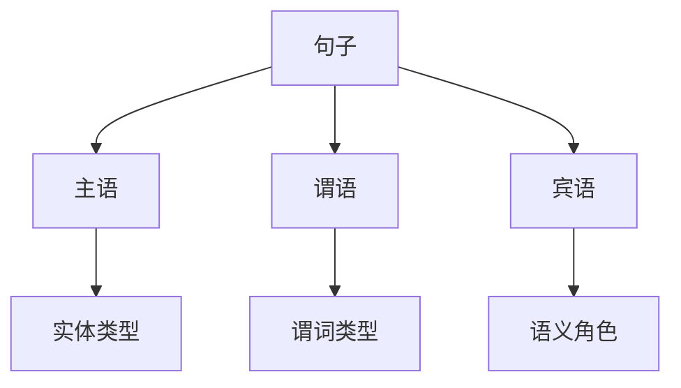
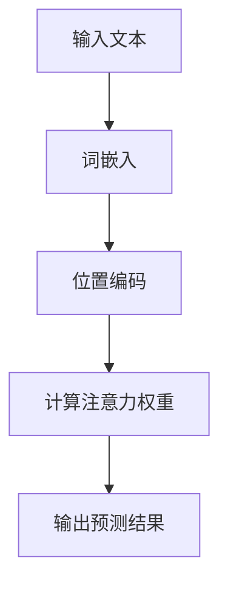
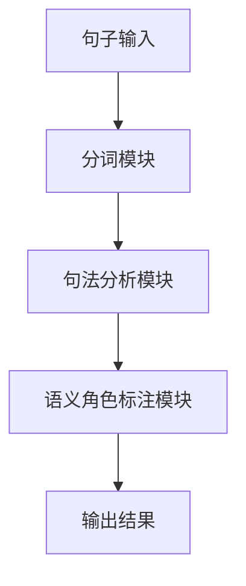
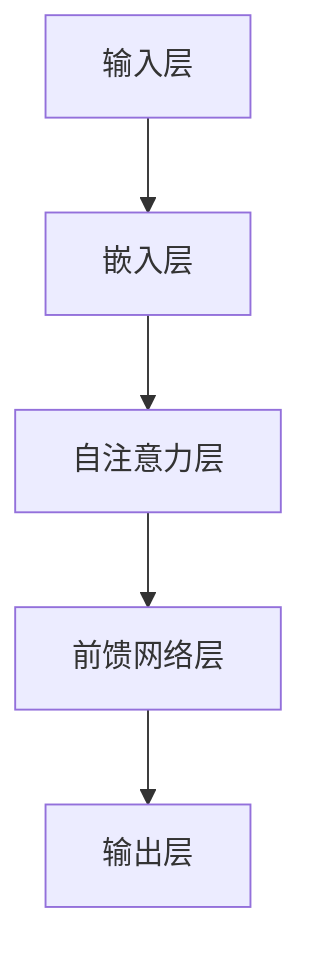
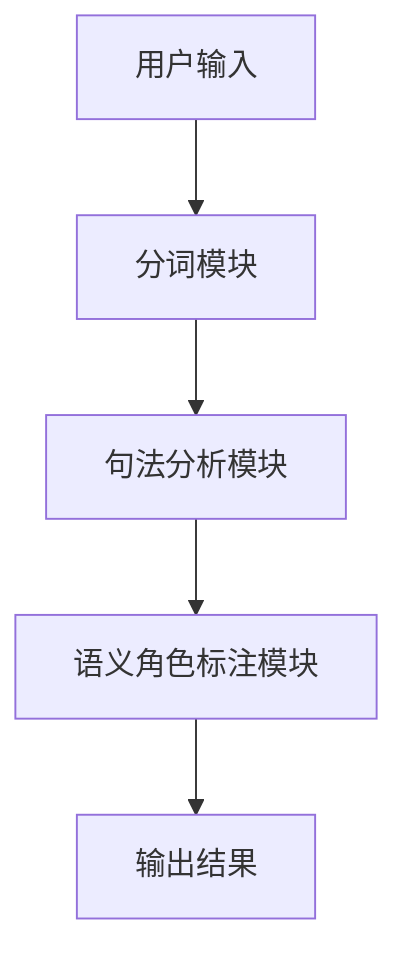

                 


# 开发AI Agent的语义角色标注能力

> 关键词：AI Agent, 语义角色标注, 系统架构, 算法原理, 项目实战

> 摘要：本文详细探讨了开发AI Agent的语义角色标注能力的关键步骤和方法，从背景介绍、核心概念、算法原理、系统架构到项目实战，全面解析了语义角色标注在AI Agent中的应用。通过理论与实践相结合的方式，帮助读者理解并掌握语义角色标注的核心技术与实现方法。

---

# 第1章: 语义角色标注的背景与概念

## 1.1 问题背景与描述

### 1.1.1 语义角色标注的定义
语义角色标注（Semantic Role Labeling，SRL）是一种自然语言处理技术，旨在从文本中提取出语义角色信息，例如“谁做了什么”、“在哪里”、“为什么”等。语义角色标注的目标是将句子中的实体和事件关系化简为一种结构化的形式，以便计算机能够理解和处理语义信息。

### 1.1.2 AI Agent中的语义角色标注问题
AI Agent需要与人类交互，并理解用户的意图和需求。为了实现这一点，AI Agent需要能够从输入文本中提取出语义角色信息，例如识别出句子中的主语、谓语和宾语。语义角色标注在AI Agent中的应用广泛，例如智能问答、对话系统、信息抽取等。

### 1.1.3 问题解决的必要性与目标
语义角色标注是AI Agent理解自然语言输入的关键一步。通过语义角色标注，AI Agent能够将输入文本转化为结构化的语义表示，从而更好地理解和处理用户的意图。本文的目标是探讨如何开发AI Agent的语义角色标注能力，并提供具体的实现方法和最佳实践。

---

## 1.2 语义角色标注的核心要素

### 1.2.1 核心概念与组成结构
语义角色标注的核心概念包括以下几个方面：
1. **实体识别**：识别句子中的实体（如人名、地名、组织名等）。
2. **谓词识别**：识别句子中的动词或谓词。
3. **语义角色分配**：为实体分配语义角色（如“主语”、“宾语”、“地点”等）。

### 1.2.2 语义角色标注的边界与外延
语义角色标注的边界在于如何准确地识别和分配语义角色。其外延包括与其他自然语言处理任务（如实体识别、关系抽取）的结合应用。

### 1.2.3 与相关概念的对比分析
以下是对语义角色标注与相关概念的对比分析：

| 概念       | 定义                                                                 | 应用场景                                       |
|------------|----------------------------------------------------------------------|-----------------------------------------------|
| 实体识别     | 识别文本中的实体（如人名、地名、组织名）                           | 信息抽取、问答系统                             |
| 关系抽取     | 识别文本中的实体间的关系（如“X是Y的 CEO”）                       | 信息抽取、知识图谱构建                         |
| 语义角色标注 | 识别句子中的语义角色（如“谁做了什么”、“在哪里”）                   | 对话系统、智能问答系统                         |

---

## 1.3 本章小结
本章介绍了语义角色标注的背景、核心概念和相关概念。通过对比分析，明确了语义角色标注在AI Agent中的重要性及其与其他自然语言处理任务的区别与联系。

---

# 第2章: 语义角色标注的核心概念与联系

## 2.1 核心概念原理

### 2.1.1 语义角色标注的基本原理
语义角色标注的基本原理包括以下步骤：
1. **分词**：将文本分割成词语或短语。
2. **句法分析**：分析句子的语法结构。
3. **语义角色分配**：根据句法分析结果，分配语义角色。

### 2.1.2 语义角色标注的关键属性特征
语义角色标注的关键属性特征包括：
1. **实体类型**：如人名、地名、时间等。
2. **谓词类型**：如动词、动词短语等。
3. **语义角色类型**：如主语、宾语、地点等。

### 2.1.3 语义角色标注的实体关系图
以下是语义角色标注的实体关系图：



---

## 2.2 核心概念的ER实体关系图

### 2.2.1 实体关系图
以下是语义角色标注的实体关系图：


---

## 2.3 核心概念的对比分析

### 2.3.1 概念属性特征对比表格
以下是核心概念的对比分析表格：

| 概念       | 属性1 | 属性2 | 属性3 |
|------------|-------|-------|-------|
| 语义角色标注 | 输入：句子 | 输出：结构化语义角色 | 应用：对话系统 |
| 实体识别     | 输入：文本 | 输出：实体列表 | 应用：信息抽取 |
| 关系抽取     | 输入：文本 | 输出：实体间关系 | 应用：知识图谱构建 |

---

## 2.4 本章小结
本章详细介绍了语义角色标注的核心概念与原理，并通过实体关系图和对比分析表格，进一步明确了语义角色标注与其他自然语言处理任务的区别与联系。

---

# 第3章: 语义角色标注的算法原理

## 3.1 算法原理概述

### 3.1.1 基于Transformer的语义角色标注模型
基于Transformer的语义角色标注模型是一种常用的深度学习模型。其核心思想是通过自注意力机制（Self-attention）捕捉文本中的语义信息。

### 3.1.2 模型的输入输出结构
模型的输入是文本序列，输出是结构化的语义角色标签。

### 3.1.3 模型的训练与优化
模型的训练过程包括以下步骤：
1. **输入预处理**：将文本分割成单词或短语。
2. **嵌入层**：将单词映射为向量。
3. **自注意力机制**：计算单词之间的注意力权重。
4. **前馈网络**：对注意力加权后的向量进行前馈处理。
5. **损失计算**：计算预测标签与真实标签之间的损失。

---

## 3.2 算法原理的数学模型

### 3.2.1 Transformer模型的注意力机制
注意力机制的公式如下：

$$
\text{Attention}(Q, K, V) = \text{softmax}\left(\frac{QK^T}{\sqrt{d_k}}\right)V
$$

其中：
- $Q$ 是查询向量。
- $K$ 是键向量。
- $V$ 是值向量。
- $d_k$ 是键的维度。

### 3.2.2 模型的损失函数
损失函数的公式如下：

$$
\mathcal{L} = -\sum_{i=1}^{n} \sum_{j=1}^{m} y_{ij} \log p(y_{ij}|x)
$$

其中：
- $y_{ij}$ 是真实标签。
- $p(y_{ij}|x)$ 是预测概率。

---

## 3.3 算法流程图



---

## 3.4 本章小结
本章详细介绍了语义角色标注的算法原理，包括基于Transformer的模型、注意力机制和损失函数的数学模型。通过流程图和公式推导，帮助读者理解语义角色标注的实现过程。

---

# 第4章: 语义角色标注的系统分析与架构设计

## 4.1 问题场景介绍

### 4.1.1 语义角色标注的典型场景
语义角色标注的典型场景包括：
1. 智能问答系统。
2. 对话系统。
3. 信息抽取系统。

### 4.1.2 系统的目标与需求
系统的目标是实现语义角色标注功能，需求包括：
1. 高准确性。
2. 实时性。
3. 可扩展性。

---

## 4.2 项目介绍

### 4.2.1 项目目标
项目的目標是开发一个基于Transformer的语义角色标注系统，能够准确地识别句子中的语义角色。

### 4.2.2 系统功能设计
以下是系统功能设计的类图：



---

## 4.3 系统架构设计

### 4.3.1 系统架构图
以下是系统的架构图：



---

## 4.4 系统接口设计

### 4.4.1 系统接口设计
系统接口设计包括：
1. 输入接口：接受文本输入。
2. 输出接口：输出结构化的语义角色标签。

---

## 4.5 系统交互序列图

### 4.5.1 交互序列图
以下是系统的交互序列图：



---

## 4.6 本章小结
本章详细介绍了语义角色标注的系统分析与架构设计，包括问题场景、系统目标、功能设计、架构设计和接口设计。

---

# 第5章: 语义角色标注的项目实战

## 5.1 环境安装与配置

### 5.1.1 环境要求
开发环境要求：
- Python 3.8+
- CUDA 10.0+
- GPU支持

### 5.1.2 工具安装
安装以下工具：
1. PyTorch
2. Hugging Face Transformers
3. Sentence Tokenizer

---

## 5.2 系统核心实现源代码

### 5.2.1 模型实现代码
以下是基于Transformer的语义角色标注模型的实现代码：

```python
import torch
from torch import nn

class SRLModel(nn.Module):
    def __init__(self, vocab_size, embed_dim, num_heads, ff_dim, dropout):
        super(SRLModel, self).__init__()
        self.embed_layer = nn.Embedding(vocab_size, embed_dim)
        self.attn = nn.MultiheadAttention(embed_dim, num_heads)
        self.ff = nn.Sequential(
            nn.Linear(embed_dim, ff_dim),
            nn.ReLU(),
            nn.Linear(ff_dim, embed_dim)
        )
        self.dropout = nn.Dropout(dropout)

    def forward(self, x, mask):
        x = self.embed_layer(x)
        x = self.dropout(x)
        attn_output, _ = self.attn(x, x, mask)
        attn_output = self.ff(attn_output)
        return attn_output
```

### 5.2.2 训练代码
以下是训练代码：

```python
import torch.optim as optim

model = SRLModel(vocab_size, embed_dim, num_heads, ff_dim, dropout)
optimizer = optim.Adam(model.parameters(), lr=0.001)
criterion = nn.CrossEntropyLoss()

for epoch in range(num_epochs):
    for batch in dataloader:
        inputs, labels = batch
        outputs = model(inputs, mask)
        loss = criterion(outputs, labels)
        optimizer.zero_grad()
        loss.backward()
        optimizer.step()
```

---

## 5.3 代码应用解读与分析

### 5.3.1 模型实现解读
模型实现代码包括以下部分：
1. **嵌入层**：将输入的文本映射为向量。
2. **自注意力机制**：计算单词之间的注意力权重。
3. **前馈网络**：对注意力加权后的向量进行前馈处理。

### 5.3.2 训练代码解读
训练代码包括以下步骤：
1. **定义模型**：初始化模型参数。
2. **定义优化器和损失函数**：使用Adam优化器和交叉熵损失函数。
3. **训练循环**：进行前向传播、计算损失、反向传播和优化。

---

## 5.4 实际案例分析

### 5.4.1 案例分析
以句子“John去北京旅游”为例：
1. **分词**：将句子分割为“John”、“去”、“北京”、“旅游”。
2. **句法分析**：识别“去”为谓词，“John”为主语，“北京”为宾语。
3. **语义角色标注**：分配语义角色为“主语”、“谓语”、“宾语”。

---

## 5.5 项目小结
本章通过实际案例分析，展示了语义角色标注的实现过程。通过代码实现和案例分析，帮助读者理解语义角色标注的核心技术与实现方法。

---

# 第6章: 开发AI Agent的语义角色标注能力的最佳实践

## 6.1 小结

### 6.1.1 本章总结
本章总结了开发AI Agent的语义角色标注能力的关键点，包括模型选择、数据预处理和系统优化。

### 6.1.2 总结
通过理论与实践相结合的方式，本文详细探讨了开发AI Agent的语义角色标注能力的关键步骤和方法。

---

## 6.2 注意事项

### 6.2.1 开发中的注意事项
1. **数据质量**：确保训练数据的多样性和准确性。
2. **模型选择**：选择适合任务的模型。
3. **系统优化**：优化模型的训练效率和推理速度。

### 6.2.2 使用中的注意事项
1. **语义角色标注的准确性**：确保标注结果的准确性。
2. **系统的可扩展性**：确保系统能够扩展到更大的数据集。

---

## 6.3 拓展阅读

### 6.3.1 推荐阅读
1. 《Transformers: A Tutorial》
2. 《自然语言处理入门》

### 6.3.2 其他推荐资源
1. Hugging Face Transformers库的官方文档。
2. PyTorch的官方文档。

---

# 作者：AI天才研究院/AI Genius Institute & 禅与计算机程序设计艺术 /Zen And The Art of Computer Programming

---

通过本文的详细讲解，读者可以系统地掌握开发AI Agent的语义角色标注能力的关键技术与实现方法。希望本文对读者有所帮助！

