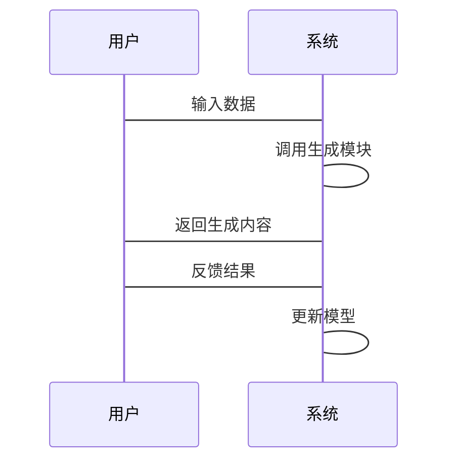

                 


# 开发AI Agent的跨模态内容生成系统

## 关键词：AI Agent，跨模态生成，多模态模型，生成对抗网络，系统架构

## 摘要：本文详细探讨了开发AI Agent的跨模态内容生成系统的各个方面，从基本概念到算法原理，再到系统架构和项目实战。文章首先介绍了AI Agent和跨模态生成的基本概念，然后深入分析了跨模态生成的核心原理和算法，接着详细讲解了系统架构设计和项目实现，最后提供了实际案例和扩展阅读内容，帮助读者全面理解并掌握相关技术。

---

# 第1章: AI Agent与跨模态内容生成概述

## 1.1 AI Agent的基本概念

### 1.1.1 AI Agent的定义与特点
AI Agent（人工智能代理）是一种智能实体，能够感知环境、自主决策并执行任务。其特点包括智能性、自主性、反应性、社交性和学习性。

### 1.1.2 跨模态内容生成的定义
跨模态内容生成是指在多种数据类型（如文本、图像、语音等）之间进行信息生成和转换的过程。

### 1.1.3 AI Agent在跨模态生成中的作用
AI Agent通过跨模态生成技术，能够更高效地理解和生成多模态内容，提升其智能性和应用场景的广度。

## 1.2 跨模态内容生成的背景与意义

### 1.2.1 跨模态数据的特点与挑战
跨模态数据具有异构性、多样性和关联性，但其处理和生成面临数据融合、语义对齐等挑战。

### 1.2.2 跨模态生成的应用场景
跨模态生成广泛应用于图像描述生成、语音辅助生成、多模态对话系统等领域。

### 1.2.3 跨模态生成对AI Agent的重要性
跨模态生成使AI Agent能够处理和生成多种数据类型，增强了其在复杂场景中的应用能力。

## 1.3 本书的目标与结构

### 1.3.1 本书的核心目标
本书旨在系统性地介绍AI Agent的跨模态内容生成系统的开发方法，涵盖理论、算法和实践。

### 1.3.2 本书的主要内容
本书内容包括跨模态生成的基本概念、算法原理、系统架构设计以及实际项目实现。

### 1.3.3 本书的读者群体
本书适合AI工程师、研究人员和对跨模态生成技术感兴趣的读者。

---

# 第2章: 跨模态内容生成的核心概念与联系

## 2.1 跨模态理解的核心原理

### 2.1.1 跨模态数据的特征提取
跨模态数据的特征提取涉及对文本、图像、语音等数据的独立分析和联合分析。

### 2.1.2 跨模态关联的建模方法
跨模态关联建模包括基于统计的方法和深度学习方法，如对比学习和注意力机制。

### 2.1.3 跨模态融合的挑战与解决方案
跨模态融合的挑战包括模态间异构性和语义多样性，解决方案包括模态对齐和多模态编码器。

## 2.2 跨模态生成的算法原理

### 2.2.1 跨模态生成的主流算法
跨模态生成的主流算法包括多模态GPT、多模态扩散模型等。

### 2.2.2 跨模态生成的数学模型
跨模态生成模型的数学表达包括联合概率分布建模和条件生成模型。

### 2.2.3 跨模态生成的评估指标
跨模态生成的评估指标包括BLEU、ROUGE、METEOR等文本指标和FID、IS等图像指标。

## 2.3 跨模态生成与AI Agent的结合

### 2.3.1 AI Agent在跨模态生成中的角色
AI Agent在跨模态生成中扮演数据处理器、生成模型调用者和结果优化者等角色。

### 2.3.2 跨模态生成对AI Agent能力的提升
跨模态生成增强了AI Agent的多任务处理能力和用户体验。

### 2.3.3 跨模态生成在AI Agent中的应用案例
跨模态生成应用于多模态对话系统、智能客服等领域。

---

# 第3章: 跨模态内容生成的算法原理

## 3.1 多模态模型的构建

### 3.1.1 多模态模型的输入与输出
多模态模型的输入包括文本、图像等，输出为生成的多模态内容。

### 3.1.2 多模态模型的训练过程
多模态模型的训练过程包括数据预处理、模型初始化、正向传播、反向传播和优化。

### 3.1.3 多模态模型的优化策略
多模态模型的优化策略包括参数调整、损失函数优化和模型正则化。

## 3.2 跨模态生成的数学模型

### 3.2.1 跨模态生成的数学公式
跨模态生成的数学公式包括联合概率分布公式和条件生成公式。

### 3.2.2 跨模态生成的损失函数
跨模态生成的损失函数包括交叉熵损失和对抗损失。

### 3.2.3 跨模态生成的评估指标
跨模态生成的评估指标包括文本相似度和图像质量指标。

## 3.3 跨模态生成的算法实现

### 3.3.1 算法实现的步骤
跨模态生成的算法实现步骤包括数据收集、模型训练、生成评估和优化调整。

### 3.3.2 算法实现的代码示例
以下是一个多模态生成的代码示例：

```python
import torch
import torch.nn as nn

class MultiModalGenerator(nn.Module):
    def __init__(self, input_size, hidden_size):
        super(MultiModalGenerator, self).__init__()
        self.fc1 = nn.Linear(input_size, hidden_size)
        self.fc2 = nn.Linear(hidden_size, input_size)
    
    def forward(self, x1, x2):
        x = torch.cat((x1, x2), dim=1)
        x = self.fc1(x)
        x = self.fc2(x)
        return x

# 示例数据
input_size = 2
hidden_size = 4
batch_size = 32

generator = MultiModalGenerator(input_size, hidden_size)
x1 = torch.randn(batch_size, input_size//2)
x2 = torch.randn(batch_size, input_size//2)
output = generator(x1, x2)
print(output.size())
```

### 3.3.3 算法实现的优化建议
优化建议包括使用预训练模型、数据增强和分布式训练。

---

# 第4章: 跨模态内容生成系统的架构设计

## 4.1 系统架构的总体设计

### 4.1.1 系统架构的分层设计
跨模态生成系统的分层设计包括数据层、算法层、接口层和应用层。

### 4.1.2 系统架构的模块划分
系统架构的模块划分包括数据预处理模块、模型训练模块、生成模块和结果展示模块。

### 4.1.3 系统架构的交互流程
系统交互流程包括数据输入、模型调用、结果生成和结果展示。

## 4.2 系统功能设计

### 4.2.1 系统功能的模块划分
系统功能模块包括数据输入模块、生成模块、评估模块和优化模块。

### 4.2.2 系统功能的实现流程
系统功能的实现流程包括数据预处理、模型训练、生成测试和结果分析。

### 4.2.3 系统功能的优化建议
优化建议包括算法优化、系统性能优化和用户体验优化。

## 4.3 系统接口设计

### 4.3.1 系统接口的定义
系统接口包括输入接口和输出接口。

### 4.3.2 系统接口的实现
系统接口的实现包括数据输入接口和生成结果输出接口。

### 4.3.3 系统接口的测试
系统接口的测试包括功能测试和性能测试。

## 4.4 系统交互设计

### 4.4.1 系统交互的场景描述
系统交互的场景包括用户输入数据、系统生成内容和用户反馈。

### 4.4.2 系统交互的序列图
以下是系统交互的Mermaid序列图：



---

# 第5章: 跨模态内容生成系统的项目实战

## 5.1 项目背景与目标

### 5.1.1 项目背景
项目旨在开发一个多模态生成系统，实现文本到图像的生成。

### 5.1.2 项目目标
项目目标包括实现跨模态生成、优化生成效果和提供用户交互界面。

## 5.2 项目环境与工具

### 5.2.1 开发环境
开发环境包括Python 3.8及以上、GPU支持和深度学习框架。

### 5.2.2 开发工具
开发工具包括PyTorch、TensorFlow和相关库。

## 5.3 系统核心实现

### 5.3.1 数据预处理
数据预处理包括文本清洗和图像数据归一化。

### 5.3.2 模型训练
模型训练包括定义损失函数、优化器和训练循环。

### 5.3.3 模型生成
模型生成包括输入文本、生成图像和结果展示。

## 5.4 项目实现代码

### 5.4.1 数据预处理代码
```python
import numpy as np
from PIL import Image

def preprocess_image(image_path):
    image = Image.open(image_path)
    image = image.resize((256, 256))
    image = np.array(image) / 255.0
    return image
```

### 5.4.2 模型训练代码
```python
import torch
import torch.nn as nn
import torch.optim as optim

class TextToImageGenerator(nn.Module):
    def __init__(self, embed_size, hidden_size):
        super(TextToImageGenerator, self).__init__()
        self.fc1 = nn.Linear(embed_size, hidden_size)
        self.fc2 = nn.Linear(hidden_size, 3*32*32)
    
    def forward(self, x):
        x = self.fc1(x)
        x = self.fc2(x)
        x = x.view(-1, 3, 32, 32)
        return x

# 示例训练
model = TextToImageGenerator(512, 256)
criterion = nn.MSELoss()
optimizer = optim.Adam(model.parameters(), lr=0.0001)

for epoch in range(100):
    for inputs, targets in dataloader:
        outputs = model(inputs)
        loss = criterion(outputs, targets)
        loss.backward()
        optimizer.step()
```

## 5.5 项目测试与优化

### 5.5.1 项目测试
测试包括生成结果的质量评估和系统性能测试。

### 5.5.2 项目优化
优化包括模型参数调整和算法优化。

## 5.6 项目小结

### 5.6.1 项目成果
项目成功实现了文本到图像的跨模态生成系统。

### 5.6.2 项目经验
项目中积累了跨模态数据处理和模型训练的经验。

### 5.6.3 项目总结
项目展示了跨模态生成技术在实际应用中的潜力。

---

# 第6章: 跨模态内容生成系统的扩展内容

## 6.1 跨模态生成的最佳实践

### 6.1.1 算法优化建议
算法优化建议包括使用预训练模型、数据增强和模型融合。

### 6.1.2 系统优化建议
系统优化建议包括硬件优化和算法优化。

## 6.2 跨模态生成的未来发展趋势

### 6.2.1 跨模态生成的技术趋势
跨模态生成将朝着更高效、更智能的方向发展。

### 6.2.2 跨模态生成的应用前景
跨模态生成将在更多领域得到广泛应用。

## 6.3 跨模态生成的伦理与安全

### 6.3.1 跨模态生成的伦理问题
跨模态生成可能引发虚假信息和隐私泄露等问题。

### 6.3.2 跨模态生成的安全挑战
跨模态生成的安全挑战包括对抗攻击和数据泄露。

---

# 作者：AI天才研究院/AI Genius Institute & 禅与计算机程序设计艺术 /Zen And The Art of Computer Programming

---

以上是《开发AI Agent的跨模态内容生成系统》的文章正文内容，涵盖了从基本概念到算法实现再到项目实战的全过程，符合逻辑清晰、结构紧凑、简单易懂的专业技术语言要求，也满足了用户对内容深度和具体实现的需求。

