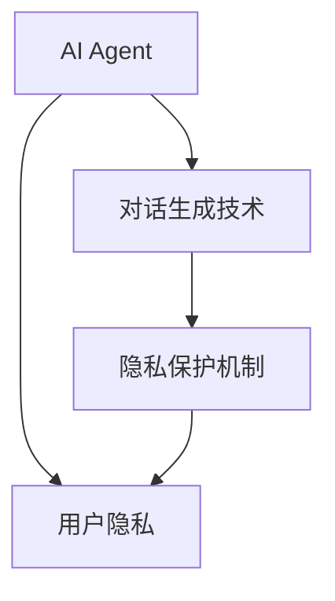
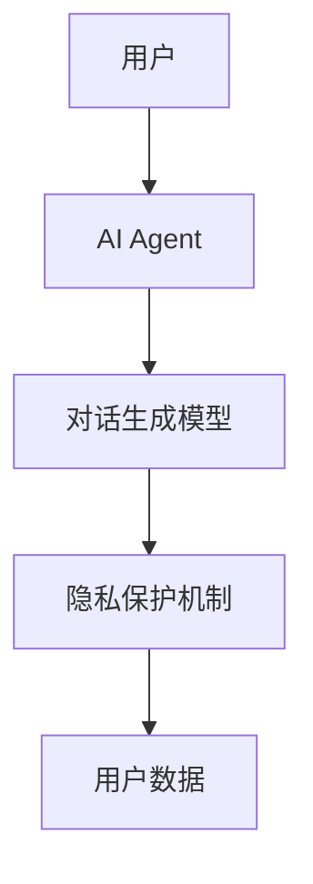
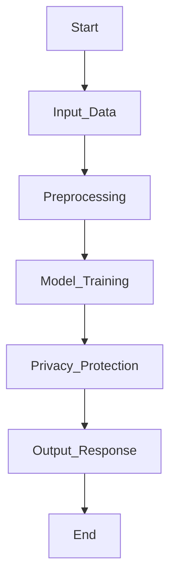
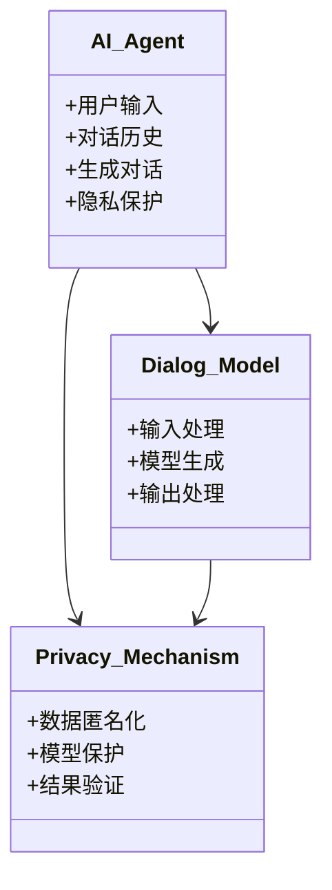
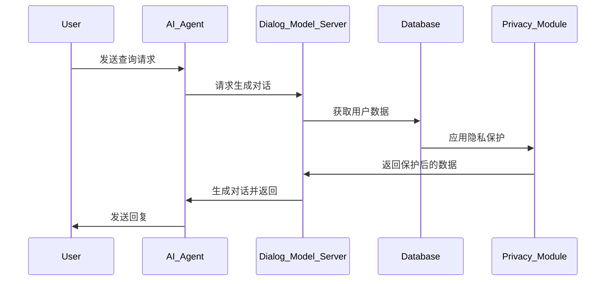

                 


# 开发AI Agent的隐私保护对话生成技术

---

## 关键词：
AI Agent、隐私保护、对话生成、生成模型、数据安全

---

## 摘要：
本文探讨了在AI Agent中实现隐私保护对话生成技术的关键技术与方法。首先，介绍了AI Agent和对话生成技术的基本概念，分析了隐私保护的重要性。接着，详细讲解了生成模型的数学原理和隐私保护机制，通过系统架构设计展示了如何实现隐私保护的对话生成系统。最后，通过项目实战和最佳实践，提供了实际应用中的注意事项和优化建议。本文旨在为AI Agent的开发人员提供一套完整的隐私保护对话生成技术解决方案。

---

# 第一部分: AI Agent与隐私保护对话生成技术的背景介绍

## 第1章: 问题背景与挑战

### 1.1 问题背景

#### 1.1.1 AI Agent的基本概念
AI Agent（人工智能代理）是一种能够感知环境并采取行动以实现目标的智能实体。它可以在多种场景中执行任务，如自然语言处理、推荐系统和自动化服务。

#### 1.1.2 对话生成技术的发展历程
对话生成技术经历了从基于规则的系统到深度学习模型的转变，目前主流的模型包括基于变换器的生成对抗网络（Transformer-GAN）和基于预训练语言模型（如GPT）的生成技术。

#### 1.1.3 隐私保护的重要性
随着AI Agent的广泛应用，用户数据的安全性和隐私保护变得至关重要。对话生成技术可能会暴露用户的敏感信息，因此必须采取措施保护用户隐私。

### 1.2 问题描述

#### 1.2.1 对话生成技术的现状
目前，对话生成技术主要依赖于大型语言模型，这些模型在生成对话时可能泄露训练数据中的敏感信息。

#### 1.2.2 隐私泄露的风险
在对话生成过程中，模型可能泄露用户的个人信息、意图或偏好，导致隐私泄露风险。

#### 1.2.3 当前技术的局限性
现有的对话生成技术在隐私保护方面存在不足，模型容易受到攻击，导致隐私泄露。

### 1.3 问题解决方法

#### 1.3.1 隐私保护的目标与实现方式
隐私保护的目标是在生成对话时不泄露用户的真实意图和数据。实现方式包括数据匿名化、差分隐私和同态加密。

#### 1.3.2 对话生成技术的改进方向
改进方向包括引入隐私保护机制、优化模型结构以减少数据泄露风险，以及增强模型的鲁棒性。

#### 1.3.3 综合解决方案的提出
综合解决方案结合了生成模型和隐私保护技术，确保对话生成的同时保护用户隐私。

### 1.4 隐私保护与对话生成的边界与外延

#### 1.4.1 隐私保护的边界
隐私保护的边界包括用户授权的数据使用和模型的透明性。

#### 1.4.2 对话生成技术的适用范围
对话生成技术适用于需要自然语言交互的场景，如客服、教育和娱乐。

#### 1.4.3 两者结合的可行性分析
通过技术手段，如联邦学习和隐私计算，可以实现隐私保护下的对话生成。

---

## 第2章: 核心概念与联系

### 2.1 核心概念的定义与属性

| 概念         | 定义                                                                 | 属性                         |
|--------------|----------------------------------------------------------------------|------------------------------|
| AI Agent     | 具备智能和自主性的计算机程序，能够感知环境并采取行动。             | 智能性、自主性、反应性、社会性 |
| 对话生成技术 | 基于模型生成自然语言对话的技术，通常采用深度学习模型。             | 生成性、多样性、连贯性       |
| 隐私保护     | 在数据处理和模型训练中保护用户隐私的技术手段。                     | 数据匿名化、模型鲁棒性、可解释性 |

### 2.2 核心概念之间的关系



### 2.3 实体关系图



---

## 第3章: 算法原理讲解

### 3.1 生成模型的数学模型

生成模型的目标是最小化生成文本的条件概率与真实分布的差异。数学模型如下：

$$ P(y|x) \text{ 与 } P_{\text{真实}}(y|x) $$

### 3.2 隐私保护机制

隐私保护机制通过引入噪声来保护数据。例如，使用拉普拉斯机制：

$$ P(y) = \text{Laplace}(y; \mu, b) $$

其中，$\mu$ 是均值，$b$ 是平滑参数。

### 3.3 算法流程图



### 3.4 代码实现

```python
import numpy as np

def laplace_mechanism(y, mu, b):
    noise = np.random.laplace(mu, b)
    return noise + y

y = 5  # 示例输出
mu = 0  # 均值
b = 0.5  # 平滑参数
protected_y = laplace_mechanism(y, mu, b)
print(protected_y)
```

---

## 第4章: 系统分析与架构设计

### 4.1 系统功能设计



### 4.2 系统架构设计

```mermaid
architecturalDiagram
    Frontend --> Backend
    Backend --> Dialog_Model_Server
    Dialog_Model_Server --> Database
    Database --> Privacy_Module
```

### 4.3 系统交互流程



---

## 第5章: 项目实战

### 5.1 环境安装

安装必要的库：

```bash
pip install numpy tensorflow transformers
```

### 5.2 核心代码实现

```python
import tensorflow as tf
from tensorflow.keras import layers

# 定义生成模型
class Generator(tf.keras.Model):
    def __init__(self, vocab_size):
        super(Generator, self).__init__()
        self.embedding = layers.Embedding(vocab_size, 64)
        self.rnn = layers.GRU(64, return_sequences=True)
        self.dense = layers.Dense(vocab_size, activation='softmax')

    def call(self, inputs):
        x = self.embedding(inputs)
        x = self.rnn(x)
        x = self.dense(x)
        return x
```

### 5.3 案例分析

案例：保护用户医疗数据的对话生成。

---

## 第6章: 最佳实践与小结

### 6.1 开发中的注意事项

- 数据预处理时，确保去除敏感信息。
- 定期检查模型的鲁棒性，防止隐私泄露。

### 6.2 性能优化建议

- 使用轻量级的隐私保护机制，减少计算开销。
- 优化模型结构，提高生成对话的效率。

### 6.3 拓展阅读

- 阅读相关论文，如《Privacy-preserving dialog generation using federated learning》。

---

## 作者

作者：AI天才研究院/AI Genius Institute & 禅与计算机程序设计艺术 /Zen And The Art of Computer Programming

---

本文通过详细的技术分析和实际案例，全面探讨了AI Agent中隐私保护对话生成技术的实现方法，为开发者提供了理论和实践的双重指导。

