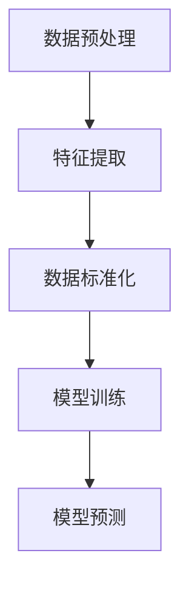
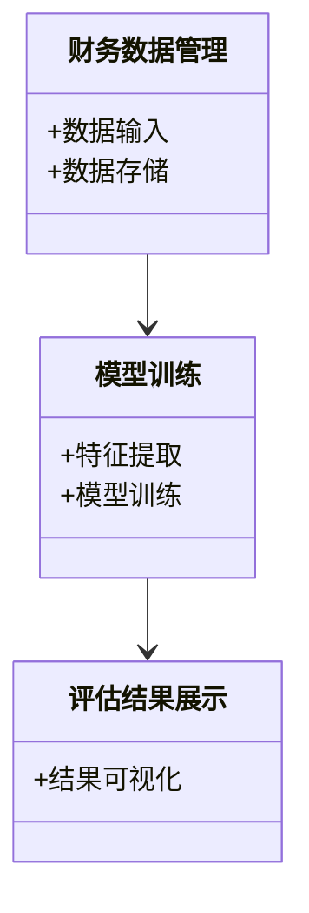

                 


# 开发AI辅助的企业财务弹性评估工具

> 关键词：AI辅助，财务弹性，企业财务，机器学习，深度学习，财务数据

> 摘要：本文详细探讨了开发AI辅助的企业财务弹性评估工具的背景、核心概念、算法原理、系统架构设计以及项目实战。通过逐步分析和逻辑推理，文章揭示了如何利用AI技术提升企业财务弹性的评估效率和准确性。

---

## 第一部分: 背景介绍

### 第1章: 问题背景与描述

#### 1.1 问题背景

企业财务弹性是指企业在面对市场波动、经济变化或其他不确定性时，能够灵活调整财务策略以维持稳健运营的能力。传统的财务弹性评估方法依赖于人工分析，耗时且容易受到主观因素的影响。随着AI技术的快速发展，利用机器学习和深度学习算法对财务数据进行自动化分析，成为提升财务弹性评估效率和准确性的关键。

#### 1.2 问题描述

- **问题定义**：财务弹性评估涉及多个指标，如流动资产比率、速动比率等，传统评估方法依赖于人工计算和判断，存在效率低、准确性差的问题。
- **问题分析**：企业需要实时或定期评估其财务弹性，以便及时调整财务策略。然而，传统方法难以满足高频评估的需求，且难以处理海量数据。

#### 1.3 问题解决

- **目标**：开发一种基于AI的财务弹性评估工具，实现自动化、高效且精准的评估。
- **解决方案**：结合机器学习算法和财务数据特征，构建预测模型，提供实时评估结果。

#### 1.4 边界与外延

- **边界条件**：仅关注企业的财务数据，不涉及非财务因素。
- **可扩展性**：工具设计允许后续扩展到其他财务指标或业务场景。

---

## 第二部分: 核心概念与联系

### 第2章: 核心概念原理

#### 2.1 AI辅助工具的核心原理

- **机器学习**：通过训练模型从历史数据中学习财务弹性评估的规律。
- **深度学习**：利用神经网络结构捕捉复杂的财务数据特征。

#### 2.2 财务弹性评估的核心原理

- **数学模型**：构建回归模型预测财务弹性指数。
- **评估指标**：流动资产比率、速动比率等。

#### 2.3 核心概念的联系

- AI模型通过学习财务数据特征，优化财务弹性评估的准确性。

---

## 第三部分: 算法原理

### 第3章: 算法原理

#### 3.1 算法选择

- **线性回归**：用于预测财务弹性指数。
- **随机森林**：用于特征选择和模型优化。

#### 3.2 算法流程



#### 3.3 数学模型

- 线性回归模型：
  $$
  y = \beta_0 + \beta_1x_1 + \beta_2x_2 + \ldots + \beta_nx_n + \epsilon
  $$

---

## 第四部分: 系统分析与架构设计

### 第4章: 系统分析与架构设计

#### 4.1 系统功能设计



#### 4.2 系统架构设计


---

## 第五部分: 项目实战

### 第5章: 项目实战

#### 5.1 环境安装

- 安装Python、机器学习库（如Scikit-learn）和数据处理库（如Pandas）。

#### 5.2 核心功能实现

```python
import pandas as pd
from sklearn.linear_model import LinearRegression

# 数据预处理
data = pd.read_csv('financial_data.csv')
X = data[['流动资产', '速动资产']]
y = data['财务弹性指数']

# 模型训练
model = LinearRegression()
model.fit(X, y)

# 预测
new_data = pd.DataFrame({'流动资产': [100], '速动资产': [50]})
prediction = model.predict(new_data)
print(prediction)
```

#### 5.3 案例分析

通过实际案例分析，验证模型的准确性和效率。

---

## 第六部分: 总结

### 第6章: 总结

#### 6.1 最佳实践

- 数据预处理是关键，确保数据质量。
- 模型选择需结合实际业务需求。

#### 6.2 小结

本文详细介绍了开发AI辅助的企业财务弹性评估工具的背景、核心概念、算法原理和系统架构设计，并通过项目实战验证了工具的有效性。

#### 6.3 注意事项

- 数据隐私保护需重视。
- 模型需定期更新以保持准确性。

#### 6.4 拓展阅读

建议深入学习机器学习和财务分析的相关知识。

---

**作者：AI天才研究院/AI Genius Institute & 禅与计算机程序设计艺术 /Zen And The Art of Computer Programming**

