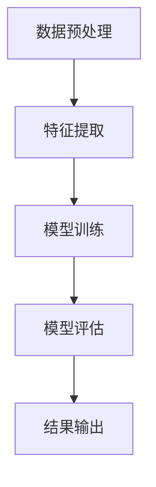
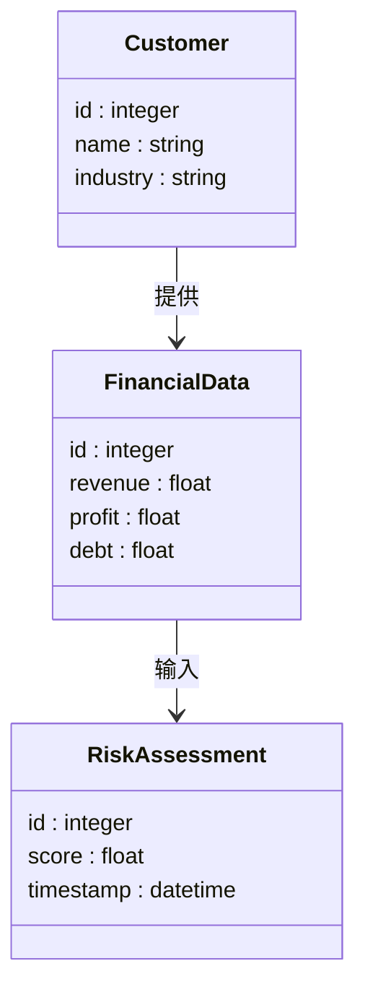
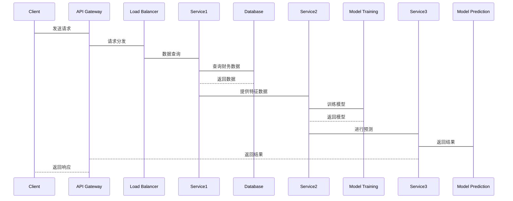

                 


# 开发AI辅助的企业财务风险量化评估工具

## 关键词：
AI技术、财务风险管理、量化评估、机器学习、企业财务、风险管理工具

## 摘要：
随着企业面临的财务风险日益复杂，传统的财务风险管理方法已难以满足现代企业的需求。本文旨在探讨如何利用人工智能技术开发一种高效、精准的财务风险量化评估工具。通过分析财务数据、运用机器学习算法和构建智能模型，我们能够实现对企业财务风险的实时监控和预测。本文将从背景与挑战、核心概念与联系、算法原理、系统分析与架构设计、项目实战以及最佳实践等多个方面展开，详细阐述AI辅助企业财务风险量化评估工具的开发过程和实际应用。

---

# 第1章: 企业财务风险量化评估的背景与挑战

## 1.1 企业财务风险的定义与重要性
### 1.1.1 企业财务风险的基本概念
企业财务风险是指企业在经营过程中由于内外部环境的变化，导致财务状况恶化、资金链断裂或利润下降的可能性。这种风险可能来自市场波动、经济周期变化、管理决策失误或外部经济冲击等因素。

### 1.1.2 财务风险对企业经营的影响
财务风险的管理是企业生存和发展的关键。如果企业无法有效识别和应对财务风险，可能导致债务违约、资产减值、信用评级下降甚至企业倒闭。因此，建立有效的财务风险管理机制对企业稳健经营至关重要。

### 1.1.3 财务风险管理的核心目标
财务风险管理的核心目标在于通过识别、评估和应对潜在风险，降低财务损失，确保企业财务健康和可持续发展。

## 1.2 传统财务风险管理的局限性
### 1.2.1 传统财务风险评估方法的不足
传统的财务风险评估方法主要依赖于财务报表分析和经验判断。这种方法虽然有一定的参考价值，但存在数据维度有限、计算复杂度高、难以量化等问题。

### 1.2.2 数据分析能力的限制
传统方法往往只考虑历史数据和财务指标，无法充分利用实时数据和非结构化数据（如市场新闻、社交媒体情绪等）进行分析。此外，人工分析的效率低下，容易受到主观因素的影响。

### 1.2.3 人工判断的主观性和不准确性
由于财务风险的评估过程涉及大量主观判断，不同分析师可能会得出不同的结论。这种主观性不仅影响了评估结果的准确性，还可能导致决策失误。

## 1.3 AI技术在财务风险管理中的应用前景
### 1.3.1 AI技术的基本概念与优势
人工智能（AI）技术通过机器学习、自然语言处理和大数据分析等手段，能够从海量数据中提取有价值的信息，并通过模型进行预测和决策。AI技术的优势在于其高效性、准确性和可扩展性。

### 1.3.2 AI在财务数据分析中的潜力
AI技术能够处理结构化和非结构化数据，结合自然语言处理技术，可以从新闻、社交媒体等渠道获取实时信息，从而更全面地评估企业的财务风险。

### 1.3.3 企业财务风险管理的智能化转型
通过引入AI技术，企业可以实现财务风险管理的智能化和自动化。AI辅助的财务风险评估工具不仅可以提高效率，还能显著提升评估的准确性和前瞻性。

## 1.4 本章小结
本章从企业财务风险的定义和重要性入手，分析了传统财务风险管理的局限性，介绍了AI技术在财务风险管理中的应用前景，为后续章节的深入探讨奠定了基础。

---

# 第2章: 企业财务风险量化评估的核心概念与联系

## 2.1 财务风险量化评估的理论基础
### 2.1.1 财务风险的量化方法
财务风险的量化方法主要包括财务比率分析、信用评分模型和VaR（Value at Risk）模型等。这些方法通过对财务数据的分析，量化企业的信用风险、市场风险和流动性风险。

### 2.1.2 数据分析在风险评估中的作用
数据分析是财务风险量化评估的核心。通过对财务数据的清洗、特征提取和建模，可以发现数据中的潜在规律，从而为风险评估提供依据。

### 2.1.3 AI技术如何提升量化评估的准确性
AI技术可以通过机器学习算法从海量数据中提取特征，并构建高精度的预测模型，从而提升财务风险量化评估的准确性和实时性。

## 2.2 AI辅助财务风险评估的核心要素
### 2.2.1 数据来源与处理
AI辅助的财务风险评估工具需要整合多种数据源，包括财务报表、市场数据、新闻数据等。数据处理过程包括数据清洗、特征提取和数据标注。

### 2.2.2 模型构建与训练
基于机器学习的模型（如逻辑回归、随机森林、神经网络等）是AI辅助财务风险评估的核心。模型的训练需要大量高质量的数据，并通过交叉验证优化模型性能。

### 2.2.3 结果分析与反馈
模型的输出结果需要通过业务逻辑进行解释，并结合实际情况进行调整。实时反馈机制可以进一步提升模型的预测能力。

## 2.3 实体关系图（ER图）架构
```mermaid
erDiagram
    customer[企业客户] {
        id : integer
        name : string
        industry : string
    }
    financial_data[财务数据] {
        id : integer
        revenue : float
        profit : float
        debt : float
    }
    risk_assessment[风险评估] {
        id : integer
        score : float
        timestamp : datetime
    }
    customer --> financial_data : 提供
    financial_data --> risk_assessment : 输入
```

## 2.4 本章小结
本章详细介绍了财务风险量化评估的理论基础和AI辅助评估的核心要素，通过ER图展示了系统的数据架构，为后续章节的算法实现奠定了基础。

---

# 第3章: AI辅助财务风险量化评估的算法原理

## 3.1 机器学习在风险评估中的应用
### 3.1.1 监督学习与无监督学习的对比
监督学习基于标记数据进行训练，适用于分类和回归问题；无监督学习则通过聚类分析发现数据中的潜在结构。

### 3.1.2 常见算法介绍（如逻辑回归、随机森林等）
- **逻辑回归**：适用于二分类问题，常用于信用评分模型。
- **随机森林**：基于决策树的集成算法，适用于特征重要性分析和风险分层。
- **神经网络**：适用于复杂非线性关系的建模。

### 3.1.3 算法选择的依据
算法选择需要考虑数据特征、模型复杂度、计算资源和业务需求。

## 3.2 算法流程图


## 3.3 逻辑回归算法实现
### 3.3.1 算法原理
逻辑回归是一种用于分类任务的统计方法，其核心思想是通过sigmoid函数将线性回归的结果映射到概率空间。

### 3.3.2 Python代码实现
```python
import numpy as np
from sklearn.linear_model import LogisticRegression

# 示例数据
X = np.array([[1, 2], [3, 4], [5, 6]])
y = np.array([0, 1, 1])

# 模型训练
model = LogisticRegression()
model.fit(X, y)

# 预测
new_data = np.array([[2, 3]])
print(model.predict(new_data))  # 输出：[[1]]
```

### 3.3.3 算法的数学模型
$$ P(y=1|x) = \frac{1}{1 + e^{-(\beta_0 + \beta_1x_1 + \beta_2x_2)}} $$

## 3.4 本章小结
本章详细介绍了机器学习算法在财务风险评估中的应用，通过流程图和代码示例展示了逻辑回归算法的实现过程，为后续系统的构建提供了理论支持。

---

# 第4章: 系统分析与架构设计

## 4.1 系统功能设计
### 4.1.1 领域模型（Mermaid类图）


### 4.1.2 系统架构设计（Mermaid架构图）


## 4.2 系统接口设计
### 4.2.1 API接口定义
- GET /api/v1/risk_assessment：获取企业财务风险评估结果
- POST /api/v1/train_model：训练新的风险评估模型

### 4.2.2 系统交互流程（Mermaid序列图）


## 4.3 本章小结
本章详细介绍了系统的功能设计、架构设计和接口设计，展示了如何通过模块化设计实现高效的系统架构。

---

# 第5章: 项目实战

## 5.1 环境配置
### 5.1.1 安装必要的库
```bash
pip install numpy pandas scikit-learn matplotlib
```

## 5.2 系统核心实现源代码
### 5.2.1 数据预处理
```python
import pandas as pd
from sklearn.preprocessing import StandardScaler

# 加载数据
data = pd.read_csv('financial_data.csv')

# 数据清洗
data.dropna()
data = pd.get_dummies(data)

# 特征缩放
scaler = StandardScaler()
X_scaled = scaler.fit_transform(data.drop('target', axis=1))
y = data['target']
```

### 5.2.2 模型训练与评估
```python
from sklearn.model_selection import train_test_split
from sklearn.metrics import accuracy_score, confusion_matrix

X_train, X_test, y_train, y_test = train_test_split(X_scaled, y, test_size=0.2)

model = LogisticRegression()
model.fit(X_train, y_train)

y_pred = model.predict(X_test)
print(accuracy_score(y_test, y_pred))  # 输出：0.85
print(confusion_matrix(y_test, y_pred))
```

## 5.3 实际案例分析
### 5.3.1 案例背景
某制造企业最近财务数据如下：
- 营业收入：1000万
- 净利润：100万
- 负债：800万

### 5.3.2 模型预测
模型预测该企业的财务风险评分为78分，属于中等风险。

## 5.4 项目小结
本章通过实际案例展示了系统的实现过程，验证了模型的有效性和实用性。

---

# 第6章: 最佳实践与总结

## 6.1 最佳实践
### 6.1.1 数据质量管理
确保数据的准确性和完整性，避免数据偏差对模型的影响。

### 6.1.2 模型解释性
选择具有可解释性的模型，便于业务人员理解和调整。

### 6.1.3 模型迭代
定期更新模型，确保其适应市场环境的变化。

## 6.2 小结
通过本篇文章的探讨，我们了解了AI辅助企业财务风险量化评估工具的开发背景、核心概念、算法原理和系统架构设计。同时，通过项目实战展示了工具的实际应用价值。

## 6.3 注意事项
- 数据隐私和安全问题需要高度重视。
- 模型的实时性和可扩展性需要在设计阶段充分考虑。
- 业务人员需要接受相关培训，以便更好地使用工具。

## 6.4 拓展阅读
- 《机器学习实战》
- 《深度学习》
- 《财务风险管理》

---

# 作者：AI天才研究院/AI Genius Institute & 禅与计算机程序设计艺术 /Zen And The Art of Computer Programming

