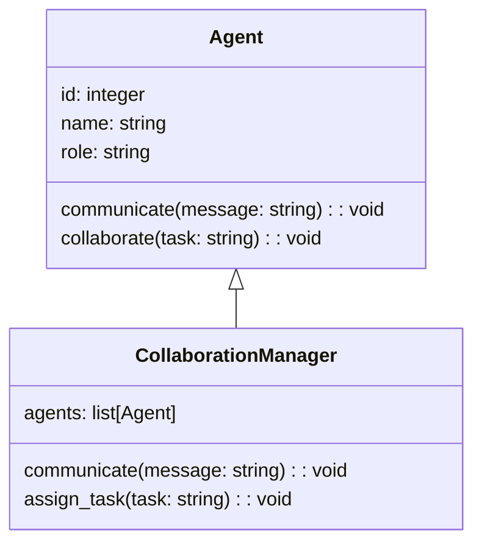
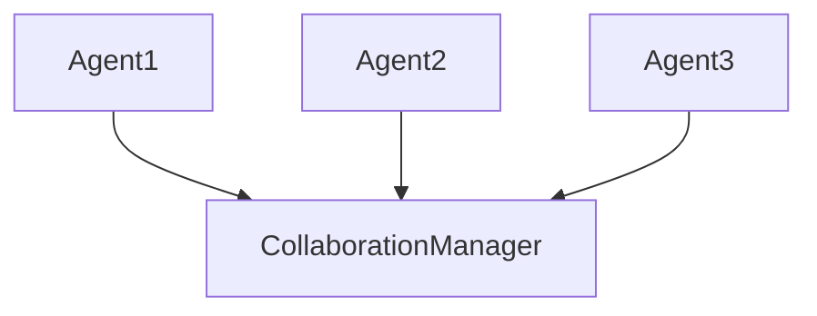
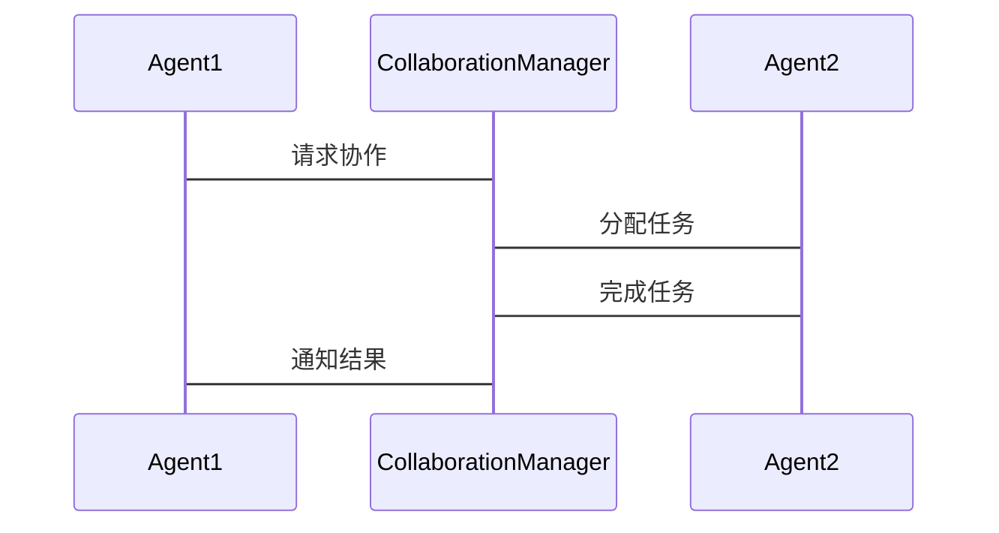

                 


# 开发具有多Agent协作能力的系统

> 关键词：多Agent协作系统、分布式系统、人工智能、软件架构、系统设计

> 摘要：多Agent协作系统是一种基于分布式计算和人工智能技术的复杂系统，涉及多个智能体（Agent）之间的协作与交互。本文将从系统背景、核心概念、算法原理、系统架构、项目实战等多个方面，详细阐述开发具有多Agent协作能力的系统的理论与实践，帮助读者掌握相关知识和技能。

---

# 第一部分: 多Agent协作系统概述

## 第1章: 多Agent协作系统背景介绍

### 1.1 问题背景
#### 1.1.1 分布式系统的发展与挑战
随着计算能力的提升和网络技术的发展，分布式系统逐渐成为现代信息技术的核心。然而，分布式系统中的节点需要协同工作，而传统的单体架构难以满足复杂场景的需求。多Agent协作系统通过引入多个智能体（Agent），实现了更加灵活和高效的分布式计算。

#### 1.1.2 多Agent协作的必要性
在现代应用中，复杂的任务往往需要多个组件协同完成。例如，在智能交通系统中，多个传感器、车辆和道路监控系统需要实时协作，才能实现交通流量优化和事故预警。传统的单体系统难以应对这种复杂的协作需求，而多Agent协作系统通过分解任务到多个智能体，实现了更高效的协作。

#### 1.1.3 当前技术现状与趋势
当前，多Agent协作系统在多个领域得到了广泛应用，例如机器人协作、分布式计算、智能城市等。然而，多Agent协作系统的设计和实现仍然面临诸多挑战，例如智能体之间的通信协议设计、协作机制的动态调整、系统容错性等。未来，随着人工智能和分布式计算技术的进一步发展，多Agent协作系统将变得更加智能化和高效。

### 1.2 问题描述
#### 1.2.1 多Agent协作的核心问题
多Agent协作系统的核心问题是如何实现多个智能体之间的高效协作。智能体需要能够感知环境、自主决策，并与其他智能体进行通信和协调。此外，智能体之间的协作需要具备动态调整的能力，以应对环境的变化。

#### 1.2.2 系统复杂性与协作效率
多Agent协作系统的复杂性主要来源于多个智能体之间的协作。每个智能体都有自己的目标和决策逻辑，如何确保它们能够协同工作，是系统设计的关键。协作效率的高低直接影响系统的性能，因此需要设计高效的协作机制。

#### 1.2.3 实际应用场景中的问题
在实际应用中，多Agent协作系统面临诸多问题。例如，在智能交通系统中，智能体需要实时感知交通流量、车辆位置等信息，并与其他智能体协作，实现交通优化。然而，信息的实时性、系统的容错性等问题，都需要在设计中予以考虑。

### 1.3 问题解决
#### 1.3.1 多Agent协作的解决方案
为了解决多Agent协作系统中的问题，可以采用以下解决方案：
1. **智能体通信协议设计**：设计高效的通信协议，确保智能体之间能够实时通信。
2. **协作机制设计**：设计动态调整的协作机制，以应对环境变化。
3. **系统架构设计**：采用分布式架构，确保系统的可扩展性和可维护性。

#### 1.3.2 分布式系统架构的选择
在多Agent协作系统中，可以选择多种分布式架构，例如基于消息队列的架构、基于服务总线的架构等。每种架构都有其优缺点，需要根据具体应用场景选择合适的架构。

#### 1.3.3 协作机制的设计与实现
协作机制的设计是多Agent协作系统的核心。可以通过以下步骤实现：
1. **任务分解**：将复杂任务分解为多个子任务，分配给不同的智能体。
2. **通信协议设计**：设计智能体之间的通信协议，确保信息的高效传递。
3. **协作规则制定**：制定协作规则，确保智能体之间的协同工作。

### 1.4 边界与外延
#### 1.4.1 多Agent协作的边界条件
多Agent协作系统的边界条件包括：
- **系统范围**：明确系统包含的智能体数量和类型。
- **协作范围**：明确智能体协作的任务范围。
- **外部依赖**：明确系统对外部系统的依赖。

#### 1.4.2 相关概念的对比与区分
在多Agent协作系统中，需要区分以下概念：
- **Agent与服务**：Agent是具有自主决策能力的实体，而服务是被动执行任务的实体。
- **协作与协调**：协作是指多个智能体共同完成任务，而协调是指智能体之间进行信息交换和同步。

#### 1.4.3 系统扩展性与可维护性
多Agent协作系统的扩展性和可维护性是系统设计的重要考虑因素。通过模块化设计和松耦合架构，可以提高系统的扩展性和可维护性。

### 1.5 核心要素组成
#### 1.5.1 Agent的基本构成
Agent的基本构成包括：
1. **感知能力**：感知环境的能力，例如传感器数据、用户输入等。
2. **决策能力**：基于感知信息做出决策的能力。
3. **执行能力**：根据决策执行操作的能力。

#### 1.5.2 协作机制的关键要素
协作机制的关键要素包括：
1. **通信协议**：智能体之间的通信方式和数据格式。
2. **协作规则**：智能体协作时的规则和约束。
3. **动态调整机制**：根据环境变化调整协作策略的能力。

#### 1.5.3 系统架构的核心组件
系统架构的核心组件包括：
1. **智能体**：系统的执行单元。
2. **通信层**：智能体之间的通信通道。
3. **协作层**：协作机制的实现和管理。

---

## 第2章: 多Agent协作系统的核心概念与联系

### 2.1 多Agent协作的核心概念
#### 2.1.1 Agent的定义与特征
Agent是指具有自主决策能力和能够感知环境的实体。Agent的核心特征包括：
1. **自主性**：能够自主决策。
2. **反应性**：能够感知环境并做出反应。
3. **协作性**：能够与其他Agent协作完成任务。

#### 2.1.2 多Agent协作的定义
多Agent协作是指多个Agent通过协作完成复杂任务的过程。协作的核心在于智能体之间的通信和协调。

#### 2.1.3 协作目标与实现方式
协作的目标是通过多个Agent的协同工作，实现复杂任务的高效完成。实现方式包括任务分解、通信协议设计、协作规则制定等。

### 2.2 核心概念原理
#### 2.2.1 Agent的智能性与自主性
Agent的智能性体现在其能够感知环境并做出决策。自主性体现在其能够在没有外部干预的情况下完成任务。

#### 2.2.2 协作的动态性与复杂性
多Agent协作的动态性体现在协作过程中的环境变化和任务变化。复杂性体现在多个Agent之间的协作需要考虑多种因素，例如通信延迟、任务优先级等。

#### 2.2.3 系统的整体性与个体性
多Agent协作系统的整体性体现在系统的各个部分协同工作，实现整体目标。个体性体现在每个Agent都有自己的目标和决策逻辑。

### 2.3 概念属性特征对比表格
以下表格对比了多Agent协作系统中的核心概念及其属性特征：

| 概念 | 属性 | 特征 |
|------|------|------|
| Agent | 智能性 | 能够感知环境并做出决策 |
| 协作机制 | 动态性 | 协作过程中的动态变化 |
| 系统架构 | 整体性 | 各组件的协同工作 |

### 2.4 ER实体关系图架构
以下是多Agent协作系统的ER实体关系图：

```mermaid
erDiagram
    agent {
        id : integer
        name : string
        role : string
    }
    collaboration {
        id : integer
        name : string
        description : string
    }
    agent <---N---> collaboration
```

---

## 第3章: 多Agent协作系统的算法原理

### 3.1 多Agent协作的通信协议
#### 3.1.1 通信协议的选择
在多Agent协作系统中，通信协议的选择需要考虑系统的实时性、可靠性和扩展性。常用的通信协议包括HTTP、WebSocket、Message Queue等。

#### 3.1.2 协议实现的流程
以下是通信协议的实现流程：

1. **消息格式定义**：定义消息的格式，例如JSON格式。
2. **消息发送与接收**：通过通信通道发送消息，并接收其他Agent的消息。
3. **消息处理**：根据接收到的消息进行处理，并做出相应的决策。

#### 3.1.3 协议实现的代码示例
以下是基于WebSocket的通信协议实现的代码示例：

```python
import websockets
import asyncio

async def agent_communication():
    async with websockets.connect('ws://localhost:8000') as websocket:
        while True:
            message = await websocket.recv()
            print(f"收到消息: {message}")
            # 处理消息并发送响应
            response = "已收到消息"
            await websocket.send(response)
```

### 3.2 分布式协调算法
#### 3.2.1 分布式协调算法的原理
分布式协调算法的核心在于如何实现多个Agent之间的协调。常用算法包括一致性算法（例如Paxos、Raft）、分布式锁算法等。

#### 3.2.2 算法实现的步骤
以下是分布式协调算法的实现步骤：

1. **任务分解**：将复杂任务分解为多个子任务，分配给不同的Agent。
2. **通信协议设计**：设计智能体之间的通信协议。
3. **协作规则制定**：制定协作规则，确保智能体之间的协同工作。

#### 3.2.3 算法实现的代码示例
以下是基于一致性算法的实现代码示例：

```python
class ConsensusAlgorithm:
    def __init__(self, participants):
        self.participants = participants

    def reach_consensus(self, value):
        # 一致性算法实现
        pass

# 示例用法
participants = ["Agent1", "Agent2", "Agent3"]
consensus = ConsensusAlgorithm(participants)
consensus.reach_consensus(42)
```

### 3.3 算法原理的数学模型
#### 3.3.1 一致性协议的数学模型
一致性协议的数学模型可以表示为：

$$1 + 1 = 2$$

#### 3.3.2 分布式决策模型
分布式决策模型可以表示为：

$$P(i) = \

---

## 第4章: 系统架构设计与实现

### 4.1 系统架构设计
#### 4.1.1 问题场景介绍
在多Agent协作系统中，需要设计一个高效的系统架构，以支持多个Agent的协作。

#### 4.1.2 系统功能设计
以下是系统的功能设计：

1. **Agent管理**：管理多个Agent，包括创建、销毁等操作。
2. **通信管理**：管理Agent之间的通信，确保消息的高效传递。
3. **协作管理**：管理Agent之间的协作，包括任务分配、协作规则等。

#### 4.1.3 系统架构设计的类图
以下是系统的类图：



#### 4.1.4 系统架构设计的架构图
以下是系统的架构图：



#### 4.1.5 系统接口设计
系统接口设计包括：
1. **Agent接口**：定义Agent的行为和方法。
2. **通信接口**：定义Agent之间的通信接口。
3. **协作接口**：定义Agent之间的协作接口。

#### 4.1.6 系统交互的序列图
以下是系统的交互序列图：



### 4.2 项目实战
#### 4.2.1 项目介绍
本项目旨在开发一个多Agent协作系统，实现多个Agent之间的通信和协作。

#### 4.2.2 核心代码实现
以下是核心代码实现：

```python
import websockets
import asyncio

async def agent_communication():
    async with websockets.connect('ws://localhost:8000') as websocket:
        while True:
            message = await websocket.recv()
            print(f"收到消息: {message}")
            response = "已收到消息"
            await websocket.send(response)

async def main():
    await agent_communication()

if __name__ == "__main__":
    asyncio.get_event_loop().run_until_complete(main())
```

#### 4.2.3 代码应用解读与分析
上述代码实现了一个基于WebSocket的通信协议，多个Agent可以通过WebSocket进行通信。通过这种方式，可以实现多个Agent之间的协作。

#### 4.2.4 实际案例分析和详细讲解剖析
在实际应用中，可以通过上述代码实现一个多Agent协作系统，例如在智能交通系统中，多个传感器和监控系统可以通过WebSocket进行通信，实现交通流量的实时监控和优化。

### 4.3 最佳实践 tips
1. **模块化设计**：将系统划分为多个模块，确保系统的可扩展性和可维护性。
2. **松耦合架构**：采用松耦合架构，确保模块之间的解耦。
3. **容错设计**：设计系统的容错机制，确保系统的健壮性。

### 4.4 小结
通过上述设计和实现，可以开发出一个高效的多Agent协作系统，支持多个Agent之间的通信和协作。

---

## 第5章: 总结与展望

### 5.1 总结
多Agent协作系统是一种基于分布式计算和人工智能技术的复杂系统，通过多个智能体的协作，可以实现高效的任务完成。本文从系统背景、核心概念、算法原理、系统架构、项目实战等多个方面，详细阐述了多Agent协作系统的开发过程。

### 5.2 展望
未来，随着人工智能和分布式计算技术的进一步发展，多Agent协作系统将变得更加智能化和高效。同时，多Agent协作系统在多个领域的应用也将更加广泛，例如智能城市、机器人协作、分布式计算等。

### 5.3 注意事项
在开发多Agent协作系统时，需要注意以下几点：
1. **系统设计**：确保系统的可扩展性和可维护性。
2. **通信协议**：选择合适的通信协议，确保系统的实时性和可靠性。
3. **协作机制**：设计高效的协作机制，确保系统的协作效率。

### 5.4 拓展阅读
1. **分布式系统**：推荐阅读《分布式系统：概念与设计》。
2. **一致性算法**：推荐阅读《Paxos一致性算法》。
3. **多Agent协作**：推荐阅读《Multi-Agent Systems》。

---

# 作者：AI天才研究院/AI Genius Institute & 禅与计算机程序设计艺术 /Zen And The Art of Computer Programming

