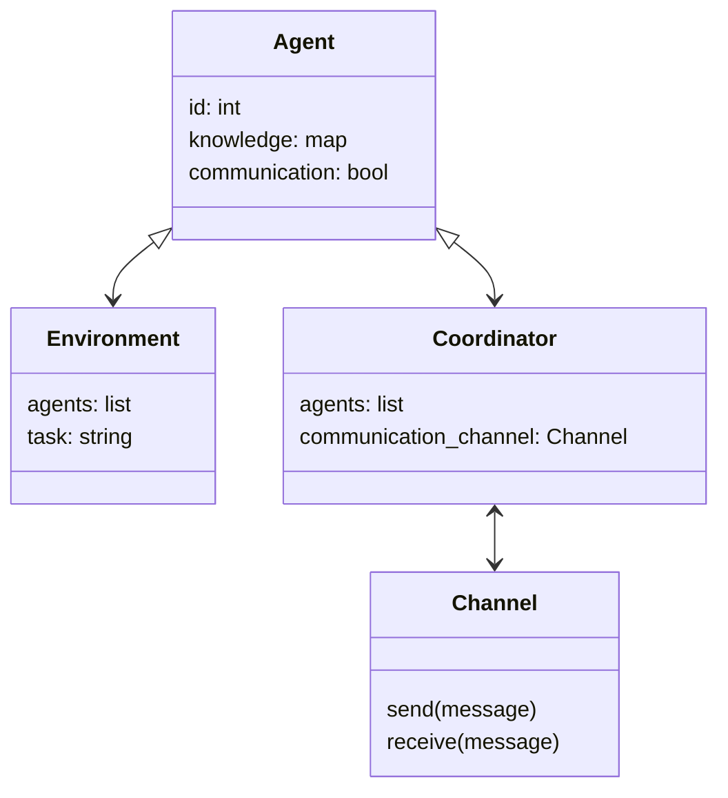
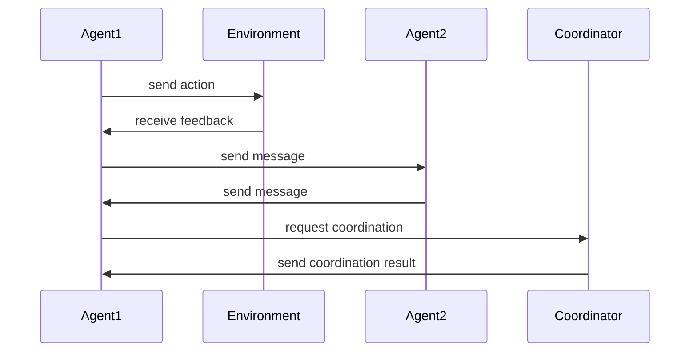

                 


# 开发具有多Agent协同学习能力的系统

## 关键词：多智能体系统、协同学习、分布式系统、机器学习、人工智能

## 摘要

随着人工智能技术的快速发展，多Agent协同学习系统逐渐成为研究的热点。本文将详细探讨多Agent协同学习的概念、核心技术和实际应用。通过分析多Agent系统中的通信与协调机制，介绍协同学习的数学模型与算法原理，提供系统设计与实现的具体步骤，最终帮助读者掌握开发多Agent协同学习系统的必备知识。

---

## 第一章: 多Agent协同学习系统概述

### 1.1 多Agent协同学习的背景与概念

#### 1.1.1 什么是Agent
Agent（智能体）是指能够感知环境并采取行动以实现目标的实体。Agent可以是软件程序、机器人或其他智能设备。在多Agent系统中，多个Agent协同工作，共同完成复杂任务。

#### 1.1.2 多Agent系统的定义
多Agent系统是由多个相互作用的Agent组成的分布式系统，这些Agent通过通信和协调共同完成任务。多Agent系统具有分布式性、自主性、反应性和协作性等特点。

#### 1.1.3 协同学习的基本概念
协同学习是指多个Agent通过共享知识和经验，共同提高学习效果的过程。协同学习可以降低单个Agent的学习成本，提高整体系统的智能水平。

#### 1.1.4 协同学习的重要性
在复杂环境中，单个Agent的学习能力有限，而通过协同学习，多个Agent可以互补优势，提高整体系统的适应性和智能性。

### 1.2 多Agent协同学习的应用场景

#### 1.2.1 分布式任务处理
在分布式系统中，多个Agent可以协同完成复杂的任务，例如分布式计算、数据处理和网络优化。

#### 1.2.2 集智决策系统
多Agent协同学习可以应用于集智决策系统，例如智能交通管理、分布式监控和群体决策。

#### 1.2.3 多智能体游戏AI
在游戏开发中，多个智能体可以通过协同学习提高游戏AI的智能水平，例如在MOBA游戏中，多个AI角色可以协同作战。

#### 1.2.4 其他应用场景
多Agent协同学习还可以应用于智能家居、自动驾驶、分布式推荐系统等领域。

---

## 第二章: 多Agent协同学习的核心概念

### 2.1 Agent的类型与特点

#### 2.1.1 简单反射型Agent
简单反射型Agent根据当前感知直接做出反应，没有内部状态。例如，自动门传感器。

#### 2.1.2 基于模型的反应式Agent
基于模型的反应式Agent会根据当前感知构建环境模型，并基于模型做出决策。例如，自动驾驶汽车。

#### 2.1.3 目标驱动型Agent
目标驱动型Agent具有明确的目标，会采取行动以实现目标。例如，自动交易系统。

#### 2.1.4 学习型Agent
学习型Agent能够通过经验改进自身的知识和能力。例如，AlphaGo中的智能体。

### 2.2 多Agent系统中的通信与协调

#### 2.2.1 Agent之间的通信机制
多Agent系统中，Agent之间的通信可以通过共享数据库、消息传递或直接交互等方式进行。通信机制是实现协同学习的关键。

#### 2.2.2 协调的必要性与实现方式
为了实现协同学习，多Agent系统需要协调各自的行动。协调可以通过同步、协商或分布式算法实现。

#### 2.2.3 分布式协调算法
分布式协调算法包括分布式一致性算法、分布式锁机制和分布式事件驱动机制等。这些算法有助于多Agent系统中的协调。

### 2.3 协同学习的数学模型

#### 2.3.1 单个Agent的学习模型
单个Agent的学习模型通常采用监督学习、无监督学习或强化学习方法。例如，随机森林、支持向量机和神经网络。

#### 2.3.2 多Agent协同学习的数学表达
多Agent协同学习可以通过联合损失函数来表示，公式如下：

$$ L_{total} = \sum_{i=1}^{m} L_i + \lambda \cdot C $$

其中，$L_i$表示第i个Agent的损失函数，$C$表示协作成本，$\lambda$为协作权重。

---

## 第三章: 多Agent协同学习的算法原理

### 3.1 分布式机器学习算法

#### 3.1.1 联邦学习（Federated Learning）
联邦学习是一种分布式学习方法，多个Agent可以在本地数据上进行训练，仅交换模型参数，保护数据隐私。

#### 3.1.2 跨主体学习（Cross-Subject Learning）
跨主体学习是一种多Agent协同学习方法，多个Agent通过共享知识和经验，共同提高学习效果。

#### 3.1.3 分布式优化算法
分布式优化算法包括分布式梯度下降、分布式Adam优化器等，适用于大规模数据和多Agent场景。

### 3.2 多智能体强化学习

#### 3.2.1 多智能体强化学习的基本概念
多智能体强化学习是指多个智能体在共享环境中通过相互作用，学习策略以实现共同目标。

#### 3.2.2 基于价值的多智能体协作
基于价值的多智能体协作通过价值函数评估各个Agent的贡献，实现协作。例如，多智能体DQN算法。

#### 3.2.3 基于策略的多智能体协作
基于策略的多智能体协作直接优化各个Agent的策略，实现协作。例如，多智能体策略梯度算法。

### 3.3 协同学习的数学模型与公式

#### 3.3.1 单个Agent的损失函数
$$ L_i = \frac{1}{n} \sum_{j=1}^{n} (y_j - \hat{y}_j)^2 $$

#### 3.3.2 多Agent协作的联合损失函数
$$ L_{total} = \sum_{i=1}^{m} L_i + \lambda \cdot C $$

其中，$C$表示协作成本，$\lambda$为协作权重。

---

## 第四章: 系统分析与架构设计

### 4.1 系统分析

#### 4.1.1 问题场景介绍
多Agent协同学习系统需要解决的问题包括：Agent之间的通信与协调、知识共享与同步、协作机制设计等。

#### 4.1.2 项目介绍
本项目旨在开发一个支持多Agent协同学习的系统，实现多个Agent之间的通信、协调和知识共享。

### 4.2 系统功能设计

#### 4.2.1 领域模型类图
以下是领域模型类图：



#### 4.2.2 系统架构图
以下是系统架构图：

```mermaid
containerDiagram
    Container 多Agent系统 {
        Component Agent1
        Component Agent2
        Component Agent3
        Communication Channel
    }
    Communication Channel --> Agent1
    Communication Channel --> Agent2
    Communication Channel --> Agent3
```

#### 4.2.3 系统接口设计
系统接口设计包括：

- Agent接口：`initialize()`, `receive(message)`, `act()`, `learn()`
- 环境接口：`get_state()`, `execute_action(action)`
- 协调器接口：`coordinate_agents()`, `exchange_messages()`

#### 4.2.4 系统交互序列图

以下是系统交互序列图：



---

## 第五章: 项目实战

### 5.1 环境安装

#### 5.1.1 安装Python
安装Python 3.8及以上版本。

#### 5.1.2 安装依赖
安装必要的库，例如`numpy`, `scikit-learn`, `tensorflow`, `pytorch`等。

```bash
pip install numpy scikit-learn tensorflow torch
```

### 5.2 核心代码实现

#### 5.2.1 Agent类实现
以下是Agent类的实现：

```python
class Agent:
    def __init__(self, id, knowledge={}):
        self.id = id
        self.knowledge = knowledge
        self.communication = False

    def receive_message(self, message):
        self.communication = True
        self.knowledge.update(message)

    def send_message(self, message):
        return message
```

#### 5.2.2 环境类实现
以下是环境类的实现：

```python
class Environment:
    def __init__(self, agents):
        self.agents = agents
        self.task = None

    def get_state(self):
        return {agent.id: agent.knowledge for agent in self.agents}

    def execute_action(self, action):
        # 根据动作执行操作，返回反馈
        feedback = f"Action {action} executed"
        return feedback
```

#### 5.2.3 协调器类实现
以下是协调器类的实现：

```python
class Coordinator:
    def __init__(self, agents):
        self.agents = agents
        self.communication_channel = Channel()

    def coordinate_agents(self):
        for agent in self.agents:
            messages = agent.send_message(agent.knowledge)
            self.communication_channel.send(messages)
```

#### 5.2.4 通信通道类实现
以下是通信通道类的实现：

```python
class Channel:
    def send(self, message):
        print(f"Message sent: {message}")

    def receive(self, message):
        print(f"Message received: {message}")
```

### 5.3 案例分析

#### 5.3.1 案例描述
假设我们有三个Agent，分别负责数据收集、数据处理和数据分析。通过协同学习，三个Agent可以共同完成数据分析任务。

#### 5.3.2 实现步骤
1. 创建三个Agent实例。
2. 初始化环境并分配任务。
3. 通过协调器实现Agent之间的通信与协调。
4. 执行任务并返回反馈。

#### 5.3.3 代码实现

```python
# 初始化三个Agent
agent1 = Agent(1, {"name": "data collector"})
agent2 = Agent(2, {"name": "data processor"})
agent3 = Agent(3, {"name": "data analyzer"})

# 初始化环境
environment = Environment([agent1, agent2, agent3])
environment.task = "analyze data"

# 初始化协调器
coordinator = Coordinator([agent1, agent2, agent3])

# 协调Agent之间的通信
coordinator.coordinate_agents()
```

### 5.4 项目小结

通过以上代码实现，我们可以看到多Agent协同学习系统的开发流程。从环境初始化、Agent创建到协调器的实现，整个过程需要详细考虑各个模块的交互和协作。

---

## 第六章: 总结与展望

### 6.1 总结
本文详细介绍了多Agent协同学习系统的开发过程，包括系统概述、核心概念、算法原理、系统架构设计和项目实战。通过本文的学习，读者可以掌握多Agent协同学习的基本知识和开发技能。

### 6.2 展望
未来，随着人工智能技术的不断发展，多Agent协同学习系统将有更广泛的应用场景。研究者们需要进一步优化协同学习算法，提高系统的效率和智能性。

---

## 作者信息

作者：AI天才研究院/AI Genius Institute & 禅与计算机程序设计艺术 /Zen And The Art of Computer Programming

---

通过本文的学习，读者可以系统地了解多Agent协同学习系统的开发过程，并掌握相关的核心技术和开发方法。希望本文能为相关领域的研究和实践提供有价值的参考。

