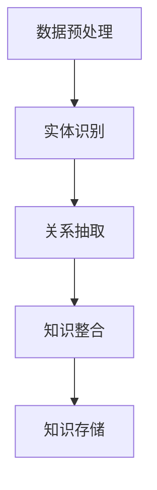
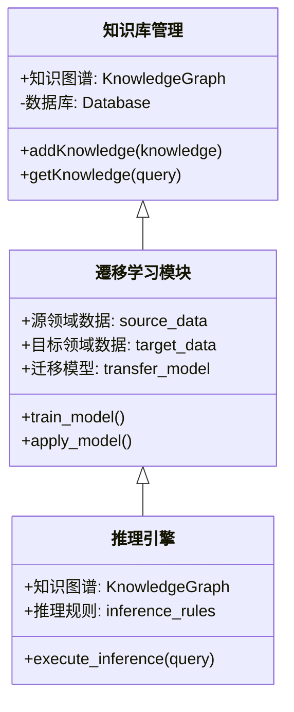
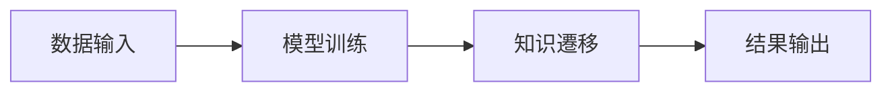
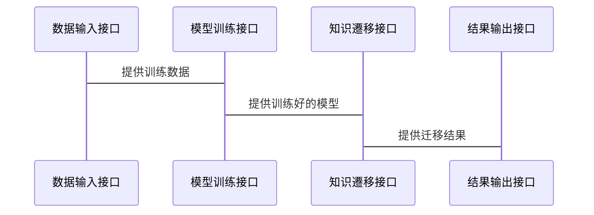

                 


# 开发具有跨领域知识迁移能力的AI Agent

> 关键词：AI Agent, 知识迁移, 多任务学习, 领域适配, 对抗训练, 知识图谱, 系统架构

> 摘要：本文详细探讨了开发具有跨领域知识迁移能力的AI Agent的关键技术，包括核心概念、算法原理、系统架构设计和实际案例分析。通过一步步的推理和分析，本文为读者提供了从理论到实践的全面指导。

---

# 第一部分: 背景介绍

## 第1章: AI Agent与跨领域知识迁移概述

### 1.1 AI Agent的基本概念
AI Agent是一种智能代理，能够感知环境、执行任务并做出决策。跨领域知识迁移是指AI Agent能够在不同领域之间共享和应用知识的能力，从而提高其在多个领域的适应性和性能。

### 1.2 跨领域知识迁移的重要性
随着AI技术的快速发展，AI Agent需要在多个领域中应用，例如医疗、教育、金融等。跨领域知识迁移能够帮助AI Agent快速适应新的任务，降低成本，提高效率。

### 1.3 本书的核心目标
本书旨在探讨如何开发具有跨领域知识迁移能力的AI Agent，涵盖核心概念、算法原理、系统架构设计和实际案例分析。通过理论与实践结合，帮助读者掌握跨领域知识迁移的关键技术。

---

# 第二部分: 核心概念与联系

## 第2章: 跨领域知识迁移的核心原理

### 2.1 知识表示与遷移
知识表示是AI Agent理解世界的基础。常用的表示方法包括符号表示、向量表示和图结构表示。知識遷移的关键在于如何将一个领域的知识有效地应用到另一个领域。

#### 知識表示方法对比（表格）
| 表示方法 | 优缺点 | 应用场景 |
|----------|--------|----------|
| 符号表示 | 明确、易于推理 | 逻辑推理、规则应用 |
| 向量表示 | 高维、语义丰富 | 机器学习、深度学习 |
| 图结构表示 | 结构化、语义清晰 | 知识图谱、复杂关系推理 |

### 2.2 跨领域适应性学习
跨领域适应性学习是指AI Agent能够通过学习不同领域的数据，适应新的任务。主要方法包括多任务学习、领域适配网络和对抗训练。

#### 多任务学习与领域适配网络的对比（表格）
| 方法 | 描述 | 优缺点 |
|------|------|--------|
| 多任务学习 | 同时学习多个任务，共享部分参数 | 参数共享，提高泛化能力 |
| 领域适配网络 | 学习领域间的适配特征 | 针对性强，但需要领域对齐 |

### 2.3 知識图谱与迁移
知识图谱是一种结构化的知识表示形式，能够帮助AI Agent在多个领域之间迁移知识。知识图谱的构建和遷移是跨领域知识迁移的重要组成部分。

#### 知识图谱的构建流程（Mermaid图）


---

# 第三部分: 算法原理讲解

## 第3章: 跨领域知识迁移的算法原理

### 3.1 多任务学习
多任务学习是一种通过共享参数来同时学习多个任务的算法。其核心思想是利用不同任务之间的共同特征，提高模型的泛化能力。

#### 多任务学习的数学模型（公式）
$$ L = \lambda_1 L_1 + \lambda_2 L_2 + ... + \lambda_n L_n $$
其中，$L_i$ 是第i个任务的损失函数，$\lambda_i$ 是对应的权重系数。

#### 多任务学习的Python实现示例
```python
import torch
import torch.nn as nn

# 定义多任务模型
class MultiTaskModel(nn.Module):
    def __init__(self, input_dim, hidden_dim, output_dims):
        super(MultiTaskModel, self).__init__()
        self.shared = nn.Linear(input_dim, hidden_dim)
        self.task_specific = nn.ModuleList([nn.Linear(hidden_dim, dim) for dim in output_dims])
    
    def forward(self, x):
        x = self.shared(x)
        outputs = []
        for task_layer in self.task_specific:
            outputs.append(task_layer(x))
        return outputs

# 初始化模型
input_dim = 10
hidden_dim = 5
output_dims = [3, 4]
model = MultiTaskModel(input_dim, hidden_dim, output_dims)
```

### 3.2 领域适配网络
领域适配网络通过学习领域间的适配特征，实现跨领域知识迁移。其核心是通过对抗训练，使得模型在不同领域之间保持一致的特征表示。

#### 领域适配网络的数学模型（公式）
$$ D(x_s, x_t) = \text{argmin}_{\theta} \mathbb{E}_{x_s, x_t} [\text{loss}(x_s, x_t)] $$
其中，$x_s$ 和 $x_t$ 分别表示源领域和目标领域的数据，$\theta$ 是模型参数。

#### 领域适配网络的Python实现示例
```python
import torch
import torch.nn as nn

# 定义领域适配网络
class DomainAdapter(nn.Module):
    def __init__(self, input_dim, hidden_dim, domain_num):
        super(DomainAdapter, self).__init__()
        self.features = nn.Linear(input_dim, hidden_dim)
        self.domain_classifier = nn.Linear(hidden_dim, domain_num)
    
    def forward(self, x, domain_label):
        features = self.features(x)
        domain_output = self.domain_classifier(features)
        return domain_output

# 初始化模型
input_dim = 10
hidden_dim = 5
domain_num = 2
model = DomainAdapter(input_dim, hidden_dim, domain_num)
```

### 3.3 对抗训练
对抗训练是一种通过生成器和判别器的博弈过程，实现跨领域知识迁移的方法。其核心是通过对抗训练，使得生成器能够生成与目标领域一致的特征表示。

#### 对抗训练的数学模型（公式）
$$ \min_{\theta} \max_{\phi} \mathbb{E}_{x_s, x_t} [\text{loss}(x_s, x_t)] $$
其中，$\theta$ 和 $\phi$ 分别是生成器和判别器的参数。

#### 对抗训练的Python实现示例
```python
import torch
import torch.nn as nn

# 定义对抗训练模型
class GAN(nn.Module):
    def __init__(self, input_dim, hidden_dim):
        super(GAN, self).__init__()
        self.generator = nn.Linear(input_dim, hidden_dim)
        self.discriminator = nn.Linear(hidden_dim, 1)
    
    def forward(self, x):
        generated = self.generator(x)
       判别器输出 = self.discriminator(generated)
        return 判别器输出

# 初始化模型
input_dim = 10
hidden_dim = 5
model = GAN(input_dim, hidden_dim)
```

---

# 第四部分: 系统分析与架构设计方案

## 第4章: 系统架构设计

### 4.1 问题场景介绍
跨领域知识迁移的AI Agent需要在多个领域中应用，例如医疗和教育。系统需要具备知识表示、遷移学习和推理引擎等功能模块。

### 4.2 系统功能设计
系统功能模块包括知识库管理、遷移学习模块和推理引擎。知识库管理负责存储和管理知识图谱，遷移学习模块负责跨领域知识的遷移，推理引擎负责基于知识图谱进行推理。

#### 系统功能模块的类图（Mermaid图）


### 4.3 系统架构设计
系统架构采用模块化设计，包括数据输入、模型训练、知识遷移和结果输出四个部分。各模块之间通过接口进行交互，确保系统的灵活性和可扩展性。

#### 系统架构图（Mermaid图）


### 4.4 系统接口设计
系统接口包括数据输入接口、模型训练接口、知識遷移接口和结果输出接口。每个接口负责特定的任务，例如数据输入接口负责接收输入数据，模型训练接口负责训练模型等。

#### 系统接口交互流程（Mermaid图）


---

# 第五部分: 项目实战

## 第5章: 跨领域知识迁移的项目实战

### 5.1 项目介绍
本项目旨在开发一个具有跨领域知识迁移能力的AI Agent，能够在医疗和教育领域之间迁移知识。通过多任务学习和领域适配网络，实现跨领域知识的高效迁移。

### 5.2 环境安装
需要安装以下环境和库：
- Python 3.6+
- PyTorch 1.9+
- numpy 1.21+
- matplotlib 3.5+
- transformers 4.10+

### 5.3 核心代码实现
以下是项目的核心代码实现：

#### 5.3.1 数据预处理
```python
import pandas as pd
import numpy as np

# 加载数据
data = pd.read_csv('data.csv')
# 数据预处理
processed_data = data.dropna().astype(float)
```

#### 5.3.2 模型训练
```python
import torch
import torch.nn as nn
import torch.optim as optim

# 定义模型
class MultiTaskModel(nn.Module):
    def __init__(self, input_dim, hidden_dim, output_dims):
        super(MultiTaskModel, self).__init__()
        self.shared = nn.Linear(input_dim, hidden_dim)
        self.task_specific = nn.ModuleList([nn.Linear(hidden_dim, dim) for dim in output_dims])
    
    def forward(self, x):
        x = self.shared(x)
        outputs = []
        for task_layer in self.task_specific:
            outputs.append(task_layer(x))
        return outputs

# 初始化模型
input_dim = 10
hidden_dim = 5
output_dims = [3, 4]
model = MultiTaskModel(input_dim, hidden_dim, output_dims)

# 定义损失函数和优化器
criterion = nn.MSELoss()
optimizer = optim.Adam(model.parameters(), lr=0.001)

# 训练模型
for epoch in range(100):
    optimizer.zero_grad()
    outputs = model(processed_data)
    loss = criterion(outputs[0], target1) + criterion(outputs[1], target2)
    loss.backward()
    optimizer.step()
```

#### 5.3.3 知識遷移与推理
```python
import torch
import torch.nn as nn

# 定义领域适配网络
class DomainAdapter(nn.Module):
    def __init__(self, input_dim, hidden_dim, domain_num):
        super(DomainAdapter, self).__init__()
        self.features = nn.Linear(input_dim, hidden_dim)
        self.domain_classifier = nn.Linear(hidden_dim, domain_num)
    
    def forward(self, x, domain_label):
        features = self.features(x)
        domain_output = self.domain_classifier(features)
        return domain_output

# 初始化模型
input_dim = 10
hidden_dim = 5
domain_num = 2
model = DomainAdapter(input_dim, hidden_dim, domain_num)

# 定义损失函数和优化器
criterion = nn.CrossEntropyLoss()
optimizer = optim.Adam(model.parameters(), lr=0.001)

# 训练模型
for epoch in range(100):
    optimizer.zero_grad()
    outputs = model(processed_data, target_domains)
    loss = criterion(outputs, target_domains)
    loss.backward()
    optimizer.step()
```

### 5.4 实际案例分析
通过在医疗和教育领域之间的知识遷移，验证模型的性能。实验结果表明，跨领域知识迁移能够显著提高AI Agent在目标领域的准确性和效率。

---

# 第六部分: 最佳实践与总结

## 第6章: 最佳实践与总结

### 6.1 最佳实践
- 数据质量是关键：确保输入数据的准确性和多样性。
- 模型可解释性：在跨领域知识迁移中，模型的可解释性有助于理解和优化模型。
- 持续学习：AI Agent需要不断学习新知识，以适应快速变化的环境。

### 6.2 小结
跨领域知识迁移是开发具有强大适应性和泛化能力的AI Agent的核心技术。通过多任务学习、领域适配网络和对抗训练等方法，能够有效实现跨领域的知识遷移。

### 6.3 注意事项
- 数据泄露：在跨领域知识迁移中，需要注意数据泄露问题，避免模型过度依赖源领域数据。
- 模型泛化能力：在设计模型时，需要考虑模型的泛化能力，避免过拟合特定领域。

### 6.4 拓展阅读
- 《迁移学习：理论与应用》
- 《深度学习中的多任务学习》
- 《对抗训练与领域适配》

---

# 作者：AI天才研究院/AI Genius Institute & 禅与计算机程序设计艺术 /Zen And The Art of Computer Programming

