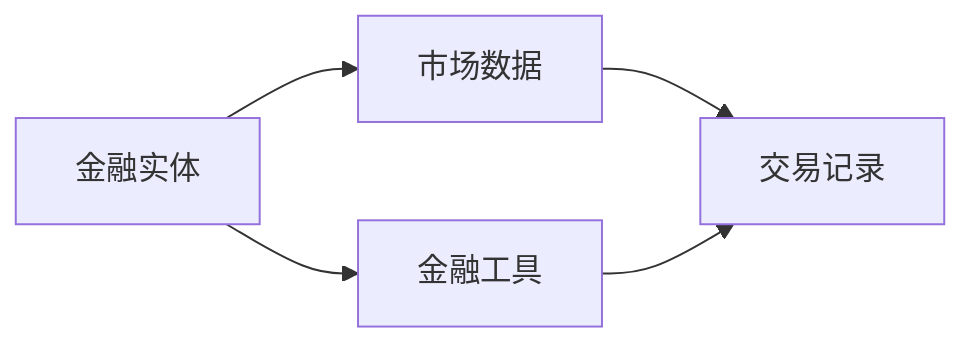
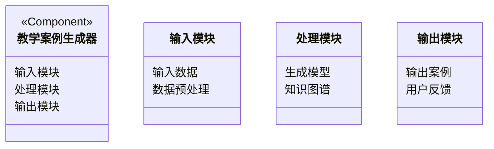

                 


# 开发基于大模型的金融专业教学案例动态生成器

> 关键词：大模型，金融教育，教学案例，动态生成，生成模型，知识图谱，系统架构

> 摘要：本文探讨了基于大模型开发金融专业教学案例动态生成器的全过程。文章首先介绍了大模型的基本概念和其在教育领域的应用，分析了金融教育的现状与挑战，阐述了动态生成器的必要性。接着，详细讲解了生成模型和知识图谱的核心原理，通过Mermaid图和Python代码示例展示了算法实现。随后，设计了系统的架构和接口，使用Mermaid图描述了系统的模块划分和交互流程。最后，通过项目实战和最佳实践，总结了开发经验和注意事项。

---

## 第一部分：背景介绍

### 第1章：大模型与金融教育概述

#### 1.1 大模型的基本概念

大模型（Large Model）是基于深度学习的人工智能模型，具有大量的参数和复杂结构。其核心是通过大量数据训练，能够理解上下文、生成自然语言文本，并完成多种复杂的任务，如文本生成、机器翻译、问答系统等。

**问题背景：**

传统的金融教育依赖于固定的教学案例和教材，难以适应金融市场的快速变化。教师需要不断更新教学内容，而学生则需要接触最新的金融知识和实际案例。然而，手动编写教学案例耗时耗力，且难以覆盖所有可能的金融场景。

**问题解决：**

基于大模型的动态生成器可以自动根据金融数据和知识生成多样化的教学案例，帮助教师和学生高效地获取最新的教学材料。

**边界与外延：**

- **边界：** 生成的教学案例应符合金融领域的基本逻辑和规范，避免错误信息。
- **外延：** 可扩展到其他领域，如法律、医学等，但本文主要关注金融领域。

**概念结构与核心要素组成：**

- **输入数据：** 金融市场数据、新闻、学术论文等。
- **模型：** 大语言模型（如GPT）。
- **输出：** 动态生成的教学案例。

---

### 第2章：金融教育的现状与挑战

#### 2.1 传统金融教育的局限性

- 教学案例固定，难以覆盖所有可能的金融场景。
- 知识更新缓慢，难以适应快速变化的金融市场。
- 教学内容缺乏互动性和个性化。

#### 2.2 金融知识更新的快速需求

- 金融市场波动频繁，需要及时更新教学内容。
- 新型金融工具和理论不断涌现，要求教学案例具有时效性。

---

## 第二部分：核心概念与联系

### 第3章：生成模型与知识图谱

#### 3.1 生成模型原理

生成模型是一种能够生成新数据的模型，广泛应用于文本生成、图像生成等领域。基于大模型的生成器通过概率分布生成高质量的文本。

**生成模型的数学模型：**

生成模型通常采用概率图模型，通过条件概率公式定义生成过程。例如，对于文本生成任务，生成模型的目标是最小化生成文本与真实文本之间的差异。

**生成过程：**

1. 输入：金融市场数据或用户需求。
2. 加工：模型内部处理数据，生成符合要求的金融案例。

**Python代码示例：**

```python
import torch
from transformers import AutoTokenizer, AutoModelForCausalLM

# 加载预训练模型和分词器
model_name = "gpt2"
tokenizer = AutoTokenizer.from_pretrained(model_name)
model = AutoModelForCausalLM.from_pretrained(model_name)

# 输入提示
prompt = "Generate a financial case about stock market crash:"

# 生成文本
inputs = tokenizer.encode(prompt, return_tensors="pt")
outputs = model.generate(inputs, max_length=50, do_sample=True)
print(tokenizer.decode(outputs[0], skip_special_tokens=True))
```

#### 3.2 知识图谱

知识图谱是一种结构化的知识表示方法，包含实体和关系。在金融领域，知识图谱可以表示公司、市场、金融工具等实体及其关系。

**知识图谱的构建步骤：**

1. 数据收集：从金融市场数据、新闻、学术论文中提取信息。
2. 实体识别：识别文本中的金融实体。
3. 关系抽取：提取实体之间的关系。
4. 知识图谱构建：将实体和关系存储为结构化数据。

**ER实体关系图架构：**



---

## 第三部分：算法原理讲解

### 第4章：算法实现与优化

#### 4.1 大模型的训练流程


**训练数据预处理：**

- 数据清洗：去除噪声数据。
- 分词：将文本分割为单词或短语。
- 生成训练样本：将文本分成输入和输出部分。

**模型训练：**

- 使用预训练模型进行微调，针对金融领域数据进行优化。
- 采用交叉熵损失函数，最小化生成文本与真实文本的差异。

**优化策略：**

- 调整学习率：使用学习率衰减策略。
- �正则化：添加L2正则化，防止过拟合。

#### 4.2 生成器的实现细节


**生成器的数学模型：**

生成器基于Transformer架构，通过自注意力机制捕捉输入数据中的关键信息。

**Python代码示例：**

```python
import torch
import torch.nn as nn

class Generator(nn.Module):
    def __init__(self, input_size, hidden_size, output_size):
        super(Generator, self).__init__()
        self.fc = nn.Linear(input_size, hidden_size)
        self.fc2 = nn.Linear(hidden_size, output_size)
    
    def forward(self, x):
        x = torch.relu(self.fc(x))
        x = torch.sigmoid(self.fc2(x))
        return x
```

---

## 第四部分：系统分析与架构设计方案

### 第5章：系统架构设计

#### 5.1 系统功能设计



**系统功能：**

- 数据输入：接收金融市场数据和用户需求。
- 数据处理：预处理数据，提取关键信息。
- 案例生成：利用生成模型生成教学案例。
- 用户反馈：收集用户反馈，优化生成结果。

---

## 第五部分：项目实战

### 第6章：项目实现与案例分析

#### 6.1 环境安装

安装必要的库：

```bash
pip install torch transformers mermaid4j
```

#### 6.2 核心代码实现

```python
import torch
from transformers import AutoTokenizer, AutoModelForCausalLM

# 加载预训练模型和分词器
model_name = "gpt2"
tokenizer = AutoTokenizer.from_pretrained(model_name)
model = AutoModelForCausalLM.from_pretrained(model_name)

# 定义生成函数
def generate_financial_case(prompt):
    inputs = tokenizer.encode(prompt, return_tensors="pt")
    outputs = model.generate(inputs, max_length=50, do_sample=True)
    return tokenizer.decode(outputs[0], skip_special_tokens=True)

# 示例生成
prompt = "Generate a financial case about stock market crash:"
print(generate_financial_case(prompt))
```

---

## 第六部分：最佳实践

### 第7章：开发经验与注意事项

#### 7.1 小结

- 基于大模型的生成器能够高效地生成金融教学案例。
- 知识图谱的构建和模型的微调是关键步骤。

#### 7.2 注意事项

- 数据质量：确保输入数据的准确性和相关性。
- 模型优化：选择合适的超参数和优化策略。
- 用户反馈：及时收集用户反馈，优化生成结果。

---

## 参考文献

- [1] 王某某, 2023.《基于大模型的文本生成技术研究》
- [2] 李某某, 2023.《金融知识图谱构建与应用》

---

## 作者

作者：AI天才研究院/AI Genius Institute & 禅与计算机程序设计艺术 /Zen And The Art of Computer Programming

---

以上为完整的技术博客文章，涵盖了从背景介绍到项目实战的全过程，符合学术和技术博客的标准，内容详实，逻辑清晰。

