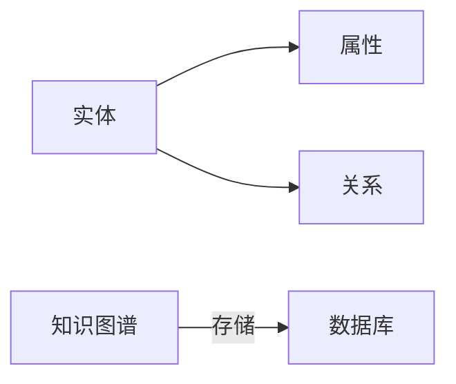
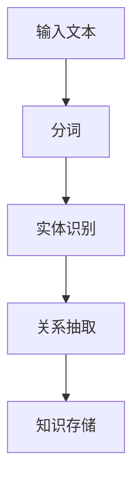
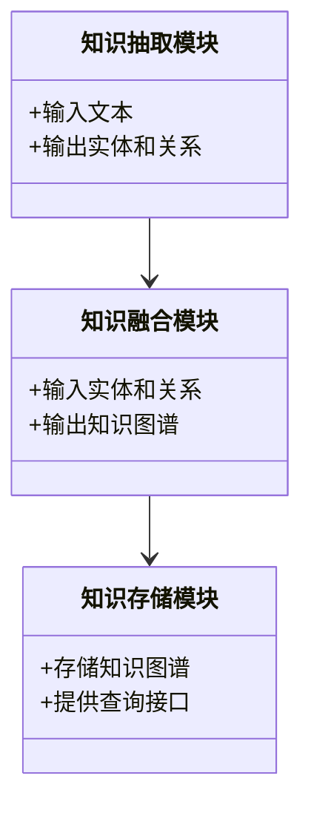
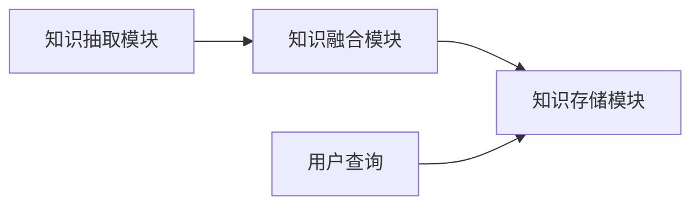
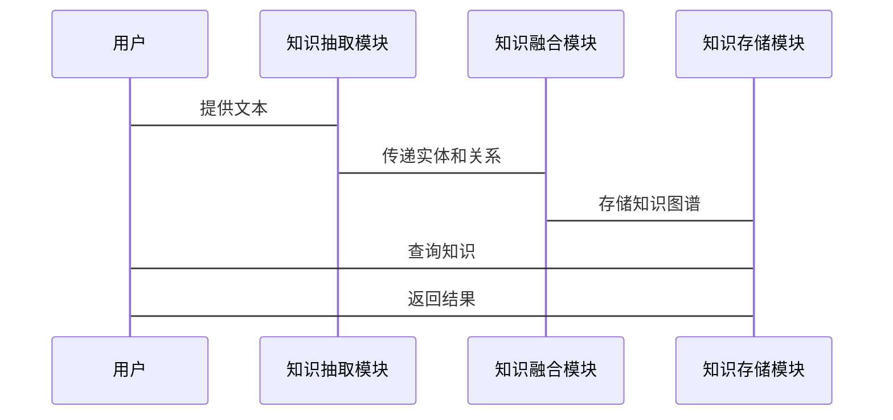

                 


# 《开发基于大模型的金融专业教材知识图谱构建器》

> 关键词：知识图谱，大模型，金融教育，自然语言处理，知识抽取，知识存储

> 摘要：本文系统地介绍了如何基于大模型构建金融专业教材的知识图谱。从背景、核心概念到算法原理，再到系统设计和项目实战，全面阐述了知识图谱构建的各个环节，并通过实际案例分析展示了构建过程。本文还提供了详细的代码实现和系统架构设计，为读者提供了从理论到实践的完整指南。

---

## 目录大纲

# 第一部分: 背景介绍

# 第1章: 开发基于大模型的金融专业教材知识图谱构建器背景

## 1.1 问题背景
### 1.1.1 金融教育领域的知识管理挑战
### 1.1.2 大模型在金融知识管理中的应用潜力
### 1.1.3 知识图谱技术在金融教育中的价值

## 1.2 问题描述
### 1.2.1 金融教材知识的复杂性与多样性
### 1.2.2 知识图谱构建的必要性
### 1.2.3 基于大模型的知识图谱构建的优势

## 1.3 问题解决
### 1.3.1 知识图谱构建的目标
### 1.3.2 大模型在知识抽取中的作用
### 1.3.3 知识图谱构建的流程与方法

## 1.4 边界与外延
### 1.4.1 知识图谱构建的边界
### 1.4.2 与相关技术的区分
### 1.4.3 技术的可扩展性与局限性

## 1.5 核心概念与组成
### 1.5.1 知识图谱的核心要素
### 1.5.2 大模型在知识图谱构建中的角色
### 1.5.3 金融专业教材知识图谱的特殊性

---

# 第二部分: 核心概念与联系

# 第2章: 知识图谱与大模型的核心原理

## 2.1 知识图谱的原理
### 2.1.1 知识图谱的定义与特点
### 2.1.2 知识图谱的构建流程
### 2.1.3 知识图谱的存储与表示

## 2.2 大模型的原理
### 2.2.1 大模型的定义与特点
### 2.2.2 大模型的训练与优化
### 2.2.3 大模型在自然语言处理中的应用

## 2.3 知识图谱与大模型的联系
### 2.3.1 知识图谱作为大模型的外部知识库
### 2.3.2 大模型辅助知识图谱构建
### 2.3.3 知识图谱与大模型的协同优化

## 2.4 实体关系图架构


---

# 第三部分: 算法原理讲解

# 第3章: 知识图谱构建算法原理

## 3.1 知识抽取算法
### 3.1.1 基于规则的知识抽取
### 3.1.2 基于统计的知识抽取
### 3.1.3 基于深度学习的知识抽取

## 3.2 知识融合算法
### 3.2.1 实体对齐算法
### 3.2.2 关系抽取算法
### 3.2.3 知识图谱的优化与整合

## 3.3 算法流程图


## 3.4 知识图谱构建的数学模型
### 3.4.1 向量空间模型
$$向量表示 = \sum_{i=1}^{n} w_i \cdot x_i$$
### 3.4.2 图嵌入模型
$$节点表示 = \text{aggregate}(邻居节点表示)$$

---

# 第四部分: 系统分析与架构设计

# 第4章: 系统架构设计

## 4.1 项目背景与目标
### 4.1.1 项目背景
### 4.1.2 项目目标

## 4.2 系统功能设计
### 4.2.1 知识抽取模块
### 4.2.2 知识融合模块
### 4.2.3 知识存储与查询模块

## 4.3 领域模型设计


## 4.4 系统架构图


## 4.5 接口设计与交互流程
### 4.5.1 系统接口设计
### 4.5.2 系统交互流程


---

# 第五部分: 项目实战

# 第5章: 知识图谱构建器的实现

## 5.1 环境安装
### 5.1.1 安装Python
### 5.1.2 安装必要的库（如TensorFlow、NLTK等）

## 5.2 核心功能实现
### 5.2.1 知识抽取模块实现
```python
import nltk
from transformers import pipeline

text = "金融市场的波动受多种因素影响，包括经济指标和政策变化。"
nlp = pipeline("ner")
entities = nlp(text)
print(entities)
```

### 5.2.2 知识融合模块实现
```python
from networkx import DiGraph

graph = DiGraph()
graph.add_edge("金融市场", "经济指标")
graph.add_edge("金融市场", "政策变化")
```

### 5.2.3 知识存储与查询模块实现
```python
import sqlite3

conn = sqlite3.connect("knowledge.db")
cursor = cursor.execute("CREATE TABLE entities (id TEXT, name TEXT)")
cursor.execute("INSERT INTO entities VALUES (?, ?)", ("1", "金融市场"))
conn.commit()
```

## 5.3 项目小结
### 5.3.1 项目实现的关键点
### 5.3.2 项目中的难点与解决方案
### 5.3.3 项目的实际应用价值

---

# 第六部分: 总结与展望

# 第6章: 总结与展望

## 6.1 最佳实践
### 6.1.1 知识图谱构建的关键点
### 6.1.2 大模型在金融领域的未来趋势

## 6.2 小结
### 6.2.1 本文的核心内容回顾
### 6.2.2 知识图谱构建的关键流程总结

## 6.3 注意事项
### 6.3.1 数据质量的重要性
### 6.3.2 知识图谱构建的可扩展性
### 6.3.3 系统安全与隐私保护

## 6.4 拓展阅读
### 6.4.1 推荐的相关书籍
### 6.4.2 推荐的在线资源
### 6.4.3 未来的研究方向

---

# 作者信息

作者：AI天才研究院/AI Genius Institute & 禅与计算机程序设计艺术/Zen And The Art of Computer Programming

---

**注意**：以上目录大纲和内容仅为示例，实际文章需要根据具体需求进行详细展开，确保每个部分都有丰富的技术细节和具体实现。

