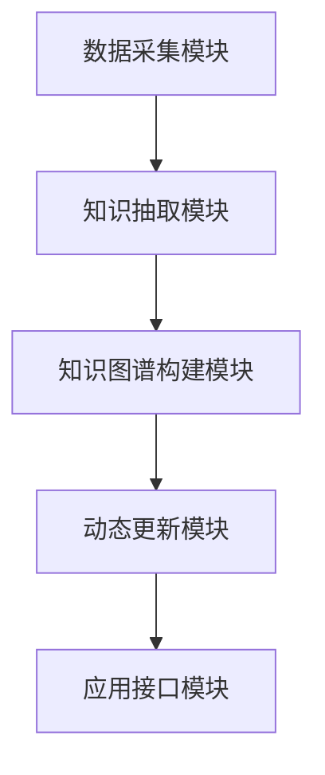

                 


# 开发基于大模型的金融专业知识图谱动态更新系统

> 关键词：金融知识图谱，大模型，动态更新，系统架构，算法原理

> 摘要：本文详细探讨了开发基于大模型的金融专业知识图谱动态更新系统的各个方面，从背景介绍到系统架构设计，再到项目实战，逐步分析了系统的构建过程。文章首先介绍了金融知识图谱的背景与需求，接着深入探讨了大模型在金融知识图谱中的应用，详细讲解了系统的核心概念与算法原理。随后，文章通过Mermaid图展示了系统的架构设计，并结合实际案例详细阐述了项目实战的步骤。最后，文章总结了开发中的经验和注意事项，为读者提供了一份完整的开发指南。

---

## 第一部分: 背景与概述

### 第1章: 金融专业知识图谱的背景与需求

#### 1.1 金融知识图谱的背景
金融知识图谱是一种将金融领域的实体、关系和概念以结构化形式表示的知识网络。它能够帮助金融机构更好地理解和分析复杂的金融数据，支持智能决策和业务创新。

- **知识图谱的定义**：知识图谱是一种图结构的数据表示方式，节点代表实体或概念，边代表实体之间的关系。
- **金融领域的知识图谱**：在金融领域，知识图谱可以表示公司、金融产品、市场趋势、法规政策等信息及其相互关系。

#### 1.2 大模型在金融知识图谱中的应用
大模型（如GPT、BERT等）具有强大的自然语言处理能力和知识表示能力，能够为金融知识图谱的构建和更新提供支持。

- **大模型的优势**：
  - **知识表示**：大模型能够理解金融领域的复杂语义，帮助提取和组织金融知识。
  - **动态更新**：大模型可以实时处理新的金融数据，保持知识图谱的最新性。
  - **推理能力**：大模型能够基于知识图谱进行推理，支持智能问答和决策。

#### 1.3 知识图谱动态更新的重要性
金融市场的数据和信息是动态变化的，知识图谱需要能够实时更新以反映最新的市场情况。

- **动态更新的必要性**：
  - 金融市场数据的实时性要求。
  - 金融法规和政策的频繁变化。
  - 金融领域的突发事件（如市场波动、公司并购等）。

---

### 第2章: 金融专业知识图谱动态更新系统的基本概念

#### 2.1 知识图谱的基本概念
- **节点与边**：节点表示实体或概念，边表示实体之间的关系。
- **知识图谱的构建**：通过数据抽取、实体识别、关系抽取等技术构建知识图谱。
- **知识图谱的表示**：常用RDF（Resource Description Framework）或图数据库（如Neo4j）进行存储。

#### 2.2 大模型在知识图谱更新中的作用
- **大模型的知识表示能力**：能够处理非结构化数据，提取隐含知识。
- **大模型的推理能力**：能够基于知识图谱进行逻辑推理，支持复杂查询。
- **大模型的动态更新能力**：能够实时处理新的数据，更新知识图谱。

#### 2.3 系统的基本架构
- **系统架构**：包括数据采集模块、知识抽取模块、知识图谱构建模块、动态更新模块和应用接口模块。
- **模块功能**：
  - 数据采集：从金融新闻、研究报告等多源数据中获取信息。
  - 知识抽取：提取实体、关系和属性。
  - 知识图谱构建：将抽取的信息组织成图结构。
  - 动态更新：实时更新知识图谱。
  - 应用接口：提供API接口，供上层应用调用。

---

## 第二部分: 核心概念与联系

### 第3章: 知识图谱与大模型的核心概念

#### 3.1 知识图谱的核心概念
- **实体**：金融领域的具体事物，如公司、金融产品、市场等。
- **关系**：实体之间的关联，如“公司A收购公司B”。
- **属性**：实体的特征，如公司的成立时间、注册资本等。

#### 3.2 大模型的核心概念
- **预训练模型**：通过大量数据训练得到的通用模型，具有强大的语义理解能力。
- **微调**：针对特定任务对预训练模型进行 fine-tuning，提高任务相关性。
- **生成与推理**：能够生成文本、回答问题，并进行逻辑推理。

#### 3.3 知识图谱与大模型的结合
- **知识抽取**：利用大模型从文本中抽取实体、关系和属性。
- **知识表示**：将抽取的信息组织成知识图谱的结构。
- **知识推理**：基于知识图谱进行逻辑推理，支持智能应用。

---

### 第4章: 知识图谱与大模型的联系

#### 4.1 知识图谱与大模型的对比分析
| 特性 | 知识图谱 | 大模型 |
|------|----------|--------|
| 数据类型 | 结构化数据 | 非结构化数据 |
| 功能 | 存储和查询知识 | 理解和生成文本 |
| 应用 | 支持智能问答、推荐系统 | 支持文本生成、情感分析 |

#### 4.2 知识图谱与大模型的联系
- **数据流**：大模型从知识图谱中获取结构化知识，用于生成文本或回答问题。
- **反馈机制**：大模型的输出可以反哺知识图谱的构建和更新。
- **协同工作**：知识图谱为大模型提供领域知识，大模型为知识图谱提供动态更新能力。

---

## 第三部分: 算法原理

### 第5章: 知识抽取算法

#### 5.1 实体识别算法
- **NER（Named Entity Recognition）**：使用大模型进行实体识别，提取金融领域的实体。
- **算法流程**：
  1. 输入文本数据。
  2. 通过大模型识别文本中的实体。
  3. 输出实体列表。

#### 5.2 关系抽取算法
- **关系抽取**：基于大模型的关系抽取模型，识别文本中的关系。
- **算法流程**：
  1. 输入文本数据。
  2. 通过大模型识别文本中的关系。
  3. 输出关系列表。

#### 5.3 属性抽取算法
- **属性抽取**：基于大模型的属性抽取模型，提取实体的属性信息。
- **算法流程**：
  1. 输入文本数据。
  2. 通过大模型识别文本中的属性。
  3. 输出属性列表。

---

### 第6章: 知识图谱构建算法

#### 6.1 知识图谱构建流程
1. 数据清洗：去除噪音数据。
2. 数据抽取：从多源数据中抽取实体、关系和属性。
3. 数据融合：将抽取的信息整合成统一的知识图谱。
4. 数据存储：将知识图谱存储到图数据库中。

#### 6.2 知识图谱构建的数学模型
- **图结构表示**：使用图论中的节点和边表示知识图谱。
- **知识表示学习**：使用嵌入方法（如Word2Vec、GloVe）将知识图谱中的节点和边映射到低维空间。

---

## 第四部分: 系统架构设计

### 第7章: 系统架构设计

#### 7.1 系统功能设计
- **数据采集模块**：从多种数据源（如新闻、报告）采集金融数据。
- **知识抽取模块**：利用大模型从文本中抽取实体、关系和属性。
- **知识图谱构建模块**：将抽取的信息组织成知识图谱。
- **动态更新模块**：实时更新知识图谱。
- **应用接口模块**：提供API接口，供上层应用调用。

#### 7.2 系统架构图


#### 7.3 系统接口设计
- **输入接口**：接收外部数据源的金融数据。
- **输出接口**：提供知识图谱的查询接口。
- **API接口**：供上层应用调用知识图谱服务。

---

## 第五部分: 项目实战

### 第8章: 环境安装与代码实现

#### 8.1 环境安装
```bash
pip install python-Neo4j
pip install transformers
pip install numpy
pip install matplotlib
```

#### 8.2 核心代码实现
```python
from transformers import AutoTokenizer, AutoModelForMaskedLM
import neo4j

# 初始化大模型
tokenizer = AutoTokenizer.from_pretrained('bert-base-uncased')
model = AutoModelForMaskedLM.from_pretrained('bert-base-uncased')

# 连接Neo4j数据库
driver = neo4j.driver("bolt://localhost:7687", neo4j.auth("neo4j", "password"))
```

#### 8.3 代码解读与分析
- **大模型初始化**：使用BERT模型进行文本处理。
- **Neo4j数据库连接**：将知识图谱存储到Neo4j数据库中。

---

### 第9章: 实际案例分析与解读

#### 9.1 案例分析
- **案例背景**：某公司收购另一家公司。
- **知识抽取**：从新闻中抽取实体（公司A、公司B）和关系（收购）。
- **知识图谱更新**：将抽取的信息更新到知识图谱中。

#### 9.2 案例实现
```python
# 抽取实体
def extract_entities(text):
    inputs = tokenizer(text, return_tensors='np')
    outputs = model(**inputs)
    # 实体抽取逻辑
    entities = []
    return entities

# 更新知识图谱
def update_knowledge_graph(entities, relations):
    # 更新逻辑
    pass
```

---

## 第六部分: 总结与展望

### 第10章: 总结与经验分享

#### 10.1 开发经验总结
- **数据质量**：数据清洗和预处理是关键。
- **模型选择**：选择适合任务的模型。
- **系统架构**：模块化设计有助于系统的扩展和维护。

#### 10.2 开发中的注意事项
- **数据隐私**：注意金融数据的隐私保护。
- **模型性能**：优化模型的推理速度和准确性。
- **系统稳定性**：确保系统的高可用性和容错能力。

---

### 第11章: 未来展望

#### 11.1 技术进步
- **大模型的优化**：开发更高效的金融知识图谱构建和更新方法。
- **多模态融合**：结合图像、音频等多模态数据，丰富知识图谱的内容。

#### 11.2 应用拓展
- **智能问答**：基于知识图谱提供智能问答服务。
- **金融预测**：结合知识图谱进行市场趋势预测。

---

作者：AI天才研究院/AI Genius Institute & 禅与计算机程序设计艺术 /Zen And The Art of Computer Programming

