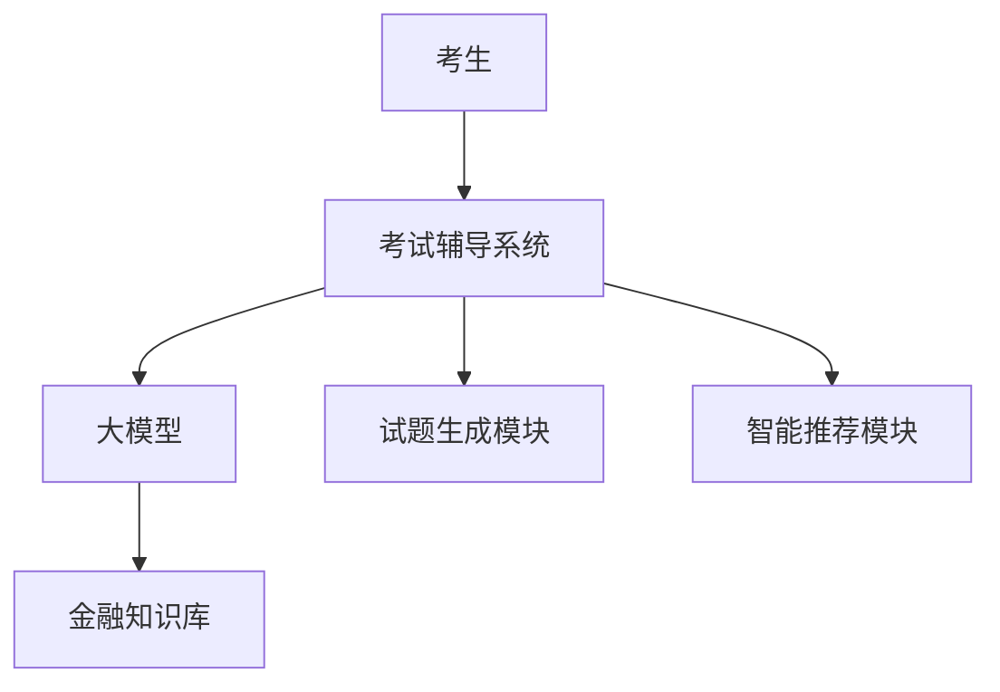

                 


# 开发基于大模型的金融专业考试辅导系统

> 关键词：大模型，金融考试，智能辅导系统，文本生成，知识推理

> 摘要：本文详细探讨了开发基于大模型的金融专业考试辅导系统的各个方面，包括背景分析、核心概念、算法原理、系统架构设计以及实际项目实现。通过结合大模型技术与金融领域的专业知识，本文提出了一个高效的解决方案，旨在为金融考试提供智能化的辅导支持。

---

## 第一部分: 背景介绍与核心概念

### 第1章: 问题背景与需求分析

#### 1.1 问题背景
金融市场的发展日益复杂，金融考试的难度也在不断增加。传统的金融考试辅导主要依赖于人工讲解和固定的教材，难以满足个性化学习需求。同时，考生的知识水平、学习习惯和问题特点各不相同，传统辅导方式难以实现精准教学。

大模型技术的快速发展为金融考试辅导带来了新的可能性。大模型具备强大的自然语言处理能力和知识推理能力，可以为考生提供个性化的学习建议和精准的知识点讲解。

#### 1.2 问题描述
金融考试辅导的核心问题在于如何为考生提供个性化的学习支持，解决他们在学习过程中遇到的具体问题。传统辅导方式存在以下问题：
- **个性化不足**：无法针对不同考生的知识水平和学习需求提供差异化服务。
- **知识更新慢**：金融市场的知识更新速度快，传统教材难以及时更新。
- **互动性差**：考生与辅导系统之间的互动有限，难以实时反馈和调整教学策略。

#### 1.3 解决方案
基于大模型的金融考试辅导系统通过以下方式解决问题：
- **个性化学习计划**：根据考生的知识水平和学习习惯，制定个性化的学习计划。
- **实时互动**：考生可以与系统进行实时互动，系统能够根据反馈动态调整教学策略。
- **知识更新及时**：大模型能够实时获取最新的金融知识，确保辅导内容的准确性。

#### 1.4 边界与外延
金融考试辅导系统的核心边界在于其功能范围。系统主要关注金融考试相关的知识点讲解、试题生成和智能推荐，不涉及其他领域的知识。

### 第2章: 核心概念与联系

#### 2.1 大模型与金融考试辅导的结合
大模型是一种基于深度学习的自然语言处理模型，具有以下特点：
- **强大的上下文理解能力**：能够理解复杂文本中的上下文关系。
- **知识推理能力**：能够根据已有知识进行推理和推断。
- **自适应学习能力**：能够通过不断学习优化自身的性能。

在金融考试辅导中的作用：
- **知识点讲解**：大模型可以为考生提供详细的金融知识点讲解。
- **试题生成**：根据知识点生成相关试题。
- **智能推荐**：根据考生的学习情况推荐适合的学习资料。

#### 2.2 核心概念对比分析
以下是大模型与传统机器学习模型的对比：

| 对比维度 | 大模型 | 传统机器学习 |
|----------|--------|--------------|
| 模型复杂度 | 高     | 较低         |
| 数据需求 | 较大    | 较小         |
| 任务类型 | 多任务  | 单任务        |
| 性能 | 高 | 中等 |

#### 2.3 实体关系图
以下是金融考试辅导系统的实体关系图：



---

## 第二部分: 算法原理与数学模型

### 第3章: 大模型算法原理

#### 3.1 大模型的基本原理
大模型的核心算法基于Transformer架构，主要包括编码器和解码器两个部分。编码器负责将输入的文本转换为向量表示，解码器负责根据编码器的输出生成目标文本。

#### 3.2 金融考试辅导中的算法应用
- **文本生成**：用于生成详细的知识点讲解和试题。
- **知识推理**：用于根据知识点生成相关试题。
- **试题自动生成**：根据知识点生成不同难度的试题。

### 第4章: 数学模型与公式

#### 4.1 大模型的核心公式
- **损失函数**：
  $$ \text{损失函数} = -\sum_{i=1}^{n} y_i \log(p_i) + (1 - y_i)\log(1 - p_i) $$
  
- **优化算法**：
  $$ \theta_{t+1} = \theta_t - \eta \cdot \nabla L $$

#### 4.2 金融考试辅导中的数学模型
- **用户画像构建**：
  $$ \text{用户画像} = \{u_1, u_2, ..., u_n\} $$
  
- **试题难度评估**：
  $$ \text{难度系数} = \frac{\text{正确率}}{\text{用户基础水平}} $$

---

## 第三部分: 系统分析与架构设计

### 第5章: 系统分析

#### 5.1 项目背景与目标
本项目旨在开发一个基于大模型的金融考试辅导系统，为考生提供个性化的学习支持。项目目标包括：
- 提供详细的金融知识点讲解。
- 根据知识点生成相关试题。
- 根据考生的学习情况推荐适合的学习资料。

#### 5.2 功能需求分析
- **知识点讲解**：提供详细的金融知识点讲解。
- **试题生成**：根据知识点生成相关试题。
- **智能推荐**：根据考生的学习情况推荐学习资料。

### 第6章: 系统架构设计

#### 6.1 系统架构图
以下是系统的架构图：


---

## 第四部分: 项目实战

### 第7章: 项目实战

#### 7.1 环境搭建
- **编程语言**：Python 3.8+
- **框架选择**：使用Hugging Face的Transformers库。
- **大模型选择**：使用GPT-3模型。

#### 7.2 核心代码实现

```python
from transformers import AutoModelForCausalLM, AutoTokenizer

# 初始化大模型
model_name = "gpt2"
tokenizer = AutoTokenizer.from_pretrained(model_name)
model = AutoModelForCausalLM.from_pretrained(model_name)

# 文本生成
def generate_text(prompt, max_length=50):
    inputs = tokenizer.encode(prompt, return_tensors="pt")
    outputs = model.generate(inputs, max_length=max_length, do_sample=True)
    return tokenizer.decode(outputs[0], skip_special_tokens=True)

# 知识点讲解
def explain_concept(concept):
    prompt = f"请详细解释以下金融概念：{concept}"
    return generate_text(prompt, max_length=200)
```

#### 7.3 案例分析
假设考生需要学习“期权定价”的知识点，系统可以生成以下内容：
- **知识点讲解**：详细解释期权定价的基本原理和相关公式。
- **试题生成**：生成一道关于期权定价的计算题。
- **智能推荐**：推荐相关的学习资料和练习题。

---

## 第五部分: 最佳实践

### 第8章: 最佳实践

#### 8.1 小结
基于大模型的金融考试辅导系统能够为考生提供个性化的学习支持，显著提升学习效率。

#### 8.2 注意事项
- **数据隐私**：确保考生数据的隐私和安全。
- **模型优化**：定期优化模型以提升生成内容的质量。

#### 8.3 拓展阅读
- 《深度学习入门：基于Python的实践》
- 《自然语言处理实战：基于Transformers的文本分析》

---

作者：AI天才研究院/AI Genius Institute & 禅与计算机程序设计艺术 /Zen And The Art of Computer Programming

