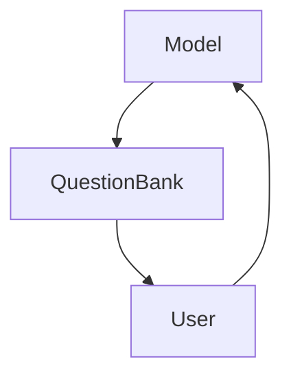

                 


# 第三部分: 算法原理

## 第3章: 大模型生成题目算法原理

### 3.1 预训练过程
#### 3.1.1 语言模型的预训练目标
#### 3.1.2 金融领域文本数据的处理
#### 3.1.3 预训练模型的评估指标

### 3.2 微调与适配
#### 3.2.1 微调过程中的数据增强策略
#### 3.2.2 金融领域特定任务的适配方法
#### 3.2.3 微调后的模型评估与优化

### 3.3 题目生成解码策略
#### 3.3.1 解码过程中的beam search算法
#### 3.3.2 温度参数与top-k采样方法
#### 3.3.3 多轮解码的优化策略

## 第4章: 生成模型的数学基础

### 4.1 基于transformer的模型架构
#### 4.1.1 自注意力机制的数学公式
#### 4.1.2 前馈神经网络的结构解析
#### 4.1.3 段落级联结构的优化

### 4.2 生成过程中的损失函数
#### 4.2.1 交叉熵损失函数的定义
$$ L = -\sum_{i=1}^{n} \sum_{j=1}^{m} y_{i,j} \log p(y_{i,j}|y_{i,1},...,y_{i,j-1}) $$
#### 4.2.2 损失函数的优化方法
#### 4.2.3 梯度下降的应用

### 4.3 解码过程中的算法优化
#### 4.3.1 Beam Search的实现细节
#### 4.3.2 Top-k采样的数学表达
#### 4.3.3 多轮解码的收敛条件

# 第四部分: 系统分析与架构设计

## 第5章: 系统分析与架构设计

### 5.1 系统需求分析
#### 5.1.1 功能需求分析
#### 5.1.2 性能需求分析
#### 5.1.3 用户需求分析

### 5.2 系统架构设计
#### 5.2.1 系统架构概述

#### 5.2.2 模块划分与设计
#### 5.2.3 模块之间的交互流程

### 5.3 数据流设计
#### 5.3.1 数据来源与处理流程
#### 5.3.2 数据存储与管理
#### 5.3.3 数据安全与隐私保护

# 第五部分: 项目实战

## 第6章: 项目实战与实现

### 6.1 环境搭建与安装
#### 6.1.1 系统环境要求
#### 6.1.2 软件依赖安装
#### 6.1.3 开发工具配置

### 6.2 核心代码实现
#### 6.2.1 模型加载与初始化
#### 6.2.2 数据预处理与加载
#### 6.2.3 生成函数实现
```python
def generate_question(model, tokenizer, max_length=50):
    input_ids = tokenizer.encode("Generate a financial question:", add_special_tokens=True)
    input_ids = input_ids + [tokenizer.eos_token_id]
    input_ids = torch.tensor(input_ids, dtype=torch.long).unsqueeze(0)
    output = model.generate(
        input_ids=input_ids,
        max_length=max_length,
        temperature=0.7,
        top_k=50
    )
    question = tokenizer.decode(output[0], skip_special_tokens=True)
    return question
```
#### 6.2.4 评分函数实现
```python
def score_question(question, answer, model, tokenizer):
    input = f"Question: {question}\nAnswer: {answer}"
    inputs = tokenizer.encode_plus(input, return_tensors='pt', max_length=100, truncation=True)
    outputs = model.generate(input_ids=inputs['input_ids'])
    prediction = tokenizer.decode(outputs[0], skip_special_tokens=True)
    return prediction == answer
```

### 6.3 实际案例分析
#### 6.3.1 生成题目案例展示
#### 6.3.2 案例分析与解释
#### 6.3.3 生成效果评估

## 第7章: 项目总结与经验分享

### 7.1 项目总结
#### 7.1.1 项目成果
#### 7.1.2 技术难点与解决方案
#### 7.1.3 可能的局限性与改进方向

### 7.2 经验分享与建议
#### 7.2.1 数据准备的注意事项
#### 7.2.2 模型调优的经验
#### 7.2.3 系统部署的建议

# 第六部分: 最佳实践与注意事项

## 第8章: 最佳实践

### 8.1 数据准备与处理
#### 8.1.1 数据清洗的常见问题
#### 8.1.2 数据增强的有效方法
#### 8.1.3 数据格式的标准化

### 8.2 模型选择与优化
#### 8.2.1 模型选择的建议
#### 8.2.2 模型调优的技巧
#### 8.2.3 模型部署的注意事项

## 第9章: 小结与注意事项

### 9.1 开发过程中的常见问题
#### 9.1.1 数据不足的问题
#### 9.1.2 模型生成偏差的问题
#### 9.1.3 系统性能的问题

### 9.2 优化建议
#### 9.2.1 数据层面的优化
#### 9.2.2 模型层面的优化
#### 9.2.3 系统层面的优化

### 9.3 未来研究方向
#### 9.3.1 更复杂的金融题目生成
#### 9.3.2 多模态生成的应用
#### 9.3.3 更高精度的生成模型

---

# 附录

## 附录A: 术语表

## 附录B: 参考文献

## 附录C: 项目代码仓库链接

## 附录D: 模型训练日志示例

## 附录E: 常见问题解答

---

# 作者

作者：AI天才研究院/AI Genius Institute & 禅与计算机程序设计艺术 /Zen And The Art of Computer Programming

---

通过以上详细的大纲，我们可以看到，这本书将从背景介绍、核心概念、算法原理、系统设计、项目实战到最佳实践，全面而系统地讲解如何开发一个基于大模型的金融专业考试题目生成器。每个部分都深入浅出，结合理论与实践，为读者提供了完整的开发指南。

