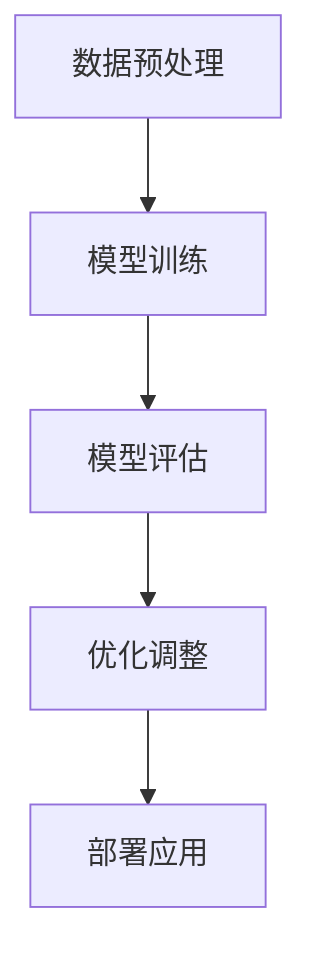
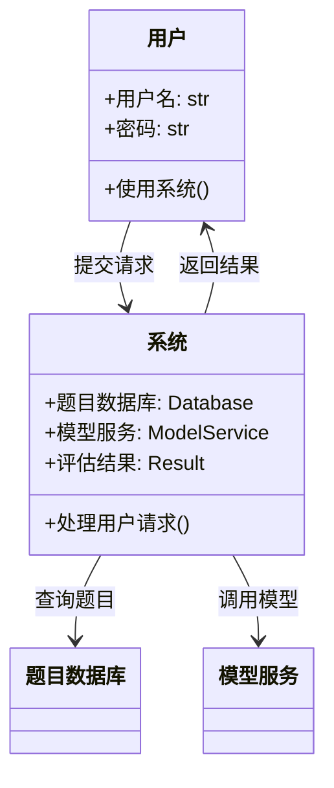
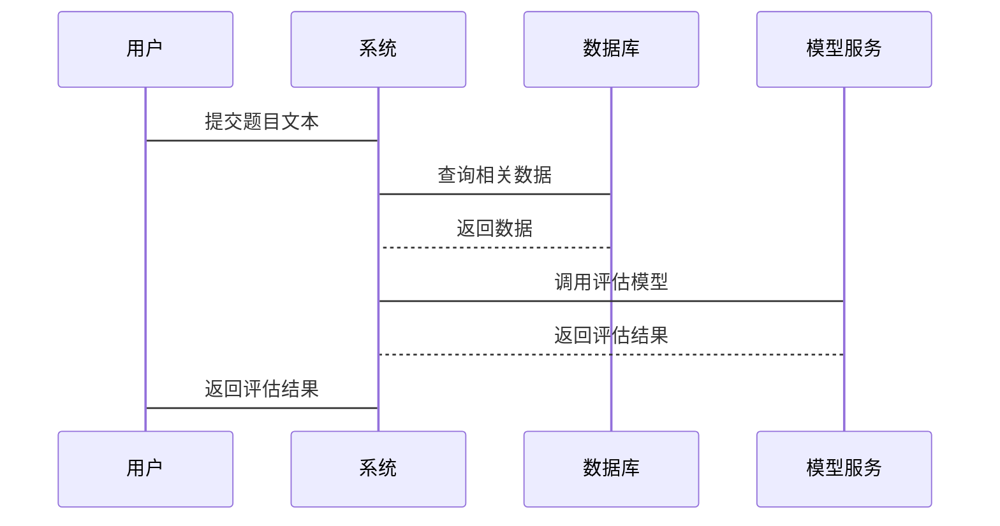

                 


# 开发基于大模型的金融专业考试题目难度评估系统

---

## 关键词：大模型、金融考试、题目难度评估、自然语言处理、深度学习

---

## 摘要：  
本文详细探讨了基于大模型的金融专业考试题目难度评估系统的开发过程。通过结合自然语言处理和深度学习技术，系统能够对金融考试题目进行智能分析，准确评估其难度。文章从问题背景、核心概念、算法原理、系统架构到项目实战，全面解析了该系统的开发过程，并提供了详细的实现方案和最佳实践。

---

# 第1章: 问题背景与需求分析

## 1.1 问题背景  
金融考试题目难度评估是教育领域中的一个重要问题。传统的评估方法依赖于人工经验，存在主观性强、效率低、难以量化等问题。随着大模型技术的快速发展，基于人工智能的自动评估系统逐渐成为可能。  

## 1.2 问题描述  
本系统的目标是通过大模型技术，对金融考试题目进行自动难度评估。系统需要处理以下问题：  
- 如何准确提取题目中的关键信息？  
- 如何量化题目的难度？  
- 如何训练模型以适应金融领域的特殊需求？  

## 1.3 问题解决思路  
1. 利用大模型的自然语言处理能力，提取题目中的关键词和语义信息。  
2. 建立金融领域的知识图谱，帮助模型更好地理解题目内容。  
3. 使用回归模型量化题目难度，结合领域专家的反馈进行模型优化。  

---

# 第2章: 核心概念与系统架构

## 2.1 大模型与金融考试的结合  
### 2.1.1 大模型的基本原理  
大模型（如BERT、GPT）通过预训练掌握了大量语言知识，能够理解和生成自然语言文本。在金融领域，这些模型可以用于文本分析、问答系统等任务。  

### 2.1.2 金融考试的特点与需求  
金融考试题目通常涉及复杂的金融概念、案例分析和计算题。题目难度的评估需要考虑知识点的深度、题型的复杂性以及考生的平均水平。  

### 2.1.3 两者的结合点分析  
大模型可以作为金融考试题目的分析工具，帮助提取题目中的关键信息，并结合领域知识进行难度评估。  

## 2.2 题目难度评估系统的核心要素  
### 2.2.1 评估指标体系  
- 知识点难度：题目涉及的知识点的深度和广度。  
- 题型复杂度：题目类型（如选择题、计算题）的复杂程度。  
- 语言难度：题目表述的清晰程度和复杂性。  

### 2.2.2 数据来源与处理  
- 数据来源：金融考试题目数据库、领域知识库。  
- 数据处理：文本清洗、分词、关键词提取。  

### 2.2.3 模型训练与优化  
- 训练数据：标注好的题目难度数据。  
- 模型优化：基于评估结果的反馈，不断优化模型参数。  

## 2.3 系统架构的ER实体关系图  
```mermaid
er
actor: 用户
actor --> system: 使用系统
system --> question: 存储题目
system --> model: 使用大模型进行评估
question --> difficulty_level: 难度等级
```

---

# 第3章: 算法原理与实现

## 3.1 算法原理概述  
### 3.1.1 大模型在题目评估中的应用  
大模型通过自然语言处理技术，提取题目中的关键词和语义信息，为难度评估提供基础数据。  

### 3.1.2 算法的核心思想  
利用回归模型对题目难度进行量化评估。输入为题目文本，输出为难度分数。  

### 3.1.3 算法的数学模型  
回归模型可以表示为：  
$$ y = \beta_0 + \beta_1 x_1 + \beta_2 x_2 + \dots + \beta_n x_n $$  
其中，$y$ 是难度分数，$x_i$ 是题目特征，$\beta_i$ 是模型参数。  

## 3.2 算法实现流程  
### 3.2.1 数据预处理  
- 对题目文本进行分词、去停用词等处理。  
- 提取关键词，构建特征向量。  

### 3.2.2 模型训练  
- 使用训练数据训练回归模型。  
- 调整模型参数，优化评估结果。  

### 3.2.3 模型评估与优化  
- 使用验证集评估模型性能。  
- 基于评估结果，调整模型参数，优化模型表现。  

## 3.3 算法实现的mermaid流程图  


## 3.4 算法实现的Python代码示例  
```python
import numpy as np
from sklearn.linear_model import LinearRegression

# 示例数据
X = np.array([[1, 2], [3, 4], [5, 6]])
y = np.array([2, 3, 5])

# 训练模型
model = LinearRegression()
model.fit(X, y)

# 预测结果
print(model.predict([[7, 8]]))
```

---

# 第4章: 系统分析与架构设计

## 4.1 问题场景介绍  
系统需要处理大量的金融考试题目，评估每道题的难度，并为用户提供评估结果。  

## 4.2 项目介绍  
本项目基于大模型技术，开发一个金融专业考试题目难度评估系统，旨在提高评估效率和准确性。  

## 4.3 系统功能设计  
### 4.3.1 领域模型mermaid类图  


### 4.3.2 系统架构设计mermaid架构图  
```mermaid
C4Model
ComponentDiagram
    actor 用户
    component 系统
    component 数据库
    component 模型服务
    用户 --> 系统: 请求处理
    系统 --> 数据库: 查询数据
    系统 --> 模型服务: 调用模型
    系统 --> 用户: 返回结果
```

## 4.4 系统接口设计  
- 用户接口：API接口，接收题目文本，返回难度评估结果。  
- 系统接口：数据库接口，存储和查询题目数据。  

## 4.5 系统交互mermaid序列图  


---

# 第5章: 项目实战

## 5.1 环境安装  
- 安装Python和必要的库（如numpy、scikit-learn、transformers）。  
- 安装大模型框架（如TensorFlow、PyTorch）。  

## 5.2 系统核心实现  
### 5.2.1 核心代码实现  
```python
import transformers
from transformers import BertTokenizer, BertModel

# 加载预训练模型
tokenizer = BertTokenizer.from_pretrained('bert-base-uncased')
model = BertModel.from_pretrained('bert-base-uncased')

# 分词处理
def preprocess_text(text):
    inputs = tokenizer(text, return_tensors='np')
    return inputs

# 提取特征
def get_features(text):
    inputs = preprocess_text(text)
    outputs = model(**inputs)
    return outputs.last_hidden_state.mean(axis=1)
```

### 5.2.2 功能解读与分析  
- 预处理文本：对题目文本进行分词和向量化处理。  
- 提取特征：利用BERT模型提取文本特征，为难度评估提供输入数据。  

## 5.3 案例分析  
- 输入：一道复杂的金融案例分析题。  
- 输出：难度评估结果为中等偏难。  

## 5.4 项目小结  
通过实际案例，验证了系统的可行性和有效性。  

---

# 第6章: 最佳实践与拓展阅读

## 6.1 最佳实践  
1. 数据处理：确保数据质量和多样性，避免过拟合。  
2. 模型优化：结合领域知识，优化模型参数和评估指标。  
3. 系统部署：采用微服务架构，提高系统的可扩展性和稳定性。  

## 6.2 小结  
本文详细介绍了基于大模型的金融专业考试题目难度评估系统的开发过程，从理论到实践，全面解析了系统的实现细节。  

## 6.3 注意事项  
- 数据隐私问题：确保用户数据的安全性和隐私性。  
- 模型可解释性：优化模型的可解释性，便于用户理解和使用。  

## 6.4 拓展阅读  
- 推荐阅读《Deep Learning》（Ian Goodfellow等著）。  
- 推荐学习大模型技术（如BERT、GPT）在自然语言处理中的应用。  

---

# 作者：AI天才研究院 & 禅与计算机程序设计艺术

