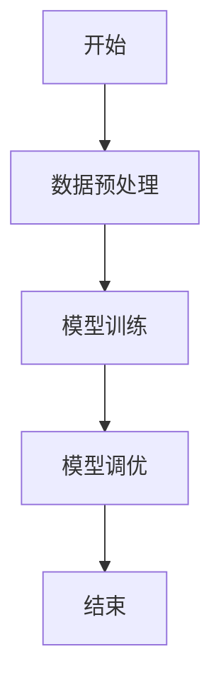
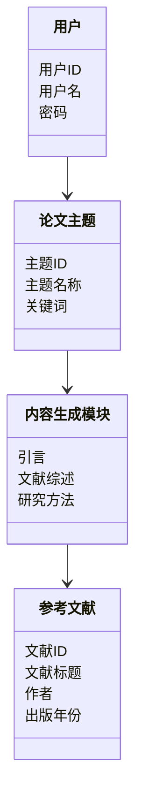
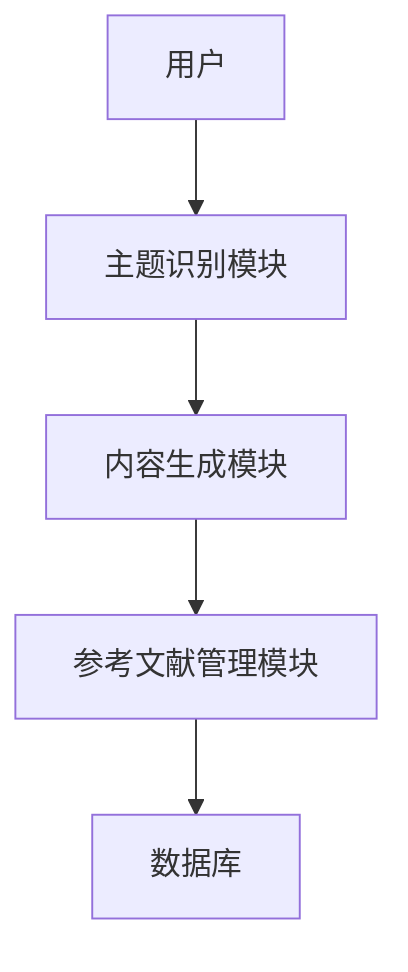
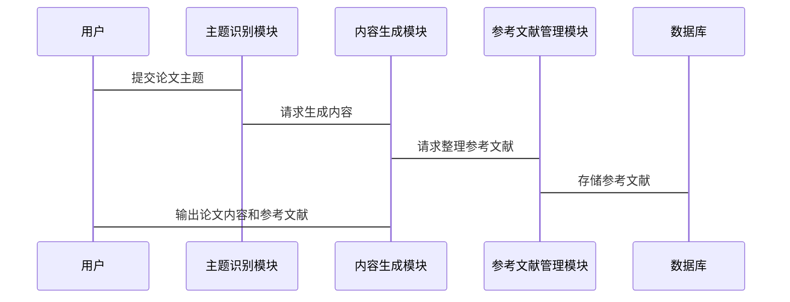

                 


# 开发基于大模型的金融专业论文写作辅助系统

## 关键词：大模型、金融论文、论文写作辅助、自然语言处理、系统架构、算法原理

## 摘要：  
本文详细介绍了开发基于大模型的金融专业论文写作辅助系统的背景、核心概念、算法原理、系统架构设计及项目实战。通过分析金融论文写作的痛点，提出了一种基于大模型的解决方案，详细阐述了系统的功能模块、算法流程和架构设计，并通过实际案例展示了系统的实现与应用。本文旨在为研究人员和开发者提供一个系统化的参考，帮助他们更好地理解和应用大模型技术在金融专业论文写作中的潜力。

---

# 第1章: 背景介绍与核心概念

## 1.1 问题背景与描述

### 1.1.1 金融专业论文写作的痛点
金融领域的论文写作具有高度的专业性和复杂性。研究人员需要处理大量的学术文献、行业数据和复杂的问题分析，同时还需要遵循严格的学术规范和格式要求。传统的人工写作方式效率低下，且容易出现逻辑不连贯、引用错误等问题。

### 1.1.2 大模型在学术写作中的应用潜力
大模型（如GPT系列、BERT系列等）在自然语言处理领域取得了显著成果，能够生成高质量的文本内容，辅助用户完成复杂的写作任务。将大模型应用于金融专业论文写作，可以显著提高写作效率，降低研究成本。

### 1.1.3 本系统的定位与目标
本系统旨在通过大模型技术，为金融领域的研究人员提供一个智能化的论文写作辅助工具。系统的目标包括：  
1. 提供论文主题识别功能，帮助用户快速确定研究方向；  
2. 提供内容生成模块，辅助用户撰写高质量的论文内容；  
3. 提供参考文献管理功能，确保引用的规范性与准确性。

## 1.2 核心概念与系统架构

### 1.2.1 大模型的基本概念与属性
大模型是一种基于深度学习的自然语言处理模型，具有以下核心属性：  
1. **大规模训练数据**：通过海量数据的预训练，模型能够理解复杂的语言模式；  
2. **多任务学习能力**：模型可以在多种任务上进行训练，具备通用性；  
3. **生成能力**：模型能够生成连贯且符合上下文语境的文本。

### 1.2.2 金融专业论文写作辅助系统的核心要素
系统的核心要素包括：  
1. **用户输入模块**：接收用户的输入，包括论文主题、关键词等；  
2. **主题识别模块**：通过大模型分析用户输入，确定论文的主题方向；  
3. **内容生成模块**：基于主题生成论文的引言、文献综述、方法部分等内容；  
4. **参考文献管理模块**：根据生成的内容自动整理参考文献。

### 1.2.3 系统边界与外延
系统的边界包括：  
1. 输入：用户的论文主题和需求；  
2. 输出：生成的论文内容和参考文献；  
3. 辅助功能：包括语法检查、格式调整等。  
系统的外延包括：与其他学术工具（如文献数据库、数据分析工具）的集成。

---

# 第2章: 大模型与金融专业论文写作辅助系统的关系

## 2.1 大模型的核心原理

### 2.1.1 大模型的基本原理
大模型的核心原理包括：  
1. **预训练**：通过大规模数据的无监督学习，模型学习语言的分布特征；  
2. **微调**：在特定任务上进行有监督训练，优化模型的性能；  
3. **生成机制**：通过解码器生成文本内容，同时考虑上下文信息。

### 2.1.2 大模型的训练与推理过程
#### 训练过程
1. 数据预处理：清洗数据，去除噪声；  
2. 模型训练：使用GPU加速训练，优化目标函数；  
3. 模型调优：通过验证集调整超参数，提升性能。  

#### 推理过程
1. 输入处理：将用户的输入转换为模型可处理的格式；  
2. 解码生成：模型生成文本内容；  
3. 输出处理：对生成的内容进行格式化和校验。

### 2.1.3 大模型的优缺点分析
**优点**：  
1. 生成能力强，能够处理复杂文本；  
2. 可扩展性高，适用于多种任务。  
**缺点**：  
1. 计算资源需求高；  
2. 可能存在生成内容的偏差或不准确。

## 2.2 金融专业论文写作辅助系统的功能模块

### 2.2.1 论文主题识别模块
该模块通过分析用户的输入，识别论文的主题方向，并生成相关的关键词和研究问题。例如，用户输入“金融风险管理”，系统会生成相关主题，如“信用风险、市场风险、操作风险”等。

### 2.2.2 内容生成模块
该模块根据主题生成论文的各个部分，包括引言、文献综述、研究方法、数据分析和结论。例如，生成引言部分时，系统会提供研究背景、研究问题和研究意义。

### 2.2.3 参考文献管理模块
该模块根据生成的内容，自动整理参考文献，并支持多种引用格式（如APA、MLA等）。例如，生成文献综述时，系统会自动引用相关的学术论文。

## 2.3 系统架构的ER实体关系图
```mermaid
er
actor: 用户
actor -|> 模块: 论文主题识别模块
actor -|> 模块: 内容生成模块
actor -|> 模块: 参考文献管理模块
模块 -|> 数据库: 论文主题数据库
模块 -|> 数据库: 内容生成数据库
模块 -|> 数据库: 参考文献数据库
```

---

# 第3章: 大模型的算法原理

## 3.1 大模型的训练过程

### 3.1.1 数据预处理
数据预处理是模型训练的基础，包括：  
1. 分词：将文本分割为单词或短语；  
2. 去除停用词：去掉常见的无意义词汇（如“的”、“了”等）；  
3. 生成训练样本：将文本划分为多个训练样本。

### 3.1.2 模型训练
模型训练过程包括：  
1. 初始化模型参数；  
2. 前向传播：计算模型的输出；  
3. 计算损失：使用交叉熵损失函数；  
4. 反向传播：更新模型参数。  

### 3.1.3 模型调优
模型调优包括：  
1. 超参数调整：如学习率、批次大小等；  
2. 正则化：防止过拟合；  
3. 早停法：监控验证集的损失，防止过训练。

## 3.2 大模型的数学模型

### 3.2.1 概率分布模型
大模型通常基于概率分布模型，假设每个词的生成概率与前一个词有关。数学表示为：
$$ P(y|x) = \prod_{i=1}^{n} P(y_i|x_{<i}) $$

### 3.2.2 变量关系模型
大模型的变量关系模型可以表示为：
$$ P(x,y) = P(y|x)P(x) $$

### 3.2.3 损失函数与优化器
常用的损失函数是交叉熵损失：
$$ L = -\sum_{i=1}^{n} \log P(y_i|x_{<i}) $$
优化器通常使用Adam优化器：
$$ \theta_{t+1} = \theta_t - \eta \frac{\partial L}{\partial \theta_t} $$

## 3.3 算法流程图


---

# 第4章: 金融专业论文写作辅助系统的系统分析与架构设计

## 4.1 问题场景介绍

### 4.1.1 用户需求分析
用户需求包括：  
1. 快速确定论文主题；  
2. 自动生成论文内容；  
3. 管理参考文献。  

### 4.1.2 系统功能需求
系统功能需求包括：  
1. 主题识别模块；  
2. 内容生成模块；  
3. 参考文献管理模块。  

### 4.1.3 系统性能需求
系统性能需求包括：  
1. 响应时间小于5秒；  
2. 支持多用户同时使用；  
3. 数据存储容量大。  

## 4.2 系统功能设计

### 4.2.1 领域模型设计


### 4.2.2 系统架构设计


### 4.2.3 系统接口设计
系统接口设计包括：  
1. 用户输入接口：接收用户的论文主题和需求；  
2. 系统输出接口：生成论文内容和参考文献；  
3. 数据库接口：与数据库交互，存储和检索数据。  

### 4.2.4 系统交互序列图


---

# 第5章: 项目实战

## 5.1 环境安装

### 5.1.1 安装Python
```bash
python --version
```

### 5.1.2 安装依赖库
```bash
pip install numpy
pip install pandas
pip install transformers
pip install torch
```

## 5.2 系统核心实现源代码

### 5.2.1 论文主题识别模块
```python
from transformers import GPT2Tokenizer, GPT2Model

tokenizer = GPT2Tokenizer.from_pretrained('gpt2')
model = GPT2Model.from_pretrained('gpt2')

def get_paper_topics(prompt):
    inputs = tokenizer(prompt, return_tensors='np')
    outputs = model.generate(inputs.input_ids, max_length=50)
    return tokenizer.decode(outputs[0], skip_special_tokens=True)
```

### 5.2.2 内容生成模块
```python
def generate_paper_content(prompt):
    inputs = tokenizer(prompt, return_tensors='np')
    outputs = model.generate(inputs.input_ids, max_length=500)
    return tokenizer.decode(outputs[0], skip_special_tokens=True)
```

### 5.2.3 参考文献管理模块
```python
import sqlite3

def create_reference_database():
    conn = sqlite3.connect('references.db')
    cursor = conn.cursor()
    cursor.execute('''CREATE TABLE references
                     (id INTEGER PRIMARY KEY,
                     title TEXT,
                     author TEXT,
                     year INTEGER)''')
    conn.commit()
    conn.close()
```

## 5.3 代码应用解读与分析

### 5.3.1 论文主题识别模块
该模块通过GPT-2模型，根据用户输入的关键词生成论文主题。例如，用户输入“金融风险管理”，系统会生成多个相关主题。

### 5.3.2 内容生成模块
该模块根据生成的论文主题，生成论文的引言、文献综述和研究方法等内容。

### 5.3.3 参考文献管理模块
该模块将生成的内容中的引用文献自动整理到数据库中，并支持多种引用格式。

## 5.4 实际案例分析

### 5.4.1 案例背景
假设用户希望撰写一篇关于“人工智能在金融风险管理中的应用”的论文。

### 5.4.2 系统输出
系统生成以下内容：  
1. 引言部分：介绍人工智能在金融领域的应用现状；  
2. 文献综述：引用相关学术论文；  
3. 研究方法：描述实验设计和数据分析方法。  

## 5.5 项目小结

---

# 第6章: 最佳实践与注意事项

## 6.1 最佳实践
1. 在使用大模型时，确保数据的多样性和代表性；  
2. 定期更新模型，以适应新的学术研究趋势；  
3. 注意生成内容的准确性和规范性。

## 6.2 小结
本文详细介绍了开发基于大模型的金融专业论文写作辅助系统的背景、核心概念、算法原理、系统架构设计及项目实战。通过系统的实现与应用，展示了大模型在金融专业论文写作中的巨大潜力。

## 6.3 注意事项
1. 计算资源需求较高，需要配置高性能硬件；  
2. 注意模型生成内容的准确性和合法性；  
3. 定期更新模型和数据，确保系统的先进性。

## 6.4 拓展阅读
1. 《大模型在自然语言处理中的应用》；  
2. 《金融专业论文写作指南》；  
3. 《深度学习在金融领域的应用》。

---

# 作者：AI天才研究院/AI Genius Institute & 禅与计算机程序设计艺术 /Zen And The Art of Computer Programming

