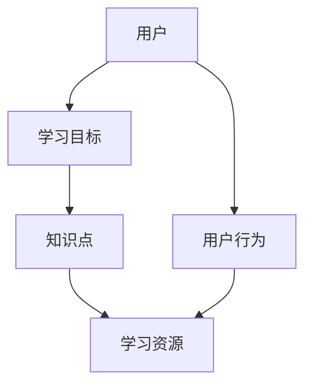
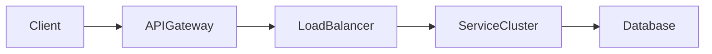

                 


# 开发基于大模型的金融合规培训个性化学习系统

---

## 关键词：大模型、金融合规、个性化学习、系统设计、算法原理、系统架构、项目实战

---

## 摘要

随着人工智能技术的快速发展，大模型（Large Language Models, LLMs）在金融领域的应用越来越广泛。本文旨在探讨如何基于大模型开发一个金融合规培训的个性化学习系统。该系统将通过分析用户的学习需求和行为数据，结合金融合规的知识体系，为用户提供个性化的学习路径和推荐内容。文章从背景、核心概念、算法原理、系统架构到项目实战，全面阐述了系统的开发过程，并通过具体的案例分析，展示了系统的实际应用价值。

---

## 第一部分: 背景介绍与核心概念

### 第1章: 问题背景与需求分析

#### 1.1 问题背景

随着金融行业的快速发展，合规培训的需求日益增长。传统的合规培训模式存在以下问题：

1. **内容过于固定**：传统培训通常采用统一的课程安排，无法根据学员的具体需求进行调整。
2. **学习效果不佳**：学员对某些知识点可能掌握得不够扎实，但传统模式难以实时反馈和优化学习路径。
3. **数据孤岛问题**：不同部门和系统的数据难以整合，导致学习效果难以量化和评估。

大模型的引入为解决这些问题提供了新的可能性。通过自然语言处理和机器学习技术，大模型可以分析学员的学习行为和需求，提供个性化的学习建议和内容推荐。

#### 1.2 问题描述

本文的核心问题是：如何基于大模型开发一个金融合规培训的个性化学习系统，以满足不同学员的个性化学习需求，并提高学习效果。

具体需求包括：

1. **个性化学习路径**：根据学员的知识水平和学习目标，动态调整学习内容和进度。
2. **智能推荐系统**：基于学员的行为数据和反馈，推荐相关的内容和练习题。
3. **实时反馈机制**：通过数据分析，实时评估学员的学习效果，并提供针对性的反馈。

#### 1.3 问题解决

通过引入大模型技术，我们可以实现以下目标：

1. **知识图谱构建**：将金融合规的知识体系转化为结构化的知识图谱，便于模型理解和推理。
2. **个性化推荐**：基于学员的行为数据和知识掌握情况，推荐最优的学习内容。
3. **动态调整学习路径**：根据学员的学习进度和反馈，动态调整学习计划。

---

### 第2章: 核心概念与系统架构

#### 2.1 大模型的基本概念

大模型是一种基于深度学习的自然语言处理模型，具有以下特点：

1. **大规模训练数据**：大模型通常使用海量的文本数据进行训练，能够捕捉语言的复杂模式。
2. **强大的上下文理解能力**：大模型可以理解文本的上下文关系，从而生成连贯且有意义的文本。
3. **可扩展性**：大模型可以通过微调和迁移学习，适应不同的任务和领域。

#### 2.2 个性化学习系统的构成

个性化学习系统主要包括以下几个模块：

1. **用户模块**：收集和分析用户的学习行为和需求。
2. **内容模块**：存储和管理金融合规的知识点和学习资源。
3. **推荐模块**：基于用户数据和知识图谱，推荐个性化的内容。
4. **评估模块**：评估学习效果，并提供反馈。

#### 2.3 金融合规的实体关系图

金融合规的实体关系图如下：



---

## 第二部分: 算法原理与数学模型

### 第3章: 大模型的算法原理

#### 3.1 大模型的训练流程

大模型的训练流程包括以下步骤：

1. **数据预处理**：清洗数据，提取特征，并将数据分为训练集和验证集。
2. **模型训练**：使用训练数据训练大模型，并通过验证集调整模型参数。
3. **模型优化**：通过调整学习率、正则化参数等，进一步优化模型性能。

#### 3.2 个性化推荐算法

个性化推荐算法主要包括以下几种：

1. **基于用户的协同过滤**：通过分析用户的相似性，推荐相似用户的喜欢的内容。
2. **基于内容的推荐**：基于内容的特征，推荐与用户兴趣相似的内容。
3. **混合推荐算法**：结合基于用户的协同过滤和基于内容的推荐，提高推荐的准确性和多样性。

#### 3.3 数学模型

以下是个性化推荐算法的数学模型示例：

1. **余弦相似度**：
$$ \text{余弦相似度} = \frac{\vec{u} \cdot \vec{v}}{\|\vec{u}\| \|\vec{v}\|} $$

2. **损失函数**：
$$ \text{损失函数} = -\sum_{i=1}^{n} \log p(y_i|x_i) $$

---

### 第4章: 系统架构设计

#### 4.1 系统功能模块

系统功能模块如下：

1. **用户模块**：负责用户注册、登录和信息管理。
2. **内容模块**：存储和管理金融合规的知识点和学习资源。
3. **推荐模块**：基于用户数据和知识图谱，推荐个性化的内容。
4. **评估模块**：评估学习效果，并提供反馈。

#### 4.2 系统架构图

系统架构图如下：



---

## 第三部分: 系统设计与实现

### 第5章: 项目实战

#### 5.1 环境搭建

项目实战需要以下环境：

1. **Python 3.8+**
2. **TensorFlow或PyTorch框架**
3. **大模型预训练权重（如GPT-3）**

#### 5.2 核心代码实现

以下是核心代码实现示例：

1. **数据预处理代码**
```python
import pandas as pd

def preprocess_data(data):
    # 数据清洗与特征提取
    pass
```

2. **推荐算法实现**
```python
def collaborative_filtering(user_id):
    # 基于用户的协同过滤算法
    pass
```

---

## 总结

本文详细探讨了如何基于大模型开发一个金融合规培训的个性化学习系统。通过分析用户需求、设计系统架构、实现推荐算法，最终构建了一个能够动态调整学习路径和推荐内容的系统。未来的工作可以进一步优化算法和系统架构，以提高学习效果和用户体验。

---

## 作者

作者：AI天才研究院/AI Genius Institute & 禅与计算机程序设计艺术 /Zen And The Art of Computer Programming

