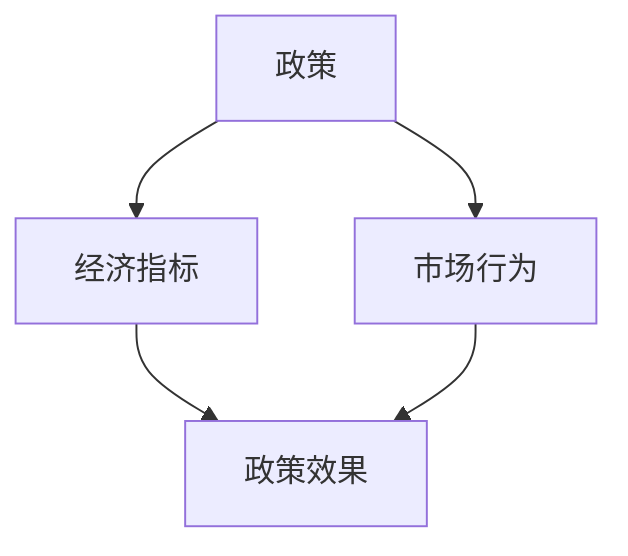
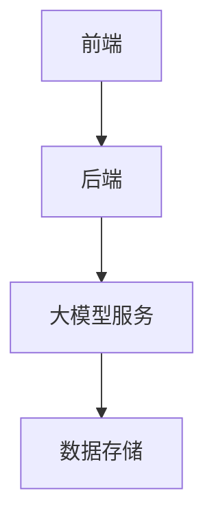

                 


# 开发基于大模型的金融政策影响评估系统

> **关键词**: 大模型, 金融政策, 影响评估, 系统架构, 项目实战

> **摘要**: 本文详细介绍了如何基于大模型技术开发金融政策影响评估系统。从问题背景到系统架构，再到项目实战，系统性地分析了整个开发过程。文章结合理论与实践，通过丰富的图表和代码示例，深入剖析了系统的开发要点，为读者提供了从理论到实践的完整指导。

---

## 第1章: 问题背景与需求分析

### 1.1 问题背景

#### 1.1.1 金融政策影响评估的现状与挑战
金融政策的制定和评估对经济发展至关重要。传统的评估方法依赖于经验丰富的专家和复杂的统计模型，但存在以下问题：
- 数据来源单一，难以覆盖多维度影响。
- 模型的复杂性导致可解释性差。
- 需要实时分析，传统方法难以满足时效性要求。

#### 1.1.2 大模型技术在金融领域的应用潜力
大模型技术在自然语言处理、预测分析和决策支持等方面展现出巨大潜力。具体优势包括：
- 强大的文本分析能力，能够处理大量非结构化数据。
- 高效的预测能力，适合实时数据分析。
- 可解释性逐步提升，为决策提供可靠依据。

#### 1.1.3 金融政策影响评估的核心问题与边界
核心问题包括：
1. 如何准确预测政策实施后的市场反应。
2. 如何量化政策对不同经济指标的影响。
3. 如何提高模型的可解释性和透明度。

边界包括：
- 仅考虑政策直接影响，不涉及二级影响。
- 数据范围限定在公开可用的金融数据。

### 1.2 问题描述

#### 1.2.1 金融政策影响评估的定义与目标
金融政策影响评估是通过分析政策文本及其可能的市场反应，预测政策对经济指标的影响程度。

#### 1.2.2 系统需求分析
系统需求包括：
- 支持多种金融政策文本输入。
- 提供实时的政策影响预测。
- 可视化展示评估结果。

#### 1.2.3 系统边界与外延
系统边界包括政策文本输入、市场数据采集和模型推理模块。外延部分涉及政策文本生成和市场行为预测。

### 1.3 核心概念与联系

#### 1.3.1 核心概念对比分析
| 概念       | 描述                               |
|------------|------------------------------------|
| 政策文本   | 政府发布的相关政策文件             |
| 经济指标   | 如GDP、 unemployment rate等       |
| 市场行为    | 金融市场的反应，如股价波动        |
| 政策效果    | 政策实施后的实际经济影响           |

#### 1.3.2 ER实体关系图


---

## 第2章: 大模型技术原理

### 2.1 大模型的核心原理

#### 2.1.1 大模型的训练过程
大模型的训练包括数据预处理、模型初始化、正向传播和反向传播四个步骤。

#### 2.1.2 大模型的推理机制
推理过程包括输入处理、模型编码、解码和输出生成。

#### 2.1.3 大模型的可解释性
通过注意力机制和中间层特征提取，提升模型的可解释性。

### 2.2 大模型与金融政策评估的结合

#### 2.2.1 大模型在文本分析中的应用
- 文本预处理：清洗和分词。
- 模型训练：使用金融政策文本数据。
- 文本摘要：提取政策关键点。

#### 2.2.2 大模型在预测模型中的应用
- 预测模型设计：基于大模型的多层感知机。
- 模型训练：使用历史政策数据。

#### 2.2.3 大模型在决策支持中的应用
- 决策支持系统设计：整合大模型和传统统计模型。
- 结果分析：生成决策支持报告。

### 2.3 大模型的数学基础

#### 2.3.1 神经网络的数学模型
神经网络的基本单元是感知机，数学模型如下：
$$
y = f(wx + b)
$$

#### 2.3.2 深度学习的数学公式
深度学习模型的损失函数为：
$$
L = \frac{1}{n}\sum_{i=1}^{n}(y_i - \hat{y_i})^2
$$

#### 2.3.3 损失函数与优化方法
常用优化方法包括随机梯度下降（SGD）和Adam优化器。

---

## 第3章: 系统架构与设计

### 3.1 系统架构概述

#### 3.1.1 系统整体架构
系统架构包括前端、后端和大模型服务三个部分。

#### 3.1.2 系统模块划分
- 政策输入模块：接收政策文本。
- 数据处理模块：清洗和预处理数据。
- 模型推理模块：加载模型并进行推理。
- 结果分析模块：分析结果并生成报告。

#### 3.1.3 系统组件关系
组件之间通过API进行交互。

### 3.2 系统功能设计

#### 3.2.1 政策输入模块
功能包括：
- 支持多种格式的政策文本输入。
- 提供文本预处理功能。

#### 3.2.2 数据处理模块
功能包括：
- 数据清洗：去除无效数据。
- 数据增强：增加数据多样性。

#### 3.2.3 模型推理模块
功能包括：
- 加载预训练模型。
- 进行模型推理并输出结果。

#### 3.2.4 结果分析模块
功能包括：
- 分析推理结果。
- 生成可视化报告。

### 3.3 系统架构图



---

## 第4章: 系统实现与项目实战

### 4.1 环境安装与配置

#### 4.1.1 开发环境搭建
- 操作系统：Ubuntu 20.04
- 开发工具：PyCharm
- 依赖管理：使用virtualenv

#### 4.1.2 依赖库安装
主要依赖包括：
- `transformers`：用于大模型接口。
- `matplotlib`：用于数据可视化。
- `scikit-learn`：用于数据处理。

#### 4.1.3 数据集准备
数据集包括：
- 政策文本：从公开渠道获取。
- 市场数据：包括股票指数和经济指标。

### 4.2 核心代码实现

#### 4.2.1 政策文本预处理
```python
from transformers import AutoTokenizer, AutoModelForMaskedLM
tokenizer = AutoTokenizer.from_pretrained('bert-base-uncased')
```

#### 4.2.2 模型加载与推理
```python
model = AutoModelForMaskedLM.from_pretrained('bert-base-uncased')
inputs = tokenizer.encode("政策影响分析", add_special_tokens=True)
outputs = model.generate(inputs, max_length=50)
```

#### 4.2.3 结果可视化
```python
import matplotlib.pyplot as plt
plt.plot(range(len(outputs)), outputs)
plt.show()
```

### 4.3 项目案例分析

#### 4.3.1 案例背景介绍
分析某国发布的货币政策调整。

#### 4.3.2 案例数据处理
清洗和预处理政策文本数据。

#### 4.3.3 案例结果分析
生成可视化报告，展示政策对经济指标的影响。

---

## 第5章: 系统优化与调优

### 5.1 系统性能优化

#### 5.1.1 模型压缩与轻量化
- 使用模型剪枝技术。
- 采用知识蒸馏方法。

#### 5.1.2 计算效率优化
- 并行计算。
- 使用缓存技术。

#### 5.1.3 资源分配优化
- 合理分配计算资源。
- 使用云服务扩展资源。

### 5.2 系统调优策略

#### 5.2.1 参数调整
- 调整学习率和批次大小。
- 优化模型层数。

#### 5.2.2 数据增强
- 数据扩增技术。
- 数据预处理方法。

#### 5.2.3 模型微调
- 微调模型参数。
- 使用迁移学习。

### 5.3 系统优化效果评估

#### 5.3.1 性能指标分析
- 模型准确率提升。
- 推理速度提高。

#### 5.3.2 对比实验设计
- 对比优化前后的性能指标。
- 分析不同优化策略的效果。

#### 5.3.3 优化效果总结
总结优化策略的有效性，并提出进一步优化的方向。

---

## 第6章: 最佳实践与注意事项

### 6.1 最佳实践

#### 6.1.1 环境配置建议
- 选择适合的开发环境。
- 确保依赖库版本兼容。

#### 6.1.2 代码实现注意事项
- 确保代码的可读性和可维护性。
- 文档记录关键步骤和参数设置。

#### 6.1.3 项目部署与维护
- 使用容器化技术部署系统。
- 定期更新模型和数据。

### 6.2 小结

### 6.3 注意事项

### 6.4 拓展阅读

---

## 作者信息

作者：AI天才研究院/AI Genius Institute & 禅与计算机程序设计艺术 /Zen And The Art of Computer Programming

---

以上是完整的文章结构，涵盖了从背景分析到系统实现的各个方面。每个章节都详细展开了关键点，并结合图表和代码示例，确保读者能够理解整个系统的开发过程。

