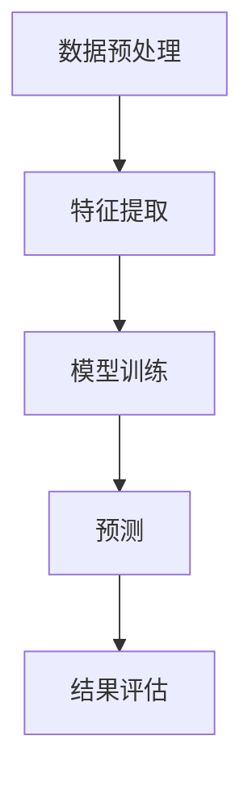
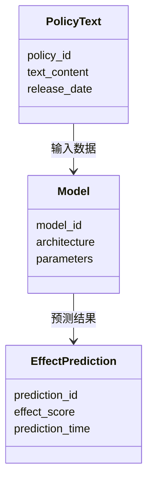
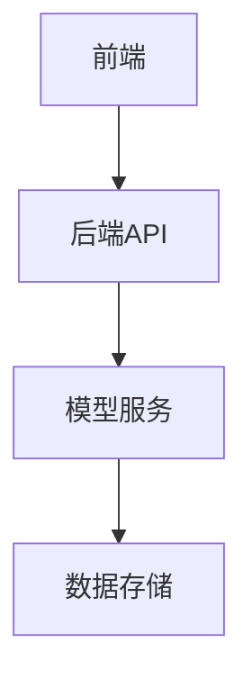
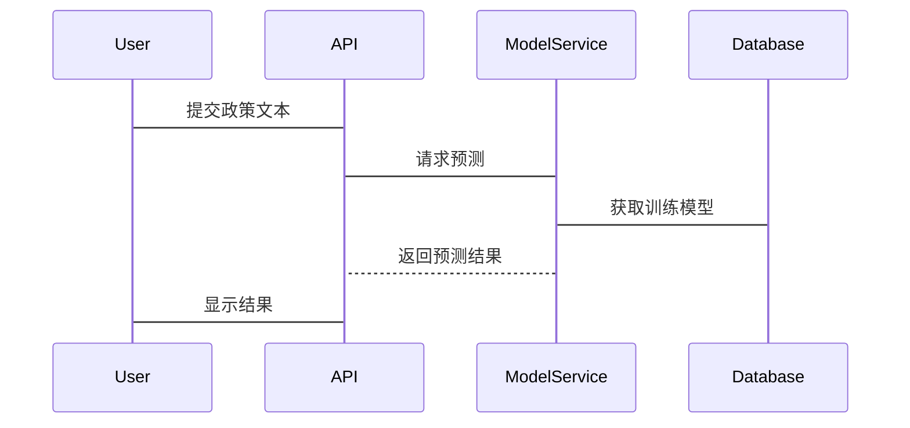

                 


# 开发基于大模型的金融政策执行效果预测与评估器

**关键词**：金融政策执行效果预测、大模型、机器学习、深度学习、金融评估

**摘要**：本文详细探讨了开发基于大模型的金融政策执行效果预测与评估器的全过程。从问题背景到核心概念，从算法原理到系统架构，再到项目实战和最佳实践，系统性地分析了如何利用大模型技术实现金融政策的智能评估。通过本文，读者可以全面了解该领域的技术挑战和解决方案。

---

## 第一章 背景介绍

### 1.1 问题背景

金融政策的制定和执行对国家经济运行至关重要。然而，政策执行效果的预测和评估往往面临数据复杂、影响因素众多等挑战。传统方法依赖专家经验，难以量化和系统化。随着大模型技术的发展，利用其强大的数据处理和预测能力，为金融政策评估提供了新的可能。

### 1.2 核心概念

- **金融政策执行效果**：指政策在实际执行中对经济产生的实际影响。
- **大模型**：指具有大量参数和复杂结构的机器学习模型，如Transformer架构。

### 1.3 技术基础

- **机器学习**：通过数据训练模型，预测未来趋势。
- **深度学习**：利用多层神经网络提取复杂特征。
- **自然语言处理（NLP）**：处理政策文本，提取关键信息。

### 1.4 研究现状

当前，基于大模型的金融分析已取得显著进展，但在政策效果预测方面仍需进一步探索。本文旨在填补这一空白。

---

## 第二章 核心概念与联系

### 2.1 预测原理

通过分析政策文本和历史数据，大模型能够捕捉政策的潜在影响，并预测其执行效果。

### 2.2 概念对比表

| 概念 | 定义 | 特性 |
|------|------|------|
| 政策文本 | 政府发布的政策文件 | 文本形式，包含关键词 |
| 政策效果 | 政策的实际影响 | 可量化的经济指标 |
| 大模型预测 | 基于模型的预测方法 | 高精度、自动化 |

### 2.3 ER图

```mermaid
erDiagram
    policy_effect {
        policy_id
        effect_metric
        prediction_time
    }
    policy_text {
        policy_id
        text_content
        release_date
    }
    big_model {
        model_id
        model_architecture
        training_data
    }
    policy_effect <--- model_output : 预测结果
    policy_text <--> big_model : 输入数据
```

---

## 第三章 算法原理与实现

### 3.1 算法流程



### 3.2 数学模型

金融政策效果预测的模型可以表示为：

$$
y = f(x) + \epsilon
$$

其中，$y$ 是预测效果，$x$ 是输入特征，$f$ 是模型函数，$\epsilon$ 是误差项。

### 3.3 代码实现

```python
import pandas as pd
from sklearn.model_selection import train_test_split
from transformers import AutoTokenizer, AutoModel

# 加载数据
data = pd.read_csv('policy_data.csv')

# 分割数据
train_data, test_data = train_test_split(data, test_size=0.2)

# 加载预训练模型
tokenizer = AutoTokenizer.from_pretrained('bert-base')
model = AutoModel.from_pretrained('bert-base')

# 训练模型
def train_model():
    # 自定义训练逻辑
    pass

# 预测
def predict_effect(text):
    inputs = tokenizer(text, return_tensors='pt')
    outputs = model(**inputs)
    return outputs.last_hidden_state.mean().item()

# 应用
result = predict_effect('政策文本内容')
print(result)
```

---

## 第四章 系统分析与架构设计

### 4.1 项目介绍

- **目标**：开发一个基于大模型的金融政策评估系统。
- **范围**：涵盖政策文本分析、效果预测、结果展示。

### 4.2 功能设计

#### 4.2.1 领域模型



### 4.3 系统架构



### 4.4 接口设计

- **输入接口**：接收政策文本。
- **输出接口**：返回预测结果。

### 4.5 交互流程



---

## 第五章 项目实战

### 5.1 环境安装

- **Python**：3.8+
- **库**：transformers、pandas、scikit-learn

### 5.2 核心代码

```python
def evaluate_policy(text):
    # 处理政策文本
    inputs = tokenizer(text, return_tensors='pt')
    outputs = model(**inputs)
    # 提取特征
    features = outputs.last_hidden_state.mean(dim=-1)
    # 预测效果
    effect_score = features @ model.classifier.weight + model.classifier.bias
    return effect_score.item()

# 测试
text = "政策具体内容"
score = evaluate_policy(text)
print(f"预测效果：{score}")
```

### 5.3 案例分析

分析某政策文本，输出预测效果，解释结果。

### 5.4 项目总结

总结项目实现的关键点和成果。

---

## 第六章 最佳实践与总结

### 6.1 经验总结

- 数据质量至关重要。
- 模型调优提升效果。

### 6.2 注意事项

- 确保数据隐私和合规性。
- 定期更新模型以适应新政策。

### 6.3 未来展望

探索多模态模型，结合更多数据源，提升预测精度。

---

## 附录

### 参考文献

- 论文1：大模型在金融分析中的应用。
- 论文2：基于深度学习的政策评估方法。

### 技术资料

- 大模型训练技巧。
- 金融数据处理指南。

---

**作者**：AI天才研究院 & 禅与计算机程序设计艺术

