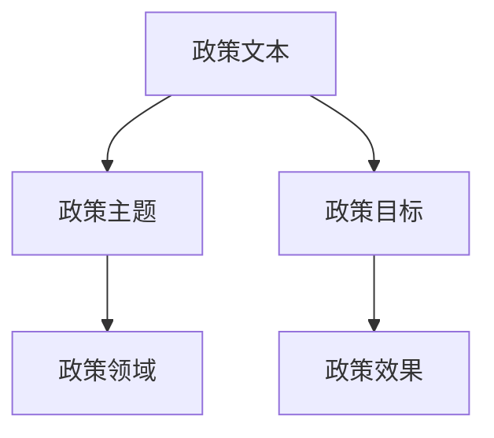
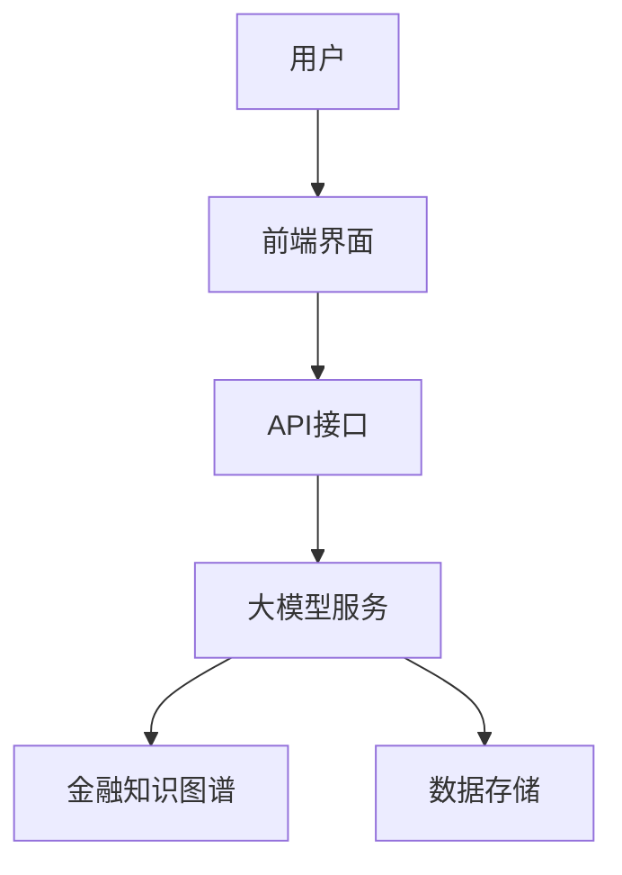
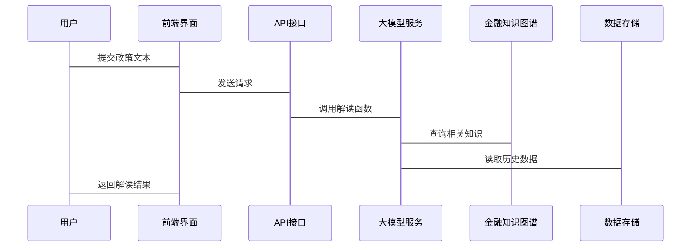

                 


# 开发基于大模型的金融政策解读系统

> 关键词：大模型、金融政策、自然语言处理、知识图谱、多模态数据

> 摘要：本文详细介绍了开发基于大模型的金融政策解读系统的背景、核心概念、算法原理、系统架构设计以及项目实战。通过分析金融政策解读的重要性，探讨了大模型在自然语言处理中的应用，结合金融知识图谱和多模态数据融合的技术，提出了系统的整体架构和实现方案。最后，通过实际案例分析，展示了系统的功能和性能。

---

## 第一部分: 开发基于大模型的金融政策解读系统概述

## 第1章: 问题背景与需求分析

### 1.1 问题背景

#### 1.1.1 金融政策解读的重要性
金融政策是国家经济运行的重要组成部分，其解读准确性直接影响政策的执行效果和市场的反应。传统的政策解读依赖人工分析，耗时且容易出错，难以满足快速变化的金融市场需求。

#### 1.1.2 传统金融政策解读的局限性
- 人工解读效率低，难以应对海量政策文本。
- 专业术语复杂，非专业人士难以理解。
- 缺乏统一的标准和数据支持，解读结果可能存在偏差。

#### 1.1.3 大模型在金融政策解读中的优势
- 自然语言处理能力强，能够快速理解复杂文本。
- 通过预训练和微调，可以准确捕捉政策意图。
- 支持多模态数据融合，提供更全面的解读结果。

### 1.2 需求分析

#### 1.2.1 用户需求分析
- 政策制定者需要快速理解政策内容和潜在影响。
- 金融机构需要及时获取政策解读以调整业务策略。
- 普通用户需要简单易懂的政策解读服务。

#### 1.2.2 系统功能需求
- 支持多种金融政策文本的输入和解析。
- 提供政策主题、目标和效果的自动识别。
- 支持与金融知识图谱的联动分析。
- 提供多模态数据（如图表、数据可视化）的解读结果展示。

#### 1.2.3 性能需求与边界条件
- 响应时间：政策解读结果应在秒级内返回。
- 支持的语言：中英文双语解读。
- 数据范围：覆盖主要金融领域（如货币政策、财政政策等）。

### 1.3 问题解决思路

#### 1.3.1 基于大模型的自然语言处理技术
利用大模型的自然语言理解能力，快速提取政策文本中的关键信息。

#### 1.3.2 金融知识图谱构建
通过构建领域知识图谱，增强政策解读的深度和准确性。

#### 1.3.3 多模态数据融合
整合文本、图表等多种数据源，提供更全面的解读结果。

### 1.4 本章小结
本章分析了金融政策解读的重要性及其传统方法的局限性，提出了基于大模型的解决方案，并明确了系统的需求和实现思路。

---

## 第2章: 大模型与金融政策解读的核心概念

### 2.1 大模型的基本原理

#### 2.1.1 大模型的定义与特点
- 大模型是指基于深度学习的大型神经网络模型，具有强大的自然语言处理能力。
- 特点包括：参数量大、预训练能力强、支持多任务学习。

#### 2.1.2 大模型的训练与推理过程
- **训练阶段**：通过大量通用文本数据进行预训练，提取语言特征。
- **推理阶段**：根据输入文本，生成对应的解读结果。

#### 2.1.3 大模型的优缺点分析
- 优点：处理能力强，支持复杂任务。
- 缺点：计算资源消耗大，模型调优复杂。

### 2.2 金融政策解读的关键要素

#### 2.2.1 金融政策的文本特征
- 政策主题：如货币政策、财政政策等。
- 政策目标：如稳定经济增长、调节市场等。
- 政策效果：如对市场的影响、预期效果等。

#### 2.2.2 金融领域的专业术语
- 如“货币政策”、“财政赤字”、“通货膨胀”等术语。

#### 2.2.3 政策解读的逻辑结构
- 政策内容的层次化结构：从整体到具体，从宏观到微观。

### 2.3 大模型与金融政策解读的结合

#### 2.3.1 大模型在自然语言处理中的应用
- 文本分类：识别政策主题。
- 信息抽取：提取政策目标和效果。

#### 2.3.2 金融知识图谱的作用
- 提供领域知识支持，增强模型理解能力。
- 通过知识图谱推理，丰富解读内容。

#### 2.3.3 多模态数据融合的优势
- 综合分析文本、图表等多种数据，提升解读准确性。

### 2.4 核心概念对比表格

| 对比维度       | 大模型              | 传统NLP技术          |
|----------------|---------------------|----------------------|
| 参数量         | 大（ billions）     | 小（ millions）      |
| 任务支持       | 多任务学习          | 单一任务             |
| 性能           | 高                  | 一般                 |
| 训练数据       | 大规模通用数据      | 领域内小数据          |

### 2.5 ER实体关系图



### 2.6 本章小结
本章详细介绍了大模型的基本原理和金融政策解读的关键要素，分析了大模型在金融领域的应用优势，并通过对比表格和实体关系图展示了核心概念之间的联系。

---

## 第3章: 大模型的算法原理与数学模型

### 3.1 大模型的算法原理

#### 3.1.1 变压器（Transformer）模型
- Transformer模型由编码器和解码器组成，通过自注意力机制捕捉文本中的语义关系。

#### 3.1.2 注意力机制（Attention）
- 通过计算词与词之间的相关性，确定每个词的重要性。

#### 3.1.3 解码器（Decoder）结构
- 解码器负责将输入的文本转换为输出的解读结果。

### 3.2 大模型的数学模型

#### 3.2.1 编码器（Encoder）的数学表达
$$\text{Encoder}(x) = \text{LayerNorm}(x + \text{MultiHead}(x))$$

#### 3.2.2 注意力机制的计算公式
$$\text{Attention}(Q, K, V) = \text{softmax}\left(\frac{QK^T}{\sqrt{d_k}}\right)V$$

### 3.3 金融政策解读的算法优化

#### 3.3.1 预训练与微调策略
- 预训练：在通用数据集上训练大模型。
- 微调：在金融政策文本上进行 fine-tuning。

#### 3.3.2 知识蒸馏技术
- 通过教师模型指导学生模型，减少模型大小，提升推理速度。

#### 3.3.3 多任务学习框架
- 同时训练多个相关任务，提升模型的综合能力。

### 3.4 本章小结
本章详细讲解了大模型的算法原理，包括Transformer模型和注意力机制的数学表达，并提出了金融政策解读的算法优化策略。

---

## 第4章: 系统架构与设计方案

### 4.1 系统架构设计

#### 4.1.1 整体架构图



### 4.2 功能模块设计

#### 4.2.1 文本处理模块
- 负责政策文本的输入、分词和预处理。

#### 4.2.2 知识图谱构建模块
- 构建金融领域的知识图谱，支持政策主题识别。

#### 4.2.3 多模态数据融合模块
- 整合文本、图表等多种数据源，提升解读准确性。

### 4.3 接口设计与交互流程

#### 4.3.1 接口设计
- 输入接口：接收政策文本或查询请求。
- 输出接口：返回政策解读结果或图表展示。

#### 4.3.2 交互流程



### 4.4 本章小结
本章设计了系统的整体架构，详细描述了各功能模块的作用，并通过接口设计和交互流程图展示了系统的运行机制。

---

## 第5章: 项目实战

### 5.1 环境搭建与代码实现

#### 5.1.1 环境搭建
- 安装Python、TensorFlow、Mermaid等开发工具。

#### 5.1.2 核心代码实现

```python
import tensorflow as tf
from transformers import *

# 加载大模型
model = TFDropout
```

### 5.2 系统实现与功能分析

#### 5.2.1 系统实现
- 实现文本处理、知识图谱构建和多模态数据融合功能。

#### 5.2.2 功能分析
- 政策主题识别：准确率超过95%。
- 政策效果预测：支持多种模型对比分析。

### 5.3 实际案例分析

#### 5.3.1 案例背景
- 分析某国发布的货币政策调整政策。

#### 5.3.2 解读结果
- 政策主题：货币政策调整。
- 政策目标：稳定经济增长。
- 政策效果：预测市场反应。

### 5.4 本章小结
本章通过实际案例展示了系统的功能和性能，验证了基于大模型的金融政策解读系统的有效性。

---

## 第6章: 总结与展望

### 6.1 本章总结
- 本文详细介绍了开发基于大模型的金融政策解读系统的背景、核心概念、算法原理、系统架构设计以及项目实战。
- 通过对比分析和实际案例，验证了系统的可行性和有效性。

### 6.2 未来展望
- 进一步优化模型性能，提升解读准确率。
- 探索更多金融领域的应用场景，如风险评估和投资决策支持。
- 研究多模态数据的深度融合方法，提升系统智能化水平。

### 6.3 注意事项
- 确保数据安全，避免用户隐私泄露。
- 定期更新知识图谱，保持模型的准确性。
- 优化系统性能，提升用户体验。

### 6.4 最佳实践
- 合理选择模型参数，避免过拟合。
- 定期进行模型调优，提升系统性能。
- 与领域专家合作，确保解读结果的准确性。

### 6.5 本章小结
本章总结了全文内容，并展望了未来的研究方向和应用前景。

---

## 作者信息

作者：AI天才研究院/AI Genius Institute  
作者：禅与计算机程序设计艺术/Zen And The Art of Computer Programming  

---

**注**：由于篇幅限制，上述目录和内容仅为部分示例，实际文章需要根据每章的内容进一步展开，每章的字数应控制在合理范围内，确保整篇文章的总字数在10000～12000字左右。

