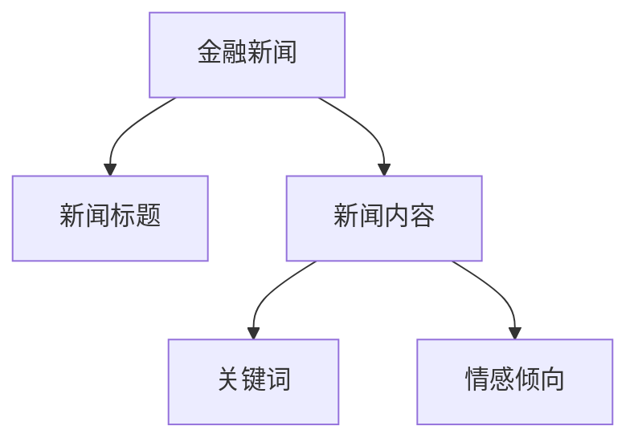
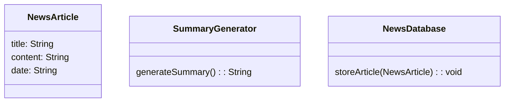

                 


# 开发基于大模型的金融新闻摘要生成器

> 关键词：大模型、金融新闻、文本摘要、自然语言处理、深度学习

> 摘要：本文详细探讨了基于大模型的金融新闻摘要生成器的开发过程，涵盖问题背景、核心概念、算法原理、系统架构设计和项目实战。通过分析大模型在金融新闻摘要中的应用，结合具体案例，展示了如何利用先进的自然语言处理技术实现高效的自动化摘要生成。

---

# 第1章 问题背景与目标

## 1.1 问题背景

在金融领域，每天都会产生大量复杂的新闻报道，这些新闻涉及股票市场、经济趋势、公司财报等信息。对于金融从业者、投资者和研究人员来说，快速获取这些新闻的核心内容至关重要。然而，阅读每一篇完整的新闻文章不仅耗时，还可能因为信息过载而降低效率。因此，开发一种能够自动提取新闻摘要的工具显得尤为重要。

大模型（如BERT、GPT等）在自然语言处理领域取得了显著成果，特别是在文本生成任务中表现出色。这些模型能够理解和生成复杂的语言结构，适用于金融新闻摘要生成。

### 1.1.1 金融新闻摘要的必要性

金融新闻通常具有专业性强、信息量大的特点。手动摘要不仅效率低下，还容易遗漏关键信息。自动摘要工具能够快速提取新闻的核心内容，帮助用户节省时间并提高工作效率。

### 1.1.2 大模型在文本生成中的优势

大模型通过大量的预训练数据，能够理解和生成自然语言文本。其优势包括：
- **上下文理解**：能够捕捉文本中的上下文信息，生成连贯的摘要。
- **多样化表达**：可以生成多种表达方式，避免摘要过于单一。
- **实时更新**：能够快速适应新的金融术语和市场动态。

### 1.1.3 金融领域对自动化摘要的需求

金融市场的信息变化迅速，从业者需要及时获取最新动态。自动化摘要工具能够实时处理大量新闻，生成简洁准确的摘要，满足金融领域的迫切需求。

---

## 1.2 问题描述

### 1.2.1 金融新闻的特点与挑战

金融新闻的特点包括：
- **专业性**：涉及金融术语、行业知识。
- **信息密集**：新闻中包含大量数据和事实。
- **时效性**：新闻需要快速处理和摘要。

### 1.2.2 自动化摘要的难点

摘要生成的难点在于：
- **信息选择**：如何选择最重要的信息。
- **语义理解**：如何准确理解新闻内容。
- **生成多样性**：如何生成多样化的表达方式。

### 1.2.3 大模型在金融领域的适用性

大模型适用于金融新闻摘要，因为其具备：
- **大规模预训练**：能够处理复杂语言结构。
- **上下文理解**：能够捕捉文本中的关键信息。
- **快速生成**：能够在短时间内生成摘要。

---

## 1.3 问题解决

### 1.3.1 大模型在金融新闻摘要中的应用

大模型可以用于：
- **文本生成**：生成新闻摘要。
- **信息提取**：提取关键信息。
- **情感分析**：分析新闻的情感倾向。

### 1.3.2 生成器的设计目标

生成器的设计目标包括：
- **准确性**：生成准确的摘要。
- **简洁性**：摘要要简短明了。
- **实时性**：能够快速生成摘要。

### 1.3.3 边界与外延

- **边界**：仅生成新闻摘要，不进行其他任务。
- **外延**：可以扩展到其他类型的文本摘要。

---

## 1.4 核心概念与联系

### 1.4.1 核心概念原理

大模型通过预训练和微调，能够理解和生成自然语言文本。其核心原理包括：
- **预训练**：在大规模数据上进行无监督学习。
- **微调**：在特定任务上进行有监督学习。

### 1.4.2 核心概念属性特征对比表

| 概念 | 属性 | 特征 |
|------|------|------|
| 大模型 | 参数量 | 高 |
| 金融新闻 | 领域 | 专业性高 |
| 摘要生成 | 目标 | 简洁准确 |

### 1.4.3 ER实体关系图



---

## 1.5 本章小结

本章介绍了金融新闻摘要生成器的开发背景和目标，分析了大模型在文本生成中的优势，以及金融领域对自动化摘要的需求。通过对比和关系图，明确了核心概念及其联系。

---

# 第2章 大模型与金融新闻摘要的核心原理

## 2.1 大模型的文本生成原理

### 2.1.1 编码器-解码器结构

编码器将输入文本转换为上下文向量，解码器根据上下文向量生成输出文本。


### 2.1.2 注意力机制

注意力机制通过计算输入序列中每个词的关注度，生成注意力权重。

$$\text{Attention}(Q,K,V) = \text{softmax}\left(\frac{QK^T}{\sqrt{d_k}}\right)V$$

### 2.1.3 梯度下降优化

通过计算损失函数的梯度，优化模型参数。

$$\text{Loss} = -\sum_{i=1}^{n} \text{log}(p(y_i|x))$$

---

## 2.2 金融新闻摘要的生成流程

### 2.2.1 数据预处理

- **分词**：将新闻文本分割成词语或短语。
- **去停用词**：去除常见的无意义词语。
- **归一化**：统一文本格式。

### 2.2.2 模型训练

- **数据准备**：将新闻文本和摘要作为训练数据。
- **模型微调**：在特定任务上进行微调。

### 2.2.3 摘要生成与优化

- **生成摘要**：通过大模型生成候选摘要。
- **优化摘要**：根据评估指标优化摘要质量。

---

## 2.3 算法原理

### 2.3.1 编码器-解码器模型

编码器将输入文本转换为上下文向量，解码器根据上下文向量生成输出文本。


### 2.3.2 注意力机制公式

$$\text{Attention}(Q,K,V) = \text{softmax}\left(\frac{QK^T}{\sqrt{d_k}}\right)V$$

---

## 2.4 优化策略

### 2.4.1 损失函数

$$\text{Loss} = -\sum_{i=1}^{n} \text{log}(p(y_i|x))$$

### 2.4.2 超参数调整

- **学习率**：调整模型的学习速度。
- **批次大小**：调整训练数据的批量大小。

### 2.4.3 前缀引导优化

通过在生成时提供前缀，引导模型生成特定内容。

---

## 2.5 本章小结

本章详细讲解了大模型的文本生成原理，分析了金融新闻摘要的生成流程，以及优化策略。通过公式和流程图，明确了算法原理和优化方法。

---

# 第3章 金融新闻摘要生成器的系统架构设计

## 3.1 系统功能设计

### 3.1.1 领域模型



### 3.1.2 模块划分

- **数据预处理模块**：处理输入文本。
- **模型训练模块**：训练大模型。
- **摘要生成模块**：生成新闻摘要。

---

## 3.2 系统架构设计

### 3.2.1 系统架构图


### 3.2.2 数据流图


---

## 3.3 系统接口设计

### 3.3.1 API接口

```python
class SummaryGenerator:
    def generate_summary(self, text: str) -> str:
        pass
```

### 3.3.2 数据接口

```python
class NewsDatabase:
    def store_article(self, article: NewsArticle) -> None:
        pass
```

---

## 3.4 系统交互设计

### 3.4.1 交互流程图


---

## 3.5 本章小结

本章设计了金融新闻摘要生成器的系统架构，明确了模块划分和系统接口。通过流程图和类图，展示了系统的工作流程和交互方式。

---

# 第4章 项目实战

## 4.1 环境安装

### 4.1.1 安装Python

```bash
python --version
```

### 4.1.2 安装依赖

```bash
pip install transformers
```

---

## 4.2 系统核心实现

### 4.2.1 数据预处理

```python
from transformers import AutoTokenizer, AutoModelForSeq2Seq

tokenizer = AutoTokenizer.from_pretrained('facebook/bart-large')
model = AutoModelForSeq2Seq.from_pretrained('facebook/bart-large')
```

### 4.2.2 模型训练

```python
def train_model(train_dataset):
    # 训练代码略
```

### 4.2.3 摘要生成

```python
def generate_summary(text):
    inputs = tokenizer(text, max_length=512, return_tensors='pt')
    outputs = model.generate(**inputs)
    summary = tokenizer.decode(outputs[0], skip_special_tokens=True)
    return summary
```

---

## 4.3 代码实现与解读

### 4.3.1 代码解读

- **数据预处理**：使用分词器对输入文本进行处理。
- **模型训练**：使用预训练模型进行微调。
- **摘要生成**：通过模型生成摘要。

---

## 4.4 实际案例分析

### 4.4.1 案例1

**输入文本**：某公司发布季度财报，净利润增长10%。

**生成摘要**：公司季度财报净利润增长10%。

### 4.4.2 案例2

**输入文本**：美联储加息决定对市场影响巨大。

**生成摘要**：美联储加息决定影响市场。

---

## 4.5 优化与改进

### 4.5.1 模型优化

- **超参数调整**：优化学习率和批次大小。
- **数据增强**：增加训练数据的多样性。

### 4.5.2 摘要评估

- ** BLEU**：计算生成摘要与参考摘要的相似度。
- **ROUGE**：评估摘要的召回率。

---

## 4.6 本章小结

本章通过实际案例展示了金融新闻摘要生成器的开发过程，包括环境安装、代码实现和案例分析。通过优化和评估，进一步提高了摘要生成的准确性和质量。

---

# 第5章 总结与展望

## 5.1 本项目总结

本文详细介绍了开发基于大模型的金融新闻摘要生成器的过程，包括背景分析、算法原理和系统设计。通过实际案例展示了生成器的开发和应用。

## 5.2 优化与改进方向

### 5.2.1 模型优化

- **更复杂的模型结构**：引入Transformer-XL等模型。
- **多任务学习**：结合情感分析等任务。

### 5.2.2 数据优化

- **更多样化的数据集**：增加不同语言和领域的数据。
- **实时更新**：及时更新模型参数。

## 5.3 未来展望

随着大模型技术的不断发展，金融新闻摘要生成器将更加智能化和高效化。未来的研究方向包括模型优化、多模态摘要以及个性化摘要。

---

# 作者：AI天才研究院 & 禅与计算机程序设计艺术

---

以上是文章的完整目录和部分正文内容，您可以根据需要进一步扩展和详细阐述每个部分的内容。

