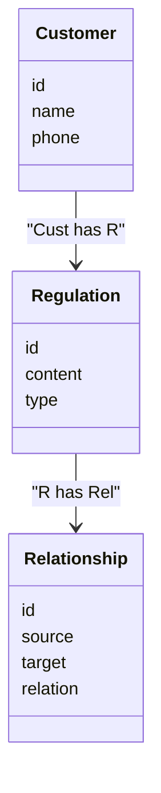
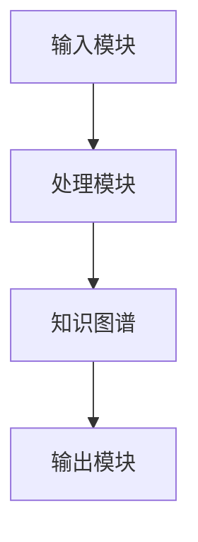

                 


# 开发基于大模型的金融法规遵从性检查系统

**关键词：** 金融法规、大模型、自然语言处理、法律文本分析、系统架构设计

**摘要：**  
随着金融行业的快速发展，合规性检查变得日益复杂和重要。传统的法规遵从性检查方法依赖于人工审查，效率低下且容易出错。基于大模型的金融法规遵从性检查系统通过自然语言处理（NLP）和知识图谱技术，能够高效、准确地识别和分析复杂的金融法规文本，帮助金融机构快速满足合规要求。本文将详细探讨如何开发这样一个系统，从背景分析、技术基础、系统设计到实际实现，全面解析其开发过程。

---

## 第一部分：开发背景与需求分析

### 第1章：金融法规遵从性检查的背景与需求

#### 1.1 问题背景
- **金融法规的重要性**  
  金融法规是维护金融市场秩序、保护投资者权益的重要保障。随着金融业务的复杂化，法规的数量和复杂性也在不断增加。  
- **传统金融监管的局限性**  
  传统法规遵从性检查主要依赖人工审查，效率低、成本高，且容易受到主观因素影响。  
- **大模型技术的潜力**  
  大模型技术（如GPT、BERT）具备强大的自然语言处理能力，能够快速理解和分析大量文本数据，为金融法规遵从性检查提供了新的解决方案。

#### 1.2 问题描述
- **核心目标**  
  开发一个基于大模型的系统，能够自动识别和分析金融法规文本，帮助金融机构快速发现潜在的合规风险。  
- **关键问题**  
  1. 如何高效处理复杂的法律文本？  
  2. 如何确保系统的准确性和可靠性？  
  3. 如何将大模型技术与金融法规分析相结合？  
- **系统边界与外延**  
  该系统专注于金融法规的文本分析，不包括具体的执法或处罚环节。

#### 1.3 核心概念与联系
- **核心概念**  
  - **金融法规**：指由监管机构制定的法律、法规和规章制度。  
  - **自然语言处理（NLP）**：用于理解和生成人类语言的技术。  
  - **知识图谱**：用于表示实体及其关系的图结构。  
- **概念结构与关系**  
  通过ER图展示金融法规、实体、关系之间的联系。

```mermaid
erDiagram
    customer[Cust, C]
    regulation[Reg, R]
    relationship[Rels, Rel]
    Cust --> R: "Cust owns R"
    R --> Rel: "R has Rel"
```

---

## 第二部分：技术基础与算法原理

### 第2章：大模型技术基础

#### 2.1 大模型的基本原理
- **大模型的定义与特点**  
  大模型是指基于深度学习的大型神经网络模型，具有参数多、训练数据量大、通用性强等特点。  
- **大模型的核心算法**  
  - **Transformer架构**：通过自注意力机制（Self-Attention）实现长文本的理解。  
  - **预训练与微调**：通过大规模数据预训练，再针对特定任务进行微调。  

#### 2.2 法律文本分析的关键技术
- **自然语言处理（NLP）**  
  - 分词、句法分析、实体识别等技术用于处理法律文本。  
- **知识图谱构建**  
  通过抽取法律文本中的实体和关系，构建知识图谱，用于快速检索和分析。

### 第3章：大模型在金融法规分析中的应用

#### 3.1 法律文本分析的挑战
- **文本复杂性**  
  法律文本通常结构复杂，包含大量专业术语和嵌套结构。  
- **法律术语的特殊性**  
  需要对专业术语进行特殊处理和解释。  
- **文本结构的多样性**  
  不同法律文本的格式和结构可能差异较大。

#### 3.2 大模型在法律文本分析中的优势
- **强大的自然语言理解能力**  
  大模型能够理解上下文，识别隐含含义。  
- **自动生成与解释能力**  
  可以生成合规报告，并解释分析结果。  
- **实时更新与适应能力**  
  大模型可以快速适应新的法规变化。

---

## 第三部分：系统分析与架构设计

### 第4章：系统功能需求分析

#### 4.1 系统功能需求
- **输入模块**  
  接收金融法规文本和相关数据。  
- **处理模块**  
  对文本进行分析、理解和推理。  
- **输出模块**  
  生成合规报告和风险提示。

#### 4.2 系统功能设计
- **领域模型设计**  
  通过领域模型明确系统的功能模块和交互流程。  
- **系统架构设计**  
  设计模块划分和模块间交互关系。  



### 第5章：系统架构设计方案

#### 5.1 系统架构设计
- **模块划分与交互流程**  
  - 输入模块：接收法规文本。  
  - 处理模块：进行文本分析和知识图谱构建。  
  - 输出模块：生成报告。  
- **系统架构图**  



---

## 第四部分：项目实战与实现

### 第6章：环境搭建与核心实现

#### 6.1 环境搭建
- **系统环境配置**  
  安装Python、TensorFlow、Keras等开发工具。  
- **代码示例**  
  下面是一个简单的NLP模型实现，用于分析法规文本：

```python
import tensorflow as tf
from tensorflow.keras import layers

# 定义模型
model = tf.keras.Sequential([
    layers.Embedding(input_dim=10000, output_dim=16),
    layers.SimpleRNN(units=16),
    layers.Dense(1, activation='sigmoid')
])

# 编译模型
model.compile(optimizer='adam', loss='binary_crossentropy', metrics=['accuracy'])
```

#### 6.2 代码实现与解读
- **模型实现**  
  使用Keras构建一个简单的文本分类模型，用于判断法规文本是否符合特定要求。  
- **数据处理**  
  对法规文本进行分词、归一化处理，并构建训练数据集。

### 第7章：系统测试与优化

#### 7.1 系统测试
- **测试用例设计**  
  编写测试用例，验证系统的准确性和稳定性。  
- **性能测试**  
  测量系统的处理速度和资源消耗。

#### 7.2 优化与改进
- **算法优化**  
  调整模型参数，改进训练方法。  
- **系统优化**  
  优化数据处理流程，提升系统性能。

---

## 第五部分：扩展与展望

### 第8章：系统优化与扩展

#### 8.1 系统优化方向
- **模型优化**  
  使用更复杂的模型（如BERT）提升准确率。  
- **数据优化**  
  增加数据多样性，提升模型的泛化能力。

#### 8.2 大模型技术的前沿发展
- **多模态模型**  
  结合图像、音频等多种模态信息，提升系统的综合分析能力。  
- **实时更新**  
  利用在线学习技术，实时更新模型参数。

### 第9章：总结与展望

#### 9.1 总结
- 本文详细介绍了开发基于大模型的金融法规遵从性检查系统的背景、技术基础、系统设计和实现过程。  
- 通过实际案例分析，展示了系统的应用价值和潜力。

#### 9.2 展望
- 随着大模型技术的不断发展，金融法规遵从性检查系统将更加智能化、高效化。  
- 未来的研究方向包括模型优化、多模态分析和实时更新技术。

---

## 作者信息

作者：AI天才研究院/AI Genius Institute & 禅与计算机程序设计艺术 /Zen And The Art of Computer Programming

---

本文通过系统化的分析和实践，详细探讨了基于大模型的金融法规遵从性检查系统的开发过程。从背景分析到技术实现，再到系统优化，为读者提供了全面的指导和启示。

