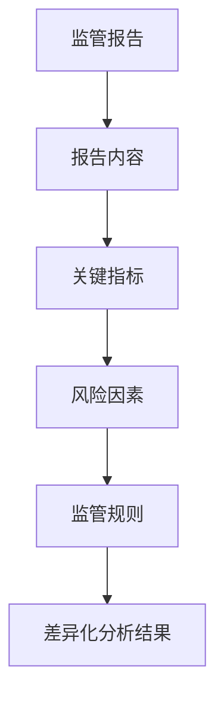
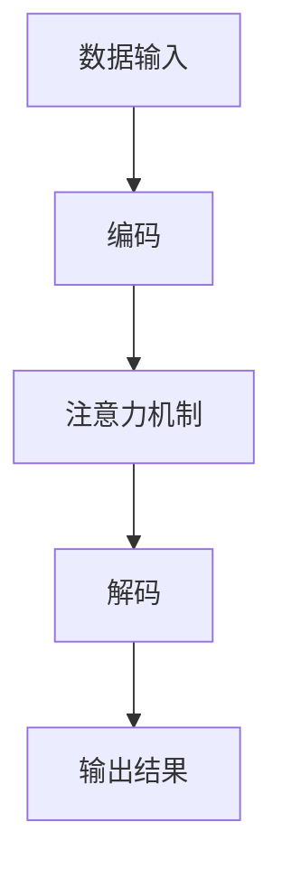
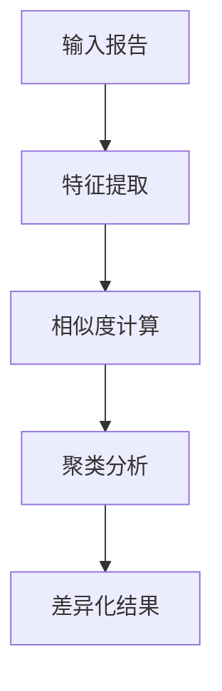
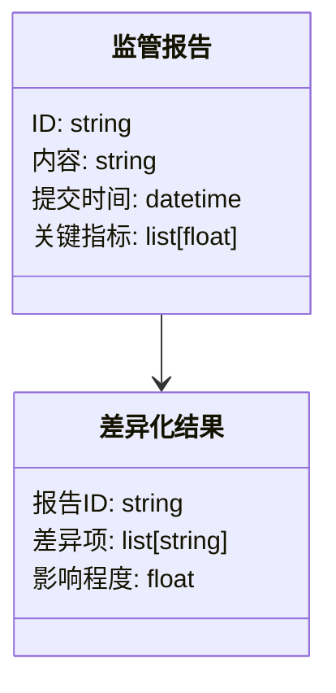
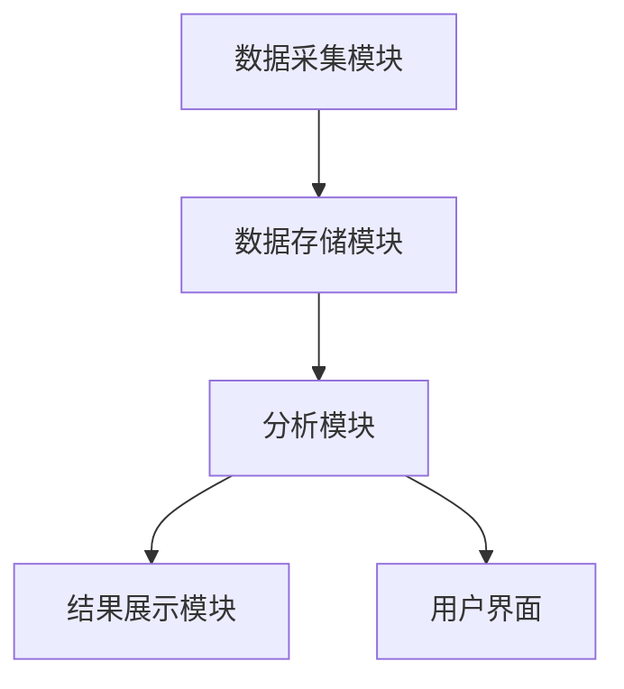
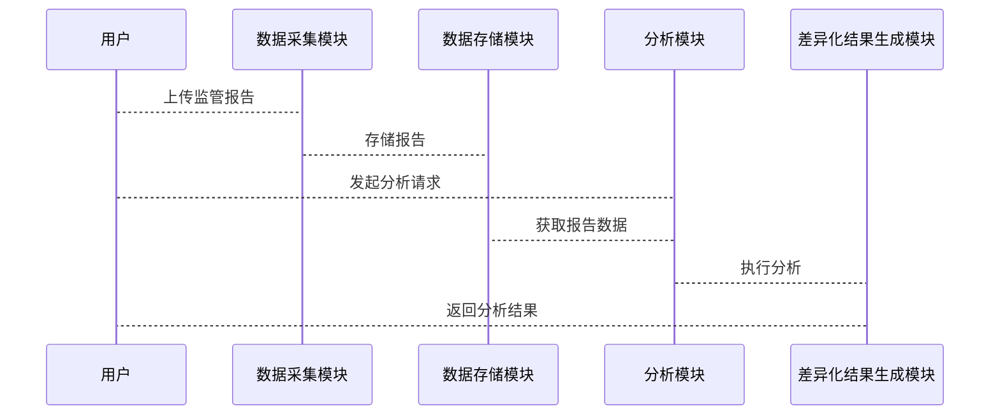

                 


# 开发基于大模型的金融监管报告差异化分析助手

---

## 关键词：
大模型、金融监管、差异化分析、自然语言处理、机器学习、监管报告

---

## 摘要：
本文详细探讨了基于大模型的金融监管报告差异化分析助手的开发过程，从问题背景到算法实现，再到系统架构设计，最后结合实际案例进行深入分析。文章内容涵盖核心概念、数学模型、系统设计、项目实战及最佳实践，旨在为读者提供全面的技术指导。

---

# 第一部分: 背景介绍与核心概念

## 第1章: 问题背景与描述

### 1.1 问题背景
#### 1.1.1 金融监管的重要性
金融监管是保障金融市场稳定运行的重要手段，涉及反洗钱、风险控制、合规性检查等多个方面。传统的监管方式依赖人工审查，效率低且容易出错。

#### 1.1.2 当前金融监管报告分析的挑战
- 数据量大：金融机构每天产生大量报告，人工处理效率低下。
- 数据复杂性高：报告内容涉及专业术语和多种格式，难以统一处理。
- 监管要求不断变化：新的法规和标准频繁出台，需要快速响应。

#### 1.1.3 大模型在金融监管中的潜在价值
大模型具备强大的自然语言处理能力和深度学习能力，能够高效处理非结构化数据，帮助监管机构快速识别风险和异常。

### 1.2 问题描述
#### 1.2.1 金融监管报告的主要类型
包括风险报告、合规报告、审计报告、市场分析报告等。

#### 1.2.2 监管报告分析的关键维度
- 时间维度：报告的时间跨度和频率。
- 空间维度：报告涉及的机构、地区和业务领域。
- 内容维度：报告中的关键指标、风险点和合规性评估。

#### 1.2.3 差异化分析的核心目标
通过对比不同报告或同一报告在不同时期的内容，识别出关键差异点，帮助监管机构制定针对性的监管策略。

### 1.3 问题解决与边界
#### 1.3.1 大模型如何解决监管报告分析问题
- 高效处理非结构化数据。
- 快速识别报告中的关键信息。
- 自动生成对比分析结果。

#### 1.3.2 边界与适用场景
- 仅适用于文本型监管报告。
- 适用于监管报告的生成、对比和分析。
- 不涉及实时数据流的处理。

#### 1.3.3 与现有技术的区别与优势
- 区别：传统方法依赖关键词匹配和规则引擎，而大模型具备更强的语义理解和上下文分析能力。
- 优势：能够处理复杂文本，提供更精准的分析结果。

---

## 第2章: 核心概念与联系

### 2.1 核心概念原理
#### 2.1.1 大模型的基本原理
大模型基于深度学习，通过多层神经网络处理输入数据，生成有意义的输出。常用模型包括BERT、GPT和Transformer架构。

#### 2.1.2 金融监管报告分析的关键要素
- 文本内容：报告中的文字信息。
- 关键指标：如风险评分、合规性评分。
- 监管规则：相关的法律法规和行业标准。

#### 2.1.3 差异化分析的定义与实现方式
差异化分析是指通过对比不同报告或同一报告在不同时间点的内容，找出关键差异点。其实现方式包括文本相似度计算、聚类分析和规则对比。

### 2.2 核心概念对比分析
#### 2.2.1 大模型与其他AI技术的对比
- 与传统机器学习的对比：大模型具备更强的特征提取能力。
- 与规则引擎的对比：大模型能够处理复杂文本，灵活性更高。

#### 2.2.2 金融监管报告分析与其他领域的差异
- 数据敏感性：金融数据涉及隐私和合规性，需要更高的安全性。
- 业务复杂性：金融监管涉及多个业务领域，需要跨领域的知识。

#### 2.2.3 差异化分析与传统数据分析的对比
- 差异化分析基于语义理解，而传统数据分析基于关键词匹配。
- 差异化分析能够处理非结构化数据，传统数据分析主要处理结构化数据。

### 2.3 实体关系图


---

# 第二部分: 算法原理与数学模型

## 第3章: 大模型算法原理

### 3.1 大模型的算法流程
#### 3.1.1 数据预处理
- 文本清洗：去除无关信息，如停用词和标点符号。
- 分词处理：将文本分割成词语或短语。
- 向量表示：将文本转换为向量表示，如Word2Vec或BERT嵌入。

#### 3.1.2 模型训练
- 网络结构：使用Transformer架构，包含编码器和解码器。
- 注意力机制：计算每个词的重要性，调整权重。
- 模型优化：使用Adam优化器，设置适当的学习率。

#### 3.1.3 推理与优化
- 文本生成：根据输入生成监管报告。
- 模型调优：通过微调任务优化模型性能。

### 3.2 大模型的数学基础
#### 3.2.1 线性代数基础
- 矩阵运算：用于数据表示和转换。
- 点积与余弦相似度：用于计算文本相似度。

#### 3.2.2 概率论与统计学基础
- 概率分布：用于模型预测和不确定性分析。
- 统计推断：用于参数估计和模型评估。

#### 3.2.3 神经网络的数学表达
- 激活函数：如ReLU、sigmoid。
- 损失函数：如交叉熵损失。
- 优化算法：如Adam、SGD。

### 3.3 大模型的训练流程


## 第4章: 差异化分析算法

### 4.1 差异化分析的核心算法
#### 4.1.1 基于大模型的文本相似度计算
- 使用余弦相似度计算文本相似度。
- 基于预训练模型生成文本表示，计算向量相似度。

#### 4.1.2 多维度特征对比算法
- 提取报告中的关键指标和特征。
- 对比不同报告的特征值，找出显著差异。

#### 4.1.3 基于聚类的差异化分析
- 使用K-means算法对报告进行聚类。
- 根据聚类结果识别差异化的报告。

### 4.2 算法实现流程


---

# 第三部分: 系统分析与架构设计

## 第5章: 系统分析与架构设计方案

### 5.1 问题场景介绍
- 系统目标：开发一个基于大模型的金融监管报告差异化分析助手。
- 使用场景：监管机构和金融机构的日常监管工作。

### 5.2 系统功能设计
#### 5.2.1 领域模型设计


#### 5.2.2 系统架构设计


### 5.3 系统接口设计
- 数据接口：提供REST API，用于数据的上传和查询。
- 分析接口：提供API用于执行差异化分析。

### 5.4 系统交互流程图


---

# 第四部分: 项目实战

## 第6章: 项目实战

### 6.1 环境安装
```bash
pip install numpy
pip install pandas
pip install transformers
pip install torch
pip install mermaid
```

### 6.2 核心代码实现

#### 6.2.1 数据预处理代码
```python
import pandas as pd
from transformers import AutoTokenizer, AutoModelForMaskLM

tokenizer = AutoTokenizer.from_pretrained('bert-base-cased')
model = AutoModelForMaskLM.from_pretrained('bert-base-cased')

def preprocess(text):
    tokens = tokenizer.encode(text, add_special_tokens=True)
    return tokens
```

#### 6.2.2 模型训练代码
```python
import torch
import torch.nn as nn

class RegulatorReportAnalyzer(nn.Module):
    def __init__(self, vocab_size):
        super(RegulatorReportAnalyzer, self).__init__()
        self.embedding = nn.Embedding(vocab_size, 128)
        self.fc = nn.Linear(128, 1)

    def forward(self, x):
        embed = self.embedding(x)
        output = self.fc(embed)
        return output

model = RegulatorReportAnalyzer(len(tokenizer.vocab))
criterion = nn.MSELoss()
optimizer = torch.optim.Adam(model.parameters(), lr=0.001)
```

#### 6.2.3 差异化分析代码
```python
def calculate_diff(report1, report2):
    vec1 = model.preprocess(report1)
    vec2 = model.preprocess(report2)
    diff = torch.abs(vec1 - vec2)
    return diff.mean().item()
```

### 6.3 实际案例分析
- 数据加载：加载多份监管报告。
- 模型训练：训练模型识别报告中的关键差异点。
- 结果可视化：生成差异化的报告对比结果，并展示在用户界面上。

---

# 第五部分: 最佳实践与小结

## 第7章: 最佳实践与小结

### 7.1 小结
- 本文详细介绍了基于大模型的金融监管报告差异化分析助手的开发过程。
- 通过理论分析和实际案例，展示了大模型在金融监管中的应用潜力。

### 7.2 注意事项
- 数据安全：金融数据涉及隐私，需要严格加密和权限控制。
- 模型优化：需要不断优化模型性能，提升分析准确率。
- 法律合规：确保系统符合相关法律法规要求。

### 7.3 拓展阅读
- 推荐阅读《深度学习》（Deep Learning，Ian Goodfellow等著）。
- 推荐学习大模型相关的课程和文献。

---

# 作者：AI天才研究院 & 禅与计算机程序设计艺术

---

**[完]**

