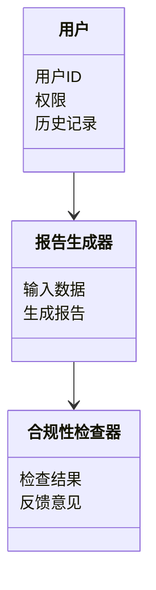
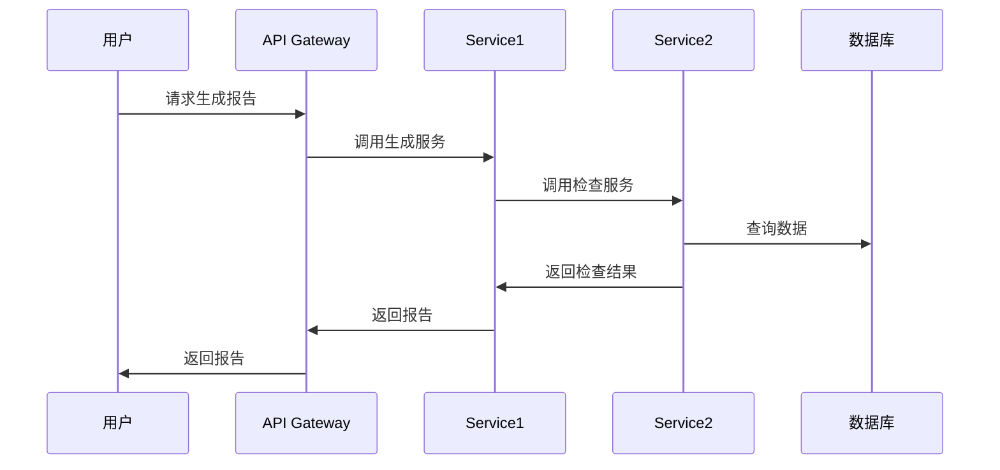

                 


# 开发基于大模型的金融监管报告智能生成与审核助手

## 关键词：大模型、金融监管、报告生成、审核助手、人工智能

## 摘要：  
本文探讨了基于大模型的金融监管报告智能生成与审核助手的开发，结合金融监管的实际需求，分析了大模型在报告生成与审核中的应用，并详细阐述了系统的设计与实现。文章从问题背景、核心概念、算法原理、系统架构到项目实战，逐步展开，旨在为读者提供一个全面的技术视角。

---

# 第1章：开发背景与问题背景

## 1.1 问题背景

### 1.1.1 金融监管报告的现状与挑战
金融监管是保障金融市场健康运行的重要环节，传统的监管报告生成和审核工作依赖于人工操作，存在效率低、成本高、易出错等问题。随着金融机构数量的增加和业务的复杂化，监管报告的生成和审核任务日益繁重。

### 1.1.2 传统金融监管报告生成的痛点
- **效率低下**：人工撰写报告耗时长，尤其是在处理大量数据时。
- **一致性差**：不同人员的撰写风格和标准不一，可能导致报告质量参差不齐。
- **合规性风险**：人工操作容易出现疏漏，难以保证报告的合规性。

### 1.1.3 大模型的引入与应用前景
大模型（如GPT-3、PaLM等）具有强大的自然语言处理能力，能够生成高质量的文本内容。将其应用于金融监管报告的生成与审核，可以显著提高效率、降低成本，并减少合规性风险。

## 1.2 问题描述

### 1.2.1 金融监管报告的核心要素
金融监管报告通常包括市场分析、风险评估、合规性检查、交易数据摘要等内容。这些内容需要基于实时数据和法规要求进行生成。

### 1.2.2 报告生成与审核的关键问题
- **数据准确性**：报告生成需要依赖准确的数据输入。
- **合规性要求**：报告内容需要符合相关法规和行业标准。
- **实时性**：金融市场变化迅速，报告需要及时更新。

### 1.2.3 大模型在金融领域的适用性分析
大模型擅长处理非结构化数据，能够快速生成符合要求的文本内容。然而，其对金融领域的专业知识依赖较大，需要结合行业知识进行微调和优化。

## 1.3 问题解决与边界

### 1.3.1 大模型如何解决金融监管问题
大模型可以通过自然语言处理技术，快速生成符合要求的监管报告，并辅助审核人员进行合规性检查。

### 1.3.2 系统的边界与外延
- **边界**：系统专注于报告生成与审核，不涉及数据采集和存储。
- **外延**：未来可以扩展至风险预警、智能合规咨询等领域。

### 1.3.3 核心概念与核心要素
- **核心概念**：大模型生成与审核报告。
- **核心要素**：数据输入、生成模型、审核规则。

## 1.4 本章小结
本章从金融监管的现状出发，分析了传统监管报告生成与审核的痛点，并探讨了大模型在这一领域的应用前景。接下来将深入探讨大模型的核心概念与原理。

---

# 第2章：核心概念与概念联系

## 2.1 核心概念原理

### 2.1.1 大模型的基本原理
大模型通过多层神经网络结构，利用海量数据进行训练，能够生成与训练数据相似的文本内容。

### 2.1.2 金融监管报告生成的流程
1. **数据输入**：接收金融市场数据和相关法规。
2. **内容生成**：基于数据生成报告初稿。
3. **审核优化**：根据合规性要求对报告进行优化。

### 2.1.3 大模型与金融监管的结合点
- **文本生成**：生成监管报告内容。
- **信息抽取**：从报告中提取关键信息。

## 2.2 核心概念属性对比

| **属性**       | **传统方法**                     | **大模型方法**                     |
|----------------|----------------------------------|------------------------------------|
| **效率**       | 低                               | 高                                 |
| **一致性**     | 差                               | 好                                 |
| **合规性**     | 易出错                           | 高                                 |

### 2.2.1 大模型与传统AI的对比
- **传统AI**：基于规则的文本生成，灵活性差。
- **大模型**：基于深度学习的生成式AI，灵活性高。

### 2.2.2 生成式AI与判别式AI的对比
- **生成式AI**：生成新内容。
- **判别式AI**：分类或识别内容。

### 2.2.3 金融监管报告生成的特征分析
- **领域特定**：需要结合金融领域的专业知识。
- **实时性要求**：需要快速生成和更新。

## 2.3 实体关系图


## 2.4 本章小结
本章详细分析了大模型的核心概念及其在金融监管中的应用，并通过对比传统方法和大模型方法，突出了大模型的优势。接下来将深入探讨大模型的算法原理。

---

# 第3章：算法原理与数学模型

## 3.1 算法原理

### 3.1.1 大模型的训练流程
1. **数据预处理**：清洗和标注数据。
2. **模型训练**：利用大规模数据进行微调。
3. **评估与优化**：基于金融监管任务进行评估。

### 3.1.2 生成式AI的数学基础
生成式AI通常基于概率图模型，通过最大似然估计进行训练。

### 3.1.3 基于大模型的生成算法
- **解码器**：将输入转换为输出文本。
- **注意力机制**：提高生成文本的相关性。

## 3.2 数学模型与公式

### 3.2.1 概率分布模型
$$ P(y|x) = \frac{P(x|y)P(y)}{P(x)} $$

### 3.2.2 梯度下降算法
$$ \theta = \theta - \eta \frac{\partial L}{\partial \theta} $$

### 3.2.3 激活函数
$$ f(x) = \text{sigmoid}(x) = \frac{1}{1+e^{-x}} $$

## 3.3 算法流程图


## 3.4 本章小结
本章详细介绍了大模型的算法原理，并通过数学公式和流程图展示了生成过程。接下来将探讨系统架构设计。

---

# 第4章：系统分析与架构设计

## 4.1 问题场景介绍

### 4.1.1 金融监管的典型场景
- **市场分析**：分析市场趋势。
- **风险评估**：评估投资风险。

## 4.2 系统功能设计

### 4.2.1 领域模型



## 4.3 系统架构设计

```mermaid
graph LR
    User[用户] --> API Gateway[网关]
    API Gateway --> Service1[服务1]
    Service1 --> Service2[服务2]
    Service2 --> Database[数据库]
```

## 4.4 系统接口设计

### 4.4.1 API接口
- **输入接口**：接收金融市场数据。
- **输出接口**：返回生成的报告和检查结果。

### 4.4.2 交互图



## 4.5 本章小结
本章通过系统架构设计和接口设计，展示了如何实现大模型在金融监管中的应用。接下来将通过项目实战进一步验证系统的设计。

---

# 第5章：项目实战

## 5.1 环境安装

### 5.1.1 安装Python
```bash
python --version
pip install --upgrade pip
```

### 5.1.2 安装依赖库
```bash
pip install transformers
pip install torch
```

## 5.2 核心代码实现

### 5.2.1 数据预处理
```python
import pandas as pd
data = pd.read_csv('input.csv')
```

### 5.2.2 模型训练
```python
from transformers import AutoModelForCausalLM
model = AutoModelForCausalLM.from_pretrained('gpt2')
```

### 5.2.3 生成报告
```python
def generate_report(input_data):
    response = model.generate(input_data, max_length=500)
    return response.decode()
```

## 5.3 案例分析

### 5.3.1 输入数据
```python
input_data = "金融市场的最新趋势分析"
```

### 5.3.2 生成结果
```python
print(generate_report(input_data))
```

## 5.4 项目小结
本章通过实际案例展示了系统的核心实现，验证了大模型在金融监管报告生成中的有效性。

---

# 第6章：最佳实践与小结

## 6.1 最佳实践

### 6.1.1 数据质量
确保输入数据的准确性和完整性。

### 6.1.2 模型优化
定期对模型进行微调，以适应金融市场的变化。

### 6.1.3 合规性检查
确保生成的报告符合相关法规和行业标准。

## 6.2 本章小结
本文详细探讨了基于大模型的金融监管报告生成与审核助手的开发，从背景、概念、算法到系统设计和项目实战，全面展示了系统的实现过程。

---

## 作者：AI天才研究院 & 禅与计算机程序设计艺术

