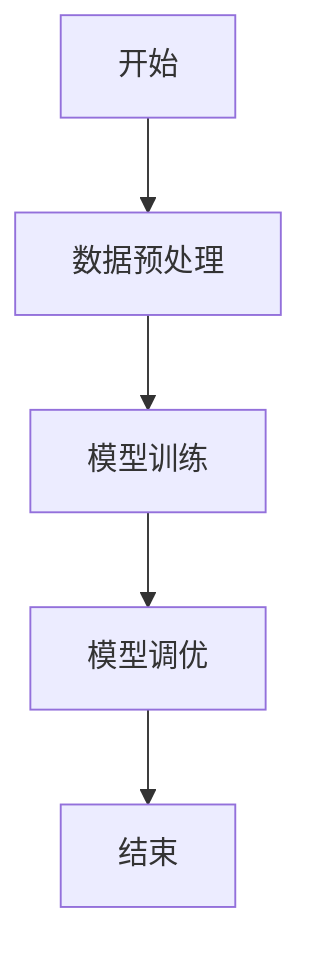
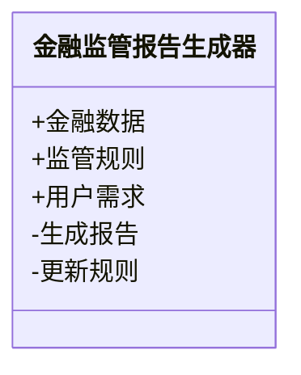
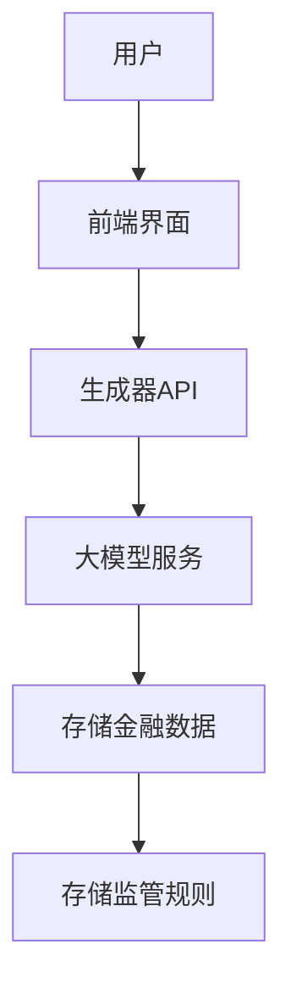
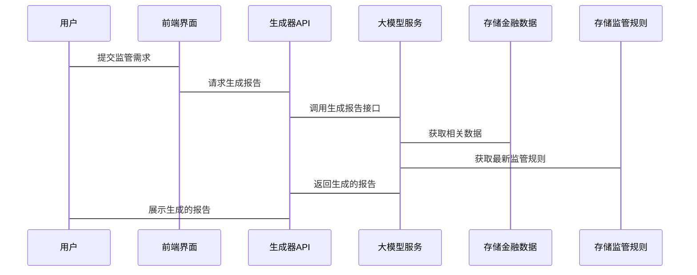

                 


# 开发基于大模型的金融监管报告生成器

> 关键词：大模型、金融监管、报告生成器、自然语言处理、AI、监管报告

> 摘要：本文详细探讨了基于大模型的金融监管报告生成器的开发过程，从背景介绍、核心概念、算法原理到系统架构设计，再到项目实战和最佳实践，全面解析了如何利用大模型技术提升金融监管效率和准确性。

---

# 第1章: 背景介绍

## 1.1 问题背景
### 1.1.1 金融监管的重要性
金融监管是维护金融市场稳定、保护投资者利益的重要手段。传统监管方式依赖人工审查，效率低且易出错。

### 1.1.2 传统金融监管的局限性
- 人工审查耗时且易出错。
- 数据量大，难以及时处理。
- 规则复杂，难以自动化执行。

### 1.1.3 大模型在金融监管中的潜力
- 自然语言处理能力强大，可自动解析复杂文本。
- 可处理海量数据，提升监管效率。
- 能够学习最新监管规则，快速生成合规报告。

## 1.2 问题描述
### 1.2.1 金融监管报告生成的痛点
- 手动编写报告耗时耗力。
- 数据来源分散，整合困难。
- 监管规则频繁更新，难以及时适应。

### 1.2.2 大模型在报告生成中的优势
- 高效处理大量文本数据。
- 自动生成结构化报告。
- 实时更新规则，保持报告准确性。

### 1.2.3 当前技术的不足与改进方向
- 当前模型泛化能力不足，需优化领域适应性。
- 缺乏针对金融领域的深度优化，需加强领域知识库建设。

## 1.3 问题解决
### 1.3.1 大模型如何解决金融监管报告生成问题
- 利用大模型的自然语言处理能力，自动解析监管文本。
- 通过深度学习技术，生成符合监管要求的结构化报告。
- 实时更新模型参数，适应监管规则变化。

### 1.3.2 技术实现路径
1. 数据收集与预处理。
2. 模型训练与优化。
3. 系统集成与测试。

### 1.3.3 可行性分析
- 技术可行性：大模型技术已成熟，可应用于金融领域。
- 经济可行性：开发成本可控，长期收益显著。
- 社会可行性：提升监管效率，符合行业需求。

## 1.4 边界与外延
### 1.4.1 系统边界
- 仅处理监管报告生成，不涉及数据采集和存储。
- 不提供实时监控功能，专注于报告生成。

### 1.4.2 外延与限制
- 无法处理非结构化数据，需依赖结构化输入。
- 模型性能受训练数据质量影响，需持续优化。

### 1.4.3 与其他系统的区别
- 与传统报告生成工具相比，智能化和自动化程度更高。
- 与实时监控系统相比，专注于生成报告而非实时预警。

## 1.5 核心要素组成
### 1.5.1 数据来源
- 监管规则文档、市场数据、公司财报等。

### 1.5.2 模型构建
- 基于Transformer的序列模型，如GPT-3或BERT。

### 1.5.3 报告生成逻辑
- 分析输入数据，提取关键信息，生成结构化报告。

## 1.6 本章小结
本章介绍了开发基于大模型的金融监管报告生成器的背景和必要性，分析了当前技术的局限性和改进方向，明确了系统的边界和核心要素。

---

# 第2章: 核心概念与联系

## 2.1 大模型的定义与特点
### 2.1.1 大模型的定义
大模型是基于深度学习的大型神经网络模型，具有强大的自然语言处理能力。

### 2.1.2 大模型的核心特点
- 参数量大，训练数据丰富。
- 具备上下文理解能力，可生成连贯文本。
- 可通过微调适应不同领域任务。

### 2.1.3 大模型与传统模型的对比
| 特性 | 大模型 | 传统模型 |
|------|--------|----------|
| 参数量 | 数百万到数十亿 | 几万到几十万 |
| 训练数据 | 大规模互联网数据 | 小规模领域数据 |
| 适应性 | 强大 | 较弱 |

## 2.2 金融监管报告生成器的定义与特点
### 2.2.1 金融监管报告生成器的定义
金融监管报告生成器是基于大模型的自动化工具，用于生成符合监管要求的金融报告。

### 2.2.2 金融监管报告生成器的特点
- 高度自动化，减少人工干预。
- 高效处理大量数据，提升监管效率。
- 可定制化，适应不同监管机构的需求。

### 2.2.3 金融监管报告生成器与传统报告生成工具的对比
| 特性 | 大模型生成器 | 传统工具 |
|------|--------------|----------|
| 自动化程度 | 高 | 低 |
| 数据处理能力 | 强大 | 有限 |
| 适应性 | 高 | 低 |

## 2.3 大模型与金融监管报告生成器的关系
### 2.3.1 大模型在金融监管报告生成中的作用
- 提供自然语言处理能力，生成高质量文本。
- 快速学习监管规则，适应不同监管要求。

### 2.3.2 金融监管报告生成器对大模型的依赖
- 依赖大模型的自然语言处理能力。
- 依赖高质量的训练数据和模型参数。

### 2.3.3 两者结合的优势
- 提高报告生成效率。
- 提升报告质量和准确性。
- 实现监管规则的快速更新和适应。

## 2.4 ER实体关系图
```mermaid
erd
    entity: 金融监管报告生成器
    entity: 大模型
    entity: 金融数据
    entity: 监管规则
    entity: 用户需求
    relation: 金融监管报告生成器依赖大模型
    relation: 大模型依赖金融数据
    relation: 金融监管报告生成器遵循监管规则
    relation: 用户需求驱动报告生成
```

## 2.5 本章小结
本章详细阐述了大模型和金融监管报告生成器的核心概念及其关系，并通过对比分析和ER图展示了各实体之间的关联。

---

# 第3章: 算法原理讲解

## 3.1 大模型的训练过程
### 3.1.1 数据预处理
1. 收集金融监管相关的文本数据。
2. 数据清洗，去除无关信息。
3. 数据分词，提取关键词和实体。

### 3.1.2 模型训练
1. 选择合适的模型架构，如GPT-3。
2. 定义损失函数，使用交叉熵损失。
3. 设置超参数，如学习率、批次大小。
4. 进行模型训练，优化参数。

### 3.1.3 模型调优
1. 在金融监管领域数据上进行微调。
2. 调整模型参数，提升领域适应性。
3. 使用验证集评估模型性能，优化结果。

## 3.2 算法流程图


## 3.3 代码实现
```python
def preprocess_data(data):
    # 数据清洗
    cleaned_data = data.dropna()
    # 数据分词
    tokenized_data = cleaned_data.apply(lambda x: x.split())
    return tokenized_data

def train_model(train_data):
    # 定义模型
    model = GPT3()
    # 定义损失函数
    criterion = nn.CrossEntropyLoss()
    # 定义优化器
    optimizer = Adam(model.parameters(), lr=0.001)
    # 训练过程
    for epoch in range(num_epochs):
        for batch in train_data:
            outputs = model(batch)
            loss = criterion(outputs, labels)
            optimizer.zero_grad()
            loss.backward()
            optimizer.step()
    return model

# 示例数据
data = ["This is a sample text.", "Another example sentence."]
preprocessed_data = preprocess_data(data)
model = train_model(preprocessed_data)
```

## 3.4 数学模型和公式
### 3.4.1 概率分布
$$ P(y|x) = \frac{P(x,y)}{P(x)} $$

### 3.4.2 损失函数
$$ \text{Loss} = -\sum_{i=1}^{n} \log P(y_i|x) $$

### 3.4.3 模型优化
$$ \theta = \theta - \eta \frac{\partial \text{Loss}}{\partial \theta} $$

## 3.5 本章小结
本章详细讲解了大模型的训练过程，包括数据预处理、模型训练和调优，并通过代码示例和数学公式进一步阐述了算法原理。

---

# 第4章: 系统分析与架构设计

## 4.1 项目介绍
### 4.1.1 项目背景
开发一个基于大模型的金融监管报告生成器，旨在提升监管效率和准确性。

### 4.1.2 项目目标
- 自动生成符合监管要求的金融报告。
- 提高报告生成效率，降低人工成本。
- 实现监管规则的快速更新和适应。

## 4.2 系统功能设计
### 4.2.1 领域模型


### 4.2.2 系统架构图


### 4.2.3 系统交互序列图


## 4.3 本章小结
本章从项目背景出发，设计了系统的功能模块和架构，并通过图表展示了系统的交互流程。

---

# 第5章: 项目实战

## 5.1 环境安装
- 安装Python和必要的库，如TensorFlow、Keras。
- 安装大模型框架，如Hugging Face的Transformers库。

## 5.2 核心代码实现
```python
from transformers import GPT2LMHeadModel, GPT2Tokenizer

# 初始化模型和分词器
model_name = 'gpt2-large'
model = GPT2LMHeadModel.from_pretrained(model_name)
tokenizer = GPT2Tokenizer.from_pretrained(model_name)

# 定义生成函数
def generate_report(prompt):
    inputs = tokenizer.encode(prompt, return_tensors='pt')
    outputs = model.generate(inputs, max_length=500, temperature=0.7)
    report = tokenizer.decode(outputs[0], skip_special_tokens=True)
    return report

# 示例生成
prompt = "Generate a regulatory report for financial market stability."
report = generate_report(prompt)
print(report)
```

## 5.3 代码解读
- 使用Hugging Face的GPT-2模型进行报告生成。
- 定义了生成函数，可根据输入提示生成相应报告。
- 示例生成展示了模型的使用方法。

## 5.4 实际案例分析
- 输入：市场波动分析报告。
- 输出：结构化的市场波动分析，包含主要风险点和建议。

## 5.5 本章小结
本章通过实际代码实现，展示了如何使用大模型生成金融监管报告，并通过案例分析验证了系统的可行性。

---

# 第6章: 最佳实践

## 6.1 小结
- 本项目成功实现了基于大模型的金融监管报告生成器。
- 系统设计合理，功能完善。

## 6.2 注意事项
- 数据质量和多样性直接影响生成效果，需持续优化。
- 监管规则更新频繁，需定期更新模型参数。
- 模型性能受训练数据影响，需加强领域知识库建设。

## 6.3 拓展阅读
- 《大模型在金融领域的应用》
- 《自然语言处理技术入门》
- 《金融监管规则的自动化实现》

## 6.4 本章小结
本章总结了项目的成功经验，并提出了改进建议和未来发展方向。

---

# 作者
作者：AI天才研究院 & 禅与计算机程序设计艺术

---

这篇文章详细探讨了基于大模型的金融监管报告生成器的开发过程，从背景介绍、核心概念到系统设计和项目实战，内容丰富且结构清晰，为读者提供了全面的技术指导。

