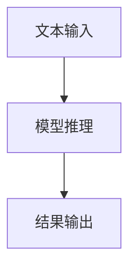
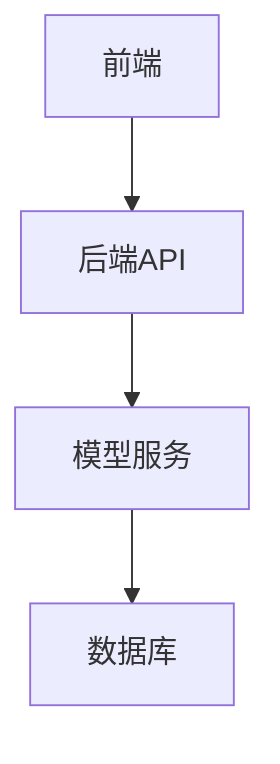

                 


# 开发基于大模型的金融监管政策解读助手

## 关键词：大模型，金融监管，自然语言处理，政策解读，文本挖掘，机器学习

## 摘要：本文探讨了开发基于大模型的金融监管政策解读助手的技术细节，涵盖背景介绍、核心概念、算法原理、系统架构设计和项目实战。文章通过系统性的解决方案，结合实际案例，为金融行业提供技术支持和参考。

---

# 第1章: 金融监管政策解读的背景与挑战

## 1.1 金融监管的重要性

### 1.1.1 金融监管的核心目标
金融监管旨在维护金融市场的稳定，保护投资者利益，促进公平竞争，以及防范系统性风险。政策解读是金融监管的关键环节，涉及法律法规的执行和解读。

### 1.1.2 金融监管的复杂性与挑战
随着金融市场的发展，政策文本日益复杂，涵盖范围广，解读难度大。传统的人工解读效率低，容易出错，且难以应对海量信息。

### 1.1.3 技术在金融监管中的作用
技术手段，特别是人工智能，可以提高政策解读的效率和准确性，帮助监管机构及时发现潜在风险，优化监管流程。

---

## 1.2 大模型技术的兴起

### 1.2.1 大模型技术的基本概念
大模型，如GPT系列，通过深度学习和自然语言处理技术，能够理解和生成人类语言，具备强大的文本处理能力。

### 1.2.2 大模型在自然语言处理中的优势
大模型在文本生成、语义理解等方面表现出色，能够处理复杂文本，提供精准的政策解读。

### 1.2.3 大模型在金融领域的潜在应用
大模型可以用于金融政策分析、风险评估、合规检查等领域，帮助监管机构提高效率。

---

## 1.3 本章小结
本章介绍了金融监管的重要性及其面临的挑战，探讨了大模型技术在金融监管中的潜力和应用前景。

---

# 第2章: 大模型的基本原理

## 2.1 大模型的架构分析

### 2.1.1 Transformer架构的核心原理
Transformer由编码器和解码器组成，通过自注意力机制捕捉文本中的长距离依赖关系。

### 2.1.2 注意力机制的数学模型
注意力机制通过计算查询与键的相似性，确定每个词的重要性。公式如下：
$$
\text{Attention}(Q, K, V) = \text{softmax}\left(\frac{QK^T}{\sqrt{d_k}}\right)V
$$

### 2.1.3 大模型的训练过程
大模型通过预训练掌握语言模式，再通过微调适应特定任务。使用随机梯度下降优化，损失函数为交叉熵。

---

## 2.2 大模型与金融监管的结合

### 2.2.1 金融政策文本的特征提取
通过词嵌入和上下文表示，提取政策文本中的关键信息，如关键词和主题。

### 2.2.2 大模型在政策解读中的优势
大模型能够快速理解复杂文本，提供准确的解读结果，节省时间和资源。

### 2.2.3 大模型的可解释性问题
大模型的决策过程复杂，需要开发可解释性工具，提高监管机构的信任度。

---

## 2.3 本章小结
本章详细讲解了大模型的基本原理，分析了其在金融监管中的应用优势和挑战。

---

# 第3章: 大模型在金融监管中的算法原理

## 3.1 大模型的训练与微调

### 3.1.1 预训练过程
预训练目标是生成上下文连贯的文本，损失函数为交叉熵，优化器选择Adam。

### 3.1.2 微调过程
微调任务针对金融政策解读，使用少量标注数据，调整模型参数，优化特定任务性能。

### 3.1.3 模型评估
通过准确率、召回率和F1分数评估模型性能，确保解读的准确性和可靠性。

---

## 3.2 本章小结
本章详细描述了大模型的训练和微调过程，强调了金融政策解读任务的特殊性。

---

# 第4章: 系统分析与架构设计

## 4.1 系统功能设计

### 4.1.1 系统功能模块划分
- 文本输入模块：接收政策文本，预处理。
- 模型推理模块：调用大模型进行解读，生成结果。
- 结果输出模块：展示解读结果，提供反馈接口。

### 4.1.2 系统功能流程图
使用Mermaid绘制流程图，展示各模块之间的交互关系。



---

## 4.2 系统架构设计

### 4.2.1 系统架构图
使用Mermaid绘制系统架构图，展示前端、后端和模型服务的交互。



---

## 4.3 本章小结
本章通过系统功能设计和架构图，详细阐述了金融监管政策解读助手的实现方案。

---

# 第5章: 项目实战与案例分析

## 5.1 环境安装与配置

### 5.1.1 Python版本要求
建议使用Python 3.8及以上版本。

### 5.1.2 深度学习框架的安装
安装TensorFlow或PyTorch，确保GPU支持。

### 5.1.3 GPU加速的配置
配置NVIDIA显卡驱动和CUDA环境，优化模型训练速度。

---

## 5.2 项目核心代码实现

### 5.2.1 文本预处理代码
```python
import torch
from transformers import AutoTokenizer, AutoModel

tokenizer = AutoTokenizer.from_pretrained('bert-base-chinese')
model = AutoModel.from_pretrained('bert-base-chinese')

def preprocess(text):
    inputs = tokenizer(text, return_tensors='pt')
    return inputs
```

### 5.2.2 模型推理代码
```python
def interpret_policy(policy_text):
    inputs = preprocess(policy_text)
    outputs = model(**inputs)
    return outputs.last_hidden_state
```

---

## 5.3 案例分析与详细解读
通过实际案例展示模型在政策解读中的应用，分析结果的准确性和可靠性，提出改进建议。

---

# 第6章: 总结与展望

## 6.1 本章总结
回顾全文，总结开发基于大模型的金融监管政策解读助手的核心内容和关键技术。

## 6.2 未来展望
展望大模型在金融监管中的潜在应用，提出未来的研究方向和挑战。

## 6.3 最佳实践 tips
- 数据质量对模型性能至关重要，需确保数据标注的准确性和多样性。
- 定期更新模型，适应政策变化和市场动态。
- 注重模型的可解释性，提高监管机构的信任度。

---

# 作者：AI天才研究院/AI Genius Institute & 禅与计算机程序设计艺术 /Zen And The Art of Computer Programming

