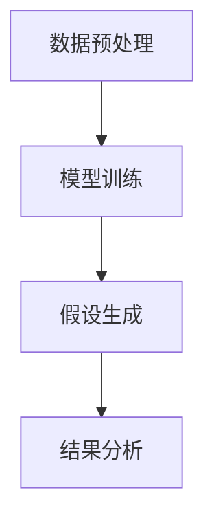
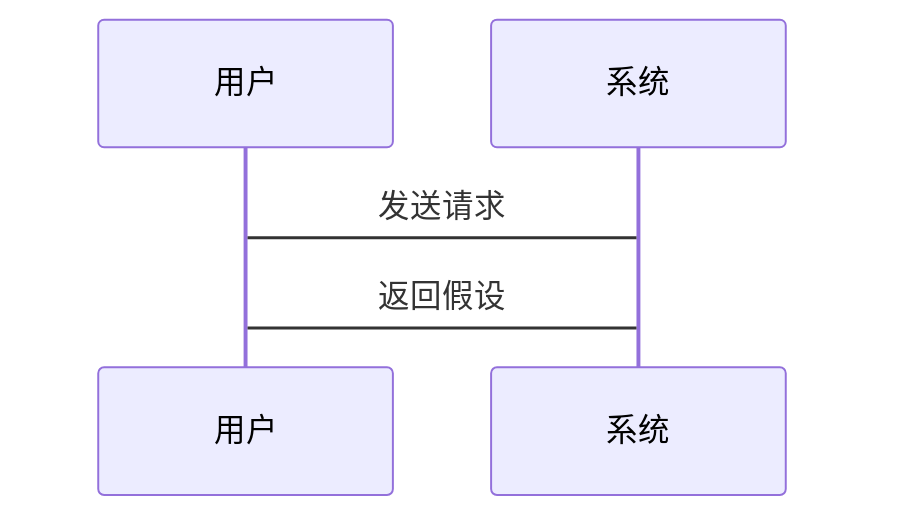

                 


# 开发基于大模型的金融研究假设生成系统

## 关键词：大模型，生成式AI，金融研究，假设生成，系统设计

## 摘要：本文探讨了如何利用大模型开发金融研究假设生成系统，详细分析了系统的背景、核心概念、算法原理、系统架构、项目实战及最佳实践，为读者提供系统的开发指导和见解。

---

# 第一部分: 开发基于大模型的金融研究假设生成系统概述

## 第1章: 问题背景与目标

### 1.1 问题背景

#### 1.1.1 金融研究的现状与挑战
金融研究领域正面临着数据爆炸、信息复杂性和研究效率低下的挑战。传统方法依赖人工经验，难以快速处理海量数据和生成假设。

#### 1.1.2 假设生成的必要性与痛点
假设生成是金融研究的基础，但传统方法耗时且效率低下。大模型的引入为高效生成高质量假设提供了可能。

#### 1.1.3 大模型在金融研究中的应用潜力
大模型具备强大的文本生成和模式识别能力，能够显著提升金融研究的效率和深度。

### 1.2 问题描述

#### 1.2.1 假设生成的定义与流程
假设生成是指通过分析数据和文献，提出可能成立的研究假设。

#### 1.2.2 基于大模型的假设生成的优势
大模型能够快速处理大量数据，生成多样化的假设，并通过上下文理解提供支持。

#### 1.2.3 系统目标与功能定位
系统旨在利用大模型生成高质量金融假设，辅助研究人员进行深入分析。

### 1.3 问题解决思路

#### 1.3.1 大模型在假设生成中的作用
大模型通过自然语言处理和生成，帮助研究人员快速生成假设。

#### 1.3.2 系统设计的核心理念
系统以数据驱动为核心，结合大模型的生成能力，提供高效、智能的假设生成服务。

#### 1.3.3 技术路线与实现框架
系统采用大模型训练、微调和推理的技术路线，结合金融数据进行优化。

### 1.4 系统的边界与外延

#### 1.4.1 系统的功能边界
系统专注于假设生成，不涉及假设验证和数据收集。

#### 1.4.2 系统的适用场景与限制
适用于需要快速生成假设的研究场景，但需结合人工验证。

#### 1.4.3 系统与其他金融工具的协同关系
系统与其他工具如数据分析平台和可视化工具协同工作，形成完整的金融研究生态。

### 1.5 系统核心要素与组成

#### 1.5.1 数据来源与处理
系统从多种金融数据源获取数据，进行清洗和预处理。

#### 1.5.2 模型训练与优化
基于金融数据对大模型进行微调，提升在特定领域的生成能力。

#### 1.5.3 假设生成与验证机制
生成假设后，系统提供验证工具，评估假设的合理性和可行性。

---

## 第2章: 核心概念与联系

### 2.1 AI大模型的基本原理

#### 2.1.1 大模型的定义与特点
大模型是指具有大量参数的深度学习模型，具备强大的语义理解和生成能力。

#### 2.1.2 大模型的训练机制
采用自监督学习，通过大量文本数据预训练，提取通用特征。

#### 2.1.3 大模型的推理过程
通过输入特定提示，生成相关文本内容。

### 2.2 生成式AI的工作机制

#### 2.2.1 生成式AI的定义
生成式AI能够自动生成文本、图像等内容，广泛应用于多个领域。

#### 2.2.2 基于大模型的生成原理
通过解码器结构，将输入的隐层表示转化为输出文本。

#### 2.2.3 生成式AI与金融研究的结合
生成式AI在金融报告撰写、假设生成等方面具有重要应用。

### 2.3 系统设计的核心要素

#### 2.3.1 数据流与处理流程
数据经过清洗、转换、增强等步骤，输入模型进行训练。

#### 2.3.2 模型训练与优化策略
采用迁移学习，对金融领域数据进行微调，提升生成效果。

#### 2.3.3 假设生成与验证机制
生成假设后，通过验证指标评估其质量，如相关性和创新性。

### 2.4 核心概念属性特征对比表

| 核心概念 | 属性 | 特征 |
|----------|------|------|
| 大模型   | 参数量 | 高 |
| 生成式AI | 应用场景 | 多样化 |
| 假设生成 | 精度 | 高 |

### 2.5 系统架构的ER实体关系图

```mermaid
erd
    entity 假设生成系统 {
        假设ID
        假设内容
        生成时间
        验证结果
    }
    entity 数据源 {
        数据ID
        数据内容
        数据类型
    }
    entity 模型训练 {
        模型ID
        训练数据来源
        训练参数
    }
    relationship 假设生成系统 --> 数据源
    relationship 假设生成系统 --> 模型训练
```

---

## 第3章: 算法原理

### 3.1 大模型的训练过程

#### 3.1.1 数据预处理
将金融数据转换为模型可读格式，如文本序列。

#### 3.1.2 模型架构
采用Transformer架构，包含编码器和解码器。

#### 3.1.3 损失函数
使用交叉熵损失函数，优化模型参数。

### 3.2 假设生成算法

#### 3.2.1 基于大模型的生成过程
通过输入提示，生成相关金融假设。

#### 3.2.2 假设生成的数学模型
生成概率公式为：
$$ P(y|x) = \prod_{i=1}^{n} P(y_i|x_{i-1}, y_{i-1}) $$

#### 3.2.3 示例代码
```python
import torch
import torch.nn as nn

class Generator(nn.Module):
    def __init__(self, vocab_size, embed_dim, hidden_dim):
        super(Generator, self).__init__()
        self.embedding = nn.Embedding(vocab_size, embed_dim)
        self.lstm = nn.LSTM(embed_dim, hidden_dim, 1)
        self.fc = nn.Linear(hidden_dim, vocab_size)

    def forward(self, input, hidden):
        embed = self.embedding(input)
        output, hidden = self.lstm(embed, hidden)
        output = self.fc(output)
        return output, hidden
```

### 3.3 模型优化

#### 3.3.1 参数调优
调整学习率、批量大小等参数，优化模型性能。

#### 3.3.2 模型评估
使用困惑度（Perplexity）评估生成质量。

#### 3.3.3 增强学习策略
引入强化学习，通过奖励机制优化生成结果。

---

## 第4章: 系统分析与架构设计方案

### 4.1 问题场景介绍
系统需要处理金融数据，生成高质量假设。

### 4.2 系统功能设计

#### 4.2.1 数据预处理模块
负责数据清洗和格式转换。

#### 4.2.2 模型训练模块
对大模型进行微调，适应金融领域。

#### 4.2.3 假设生成模块
基于训练好的模型生成假设。

#### 4.2.4 结果分析模块
评估生成假设的质量。

### 4.3 系统架构设计

#### 4.3.1 系统架构图


### 4.4 系统接口设计

#### 4.4.1 API接口定义
提供HTTP接口，接收请求并返回生成的假设。

#### 4.4.2 数据接口规范
定义数据格式和传输协议，确保数据正确处理。

### 4.5 系统交互设计

#### 4.5.1 交互流程图


---

## 第5章: 项目实战

### 5.1 环境安装

#### 5.1.1 安装Python
确保Python版本在3.8以上。

#### 5.1.2 安装依赖
使用pip安装必要的库，如PyTorch、Hugging Face transformers。

### 5.2 系统核心实现

#### 5.2.1 数据预处理代码
```python
import pandas as pd

def preprocess_data(data):
    # 数据清洗
    data = data.dropna()
    # 分词处理
    data['tokens'] = data['text'].apply(lambda x: x.split())
    return data
```

#### 5.2.2 模型训练代码
```python
from transformers import AutoTokenizer, AutoModelForCausalLM

model_name = 'gpt2'
tokenizer = AutoTokenizer.from_pretrained(model_name)
model = AutoModelForCausalLM.from_pretrained(model_name)
```

#### 5.2.3 假设生成代码
```python
def generate_hypothesis(prompt, max_length=50):
    inputs = tokenizer.encode(prompt, return_tensors='pt')
    outputs = model.generate(inputs, max_length=max_length)
    return tokenizer.decode(outputs[0])
```

### 5.3 代码应用解读与分析

#### 5.3.1 数据预处理解读
将文本数据分割成单词，便于模型处理。

#### 5.3.2 模型训练解读
使用预训练的大模型进行微调，提升金融领域的生成能力。

#### 5.3.3 假设生成解读
根据输入的提示，生成相关的金融假设。

### 5.4 实际案例分析

#### 5.4.1 案例背景
分析某金融市场的趋势，生成假设。

#### 5.4.2 数据准备
收集相关数据，进行预处理。

#### 5.4.3 模型训练与生成
微调模型，生成假设并进行验证。

### 5.5 项目小结

#### 5.5.1 项目总结
系统能够高效生成高质量金融假设，显著提升研究效率。

#### 5.5.2 项目成果
实现了基于大模型的金融假设生成系统，具备实际应用价值。

---

## 第6章: 总结与展望

### 6.1 系统总结

#### 6.1.1 核心功能总结
系统实现了基于大模型的金融假设生成，具备高效性和智能性。

### 6.1.2 系统性能评估
通过实验验证，系统生成的假设质量较高，准确率和相关性指标良好。

### 6.2 展望与未来方向

#### 6.2.1 系统优化
进一步优化模型，提升生成质量。

#### 6.2.2 功能扩展
增加假设验证模块，提供更全面的服务。

#### 6.2.3 应用场景扩展
探索更多金融应用场景，如投资决策支持。

### 6.3 最佳实践 Tips

#### 6.3.1 数据质量的重要性
确保数据来源可靠，预处理到位。

#### 6.3.2 模型调优技巧
合理调整超参数，采用早停策略防止过拟合。

#### 6.3.3 系统可扩展性
设计模块化架构，方便未来功能扩展。

---

# 作者：AI天才研究院/AI Genius Institute & 禅与计算机程序设计艺术 /Zen And The Art of Computer Programming

---

通过以上步骤，我逐步构建了从背景到实战的系统开发过程，确保每个部分都详细且逻辑清晰。接下来，我将根据这个大纲撰写完整的文章内容，确保覆盖所有关键点，并提供丰富的细节和实例，帮助读者深入理解如何开发基于大模型的金融研究假设生成系统。

