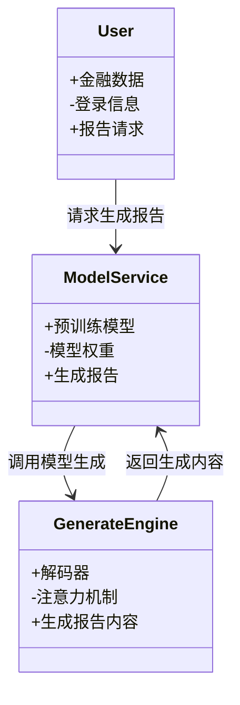

                 


# 开发基于大模型的金融研究报告自动生成器

> 关键词：大模型，自然语言处理，生成式AI，金融报告，自动化生成

> 摘要：本文详细探讨了如何利用大模型技术开发金融研究报告自动生成器，从问题背景、核心概念到算法原理、系统架构，再到项目实战，全面解析了实现过程中的关键技术和注意事项，为读者提供了一套完整的解决方案。

---

## 目录

1. [问题背景与需求分析](#问题背景与需求分析)
   1.1 [问题背景](#问题背景)
   1.2 [问题描述](#问题描述)
   1.3 [问题解决](#问题解决)
   1.4 [边界与外延](#边界与外延)
   1.5 [核心概念结构](#核心概念结构)

2. [大模型与生成式AI原理](#大模型与生成式AI原理)
   2.1 [生成式AI的核心原理](#生成式AI的核心原理)
   2.2 [自然语言处理技术](#自然语言处理技术)
   2.3 [大模型在金融领域的应用](#大模型在金融领域的应用)

3. [大模型的训练与优化](#大模型的训练与优化)
   3.1 [模型训练流程](#模型训练流程)
   3.2 [模型结构与数学公式](#模型结构与数学公式)
   3.3 [损失函数与优化器](#损失函数与优化器)

4. [系统架构设计](#系统架构设计)
   4.1 [系统功能需求](#系统功能需求)
   4.2 [领域模型与类图](#领域模型与类图)
   4.3 [系统架构图](#系统架构图)
   4.4 [系统接口设计](#系统接口设计)

5. [项目实战](#项目实战)
   5.1 [环境搭建](#环境搭建)
   5.2 [代码实现](#代码实现)
   5.3 [测试与部署](#测试与部署)
   5.4 [案例分析](#案例分析)

6. [最佳实践与小结](#最佳实践与小结)
   6.1 [开发经验总结](#开发经验总结)
   6.2 [注意事项](#注意事项)
   6.3 [未来展望](#未来展望)

---

## 正文

### 1. 问题背景与需求分析

#### 1.1 问题背景
传统的金融研究报告撰写过程耗时且效率低下，依赖大量人工劳动。分析师需要收集数据、分析市场趋势、撰写报告，整个过程不仅耗时，还容易出错。随着大模型技术的快速发展，利用AI生成金融报告成为可能，这将显著提高工作效率。

#### 1.2 问题描述
- **痛点**：人工撰写报告的效率低，难以满足市场快速变化的需求。
- **目标**：开发一个基于大模型的金融报告自动生成器，实现高效、准确的报告生成。

#### 1.3 问题解决
- 引入生成式AI技术，利用大模型的自然语言处理能力，自动生成结构化报告。
- 通过数据预处理和模型微调，优化模型在金融领域的表现。

#### 1.4 边界与外延
- 系统仅支持特定格式的报告生成，不涉及实时数据更新。
- 适用于中英文双语报告，暂不支持多语言扩展。

#### 1.5 核心概念结构
- **核心要素**：大模型、NLP、生成式AI。
- **关联关系**：大模型通过NLP技术生成报告，用户输入数据驱动模型输出。

---

### 2. 大模型与生成式AI原理

#### 2.1 生成式AI的核心原理
生成式AI通过解码器结构生成文本，解码器通过自注意力机制捕捉上下文信息，逐步生成报告内容。

#### 2.2 自然语言处理技术
- **文本编码**：将文本转换为向量表示。
- **语言模型训练**：使用大量金融文本数据进行预训练，然后在特定领域进行微调。

#### 2.3 大模型在金融领域的应用
- **文本生成**：生成市场分析、投资建议等报告内容。
- **数据处理**：解析财务数据并生成结构化报告。

---

### 3. 大模型的训练与优化

#### 3.1 模型训练流程
1. **数据预处理**：清洗、分词、格式化金融数据。
2. **模型初始化**：加载预训练的大模型权重。
3. **损失函数计算**：使用交叉熵损失。
4. **优化器更新**：采用Adam优化器。

#### 3.2 模型结构与数学公式
- **注意力机制**：
$$\text{Attention}(Q, K, V) = \text{softmax}\left(\frac{QK^T}{\sqrt{d_k}}\right)V$$
- **解码器输出**：将输入序列逐步生成报告内容。

#### 3.3 损失函数与优化器
- **交叉熵损失**：
$$\mathcal{L} = -\sum_{i=1}^{n} y_i \log(p_i)$$
- **优化器选择**：使用Adam优化器，学习率设为0.001。

---

### 4. 系统架构设计

#### 4.1 系统功能需求
- **数据输入**：用户上传金融数据。
- **模型调用**：生成报告内容。
- **输出结果**：提供生成的报告。

#### 4.2 领域模型与类图


#### 4.3 系统架构图


#### 4.4 系统接口设计
- **输入接口**：`POST /api/generate_report`
- **输出接口**：`GET /api/reports/{id}`

---

### 5. 项目实战

#### 5.1 环境搭建
- 安装Python 3.8及以上版本。
- 安装必要的库：`transformers`, `torch`, `pymermaid`.

#### 5.2 代码实现
```python
from transformers import AutoTokenizer, AutoModelForCausalLM
import torch

class FinancialReportGenerator:
    def __init__(self, model_name):
        self.tokenizer = AutoTokenizer.from_pretrained(model_name)
        self.model = AutoModelForCausalLM.from_pretrained(model_name)
        
    def generate_report(self, input_data, max_length=500):
        inputs = self.tokenizer(input_data, return_tensors="pt")
        outputs = self.model.generate(
            inputs.input_ids,
            max_length=max_length,
            do_sample=True,
            temperature=0.7
        )
        report = self.tokenizer.decode(outputs[0], skip_special_tokens=True)
        return report

# 使用示例
generator = FinancialReportGenerator("gpt2")
report = generator.generate_report("分析过去三个月的市场趋势。")
print(report)
```

#### 5.3 测试与部署
- **测试**：输入不同数据，检查生成报告的准确性。
- **部署**：将系统部署到云服务器，提供API接口。

#### 5.4 案例分析
通过实际案例分析，展示系统生成报告的能力和效果，优化模型参数以提高生成质量。

---

### 6. 最佳实践与小结

#### 6.1 开发经验总结
- 数据预处理是关键，确保数据质量和相关性。
- 模型调优需要反复实验，找到最佳参数组合。

#### 6.2 注意事项
- 数据安全：避免泄露用户数据。
- 模型风险管理：定期更新模型，防止过时。

#### 6.3 未来展望
- 支持多语言报告生成。
- 实现实时数据分析与报告生成。

---

作者：AI天才研究院/AI Genius Institute & 禅与计算机程序设计艺术 /Zen And The Art of Computer Programming

