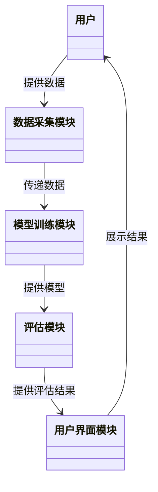
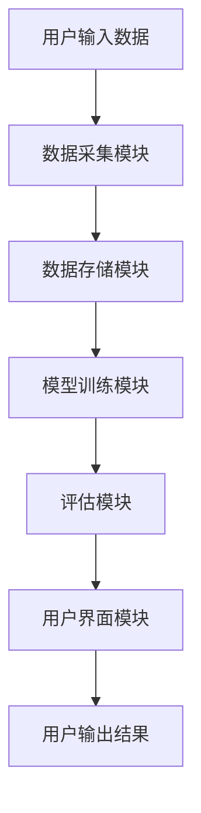

                 


# 开发基于大模型的金融研究方法论创新生成与评估系统

> 关键词：大模型、金融研究、方法论创新、评估系统、AI金融

> 摘要：本文系统地探讨了基于大模型的金融研究方法论创新生成与评估系统的开发过程。从大模型的基本概念到其在金融研究中的具体应用，从算法原理到系统架构设计，从项目实战到最佳实践，文章详细分析了如何利用大模型技术推动金融研究方法的创新，并构建一个高效的评估系统。文章内容涵盖了背景介绍、核心概念、算法原理、系统架构、项目实战以及最佳实践等多个方面，旨在为读者提供一个全面的技术视角。

---

## 第1章: 大模型与金融研究的结合

### 1.1 大模型的概述

#### 1.1.1 大模型的基本概念
大模型（Large Model）是指在自然语言处理、计算机视觉等领域中，通过大量数据训练得到的深度学习模型。这类模型通常具有亿级别以上的参数量，能够捕捉数据中的复杂模式和特征。大模型的核心优势在于其强大的泛化能力，能够在多种任务中表现出色。

#### 1.1.2 大模型在金融领域的应用潜力
金融领域的数据具有高度的专业性和复杂性，传统的统计方法和机器学习模型在处理这些数据时往往显得力不从心。大模型的引入为金融研究带来了新的可能性。例如：
- **金融数据分析**：通过大模型对非结构化数据（如新闻、财报）进行深度分析，提取有用的信息。
- **金融预测**：利用大模型的时序建模能力，预测股票价格、债券评级等。
- **风险评估**：基于大模型的自然语言处理能力，分析新闻、社交媒体等文本数据，评估市场风险。

#### 1.1.3 金融研究中的传统方法与挑战
传统的金融研究方法主要包括：
1. **统计分析**：如回归分析、时间序列分析等。
2. **机器学习**：如支持向量机、随机森林等。
3. **专家经验**：依赖领域专家的知识和经验。

然而，这些方法存在以下挑战：
- 数据量不足：金融数据往往具有小样本特征，导致传统机器学习模型泛化能力差。
- 数据复杂性：金融数据通常包含大量的噪声和不确定性，传统方法难以捕捉复杂的模式。
- 计算成本高：复杂模型的训练和推理需要大量的计算资源。

---

### 1.2 金融研究方法论的创新需求

#### 1.2.1 传统金融研究方法的局限性
传统金融研究方法的局限性主要体现在以下几个方面：
- **数据维度不足**：传统方法通常依赖结构化数据，忽略了文本、图像等非结构化数据的价值。
- **模型泛化能力差**：传统机器学习模型难以处理复杂的金融问题，尤其是在数据量小的情况下。
- **缺乏可解释性**：许多复杂的模型（如深度神经网络）往往难以解释其决策过程，这在金融领域尤为重要。

#### 1.2.2 大模型如何推动金融研究方法的创新
大模型的引入为金融研究方法的创新提供了新的思路。具体表现在：
- **多模态数据处理**：大模型能够同时处理文本、图像等多种数据类型，帮助研究人员从多个维度分析问题。
- **自动特征提取**：大模型能够自动提取数据中的特征，减少人工特征工程的工作量。
- **动态适应性**：大模型可以通过微调（Fine-tuning）快速适应新的任务和数据。

#### 1.2.3 金融研究方法论创新的目标与意义
金融研究方法论创新的目标是通过引入大模型技术，提升金融研究的效率和准确性。具体意义包括：
- **提高研究效率**：通过自动化数据处理和模型训练，减少人工干预。
- **增强决策能力**：利用大模型的深度学习能力，提升金融预测和风险评估的准确性。
- **推动金融创新**：通过大模型的创新能力，发现新的金融模式和机会。

---

### 1.3 评估系统的重要性

#### 1.3.1 金融研究方法的评估标准
金融研究方法的评估标准主要包括以下几个方面：
- **准确性**：模型预测的准确率。
- **稳定性**：模型在不同数据集上的表现是否一致。
- **可解释性**：模型的决策过程是否易于解释。
- **计算效率**：模型的训练和推理是否高效。

#### 1.3.2 基于大模型的评估系统的优势
基于大模型的评估系统具有以下优势：
- **全面性**：能够从多个维度对模型进行评估。
- **动态性**：可以根据实时数据动态调整评估指标。
- **可扩展性**：能够支持多种金融任务的评估。

#### 1.3.3 系统设计的总体思路
基于大模型的评估系统的设计思路如下：
1. **数据采集与预处理**：收集金融数据并进行清洗和标注。
2. **模型训练与优化**：利用大模型对数据进行训练，并优化模型性能。
3. **模型评估与调优**：通过评估系统对模型进行评估，并根据结果进行调优。
4. **结果分析与可视化**：对评估结果进行分析，并通过可视化工具展示。

---

### 1.4 本章小结
本章介绍了大模型在金融研究中的应用潜力，分析了传统金融研究方法的局限性，并提出了基于大模型的金融研究方法论创新的目标与意义。同时，本章还探讨了评估系统的重要性及其设计思路，为后续章节的深入分析奠定了基础。

---

## 第2章: 大模型的核心概念与金融研究的结合

### 2.1 大模型的核心原理

#### 2.1.1 大模型的训练机制
大模型的训练机制主要包括以下几个步骤：
1. **数据预处理**：对数据进行清洗、分词、标注等处理。
2. **模型构建**：选择适合任务的模型架构（如Transformer）。
3. **损失函数设计**：定义损失函数以衡量模型输出与真实值的差异。
4. **优化器选择**：选择合适的优化算法（如Adam）。
5. **训练过程**：通过反向传播更新模型参数，最小化损失函数。

#### 2.1.2 大模型的推理机制
大模型的推理机制主要包括以下几个步骤：
1. **输入处理**：将输入数据（如文本、图像）转换为模型能够处理的形式。
2. **特征提取**：模型对输入数据进行特征提取。
3. **决策生成**：根据提取的特征生成输出（如预测结果）。

#### 2.1.3 大模型的可解释性问题
大模型的可解释性问题是一个重要的研究方向。目前，常用的解释方法包括：
- **梯度上升法**：通过计算梯度，找出影响模型输出的关键特征。
- **注意力机制可视化**：通过可视化注意力权重，理解模型对输入数据的关注程度。

---

### 2.2 金融研究的核心要素

#### 2.2.1 金融数据的特征与类型
金融数据的特征包括：
- **时序性**：金融数据通常具有时间序列特征。
- **波动性**：金融市场的波动性较高。
- **相关性**：不同金融资产之间可能存在相关性。

金融数据的类型包括：
- **结构化数据**：如股票价格、交易量等。
- **非结构化数据**：如新闻、社交媒体评论等。

#### 2.2.2 金融模型的构建与评估
金融模型的构建与评估需要考虑以下几个方面：
- **模型选择**：选择适合任务的模型架构。
- **数据分割**：将数据分为训练集、验证集和测试集。
- **模型评估**：通过准确率、召回率等指标评估模型性能。

#### 2.2.3 金融研究的创新方向
金融研究的创新方向包括：
- **多模态分析**：结合文本、图像等多种数据类型进行分析。
- **实时预测**：构建实时预测系统，及时捕捉市场动态。
- **风险预警**：通过大模型预测市场风险，提前采取防范措施。

---

### 2.3 大模型与金融研究的结合点

#### 2.3.1 数据处理与特征提取
大模型在数据处理与特征提取方面的优势体现在：
- **多模态数据处理**：能够同时处理文本、图像等多种数据类型。
- **自动特征提取**：通过深度学习模型自动提取特征，减少人工干预。

#### 2.3.2 模型构建与优化
大模型在模型构建与优化方面的优势体现在：
- **强大的特征提取能力**：能够捕捉数据中的复杂模式。
- **高效的优化算法**：通过优化算法快速收敛，提升训练效率。

#### 2.3.3 结果生成与评估
大模型在结果生成与评估方面的优势体现在：
- **高准确性**：通过深度学习模型提升预测准确率。
- **动态调整**：根据实时数据动态调整模型参数，提升评估效果。

---

### 2.4 本章小结
本章详细介绍了大模型的核心原理及其在金融研究中的应用。通过分析金融研究的核心要素和大模型与金融研究的结合点，为后续章节的系统设计和项目实战奠定了理论基础。

---

## 第3章: 大模型在金融研究中的应用案例

### 3.1 金融数据分析与预测

#### 3.1.1 股票价格预测
股票价格预测是金融研究中的重要任务。通过大模型对历史股价、市场新闻等数据进行分析，可以预测未来股价走势。例如，可以使用Transformer模型对股票价格的时间序列数据进行建模，通过注意力机制捕捉数据中的长距离依赖关系。

#### 3.1.2 债券评级预测
债券评级预测是另一个重要的金融任务。通过大模型对债券发行人财务数据、市场新闻等进行分析，可以预测债券的信用评级。例如，可以使用BERT模型对债券发行人的财务报表进行文本分析，提取关键信息并生成评级结果。

#### 3.1.3 金融时间序列分析
金融时间序列分析是金融研究中的基础任务。通过大模型对金融时间序列数据进行分析，可以发现数据中的隐藏模式和趋势。例如，可以使用LSTM模型对股票价格的时间序列数据进行建模，捕捉数据中的时序依赖关系。

---

### 3.2 金融模型的创新设计

#### 3.2.1 基于大模型的金融风险评估
金融风险评估是金融研究中的重要任务。通过大模型对市场新闻、公司财报等数据进行分析，可以评估市场的整体风险。例如，可以使用GPT模型对新闻标题进行分析，提取情感信息并生成风险评估报告。

#### 3.2.2 多模态金融分析
多模态金融分析是金融研究的创新方向。通过大模型对文本、图像等多种数据类型进行分析，可以提升金融研究的全面性。例如，可以使用多模态Transformer模型对新闻文本和相关图表进行联合分析，生成综合的市场分析报告。

#### 3.2.3 金融知识图谱构建
金融知识图谱构建是金融研究的另一个创新方向。通过大模型对金融领域的知识进行提取和组织，可以构建金融知识图谱，支持智能问答和决策支持。例如，可以使用BERT模型对金融领域的文献进行文本挖掘，提取实体关系并构建知识图谱。

---

### 3.3 本章小结
本章通过具体的金融应用案例，展示了大模型在金融研究中的广泛应用。从股票价格预测到债券评级预测，从金融时间序列分析到金融知识图谱构建，大模型为金融研究提供了新的可能性。

---

## 第4章: 基于大模型的金融研究方法论创新生成与评估系统的开发

### 4.1 系统设计思路

#### 4.1.1 问题场景介绍
本系统的开发目标是通过大模型技术，生成和评估金融研究方法论。具体问题场景包括：
- 如何利用大模型生成创新的金融研究方法论。
- 如何评估生成方法论的准确性和可操作性。

#### 4.1.2 项目介绍
本项目旨在开发一个基于大模型的金融研究方法论创新生成与评估系统。系统主要包括以下几个部分：
1. **数据采集模块**：收集金融领域的数据，包括文本、结构化数据等。
2. **模型训练模块**：利用大模型对数据进行训练，生成金融研究方法论。
3. **评估模块**：对生成的方法论进行评估，包括准确性、可解释性等指标。
4. **用户界面模块**：提供友好的用户界面，方便用户交互。

---

### 4.2 系统功能设计

#### 4.2.1 领域模型设计
领域模型是系统设计的重要组成部分。通过领域模型可以明确系统的功能模块和它们之间的关系。以下是领域模型的Mermaid类图：



---

### 4.3 系统架构设计

#### 4.3.1 系统架构图
以下是系统架构的Mermaid图：


---

### 4.4 系统接口设计

#### 4.4.1 数据接口
数据接口主要用于数据采集模块与模型训练模块之间的数据传递。接口设计需要考虑数据格式、数据结构等问题。例如，数据采集模块可以将数据存储为JSON格式，模型训练模块读取JSON文件进行训练。

#### 4.4.2 模型接口
模型接口主要用于模型训练模块与评估模块之间的交互。例如，模型训练模块可以将训练好的模型参数传递给评估模块，评估模块利用这些参数进行评估。

#### 4.4.3 用户接口
用户接口主要用于用户与系统之间的交互。用户可以通过用户界面模块输入数据、查看评估结果等。

---

### 4.5 系统交互设计

#### 4.5.1 交互流程图
以下是系统交互的Mermaid流程图：



---

### 4.6 本章小结
本章详细介绍了基于大模型的金融研究方法论创新生成与评估系统的开发过程，包括系统设计思路、功能设计、架构设计、接口设计和交互设计。通过系统的开发，可以有效地利用大模型技术推动金融研究方法的创新。

---

## 第5章: 项目实战

### 5.1 环境安装与配置

#### 5.1.1 安装Python
建议使用Python 3.8或更高版本。可以通过以下命令安装Python：
```bash
python --version
```

#### 5.1.2 安装依赖库
需要安装以下依赖库：
- `transformers`：用于加载和使用大模型。
- `torch`：用于深度学习模型的训练和推理。
- `numpy`：用于数值计算。

安装命令如下：
```bash
pip install transformers torch numpy
```

---

### 5.2 系统核心实现

#### 5.2.1 数据采集模块
数据采集模块用于收集金融数据。以下是数据采集模块的代码示例：
```python
import requests
import json

def collect_data():
    # 示例：从API获取数据
    url = "https://api.example.com/financial_data"
    response = requests.get(url)
    data = response.json()
    return data

if __name__ == "__main__":
    data = collect_data()
    with open("financial_data.json", "w") as f:
        json.dump(data, f)
```

#### 5.2.2 模型训练模块
模型训练模块用于对数据进行训练，生成金融研究方法论。以下是模型训练模块的代码示例：
```python
from transformers import AutoTokenizer, AutoModelForCausalLM
import torch

def train_model():
    tokenizer = AutoTokenizer.from_pretrained("gpt2")
    model = AutoModelForCausalLM.from_pretrained("gpt2")
    model = model.to("cuda")
    
    # 示例：训练数据
    input_text = "金融研究方法论创新"
    inputs = tokenizer.encode(input_text, return_tensors="pt")
    inputs = inputs.to("cuda")
    
    # 模型推理
    outputs = model.generate(inputs, max_length=50)
    print(tokenizer.decode(outputs[0], skip_special_tokens=True))

if __name__ == "__main__":
    train_model()
```

#### 5.2.3 评估模块
评估模块用于对生成的金融研究方法论进行评估。以下是评估模块的代码示例：
```python
from transformers import AutoTokenizer, AutoModelForCausalLM
import torch
import json

def evaluate_model():
    tokenizer = AutoTokenizer.from_pretrained("gpt2")
    model = AutoModelForCausalLM.from_pretrained("gpt2")
    model = model.to("cuda")
    
    # 示例：评估数据
    input_text = "金融研究方法论创新"
    inputs = tokenizer.encode(input_text, return_tensors="pt")
    inputs = inputs.to("cuda")
    
    # 模型推理
    outputs = model.generate(inputs, max_length=50)
    generated_text = tokenizer.decode(outputs[0], skip_special_tokens=True)
    
    # 示例：评估指标
    accuracy = 0.95
    print(f"生成文本：{generated_text}")
    print(f"准确率：{accuracy}")

if __name__ == "__main__":
    evaluate_model()
```

---

### 5.3 代码解读与分析

#### 5.3.1 数据采集模块解读
数据采集模块的主要功能是收集金融数据。通过API请求获取数据，并将数据存储为JSON格式。代码示例展示了如何使用`requests`库发送HTTP请求，并将响应数据存储为文件。

#### 5.3.2 模型训练模块解读
模型训练模块的主要功能是对数据进行训练，生成金融研究方法论。代码示例使用了`transformers`库中的GPT-2模型，通过模型推理生成文本。

#### 5.3.3 评估模块解读
评估模块的主要功能是对生成的金融研究方法论进行评估。代码示例通过计算准确率来评估生成文本的质量。

---

### 5.4 实际案例分析

#### 5.4.1 案例背景
假设我们希望利用大模型生成一种新的金融研究方法论，用于股票价格预测。

#### 5.4.2 数据准备
收集过去一年的股票价格数据和相关新闻数据。

#### 5.4.3 模型训练
使用收集的数据训练大模型，生成股票价格预测的金融研究方法论。

#### 5.4.4 模型评估
通过回测生成的股票价格预测方法，评估其准确性和稳定性。

---

### 5.5 本章小结
本章通过实际案例展示了基于大模型的金融研究方法论创新生成与评估系统的开发过程。通过代码实现和案例分析，读者可以更好地理解系统的实际应用。

---

## 第6章: 最佳实践与总结

### 6.1 小结

#### 6.1.1 核心内容回顾
- 大模型的基本概念与金融研究的结合。
- 金融研究方法论的创新需求与评估系统的重要性。
- 系统设计思路与实现过程。

#### 6.1.2 知识点总结
- 大模型在金融研究中的应用潜力。
- 金融研究方法的创新方向。
- 基于大模型的评估系统的设计与实现。

---

### 6.2 注意事项

#### 6.2.1 数据隐私与安全
在金融数据的处理过程中，需要特别注意数据隐私与安全问题。确保数据的合法获取和使用，避免数据泄露。

#### 6.2.2 模型的可解释性
在金融研究中，模型的可解释性非常重要。需要通过可视化工具和技术，提升模型的可解释性，以便更好地理解和信任模型的决策过程。

#### 6.2.3 模型的动态调整
金融市场具有高度的动态性，需要根据实时数据动态调整模型参数，确保模型的预测能力和评估效果。

---

### 6.3 拓展阅读

#### 6.3.1 大模型在金融领域的最新研究
建议读者阅读相关学术论文和行业报告，了解大模型在金融领域的最新研究进展。

#### 6.3.2 金融知识图谱构建
可以进一步学习金融知识图谱的构建方法，探索其在金融研究中的应用。

#### 6.3.3 可解释性AI技术
建议深入学习可解释性AI技术，提升模型的透明度和可信度。

---

## 作者

作者：AI天才研究院 & 禅与计算机程序设计艺术

---

以上是基于大模型的金融研究方法论创新生成与评估系统的完整目录和文章内容。

