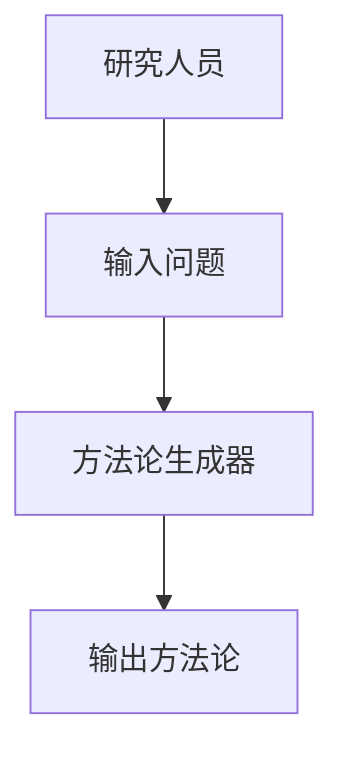
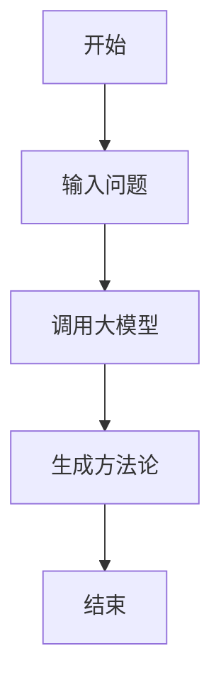
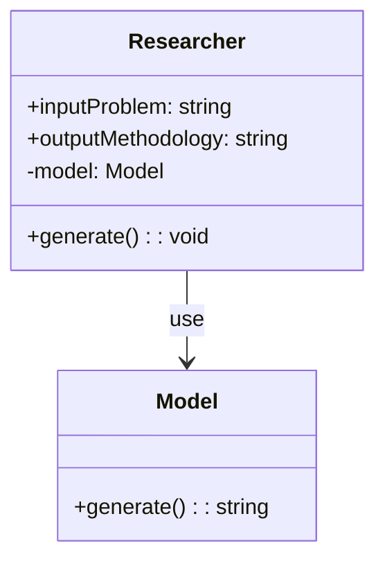
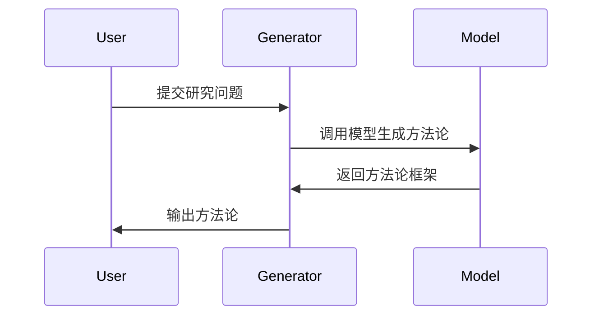

                 


# 开发基于大模型的金融研究方法论生成器

## 关键词：大模型、金融研究、方法论生成器、算法原理、系统架构、项目实战

## 摘要：本文详细探讨了开发基于大模型的金融研究方法论生成器的方法。从问题背景到系统架构，从算法原理到项目实战，全面分析了该生成器的开发过程。通过具体案例分析，展示了其在金融研究中的应用价值，为读者提供了系统的开发指导。

---

# 第一部分: 开发基于大模型的金融研究方法论生成器概述

## 第1章: 问题背景与目标

### 1.1 问题背景
#### 1.1.1 传统金融研究方法的局限性
传统的金融研究方法依赖于人工分析和经验判断，存在效率低、成本高、主观性强等问题。研究人员需要花费大量时间收集数据、分析模型和验证假设，且结果可能受个人经验的限制。

#### 1.1.2 大模型在金融研究中的潜力
大模型（如GPT-3、GPT-4等）具有强大的自然语言处理能力和模式识别能力，能够快速生成文本、识别数据中的模式，并辅助研究人员制定研究计划。通过结合大模型，金融研究可以变得更加高效和智能化。

#### 1.1.3 方法论生成器的必要性
方法论生成器是一种工具，它利用大模型的能力，帮助研究人员自动生成金融研究的方法论框架。这种工具可以显著提高研究效率，降低研究成本，并为研究人员提供新的视角和思路。

### 1.2 问题描述
#### 1.2.1 金融研究中的常见问题
金融研究涉及复杂的数据分析和模型构建，研究人员常常面临以下问题：
- 数据量大且复杂，难以快速找到研究方向。
- 方法选择多样，但研究人员可能缺乏相关知识。
- 研究过程繁琐，需要反复调整模型参数。

#### 1.2.2 现有工具的不足
现有的金融研究工具多为数据分析软件（如Excel、Python库等），它们虽然功能强大，但缺乏智能化的辅助功能。研究人员仍需手动完成数据清洗、模型选择和结果解读等步骤。

#### 1.2.3 方法论生成器的目标
方法论生成器的目标是通过大模型的能力，为研究人员提供一个智能化的工具，帮助他们快速生成研究方法论框架，包括研究目标、数据收集方法、模型选择和结果解读等。

### 1.3 方法论生成器的核心价值
#### 1.3.1 提高研究效率
方法论生成器能够快速生成研究框架，帮助研究人员节省时间，专注于数据分析和结果解读。

#### 1.3.2 降低研究成本
通过自动化生成方法论，可以减少人工劳动，降低研究的总体成本。

#### 1.3.3 提供个性化研究方案
大模型可以根据具体问题生成个性化的研究方案，帮助研究人员找到最适合的分析方法。

### 1.4 本章小结
本章介绍了金融研究中传统方法的局限性，以及大模型在金融研究中的潜力。提出了方法论生成器的目标和价值，为后续的开发工作奠定了基础。

---

## 第2章: 核心概念与联系

### 2.1 方法论生成器的核心原理
#### 2.1.1 大模型的训练与调优
大模型需要经过大量的金融相关数据训练，包括学术论文、研究报告和金融新闻等。通过监督学习和微调，使模型能够理解金融领域的术语和概念。

#### 2.1.2 方法论生成的流程
方法论生成的流程包括以下步骤：
1. **输入问题**：用户输入金融研究的具体问题或目标。
2. **模型调用**：生成器调用大模型，根据输入生成方法论框架。
3. **结果输出**：生成器将方法论框架输出给用户。

#### 2.1.3 生成器的输入与输出
- **输入**：用户输入的金融研究问题或目标。
- **输出**：生成的方法论框架，包括研究目标、数据收集方法、模型选择和结果解读等。

### 2.2 核心概念对比分析
#### 2.2.1 方法论生成器与传统工具的对比
| **对比维度**       | **传统工具**                     | **方法论生成器**                |
|--------------------|-----------------------------------|---------------------------------|
| **功能**           | 数据分析、建模                   | 自动生成研究方法论              |
| **智能化程度**     | 低，依赖人工操作                 | 高，自动化生成                   |
| **适用范围**       | 有限，需要手动调整               | 广泛，适用于多种金融问题         |

#### 2.2.2 不同模型的性能对比
| **模型名称** | **参数量** | **生成效果**       | **推理速度** |
|-------------|------------|--------------------|-------------|
| GPT-3       | 175B       | 较好，但需要微调   | 较慢         |
| GPT-4       | 12,000B    | 更准确，效果更优   | 较快         |
| LLaMA       | 7B         | 适合轻量级应用     | 快           |

#### 2.2.3 方法论生成器的优缺点分析
- **优点**：
  - 提高研究效率。
  - 提供个性化方法论。
  - 降低研究成本。
- **缺点**：
  - 生成的框架可能不够精细，需要人工调整。
  - 对模型的训练和调优要求较高。

### 2.3 实体关系图


### 2.4 本章小结
本章详细讲解了方法论生成器的核心原理，对比了传统工具与生成器的优缺点，并通过实体关系图展示了系统的整体架构。

---

## 第3章: 方法论生成器的算法原理

### 3.1 算法流程图


### 3.2 算法实现
```python
def generate_methodology(input_problem):
    # 加载预训练好的大模型
    model = load_pretrained_model()
    # 生成方法论
    output = model.generate(input_problem)
    return output
```

### 3.3 数学模型
#### 3.3.1 概率分布模型
大模型的生成过程基于概率分布，给定输入序列，模型预测下一个词的概率分布：
$$ P(y|x) = \frac{y}{\sum_{k=1}^n y_k} $$
其中，\( x \) 是输入序列，\( y \) 是生成的下一个词的概率。

#### 3.3.2 损失函数
模型的损失函数通常采用交叉熵损失：
$$ \mathcal{L} = -\sum_{i=1}^n y_i \log p(y_i) $$
其中，\( y_i \) 是真实标签的概率，\( p(y_i) \) 是模型预测的概率。

### 3.4 本章小结
本章详细讲解了方法论生成器的算法流程，包括算法实现和数学模型。通过具体的代码和公式，展示了生成器的核心原理。

---

## 第4章: 系统分析与架构设计

### 4.1 项目场景描述
金融研究方法论生成器将帮助研究人员快速生成研究框架，适用于学术研究、金融分析和投资决策等多种场景。

### 4.2 系统功能设计
#### 4.2.1 领域模型


#### 4.2.2 系统架构


#### 4.2.3 接口设计
- **输入接口**：接受用户的金融研究问题。
- **输出接口**：返回生成的方法论框架。

#### 4.2.4 交互流程图


### 4.3 本章小结
本章从系统架构的角度，详细分析了方法论生成器的实现方案，包括领域模型、系统架构和交互流程图。

---

## 第5章: 项目实战

### 5.1 环境安装
- **Python**：3.8+
- **大模型库**：如Hugging Face的Transformers库
- **依赖库**：安装必要的NLP库（如Pandas、NumPy等）

### 5.2 核心代码实现
```python
from transformers import AutoModelForCausalLM, AutoTokenizer

# 加载预训练模型
model_name = "gpt2-large"
model = AutoModelForCausalLM.from_pretrained(model_name)
tokenizer = AutoTokenizer.from_pretrained(model_name)

def generate_methodology(input_problem):
    inputs = tokenizer.encode(input_problem, return_tensors="pt")
    outputs = model.generate(inputs, max_length=500, do_sample=True)
    result = tokenizer.decode(outputs[0], skip_special_tokens=True)
    return result

# 使用示例
input_problem = "分析股票价格波动的原因"
print(generate_methodology(input_problem))
```

### 5.3 代码解读与分析
- **模型加载**：使用Hugging Face库加载预训练的大模型。
- **输入处理**：将用户输入的问题编码为模型可以处理的格式。
- **生成方法论**：调用模型生成方法论框架。
- **结果输出**：将生成的结果解码为字符串并返回。

### 5.4 实际案例分析
假设用户输入的问题是“分析某公司财务状况”，生成器可能会生成以下方法论：
1. **研究目标**：分析该公司过去三年的财务状况，预测未来一年的财务趋势。
2. **数据收集**：收集过去三年的财务报表、行业报告和市场数据。
3. **模型选择**：使用时间序列分析模型（如ARIMA）进行预测。
4. **结果解读**：根据模型预测结果，制定投资策略。

### 5.5 项目小结
本章通过实际案例分析，展示了方法论生成器的应用场景和具体实现。通过代码实现，验证了生成器的有效性和可行性。

---

## 第6章: 最佳实践与总结

### 6.1 最佳实践
- **数据处理**：确保输入数据的高质量和多样性。
- **模型选择**：根据具体任务选择合适的模型和参数。
- **性能优化**：通过并行计算和优化算法提升生成效率。

### 6.2 全文总结
本文详细探讨了开发基于大模型的金融研究方法论生成器的方法，从问题背景到系统架构，从算法原理到项目实战，全面分析了生成器的开发过程。通过实际案例分析，展示了其在金融研究中的应用价值。

### 6.3 注意事项
- 生成器的结果可能不够精细，需要人工调整。
- 模型的训练和调优需要大量的计算资源。

### 6.4 拓展阅读
- 《大模型在金融领域的应用》
- 《基于生成模型的金融数据分析》

---

## 作者：AI天才研究院/AI Genius Institute & 禅与计算机程序设计艺术 /Zen And The Art of Computer Programming

