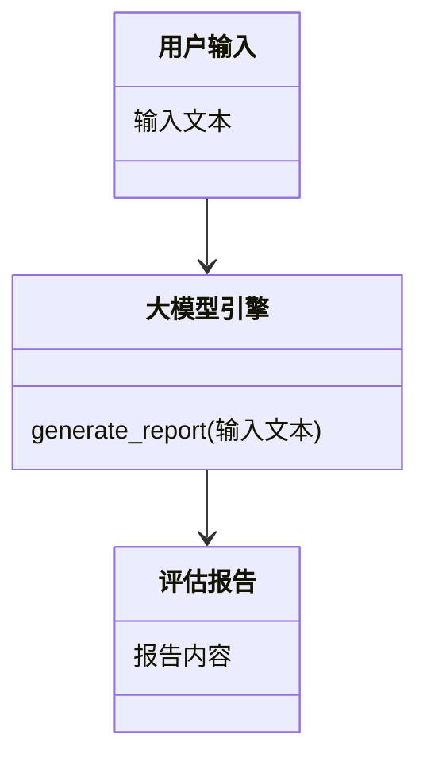
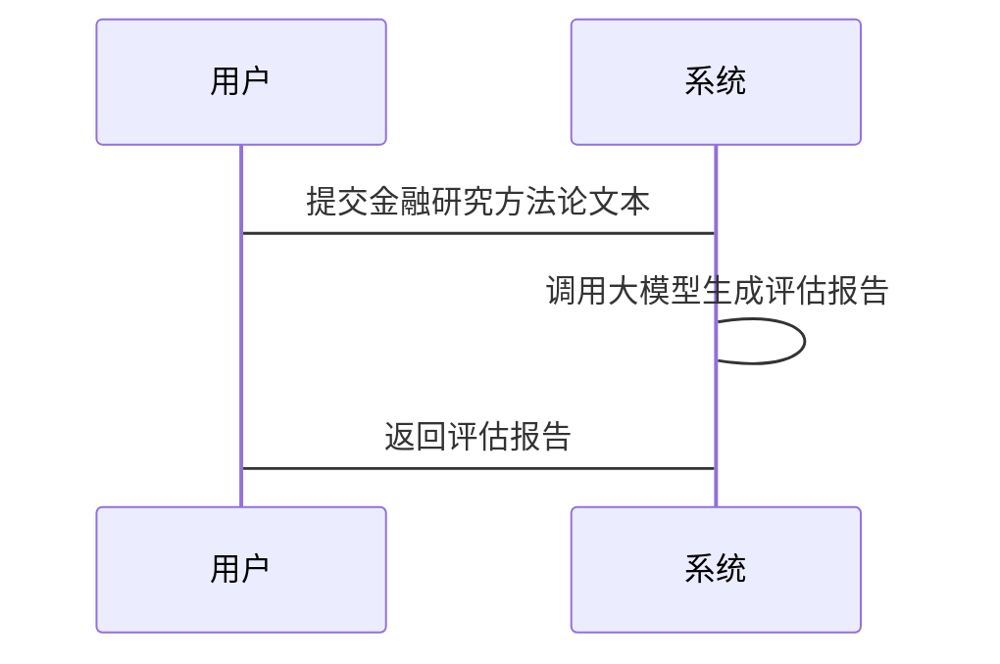

                 


# 开发基于大模型的金融研究方法论评估生成器

> 关键词：大模型，金融研究，方法论评估，生成器，算法原理

> 摘要：本文将详细介绍如何开发一个基于大模型的金融研究方法论评估生成器。通过分析大模型在金融领域的应用潜力，结合金融研究方法论的核心要素，提出了一种基于大模型的评估生成方法。本文从背景与概述、核心概念与联系、算法原理、系统架构设计、项目实战、总结与展望以及附录等方面进行详细阐述，帮助读者理解如何利用大模型技术实现金融研究方法论的智能化评估。

---

# 第一章: 开发基于大模型的金融研究方法论评估生成器概述

## 1.1 问题背景与目标

### 1.1.1 金融研究方法论的现状与挑战
金融研究方法论是金融领域研究的核心工具，但传统的评估方法存在主观性高、效率低下、难以量化等问题。随着大模型技术的快速发展，如何利用大模型提升金融研究方法论的评估效率和准确性成为一个重要课题。

### 1.1.2 大模型在金融领域的应用潜力
大模型具有强大的自然语言处理和生成能力，可以用于金融领域的多种任务，如金融文本分析、风险评估、投资策略生成等。在金融研究方法论评估中，大模型可以提供自动化、智能化的评估工具。

### 1.1.3 本课题的目标与意义
本课题的目标是开发一个基于大模型的金融研究方法论评估生成器，通过自动化评估生成，提高金融研究方法论的评估效率和准确性。其意义在于推动金融研究的智能化和高效化，为金融研究提供新的工具和方法。

## 1.2 核心概念与问题描述

### 1.2.1 金融研究方法论的基本概念
金融研究方法论是研究金融市场、金融现象和金融行为的系统方法。常见的方法包括定量分析、定性分析、案例分析等。

### 1.2.2 大模型在方法论评估中的作用
大模型可以通过自然语言处理和生成技术，对金融研究方法论进行自动化评估，生成评估报告和改进建议。

### 1.2.3 问题的边界与外延
本课题的边界包括金融研究方法论的评估生成，不涉及具体的投资决策或交易执行。其外延包括大模型在金融领域的其他应用，如金融文本生成和风险评估。

## 1.3 核心要素与系统架构

### 1.3.1 方法论评估的核心要素
- 输入：金融研究方法论文本
- 输出：评估报告和改进建议
- 评估指标：逻辑性、创新性、实用性等

### 1.3.2 系统架构的核心要素
- 用户界面：输入方法论文本，输出评估报告
- 大模型引擎：负责生成评估报告
- 评估指标库：存储评估标准和权重

### 1.3.3 评估生成器的功能模块划分
- 文本预处理模块：清洗和格式化输入文本
- 模型生成模块：调用大模型生成评估报告
- 报告后处理模块：优化和格式化输出报告

## 1.4 本章小结
本章从背景、核心概念和系统架构三个方面介绍了开发基于大模型的金融研究方法论评估生成器的基本情况，为后续章节的深入分析奠定了基础。

---

# 第二章: 方法论评估生成器的核心原理

## 2.1 核心概念与原理

### 2.1.1 方法论评估的数学模型
评估生成器的数学模型包括输入表示、评估指标计算和生成模型。通过多目标损失函数优化生成模型，使其能够同时满足多个评估指标的要求。

$$\text{损失函数} = \lambda_1 L_1 + \lambda_2 L_2 + \lambda_3 L_3$$

其中，$L_1, L_2, L_3$分别为不同的评估指标损失，$\lambda$为权重系数。

### 2.1.2 大模型在生成评估中的角色
大模型通过自然语言处理技术，将输入的金融研究方法论文本转化为评估报告。生成过程包括文本编码、评估指标计算和生成报告。

### 2.1.3 方法论评估的指标体系
评估指标包括逻辑性、创新性、实用性等，每个指标都有对应的权重和计算方法。

---

## 2.2 核心概念对比分析

### 2.2.1 方法论评估与传统评估方法的对比
传统的评估方法依赖人工评分，主观性强，效率低。而基于大模型的评估生成器可以实现自动化评估，提高效率和准确性。

### 2.2.2 大模型生成与人工评估的对比
大模型生成评估报告具有速度快、一致性好，但可能缺乏深度理解和创造性。人工评估更具深度，但效率低。

### 2.2.3 不同大模型在评估生成中的表现对比
不同的大模型在生成评估报告中的表现可能因训练数据和模型结构而异，需要根据具体任务选择合适的模型。

---

## 2.3 实体关系图与流程图

### 2.3.1 方法论评估生成器的实体关系图


---

## 2.4 本章小结
本章详细介绍了方法论评估生成器的核心原理和概念，通过对比分析和流程图展示了系统的工作流程，为后续章节的实现提供了理论基础。

---

# 第三章: 基于大模型的评估生成算法

## 3.1 算法原理概述

### 3.1.1 基于大模型的文本生成算法
生成评估报告的算法基于Transformer架构，采用自注意力机制和解码器结构，生成高质量的文本。

### 3.1.2 评估生成的数学模型
评估生成模型通过多目标损失函数优化，同时考虑多个评估指标。

### 3.1.3 算法的优化与改进
通过调整超参数和引入领域知识，优化生成模型的性能。

---

## 3.2 算法流程图


---

## 3.3 算法实现代码

```python
def generate_assessment(methodology_input):
    processed_input = prepr
    # 处理输入
    processed_input = prepr
    # 调用大模型生成评估报告
    assessment_report = model.generate(processed_input)
    # 返回结果
    return assessment_report
```

---

## 3.4 本章小结
本章详细讲解了基于大模型的评估生成算法，通过流程图和代码示例展示了算法的实现过程，为后续章节的系统设计提供了技术基础。

---

# 第四章: 系统分析与架构设计方案

## 4.1 系统功能设计

### 4.1.1 领域模型设计


### 4.1.2 系统架构设计


### 4.1.3 接口设计
系统提供API接口，支持多种输入格式和输出格式，方便与其他系统集成。

### 4.1.4 交互流程


---

## 4.2 本章小结
本章通过系统分析和架构设计，展示了开发基于大模型的金融研究方法论评估生成器的系统结构和实现方案。

---

# 第五章: 项目实战

## 5.1 环境搭建

### 5.1.1 安装必要的依赖
安装Python、TensorFlow、大模型框架等。

### 5.1.2 下载大模型预训练权重
选择合适的大模型，并下载其预训练权重。

---

## 5.2 系统核心实现

### 5.2.1 文本预处理
编写预处理代码，清洗和格式化输入文本。

### 5.2.2 模型调用
调用大模型生成评估报告，处理生成结果。

### 5.2.3 报告后处理
优化生成的评估报告，确保格式和内容符合要求。

---

## 5.3 代码实现与解读

### 5.3.1 文本预处理代码
```python
def preprocess(text):
    # 文本清洗和格式化
    return processed_text
```

### 5.3.2 模型调用代码
```python
def generate_assessment(methodology_input):
    processed_input = preprocess(methodology_input)
    assessment_report = model.generate(processed_input)
    return assessment_report
```

### 5.3.3 报告后处理代码
```python
def postprocess(report):
    # 格式化和优化报告
    return formatted_report
```

---

## 5.4 实际案例分析

### 5.4.1 案例输入
输入一个金融研究方法论文本，例如：“使用回归分析法研究股票价格的影响因素。”

### 5.4.2 模型生成
模型生成评估报告，例如：“该方法论在逻辑性上较为严谨，但创新性不足。”

### 5.4.3 评估报告
最终输出评估报告，包括改进建议和其他相关信息。

---

## 5.5 本章小结
本章通过实际案例分析，展示了如何利用大模型生成金融研究方法论的评估报告，帮助读者理解系统的实际应用。

---

# 第六章: 总结与展望

## 6.1 本章总结
本文详细介绍了开发基于大模型的金融研究方法论评估生成器的背景、核心概念、算法原理、系统架构设计和实现方案。通过实际案例分析，展示了系统的实际应用价值。

## 6.2 未来展望
未来可以进一步优化大模型的生成能力，引入更多评估指标和领域知识，提升评估的准确性和深度。同时，可以探索与其他金融工具的集成，拓展应用场景。

---

# 附录: 参考资料与技术细节

## 附录A: 数学公式

### 评估生成模型的损失函数
$$L = \lambda_1 L_1 + \lambda_2 L_2 + \lambda_3 L_3$$

其中，$L_1$、$L_2$、$L_3$分别为逻辑性、创新性和实用性的损失函数，$\lambda$为权重系数。

---

## 附录B: 系统接口文档

### 输入接口
```json
{
    "input": "金融研究方法论文本",
    "parameters": {
        "temperature": 0.7
    }
}
```

### 输出接口
```json
{
    "assessment": "评估报告内容",
    "improvement建议": "改进建议"
}
```

---

## 附录C: 大模型API调用示例

```python
import requests

url = "http://localhost:5000/api/generate"
data = {
    "input": "使用回归分析法研究股票价格的影响因素。",
    "parameters": {
        "temperature": 0.7
    }
}
response = requests.post(url, json=data)
print(response.json())
```

---

# 作者：AI天才研究院/AI Genius Institute & 禅与计算机程序设计艺术 /Zen And The Art of Computer Programming

---

以上是《开发基于大模型的金融研究方法论评估生成器》的目录大纲，涵盖了从背景介绍到项目实战的各个方面，内容详实且结构清晰。

