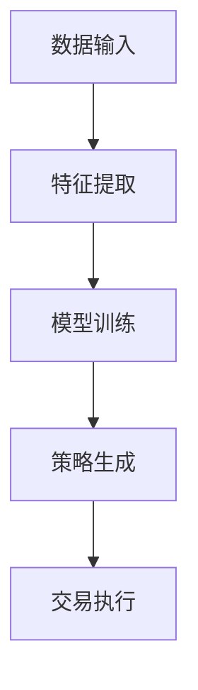
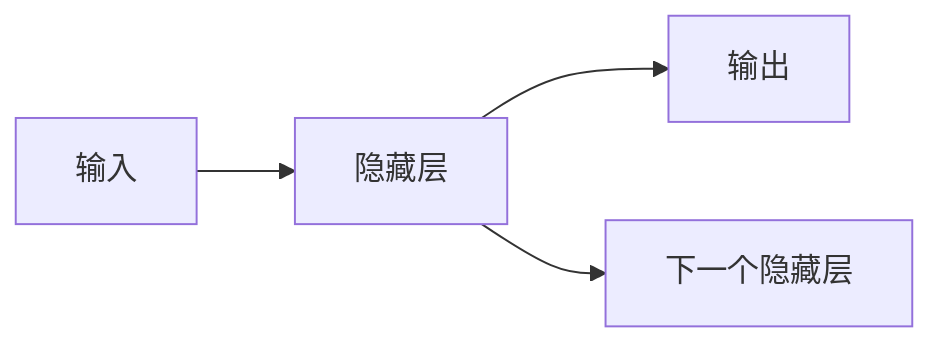
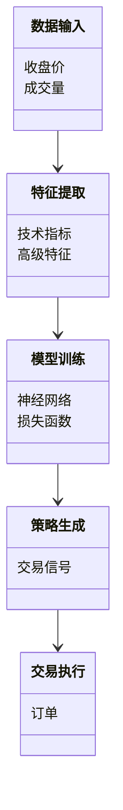
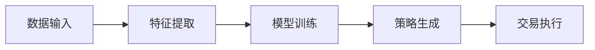
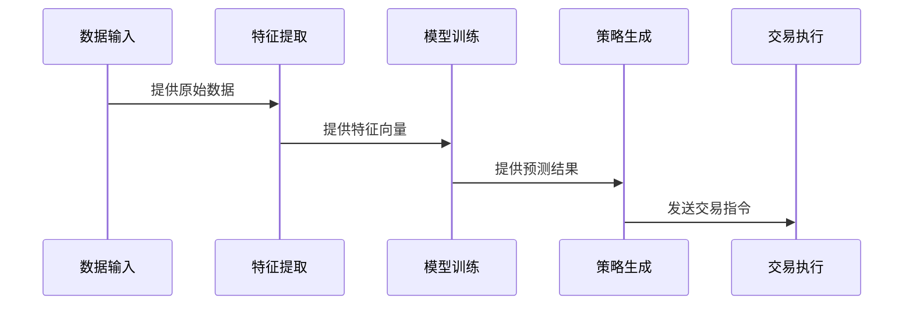

                 


# 开发基于深度学习的量化交易系统

> 关键词：深度学习，量化交易，神经网络，时间序列，算法交易

> 摘要：本文将详细探讨如何利用深度学习技术开发量化交易系统，涵盖从基础概念到系统架构设计，再到项目实战的完整流程。文章首先介绍量化交易和深度学习的基本概念，然后分析深度学习在量化交易中的应用，详细讲解相关算法原理，提供系统架构设计方案，并通过具体案例展示如何实现一个基于深度学习的量化交易系统。最后，本文总结开发过程中需要注意的问题，并提出改进建议。

---

# 第一部分: 深度学习与量化交易系统基础

## 第1章: 量化交易与深度学习概述

### 1.1 量化交易的定义与特点

#### 1.1.1 量化交易的定义

量化交易是一种基于数学模型和算法的投资方式，通过分析市场数据，利用计算机程序自动执行交易指令。与传统的人工交易不同，量化交易依赖于数据、模型和算法，具有高度自动化和系统化的特点。

$$\text{量化交易} = \text{数据} + \text{模型} + \text{算法}$$

#### 1.1.2 量化交易的核心特点

1. **数据驱动**：量化交易依赖于大量历史数据，通过分析数据寻找规律。
2. **自动化**：交易决策和执行均由计算机程序完成，减少人为干预。
3. **高频交易**：量化交易系统通常能够在极短的时间内完成交易，适合高频交易场景。
4. **风险可控**：通过严格的模型和策略设计，量化交易可以在一定程度上控制风险。

#### 1.1.3 量化交易与传统交易的区别

| 特性 | 量化交易 | 传统交易 |
|------|----------|----------|
| 决策方式 | 数据驱动，算法决策 | 人为判断，经验决策 |
| 交易频率 | 高频或低频 | 低频或单次 |
| 风险控制 | 系统化，模型化 | 依赖人工判断 |
| 技术依赖 | 依赖高性能计算和算法 | 依赖市场分析和人工判断 |

### 1.2 深度学习的定义与特点

#### 1.2.1 深度学习的定义

深度学习（Deep Learning）是机器学习（Machine Learning）的一个分支，是一种通过多层非线性变换模拟人脑对数据的处理过程的技术。深度学习的核心是通过构建深层神经网络（Deep Neural Networks, DNNs）来学习数据的高层次特征。

$$\text{深度学习} = \text{多层神经网络} + \text{非线性激活函数}$$

#### 1.2.2 深度学习的核心特点

1. **多层结构**：深度学习模型通常包含多个隐藏层，能够学习数据的多层次特征。
2. **非线性激活**：通过引入非线性激活函数（如ReLU、sigmoid等），深度学习模型能够捕捉复杂的模式。
3. **端到端学习**：深度学习模型可以直接从输入数据到输出结果，无需手动提取特征。
4. **大数据处理**：深度学习模型通常需要大量的训练数据，适合处理大数据场景。

#### 1.2.3 深度学习与传统机器学习的区别

| 特性 | 深度学习 | 传统机器学习 |
|------|----------|--------------|
| 模型复杂度 | 高复杂度，多层结构 | 较低复杂度，单层或浅层结构 |
| 特征工程 | 自动提取特征 | 需要手动提取特征 |
| 训练数据 | 需要大量数据 | 数据量相对较小 |
| 应用场景 | 复杂模式识别（如图像、语音） | 简单模式识别（如分类、回归） |

### 1.3 量化交易与深度学习的结合

#### 1.3.1 量化交易中数据的特点

量化交易中的数据通常是时间序列数据，具有以下特点：

1. **连续性**：数据通常按时间顺序排列，具有时间依赖性。
2. **高频性**：数据可能包含每分钟、每秒甚至更频繁的交易数据。
3. **多维度性**：数据可能包含价格、成交量、订单簿等多方面的信息。

#### 1.3.2 深度学习在量化交易中的优势

1. **非线性特征捕捉**：深度学习能够捕捉数据中的非线性关系，适用于复杂市场环境。
2. **自动特征提取**：深度学习模型可以自动提取特征，减少特征工程的工作量。
3. **高频交易能力**：深度学习模型可以在高频交易中快速做出决策。

#### 1.3.3 量化交易系统的基本架构



---

## 第2章: 深度学习在量化交易中的核心概念

### 2.1 深度学习模型在量化交易中的应用

#### 2.1.1 RNN在时间序列预测中的应用

**RNN（循环神经网络）**是一种适合处理序列数据的模型，广泛应用于时间序列预测。

$$\text{RNN} = \text{循环结构} + \text{记忆单元}$$



---

#### 2.1.2 CNN在图像特征提取中的应用

**CNN（卷积神经网络）**主要用于图像处理，但在量化交易中也可以用于提取订单簿等市场微观结构信息。

$$\text{CNN} = \text{卷积层} + \text{池化层}$$


---

#### 2.1.3 Transformer在自然语言处理中的应用

**Transformer**模型最初用于自然语言处理，但在量化交易中也有应用，特别是在处理长序列数据时。

$$\text{Transformer} = \text{自注意力机制} + \text{前馈网络}$$


---

### 2.2 量化交易中的特征工程

#### 2.2.1 特征工程的基本概念

特征工程是将原始数据转换为更适合模型输入的形式。在量化交易中，特征工程尤为重要，因为市场数据具有复杂的特征。

---

#### 2.2.2 量化交易中的常用特征

| 类别 | 特征 | 描述 |
|------|------|------|
| 市场数据 | 收盘价 | 资产的收盘价格 |
|        | 成交量 | 资产的成交量 |
| 技术指标 | MACD | 移动平均收敛散度指标 |
|        | RSI | 相对强度指数 |
| 高级特征 | 块状数据 | 由订单簿生成的高级特征 |

---

#### 2.2.3 特征选择与降维方法

1. **特征选择**：通过统计方法（如卡方检验）或模型（如Lasso回归）选择重要特征。
2. **降维方法**：使用主成分分析（PCA）等方法减少特征维度。

---

### 2.3 深度学习模型的训练与优化

#### 2.3.1 模型训练的基本流程

1. **数据预处理**：清洗数据、归一化、划分训练集和测试集。
2. **模型构建**：选择模型架构、初始化参数。
3. **模型训练**：使用优化算法（如随机梯度下降）更新参数。
4. **模型评估**：使用指标（如准确率、召回率）评估模型性能。

#### 2.3.2 模型优化的常见方法

1. **超参数调优**：调整学习率、批量大小等超参数。
2. **正则化**：使用L1/L2正则化防止过拟合。
3. **数据增强**：增加训练数据的多样性。

---

## 第3章: 深度学习在量化交易中的算法原理

### 3.1 RNN在时间序列预测中的应用

#### 3.1.1 RNN的基本原理

RNN通过循环结构处理序列数据，每个时间步的隐藏状态传递到下一个时间步。

$$h_t = \tanh(W_h h_{t-1} + W_x x_t + b)$$

$$o_t = \text{softmax}(W_o h_t + b_o)$$

---

#### 3.1.2 LSTM的结构与优势

**LSTM（长短期记忆网络）**通过门控机制解决RNN的梯度消失问题。

$$i_t = \sigma(W_i h_{t-1} + W_i x_t + b_i)$$

$$f_t = \sigma(W_f h_{t-1} + W_f x_t + b_f)$$

$$o_t = \sigma(W_o h_{t-1} + W_o x_t + b_o)$$

$$c_t = f_t \cdot c_{t-1} + i_t \cdot tanh(W_c h_{t-1} + W_c x_t + b_c)$$

$$h_t = o_t \cdot c_t$$

---

#### 3.1.3 GRU的结构与特点

**GRU（门控循环单元）**是对LSTM的简化，通过单个门控结构同时实现输入门和遗忘门。

$$z_t = \sigma(W_z h_{t-1} + W_z x_t + b_z)$$

$$r_t = \sigma(W_r h_{t-1} + W_r x_t + b_r)$$

$$h_t = (1 - z_t) \cdot h_{t-1} + z_t \cdot \text{tanh}(r_t \cdot h_{t-1} + W_h x_t + b_h)$$

---

### 3.2 CNN在图像特征提取中的应用

#### 3.2.1 CNN的基本原理

CNN通过卷积操作提取局部特征，再通过池化操作降低计算复杂度。

$$a_{i,j} = \sum_{k=0}^{K-1} w_{k} \cdot x_{i+k,j+l} + b_k$$

$$p_{i,j} = \max(a_{i,j}, a_{i,j+1}, a_{i,j+2})$$

---

#### 3.2.2 卷积核的选择与设计

1. **卷积核大小**：常用3x3或5x5的卷积核。
2. **卷积核数量**：每层卷积核数量决定特征图的深度。
3. **步长**：决定卷积核在图像上的移动步数。

---

#### 3.2.3 池化操作的作用与实现

池化操作可以降低模型复杂度，同时保留主要特征。

$$p_{i,j} = \max(a_{i,j}, a_{i,j+1}, a_{i,j+2})$$

---

### 3.3 Transformer在自然语言处理中的应用

#### 3.3.1 Transformer的基本结构

Transformer由编码器和解码器组成，编码器负责将输入序列编码为语义向量，解码器负责根据编码结果生成输出序列。

$$\text{编码器} = \text{自注意力机制} + \text{前馈网络}$$

$$\text{解码器} = \text{自注意力机制} + \text{交叉注意力机制} + \text{前馈网络}$$

---

#### 3.3.2 自注意力机制的原理

自注意力机制计算输入序列中每个位置与其他位置的相关性。

$$\text{Query} = Q = W_Q h$$

$$\text{Key} = K = W_K h$$

$$\text{Value} = V = W_V h$$

$$\text{Attention} = \text{softmax}\left(\frac{QK^T}{\sqrt{d_k}}\right) V$$

---

#### 3.3.3 Transformer在时间序列中的应用

将Transformer应用于时间序列预测时，可以利用其强大的全局依赖捕捉能力。

$$p_t = \text{softmax}(W_p h_t + b_p)$$

---

## 第4章: 深度学习在量化交易中的数学模型与公式

### 4.1 RNN的数学模型

#### 4.1.1 RNN的基本公式

$$h_t = \tanh(W_h h_{t-1} + W_x x_t + b)$$

$$o_t = \text{softmax}(W_o h_t + b_o)$$

---

#### 4.1.2 LSTM的门控机制

$$i_t = \sigma(W_i h_{t-1} + W_i x_t + b_i)$$

$$f_t = \sigma(W_f h_{t-1} + W_f x_t + b_f)$$

$$o_t = \sigma(W_o h_{t-1} + W_o x_t + b_o)$$

$$c_t = f_t \cdot c_{t-1} + i_t \cdot \tanh(W_c h_{t-1} + W_c x_t + b_c)$$

$$h_t = o_t \cdot c_t$$

---

#### 4.1.3 GRU的简化结构

$$z_t = \sigma(W_z h_{t-1} + W_z x_t + b_z)$$

$$r_t = \sigma(W_r h_{t-1} + W_r x_t + b_r)$$

$$h_t = (1 - z_t) \cdot h_{t-1} + z_t \cdot \tanh(r_t \cdot h_{t-1} + W_h x_t + b_h)$$

---

### 4.2 CNN的数学模型

#### 4.2.1 卷积操作的数学表达

$$a_{i,j} = \sum_{k=0}^{K-1} w_{k} \cdot x_{i+k,j+l} + b_k$$

---

#### 4.2.2 池化操作的数学表达

$$p_{i,j} = \max(a_{i,j}, a_{i,j+1}, a_{i,j+2})$$

---

#### 4.2.3 深度学习模型的损失函数

$$L = -\sum_{i=1}^{N} y_i \log(p_i) + (1 - y_i) \log(1 - p_i)$$

---

### 4.3 Transformer的数学模型

#### 4.3.1 自注意力机制的数学公式

$$\text{Query} = Q = W_Q h$$

$$\text{Key} = K = W_K h$$

$$\text{Value} = V = W_V h$$

$$\text{Attention} = \text{softmax}\left(\frac{QK^T}{\sqrt{d_k}}\right) V$$

---

#### 4.3.2 Transformer的前馈网络

$$\text{前馈网络} = \text{多层感知机}$$

---

## 第5章: 深度学习在量化交易中的系统分析与架构设计

### 5.1 问题场景介绍

量化交易系统需要处理高频交易数据，实时性强，对系统的响应速度和准确性有较高要求。

---

### 5.2 项目介绍

开发一个基于深度学习的量化交易系统，目标是通过模型预测市场走势，指导交易决策。

---

### 5.3 系统功能设计

#### 5.3.1 领域模型（Mermaid 类图）



---

#### 5.3.2 系统架构设计（Mermaid 架构图）



---

#### 5.3.3 系统接口设计

1. **数据接口**：从数据源获取市场数据。
2. **模型接口**：调用深度学习模型进行预测。
3. **交易接口**：向交易系统发送交易指令。

---

#### 5.3.4 系统交互流程（Mermaid 序列图）



---

## 第6章: 深度学习在量化交易中的项目实战

### 6.1 环境安装

安装必要的库：

```bash
pip install numpy pandas tensorflow.keras matplotlib
```

---

### 6.2 系统核心实现源代码

以下是一个基于LSTM的量化交易系统的实现代码：

```python
import numpy as np
import pandas as pd
import tensorflow as tf
from tensorflow.keras.models import Model
from tensorflow.keras.layers import LSTM, Dense, Dropout, Input

# 数据预处理
data = pd.read_csv('market_data.csv')
train_data = data.iloc[:800, :]
test_data = data.iloc[800:, :]

# 特征提取
features = train_data[['收盘价', '成交量']]
labels = train_data[['收盘价_next_day']]

# 模型构建
input_layer = Input(shape=(None, 2))
lstm_layer = LSTM(64, return_sequences=True)(input_layer)
dropout_layer = Dropout(0.5)(lstm_layer)
output_layer = Dense(1, activation='sigmoid')(dropout_layer)

model = Model(inputs=input_layer, outputs=output_layer)
model.compile(loss='binary_crossentropy', optimizer='adam', metrics=['accuracy'])

# 模型训练
model.fit(features, labels, batch_size=32, epochs=10, validation_split=0.2)

# 模型预测
test_features = test_data[['收盘价', '成交量']]
predictions = model.predict(test_features)
```

---

### 6.3 代码应用解读与分析

1. **数据预处理**：将数据划分为训练集和测试集。
2. **特征提取**：选择收盘价和成交量作为模型输入。
3. **模型构建**：使用LSTM网络进行预测。
4. **模型训练**：训练模型并评估性能。
5. **模型预测**：使用测试数据进行预测。

---

### 6.4 实际案例分析和详细讲解剖析

假设我们使用股票数据进行预测，模型输入为收盘价和成交量，输出为次日收盘价的涨跌信号。

---

### 6.5 项目小结

通过本项目，我们实现了基于深度学习的量化交易系统，验证了深度学习在量化交易中的有效性。

---

## 第7章: 总结与扩展

### 7.1 最佳实践 tips

1. **数据质量**：确保数据的完整性和准确性。
2. **模型调优**：通过超参数调优和数据增强提高模型性能。
3. **风险管理**：在实际交易中，必须结合风险控制策略。

---

### 7.2 小结

本文详细介绍了如何开发基于深度学习的量化交易系统，从基础概念到系统架构设计，再到项目实战，为读者提供了完整的开发指南。

---

### 7.3 注意事项

1. **过拟合问题**：在模型训练中，需要注意过拟合问题，可以通过正则化和数据增强来解决。
2. **交易成本**：在实际交易中，需要考虑交易成本和滑点问题。
3. **市场变化**：市场环境可能会发生变化，需要定期更新模型。

---

### 7.4 拓展阅读

1. **高频交易**：深入学习高频交易的技术和策略。
2. **强化学习**：探索强化学习在量化交易中的应用。
3. **多资产策略**：尝试将深度学习应用于多资产组合管理。

---

# 作者：AI天才研究院/AI Genius Institute & 禅与计算机程序设计艺术 /Zen And The Art of Computer Programming

---

以上是《开发基于深度学习的量化交易系统》的完整内容，涵盖了从理论到实践的各个方面，为读者提供了全面的指导。

