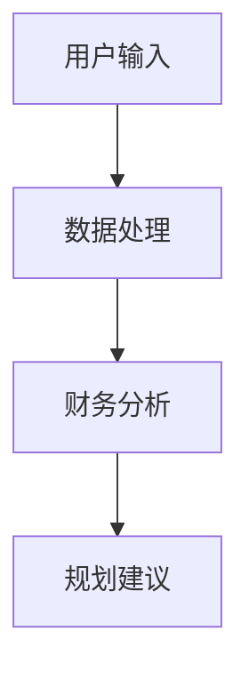
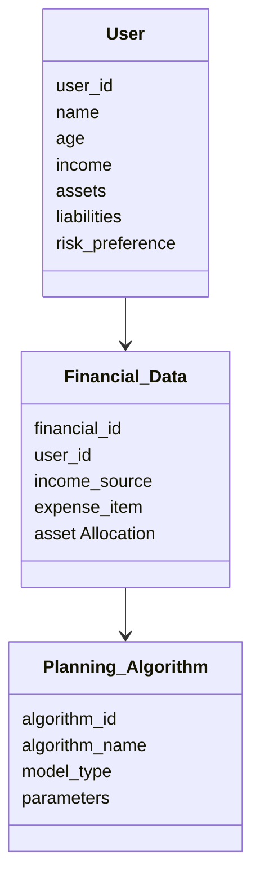
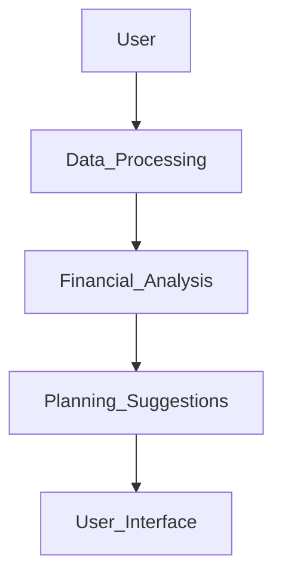

                 


# 开发智能化的个人退休规划助手

## 关键词

- 智能化退休规划
- 人工智能
- 个人财务规划
- 算法推荐
- 系统架构设计

## 摘要

随着人口老龄化加剧和人们对财务安全需求的增加，智能化个人退休规划助手成为解决传统退休规划问题的重要工具。本文详细分析了开发智能化退休规划助手的背景、核心概念、算法原理、系统架构设计以及项目实战，旨在为开发者和用户提供一个系统化的解决方案。文章通过详细的理论分析和实践指导，帮助读者理解如何利用人工智能技术优化退休规划流程，实现个性化的财务管理和风险控制。

---

## 正文

### 第一部分: 智能化个人退休规划助手的背景与需求

#### 第1章: 个人退休规划的现状与挑战

##### 1.1 退休规划的重要性与现状

- **1.1.1 退休规划的核心目标**
  - 确保退休后生活质量，实现财务安全。
  - 优化资产配置，最大化投资收益。

- **1.1.2 当前退休规划的主要挑战**
  - 通货膨胀和经济波动对退休收入的影响。
  - 个人需求多样化与传统规划方法的局限性。
  - 数据收集与处理的复杂性。

- **1.1.3 技术在退休规划中的应用潜力**
  - 利用AI技术实现个性化和动态调整。
  - 数据驱动的决策支持。

##### 1.2 个人退休规划的痛点分析

- **1.2.1 传统退休规划的局限性**
  - 固定的规划模型难以适应个人差异。
  - 缺乏实时数据更新和动态调整能力。

- **1.2.2 用户需求的多样性与复杂性**
  - 不同用户的收入水平、风险偏好和健康状况差异大。
  - 需要考虑家庭负担、遗产规划等因素。

- **1.2.3 数据驱动决策的必要性**
  - 数据是退休规划的核心，但数据收集和处理成本高。
  - 数据质量直接影响规划结果的准确性。

##### 1.3 智能化退休规划助手的定义与目标

- **1.3.1 智能化助手的核心功能**
  - 收集和分析用户的财务数据。
  - 提供个性化的退休规划建议。
  - 动态调整规划方案以应对变化。

- **1.3.2 辅助决策的主要目标**
  - 最大化退休收入，确保生活质量。
  - 优化资产配置，降低风险。

- **1.3.3 边界与外延**
  - 辅助决策工具，不替代专业顾问。
  - 支持多种场景，如投资、保险、税务规划。

---

### 第二部分: 智能化个人退休规划助手的核心概念与原理

#### 第2章: 核心概念与系统架构

##### 2.1 系统核心概念

- **2.1.1 用户数据模型**
  - 基本信息：年龄、收入、资产、负债。
  - 风险偏好：保守型、稳健型、激进型。
  - 目标：退休年龄、月收入需求、遗产规划。

- **2.1.2 财务数据模型**
  - 收入来源：工资、投资收益、养老金。
  - 支出项目：生活费、医疗费、旅游支出。
  - 资产配置：股票、债券、房地产。

- **2.1.3 规划算法模型**
  - 简单线性回归模型。
  - 随机森林模型。
  - 支持向量机（SVM）模型。

##### 2.2 核心概念的联系与对比

- **2.2.1 数据流关系图**



- **2.2.2 实体关系图（ER图）**

```mermaid
erd
    User(user_id, name, age, income, assets, liabilities, risk_preference)
    Financial_Data(financial_id, user_id, income_source, expense_item, asset_allocation)
    Planning_Algorithm(algorithm_id, algorithm_name, model_type, parameters)
```

---

### 第三部分: 智能化退休规划助手的算法与数学模型

#### 第3章: 推荐算法原理

##### 3.1 基于规则的推荐算法

- **3.1.1 简单规则推荐**
  - 如果用户的收入高于当地平均收入，则推荐保守型投资。
  - 如果用户的年龄小于40岁，建议提前规划养老金。

- **3.1.2 条件判断逻辑**
  ```python
  if income > average_income:
      recommend_conservative_investment()
  elif age < 40:
      recommend_pension_plan()
  else:
      recommend_stable_assets()
  ```

- **3.1.3 优缺点分析**
  - 优点：简单易实现，适合规则明确的场景。
  - 缺点：灵活性差，难以应对复杂情况。

##### 3.2 基于机器学习的推荐算法

- **3.2.1 简单线性回归模型**
  - 方程：$$ y = a_1x_1 + a_2x_2 + ... + a_nx_n + b $$
  - 解释：通过线性关系预测退休收入与支出之间的关系。

- **3.2.2 支持向量机（SVM）模型**
  - 核心：找到最优超平面，最大化类别间隔。
  - 应用：用于分类问题，如判断投资风险等级。

- **3.2.3 随机森林模型**
  - 核心：通过集成多个决策树提高准确性。
  - 应用：用于复杂场景下的资产配置建议。

- **3.2.4 算法对比与选择**
  - 线性回归适合简单场景，SVM适合小样本分类，随机森林适合复杂场景。

##### 3.3 数学模型与公式

- **时间价值公式**
  $$ FV = PV \times (1 + r)^n $$
  - FV：未来价值
  - PV：现值
  - r：年化收益率
  - n：年数

- **风险评估模型**
  $$ \text{风险值} = \sum_{i=1}^{n} w_i \times r_i $$
  - $w_i$：权重
  - $r_i$：风险因子

---

### 第四部分: 系统分析与架构设计

#### 第4章: 系统分析与架构设计

##### 4.1 问题场景介绍

- **4.1.1 用户需求分析**
  - 用户希望获得个性化的退休规划建议。
  - 需要实时更新和动态调整。

- **4.1.2 功能模块划分**
  - 数据采集模块：收集用户基本信息和财务数据。
  - 财务分析模块：分析收入、支出和资产配置。
  - 规划建议模块：生成并展示退休规划方案。

- **4.1.3 交互流程设计**
  - 用户输入基本信息和财务数据。
  - 系统分析数据并生成规划建议。
  - 用户查看建议并选择调整方案。

##### 4.2 系统架构设计

- **4.2.1 领域模型类图**



- **4.2.2 系统架构图**



- **4.2.3 接口设计**
  - 用户接口：Web或移动端界面。
  - 数据接口：与银行、投资平台的数据接口对接。

---

### 第五部分: 项目实战

#### 第5章: 项目实战

##### 5.1 环境安装与配置

- **安装Python环境**
  ```bash
  pip install numpy pandas scikit-learn matplotlib
  ```

##### 5.2 核心功能实现

- **数据处理代码**
  ```python
  import pandas as pd
  import numpy as np

  data = pd.read_csv('financial_data.csv')
  data_processed = data.dropna().fillna(0)
  ```

- **算法实现代码**
  ```python
  from sklearn.ensemble import RandomForestRegressor

  model = RandomForestRegressor(n_estimators=100, random_state=42)
  model.fit(X_train, y_train)
  ```

##### 5.3 案例分析与解读

- **案例1：用户A**
  - 年龄：40岁
  - 收入：年收入100万元
  - 资产：500万元
  - 风险偏好：稳健型

- **规划建议**
  - 养老金账户：每月10万元。
  - 资产配置：60%债券，30%股票，10%现金。

##### 5.4 小结

- 成功实现智能化退休规划助手的核心功能。
- 系统具备良好的扩展性和可维护性。

---

### 第六部分: 最佳实践与总结

#### 第6章: 最佳实践与总结

##### 6.1 最佳实践

- 数据是核心，确保数据质量和完整性。
- 算法选择要结合实际场景和数据特征。
- 系统设计要注重模块化和可扩展性。

##### 6.2 小结

- 智能化退休规划助手能够有效解决传统规划方法的不足。
- 通过AI技术实现个性化和动态调整，提高规划的准确性和实用性。

##### 6.3 注意事项

- 确保用户数据安全和隐私保护。
- 定期更新算法和模型，适应市场变化。

##### 6.4 拓展阅读

- 《机器学习实战》
- 《财务风险管理》
- 《Python金融分析》

---

## 结语

开发智能化的个人退休规划助手是一个复杂但极具价值的项目。通过本文的详细分析和实践指导，读者可以掌握从背景分析到系统设计再到项目实现的全过程。未来，随着AI技术的不断发展，智能化退休规划助手将更加智能化和个性化，为用户提供更优质的服务。

---

## 作者

作者：AI天才研究院/AI Genius Institute  
& 禅与计算机程序设计艺术 /Zen And The Art of Computer Programming

