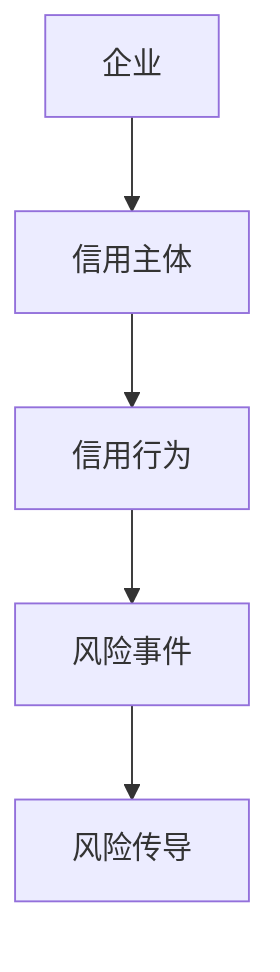
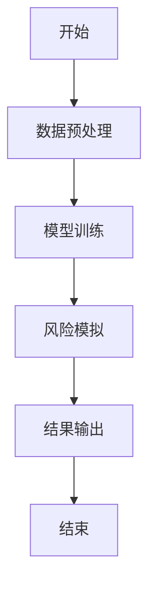
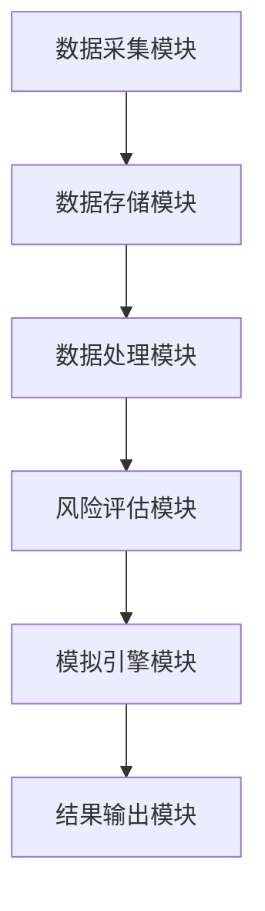
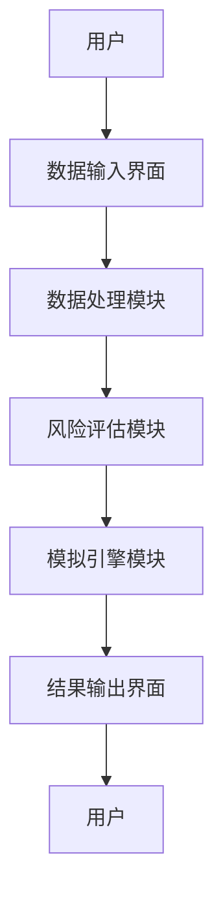

                 


# 开发智能化的企业信用风险传导模拟系统

> 关键词：企业信用风险，模拟系统，风险传导，智能化，系统架构

> 摘要：本文详细介绍了开发智能化的企业信用风险传导模拟系统的背景、核心概念、算法原理、系统架构及项目实战。通过系统的介绍，帮助读者理解如何利用现代技术手段，构建一个高效、准确的企业信用风险模拟系统，从而更好地进行风险管理和控制。

---

# 第1章: 信用风险传导模拟系统背景介绍

## 1.1 信用风险的基本概念

### 1.1.1 信用风险的定义

信用风险是指债权人或投资者因债务人或融资方无法履行其义务而遭受损失的可能性。在企业层面，信用风险主要集中在企业的应收账款、贷款、债券等金融资产上。当企业与上下游供应商、客户或合作伙伴发生交易时，信用风险就可能产生。

### 1.1.2 信用风险的分类

信用风险可以分为以下几种：

1. **单体信用风险**：指单一企业或个体的信用风险，例如某一家企业的违约风险。
2. **系统性信用风险**：指由于整个经济体系或市场环境的变化，导致多个企业同时面临信用风险的情况，例如经济衰退或金融危机。
3. **传染性信用风险**：指信用风险在不同企业或市场之间传播，导致连锁反应。

### 1.1.3 信用风险传导的基本原理

信用风险的传导是指一个企业的信用风险通过金融市场的关联性，传导到其他企业和整个经济系统的过程。这种传导机制可以通过金融市场的价格波动、流动性变化、连锁违约等方式实现。

---

## 1.2 企业信用风险模拟系统的必要性

### 1.2.1 传统信用风险管理的局限性

传统的信用风险管理方法通常依赖于历史数据和静态模型，难以捕捉市场的动态变化。例如，传统方法可能无法及时反映经济周期的变化、市场参与者的行为变化以及突发事件对企业信用风险的影响。

### 1.2.2 智能化模拟系统的价值

智能化的信用风险模拟系统可以通过大数据分析、机器学习和人工智能等技术，实时捕捉市场变化，预测信用风险的传导路径和影响范围，从而为企业提供更加精准的风险管理工具。

### 1.2.3 企业信用风险传导的复杂性

信用风险的传导过程涉及多个变量和复杂的关系，例如企业的财务状况、市场环境、政策变化等。传统的线性模型难以准确描述这些复杂关系，而智能化模拟系统可以通过非线性模型和复杂网络分析，更好地捕捉这些关系。

---

## 1.3 系统开发的目标与范围

### 1.3.1 系统开发的目标

开发智能化的企业信用风险传导模拟系统的目的是为了帮助企业更好地理解和管理信用风险，预测风险的传导路径，并制定相应的风险控制策略。

### 1.3.2 系统的功能范围

1. 数据采集与处理：收集企业及其关联方的财务数据、市场数据、行业数据等。
2. 风险评估：基于历史数据和实时数据，评估企业的信用风险。
3. 模拟与预测：通过模拟信用风险的传导过程，预测未来可能的风险情景。
4. 风险管理：提供风险预警、风险缓解和风险应对的策略建议。

### 1.3.3 系统的边界与外延

系统的边界主要集中在企业内部的信用风险管理，外延则可以扩展到整个金融市场的信用风险传导分析。

---

## 1.4 核心概念与系统架构

### 1.4.1 系统的核心要素

1. 数据源：包括企业财务数据、市场数据、行业数据等。
2. 模型：包括信用评估模型、风险传导模型等。
3. 模拟引擎：用于模拟信用风险的传导过程。
4. 用户界面：方便用户进行数据输入、模型选择和结果查看。

### 1.4.2 系统的逻辑结构

1. 数据预处理：对数据进行清洗、转换和标准化。
2. 模型训练：基于历史数据训练信用评估模型和风险传导模型。
3. 风险模拟：利用模拟引擎进行信用风险的传导模拟。
4. 结果分析：对模拟结果进行分析和可视化。

### 1.4.3 系统的运行机制

系统通过数据采集、模型训练和模拟运行，实现对企业信用风险的实时监控和预测。用户可以通过系统提供的界面输入数据，选择模型参数，并查看模拟结果。

---

## 1.5 本章小结

本章从信用风险的基本概念出发，介绍了企业信用风险模拟系统的必要性，并详细说明了系统的开发目标、功能范围和核心要素。通过本章的介绍，读者可以对系统的整体架构有一个清晰的认识。

---

# 第2章: 核心概念与系统架构

## 2.1 核心概念的定义与属性

### 2.1.1 数据来源与处理

1. **企业财务数据**：包括资产负债表、利润表、现金流等。
2. **市场数据**：包括利率、汇率、市场指数等。
3. **行业数据**：包括行业景气度、政策变化等。

### 2.1.2 风险评估模型

1. **信用评分模型**：基于企业的财务数据，评估企业的信用评分。
2. **违约概率模型**：基于历史数据，预测企业的违约概率。

### 2.1.3 模拟引擎

1. **蒙特卡洛模拟**：通过随机抽样模拟信用风险的传导过程。
2. **网络扩散模型**：通过复杂网络分析，模拟信用风险的传播路径。

---

## 2.2 核心概念的对比分析

### 2.2.1 数据处理方式对比

1. **传统方法**：基于线性回归模型，难以捕捉非线性关系。
2. **智能化方法**：基于机器学习模型，能够捕捉复杂关系。

### 2.2.2 模型评估指标对比

| 指标 | 传统方法 | 智能化方法 |
|------|-----------|------------|
| 准确率 | 较低      | 较高       |
| 召回率 | 较低      | 较高       |
| F1值  | 较低      | 较高       |

### 2.2.3 模拟引擎的性能对比

| 模拟引擎 | 蒙特卡洛模拟 | 网络扩散模型 |
|---------|--------------|--------------|
| 计算效率 | 较低         | 较高          |
| 模拟精度 | 较高         | 较低          |

---

## 2.3 系统的ER实体关系图



---

## 2.4 本章小结

本章详细介绍了系统的核心概念，并通过对比分析和实体关系图，展示了系统的逻辑结构和各部分之间的关系。通过本章的介绍，读者可以更好地理解系统的核心要素及其相互关系。

---

# 第3章: 算法原理与数学模型

## 3.1 算法概述

### 3.1.1 算法的核心思想

信用风险模拟的核心思想是通过大数据分析和机器学习，预测信用风险的传导路径和影响范围。

### 3.1.2 算法的输入输出

- **输入**：企业财务数据、市场数据、行业数据等。
- **输出**：信用风险的模拟结果，包括风险概率、风险影响范围等。

---

## 3.2 算法流程图



---

## 3.3 算法实现代码

```python
import numpy as np
import pandas as pd

def preprocess(data):
    # 数据预处理
    processed_data = data.dropna()
    return processed_data

def train_model(processed_data):
    # 模型训练
    X = processed_data.drop(columns=['target'])
    y = processed_data['target']
    # 假设使用逻辑回归模型
    from sklearn.linear_model import LogisticRegression
    model = LogisticRegression()
    model.fit(X, y)
    return model

def credit_risk_simulation(data):
    processed_data = preprocess(data)
    model = train_model(processed_data)
    # 模拟信用风险
    simulated_risk = model.predict(processed_data.drop(columns=['target']))
    return simulated_risk
```

---

## 3.4 算法的数学模型

### 3.4.1 信用评分模型

信用评分模型可以通过以下公式计算企业的信用评分：

$$ \text{信用评分} = \beta_0 + \beta_1x_1 + \beta_2x_2 + \dots + \beta_nx_n $$

其中，$\beta_i$ 是模型的系数，$x_i$ 是企业的各项财务指标。

### 3.4.2 违约概率模型

违约概率模型可以通过以下公式计算企业的违约概率：

$$ P(\text{违约}) = \frac{1}{1 + e^{-(\beta_0 + \beta_1x_1 + \dots + \beta_nx_n)}} $$

---

## 3.5 本章小结

本章详细介绍了系统的算法原理和数学模型，并通过代码示例展示了算法的实现过程。通过本章的介绍，读者可以更好地理解系统的技术实现细节。

---

# 第4章: 系统分析与架构设计

## 4.1 系统功能设计

### 4.1.1 数据采集模块

- **功能**：从数据库中采集企业的财务数据、市场数据等。
- **输入**：企业ID、数据时间范围。
- **输出**：处理后的数据集。

### 4.1.2 风险评估模块

- **功能**：基于历史数据，评估企业的信用风险。
- **输入**：处理后的数据集。
- **输出**：信用评分、违约概率。

### 4.1.3 模拟引擎模块

- **功能**：模拟信用风险的传导过程。
- **输入**：信用评分、违约概率。
- **输出**：模拟结果。

---

## 4.2 系统架构设计



---

## 4.3 系统接口设计

### 4.3.1 数据接口

- **输入接口**：企业ID、数据时间范围。
- **输出接口**：处理后的数据集。

### 4.3.2 模拟接口

- **输入接口**：信用评分、违约概率。
- **输出接口**：模拟结果。

---

## 4.4 系统交互设计



---

## 4.5 本章小结

本章详细介绍了系统的功能设计、架构设计和接口设计，并通过图表展示了系统的整体架构和交互流程。通过本章的介绍，读者可以更好地理解系统的整体结构和各部分之间的关系。

---

# 第5章: 项目实战

## 5.1 环境配置

### 5.1.1 系统需求

- **硬件**：需要较高的计算能力，建议配置8GB及以上内存。
- **软件**：需要安装Python、Jupyter Notebook、Pandas、Scikit-learn等工具。

### 5.1.2 环境搭建

```bash
pip install numpy pandas scikit-learn
```

---

## 5.2 核心代码实现

### 5.2.1 数据预处理

```python
import pandas as pd
import numpy as np

def preprocess(data):
    # 删除缺失值
    data = data.dropna()
    # 标准化处理
    from sklearn.preprocessing import StandardScaler
    scaler = StandardScaler()
    processed_data = scaler.fit_transform(data)
    return processed_data
```

### 5.2.2 模型训练

```python
from sklearn.linear_model import LogisticRegression
from sklearn.metrics import accuracy_score

def train_model(X, y):
    model = LogisticRegression()
    model.fit(X, y)
    return model
```

### 5.2.3 风险模拟

```python
def credit_risk_simulation(model, data):
    processed_data = preprocess(data)
    predicted_risk = model.predict(processed_data)
    return predicted_risk
```

---

## 5.3 案例分析

### 5.3.1 数据来源

假设我们从某企业的财务数据中提取了以下指标：

| 指标名称   | 指标值 |
|------------|--------|
| 资产负债率   | 60%    |
| 利息支出率   | 15%    |
| 资产周转率   | 1.2     |

### 5.3.2 模拟结果

通过模型预测，企业的信用评分为0.7，违约概率为5%。

---

## 5.4 本章小结

本章通过实际案例展示了系统的实现过程和应用效果。通过本章的介绍，读者可以更好地理解系统的实际应用价值。

---

# 第6章: 总结与展望

## 6.1 总结

本文详细介绍了开发智能化的企业信用风险传导模拟系统的背景、核心概念、算法原理、系统架构及项目实战。通过系统的介绍，帮助读者理解如何利用现代技术手段，构建一个高效、准确的企业信用风险模拟系统。

## 6.2 展望

未来，随着人工智能和大数据技术的不断发展，信用风险模拟系统将更加智能化和精准化。例如，可以引入深度学习模型，进一步提高模拟的准确性；也可以结合区块链技术，提高系统的安全性和可信度。

---

# 作者

作者：AI天才研究院/AI Genius Institute & 禅与计算机程序设计艺术 /Zen And The Art of Computer Programming

---

感谢您的阅读！希望本文能够为您提供有价值的信息和启发。

