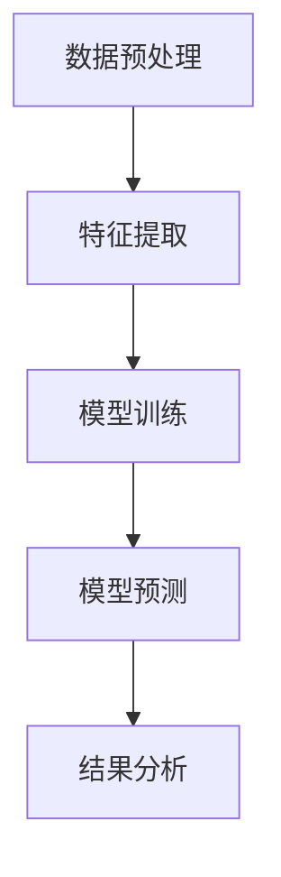

                 


# 开发智能化的企业信用风险敞口管理系统

## 关键词：
- 信用风险敞口
- 智能化
- 信用风险管理
- 机器学习
- 系统架构

## 摘要：
随着企业规模的不断扩大，信用风险敞口管理变得日益复杂。传统的管理方法已难以满足现代企业的需求。智能化的信用风险敞口管理系统利用先进的数据分析和机器学习技术，能够实时监控和评估信用风险，从而帮助企业做出更明智的决策。本文将详细探讨如何开发这样一个系统，从核心概念到系统架构设计，再到实际项目实现，提供全面的指导。

---

## 第1章: 信用风险敞口管理概述

### 1.1 信用风险的基本概念

#### 1.1.1 信用风险的定义
信用风险是指企业在经营过程中，由于交易对手无法履行其财务义务而可能遭受的损失。这种风险广泛存在于企业与客户、供应商以及合作伙伴的交易中。

#### 1.1.2 信用风险的分类
信用风险可以分为以下几种：
- **交易信用风险**：由于交易对手未能履行合同义务而产生的风险。
- **信用集中风险**：由于过于依赖少数客户或供应商而导致的风险。
- **行业信用风险**：由于特定行业整体信用状况恶化而产生的风险。

#### 1.1.3 信用风险敞口的定义与特征
信用风险敞口是指企业在某一时间段内，由于交易对手的信用问题可能遭受的最大潜在损失。其特征包括：
- **动态性**：随着市场环境和交易情况的变化而变化。
- **关联性**：多个交易对手的信用风险可能相互影响。
- **可量化性**：通过数学模型进行量化评估。

### 1.2 企业信用风险管理的重要性

#### 1.2.1 信用风险对企业的影响
信用风险直接影响企业的财务状况和经营稳定性。如果企业未能有效管理信用风险，可能导致资金链断裂，影响正常的业务运作。

#### 1.2.2 信用风险管理在企业经营中的作用
有效的信用风险管理可以帮助企业：
- 减少坏账损失
- 提高资金周转效率
- 优化客户和供应商结构

#### 1.2.3 智能化信用风险管理的优势
智能化信用风险管理通过引入人工智能和大数据分析技术，可以实现：
- **实时监控**：快速识别潜在风险
- **精准评估**：基于历史数据和市场趋势进行精准预测
- **自动化决策**：减少人为干预，提高决策效率

---

## 第2章: 信用风险敞口管理的核心概念与联系

### 2.1 信用风险敞口的数学模型

#### 2.1.1 概率论基础
概率论是信用风险评估的重要基础。通过概率模型可以估计交易对手违约的可能性。

#### 2.1.2 风险敞口的度量公式
信用风险敞口的度量可以通过以下公式进行：
$$ \text{风险敞口} = \sum_{i=1}^{n} \text{交易金额}_i \times \text{违约概率}_i $$

#### 2.1.3 模型的适用范围
该模型适用于多个交易对手的信用风险评估，尤其在数据充足的情况下表现优异。

### 2.2 信用风险敞口的影响因素

#### 2.2.1 宏观经济因素
- **经济周期**：经济衰退时期，违约概率通常上升。
- **利率水平**：利率上升可能导致债务负担加重，增加违约风险。

#### 2.2.2 企业自身因素
- **财务状况**：企业的盈利能力、资产负债情况等直接影响其信用风险。
- **管理能力**：企业内部管理不善可能导致信用风险增加。

#### 2.2.3 市场环境因素
- **行业竞争**：竞争激烈的行业可能面临更高的信用风险。
- **市场波动**：市场波动性大的行业，信用风险更容易发生。

### 2.3 核心概念的ER实体关系图

```mermaid
erDiagram
    actor 顾客 {
        <属性> id : integer
        <属性> name : string
        <属性> credit_score : integer
    }
    actor 企业 {
        <属性> id : integer
        <属性> name : string
        <属性> credit_limit : integer
    }
    actor 风险敞口 {
        <属性> id : integer
        <属性> risk_level : string
        <属性> exposure_amount : integer
    }
    顾客 --> 风险敞口 : 影响
    企业 --> 风险敞口 : 影响
```

---

## 第3章: 信用风险敞口管理的智能化实现

### 3.1 智能化信用风险管理的核心算法

#### 3.1.1 算法原理
使用逻辑回归模型进行信用风险预测：
$$ P(\text{违约}) = \frac{1}{1 + e^{-(\beta_0 + \beta_1 x_1 + \dots + \beta_n x_n)}} $$

#### 3.1.2 代码实现
```python
import pandas as pd
from sklearn.linear_model import LogisticRegression
from sklearn.metrics import accuracy_score

# 加载数据
data = pd.read_csv('credit_data.csv')

# 特征工程
X = data[['income', 'debt', 'score']]
y = data['default']

# 模型训练
model = LogisticRegression()
model.fit(X, y)

# 预测与评估
predictions = model.predict(X)
print("准确率:", accuracy_score(y, predictions))
```

#### 3.1.3 算法流程图


### 3.2 系统架构设计

#### 3.2.1 系统功能模块
- **数据采集模块**：负责收集交易数据和市场信息。
- **风险评估模块**：基于算法模型评估信用风险。
- **预警模块**：实时监控风险敞口，触发预警机制。

#### 3.2.2 系统架构图


#### 3.2.3 系统接口设计
- **输入接口**：接收交易数据和市场信息。
- **输出接口**：提供风险评估结果和预警信息。

---

## 第4章: 智能化信用风险敞口管理系统的项目实战

### 4.1 环境安装
安装必要的库：
```bash
pip install pandas scikit-learn matplotlib
```

### 4.2 核心代码实现
```python
import pandas as pd
from sklearn.ensemble import RandomForestClassifier
from sklearn.metrics import classification_report

# 加载数据
data = pd.read_csv('credit_risk.csv')

# 特征工程
X = data.drop('risk_level', axis=1)
y = data['risk_level']

# 模型训练
model = RandomForestClassifier(n_estimators=100)
model.fit(X, y)

# 预测与评估
predictions = model.predict(X)
print(classification_report(y, predictions))
```

### 4.3 实际案例分析
以一家中型制造企业为例，展示如何通过系统实现信用风险敞口管理。分析模型预测结果，优化企业的信用策略。

---

## 第5章: 总结与展望

### 5.1 总结
智能化信用风险敞口管理系统通过先进的数据分析和机器学习技术，能够有效降低企业的信用风险。本文详细探讨了系统的开发过程，包括核心概念、算法原理、系统架构设计和项目实战。

### 5.2 展望
未来，随着人工智能和大数据技术的不断发展，信用风险管理将更加智能化和自动化。引入区块链技术可以进一步提升系统的安全性和透明度。

---

## 作者：AI天才研究院/AI Genius Institute & 禅与计算机程序设计艺术 /Zen And The Art of Computer Programming

---

通过以上内容，您可以系统地了解如何开发智能化的企业信用风险敞口管理系统。

