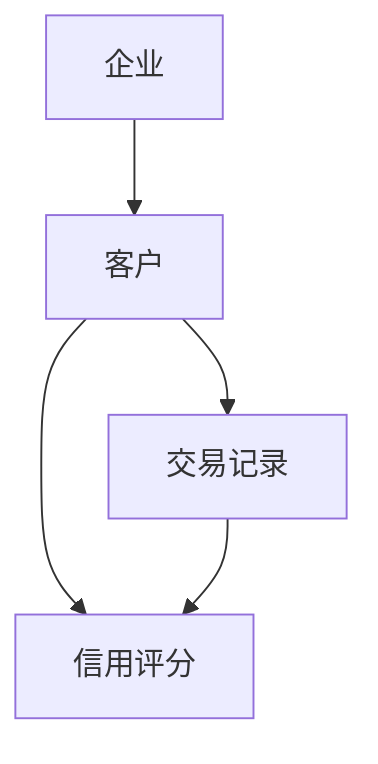
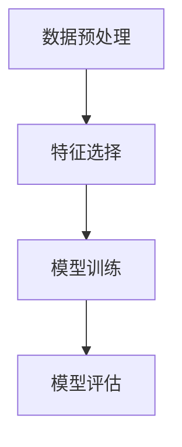

                 

# 开发智能化的企业信用风险评估模型

## 关键词：
企业信用风险、人工智能、大数据分析、机器学习、风险评估模型

## 摘要：
信用风险评估是企业信贷决策中的关键环节，传统的评估方法存在局限性。随着大数据和人工智能的发展，智能化信用风险评估模型成为可能。本文将从背景、核心概念、算法原理、系统架构设计、项目实战和最佳实践等方面详细探讨智能化企业信用风险评估模型的开发过程。

---

# 第1章：企业信用风险评估模型的背景与问题描述

## 1.1 信用风险评估的基本概念

### 1.1.1 信用风险的定义与特征
信用风险是指企业在信贷活动中未能履行还款义务的可能性。其特征包括不确定性、传染性、系统性等。

### 1.1.2 企业信用风险评估的必要性
企业信用风险评估是金融机构进行信贷决策的重要依据，能够有效降低坏账率和损失。

### 1.1.3 传统信用风险评估方法的局限性
传统方法依赖人工经验，主观性强，难以处理海量数据，且缺乏动态调整能力。

---

## 1.2 智能化信用风险评估的背景与意义

### 1.2.1 大数据与人工智能在金融领域的应用
大数据和AI技术的快速发展，为信用风险评估提供了新的工具和方法。

### 1.2.2 智能化信用风险评估的核心优势
智能化模型能够处理海量数据，实时更新，提高评估准确性和效率。

### 1.2.3 企业信用风险评估智能化的未来趋势
随着技术进步，智能化模型将成为信用风险评估的主流方法。

---

## 1.3 问题背景与目标

### 1.3.1 问题背景分析
传统评估方法效率低，成本高，难以适应现代金融环境。

### 1.3.2 问题解决的目标
开发智能化模型，提高评估效率和准确性。

### 1.3.3 边界与外延
模型仅用于评估信用风险，不考虑市场风险等其他因素。

### 1.3.4 核心要素与概念结构
模型的核心要素包括企业财务数据、市场表现、交易记录等。

---

## 1.4 核心概念对比分析

### 1.4.1 数据特征与模型算法对比
数据特征包括收入、利润等，模型算法包括逻辑回归、随机森林等。

### 1.4.2 不同模型的性能对比
通过对比分析，选择最优模型。

### 1.4.3 评估指标与应用场景对比
评估指标如准确率、召回率，适用于不同场景。

---

## 1.5 本章小结
本章介绍了信用风险评估的基本概念、智能化的背景意义以及核心概念的对比分析。

---

# 第2章：企业信用风险评估模型的核心概念与联系

## 2.1 核心概念原理

### 2.1.1 数据特征提取
从企业财务报表、市场数据中提取相关特征。

### 2.1.2 模型算法选择
选择适合的算法，如逻辑回归。

### 2.1.3 风险评估指标
包括违约概率、风险价值等。

---

## 2.2 核心概念属性特征对比

### 2.2.1 数据特征对比表
| 特征 | 描述 |
|------|------|
| 收入 | 年收入额 |

### 2.2.2 模型算法对比表
| 算法 | 描述 |
|------|------|
| 逻辑回归 | 分类任务 |

### 2.2.3 评估指标对比表
| 指标 | 描述 |
|------|------|
| 准确率 | 分类正确比例 |

---

## 2.3 实体关系图架构

---

## 2.4 本章小结
本章详细阐述了企业信用风险评估模型的核心概念和相关属性特征。

---

# 第3章：机器学习算法原理与流程

## 3.1 常见算法原理

### 3.1.1 逻辑回归
用于分类任务，通过sigmoid函数将输出压缩到[0,1]区间。

### 3.1.2 随机森林
基于决策树的集成算法，具有高准确性和稳定性。

### 3.1.3 神经网络
通过多层神经元模拟人类神经网络，适用于复杂任务。

---

## 3.2 算法流程图

---

## 3.3 算法数学公式

### 3.3.1 逻辑回归
$$ P(y=1|x) = \frac{e^{\beta x}}{1 + e^{\beta x}} $$

---

## 3.4 本章小结
本章详细介绍了常见机器学习算法及其原理。

---

# 第4章：系统架构设计与实现

## 4.1 系统功能设计

### 4.1.1 数据采集模块
从数据库中获取企业数据。

### 4.1.2 特征工程模块
进行数据清洗和特征提取。

### 4.1.3 模型训练模块
选择算法进行训练。

### 4.1.4 模型评估模块
评估模型性能。

---

## 4.2 系统架构设计

---

## 4.3 系统接口设计

### 4.3.1 数据接口
API用于数据输入输出。

### 4.3.2 模型接口
API用于模型调用。

---

## 4.4 系统交互序列图

---

## 4.5 本章小结
本章详细描述了系统的功能设计和架构设计。

---

# 第5章：项目实战与案例分析

## 5.1 项目背景与目标

### 5.1.1 项目背景
开发一个智能化的企业信用风险评估系统。

### 5.1.2 项目目标
提高评估效率和准确性。

---

## 5.2 数据准备与特征工程

### 5.2.1 数据清洗
处理缺失值和异常值。

### 5.2.2 特征提取
从财务报表中提取关键特征。

---

## 5.3 模型实现与训练

### 5.3.1 选择算法
选择逻辑回归进行训练。

### 5.3.2 训练过程
通过优化参数提高模型性能。

---

## 5.4 模型评估与优化

### 5.4.1 评估指标
准确率、召回率等。

### 5.4.2 模型优化
调整参数，提高性能。

---

## 5.5 本章小结
本章通过实际案例展示了项目开发的全过程。

---

# 第6章：最佳实践与未来展望

## 6.1 实践经验总结

### 6.1.1 数据处理
确保数据质量。

### 6.1.2 模型选择
根据需求选择合适算法。

---

## 6.2 注意事项与建议

### 6.2.1 数据隐私
保护用户隐私。

### 6.2.2 模型更新
定期更新模型。

---

## 6.3 未来发展方向

### 6.3.1 技术进步
AI和大数据技术的进一步发展。

### 6.3.2 应用场景扩展
应用于更多领域。

---

## 6.4 本章小结
本章总结了实践经验，并展望了未来发展方向。

---

# 作者：AI天才研究院/AI Genius Institute & 禅与计算机程序设计艺术 /Zen And The Art of Computer Programming

