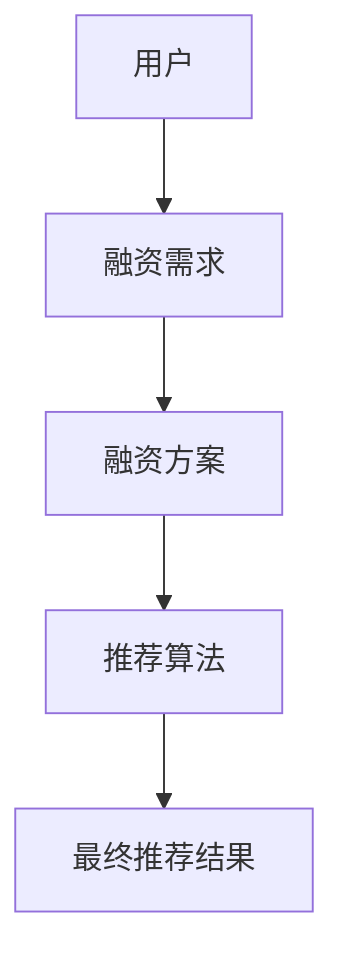
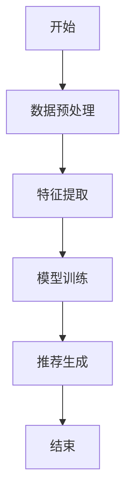

                 


# 开发智能化的企业融资方案推荐系统

## 关键词：企业融资、推荐系统、人工智能、机器学习、算法原理

## 摘要：本文详细介绍了开发智能化企业融资方案推荐系统的背景、核心概念、算法原理、系统架构设计、项目实战以及最佳实践。通过理论与实践相结合的方式，帮助读者理解如何利用人工智能技术构建高效的融资推荐系统，解决传统融资过程中的低效和高成本问题。

---

# 第一部分: 智能化企业融资方案推荐系统背景与核心概念

## 第1章: 企业融资方案推荐系统背景介绍

### 1.1 问题背景与问题描述

#### 1.1.1 传统企业融资面临的挑战
在传统的企业融资过程中，企业往往面临以下挑战：
- **信息不对称**：企业难以找到合适的融资渠道和方案，金融机构也难以快速匹配合适的企业。
- **效率低下**：传统融资流程复杂，审批时间长，导致企业融资效率低下。
- **高成本**：融资过程涉及多环节的人工操作，导致融资成本高昂。

#### 1.1.2 智能化融资推荐的必要性
随着人工智能和大数据技术的快速发展，智能化融资推荐系统能够通过分析企业的多维数据，快速匹配最优融资方案，显著提高融资效率并降低成本。

#### 1.1.3 当前市场中的融资推荐系统现状
当前，市场上已经出现了一些融资推荐系统，但大多数系统在数据处理能力、推荐算法精准度以及个性化推荐方面仍有改进空间。

### 1.2 融资推荐系统的核心目标

#### 1.2.1 提供个性化融资方案
系统通过分析企业的财务状况、行业特点和融资需求，提供个性化的融资方案。

#### 1.2.2 提高融资效率
通过自动化处理和智能推荐，显著缩短融资周期。

#### 1.2.3 降低融资成本
减少人工干预和多环节操作，降低融资过程中的各项成本。

### 1.3 融资推荐系统的边界与外延

#### 1.3.1 系统的功能边界
系统主要专注于融资方案的推荐，不涉及具体的融资交易过程。

#### 1.3.2 系统的外延应用
系统可以扩展至其他金融领域的推荐，如投资建议和风险管理。

#### 1.3.3 系统与外部系统的交互
系统需要与企业征信系统、金融机构数据库等外部系统进行数据交互。

### 1.4 融资推荐系统的核心要素组成

#### 1.4.1 数据来源与处理
系统需要整合企业财务数据、市场数据和用户行为数据，并进行清洗和特征提取。

#### 1.4.2 推荐算法与模型
采用机器学习算法，如协同过滤和深度学习模型，进行融资方案的推荐。

#### 1.4.3 用户画像与需求分析
通过用户画像和需求分析，系统能够精准匹配用户的融资需求。

---

## 第2章: 融资推荐系统的核心概念与联系

### 2.1 核心概念原理

#### 2.1.1 融资需求分析
分析企业的融资需求，包括融资类型、金额和期限等。

#### 2.1.2 融资方案匹配
根据企业的需求，匹配合适的融资方案。

#### 2.1.3 推荐算法实现
通过机器学习算法，实现融资方案的智能推荐。

### 2.2 核心概念属性对比表

| 概念       | 属性1 | 属性2 | 属性3 |
|------------|-------|-------|-------|
| 融资需求   | 类型  | 额度  | 期限  |
| 融资方案   | 来源  | 利率  | 风险  |
| 推荐算法   | 类型  | 参数  | 性能  |

### 2.3 ER实体关系图



---

# 第二部分: 融资推荐系统算法原理

## 第3章: 融资推荐系统算法基础

### 3.1 算法原理概述

#### 3.1.1 基于概率论的推荐算法
通过概率模型分析企业融资需求的可能性，推荐合适的方案。

#### 3.1.2 基于统计学的推荐算法
利用统计分析方法，分析企业的信用风险和市场趋势，进行推荐。

#### 3.1.3 基于机器学习的推荐算法
采用协同过滤、聚类和深度学习模型，实现精准推荐。

### 3.2 算法流程图



### 3.3 算法实现代码

```python
import pandas as pd
from sklearn.model_selection import train_test_split
from sklearn.metrics import accuracy_score

# 数据预处理
data = pd.read_csv('融资数据.csv')
X = data.drop('label', axis=1)
y = data['label']

# 划分训练集和测试集
X_train, X_test, y_train, y_test = train_test_split(X, y, test_size=0.2)

# 模型训练
from sklearn.ensemble import RandomForestClassifier
model = RandomForestClassifier()
model.fit(X_train, y_train)

# 预测和评估
y_pred = model.predict(X_test)
print(accuracy_score(y_test, y_pred))
```

### 3.4 数学模型与公式

#### 3.4.1 概率公式
$$P(A|B) = \frac{P(B|A)P(A)}{P(B)}$$

#### 3.4.2 损失函数
$$L = -\frac{1}{N}\sum_{i=1}^{N} [y_i \cdot \log(p_i) + (1 - y_i) \cdot \log(1 - p_i)]$$

---

## 第4章: 融资推荐系统算法实现

### 4.1 算法实现步骤

#### 4.1.1 数据预处理
清洗数据，处理缺失值和异常值。

#### 4.1.2 特征提取
从数据中提取关键特征，如企业信用评分和市场趋势。

#### 4.1.3 模型训练
采用随机森林或神经网络模型进行训练。

#### 4.1.4 模型评估
通过准确率、召回率等指标评估模型性能。

### 4.2 模型优化

#### 4.2.1 超参数调整
通过网格搜索优化模型参数。

#### 4.2.2 模型融合
结合多种算法，提高推荐的准确性和多样性。

---

## 第5章: 融资推荐系统实战案例

### 5.1 项目背景

#### 5.1.1 项目需求
开发一个智能化的企业融资方案推荐系统，帮助中小企业快速找到合适的融资渠道。

#### 5.1.2 数据来源
使用公开的企业信用数据和市场数据进行分析。

### 5.2 系统功能设计

#### 5.2.1 用户模块
用户可以输入企业信息和融资需求。

#### 5.2.2 数据处理模块
对输入数据进行清洗和特征提取。

#### 5.2.3 推荐模块
根据模型预测结果，生成推荐的融资方案。

### 5.3 系统实现

#### 5.3.1 环境安装
安装Python和必要的机器学习库，如scikit-learn和XGBoost。

#### 5.3.2 核心代码实现

```python
import pandas as pd
from sklearn.ensemble import RandomForestClassifier
from sklearn.metrics import accuracy_score

# 读取数据
data = pd.read_csv('融资数据.csv')

# 数据预处理
X = data.drop('label', axis=1)
y = data['label']

# 划分数据集
X_train, X_test, y_train, y_test = train_test_split(X, y, test_size=0.2)

# 训练模型
model = RandomForestClassifier()
model.fit(X_train, y_train)

# 评估模型
y_pred = model.predict(X_test)
print("准确率:", accuracy_score(y_test, y_pred))
```

### 5.4 案例分析

#### 5.4.1 案例背景
某中小企业的融资需求为500万元，期限为1年。

#### 5.4.2 数据分析
系统分析企业的信用评分、行业风险和市场趋势，推荐最优融资方案。

#### 5.4.3 推荐结果
系统推荐了两家银行的贷款方案，其中一家银行的年利率较低，适合企业的资金需求。

---

## 第6章: 融资推荐系统最佳实践

### 6.1 小结

#### 6.1.1 系统开发的关键点
数据质量、算法选择和模型优化是系统开发的核心。

#### 6.1.2 系统应用的注意事项
保护用户隐私，确保数据安全。

### 6.2 小结

通过本文的介绍，读者可以系统地了解和掌握智能化企业融资方案推荐系统的开发方法。

### 6.3 注意事项

#### 6.3.1 数据隐私保护
确保数据的安全性和合规性。

#### 6.3.2 系统可扩展性
系统设计应具备良好的扩展性，以应对未来数据量和业务需求的增长。

### 6.4 拓展阅读

建议读者进一步学习机器学习和金融领域的相关知识，以提升系统开发的深度和广度。

---

## 作者

**作者：AI天才研究院/AI Genius Institute & 禅与计算机程序设计艺术 /Zen And The Art of Computer Programming**

---

通过本文的详细讲解，读者可以系统地了解智能化企业融资方案推荐系统的开发过程，从背景分析到算法实现，再到项目实战，全面掌握系统的开发方法。

