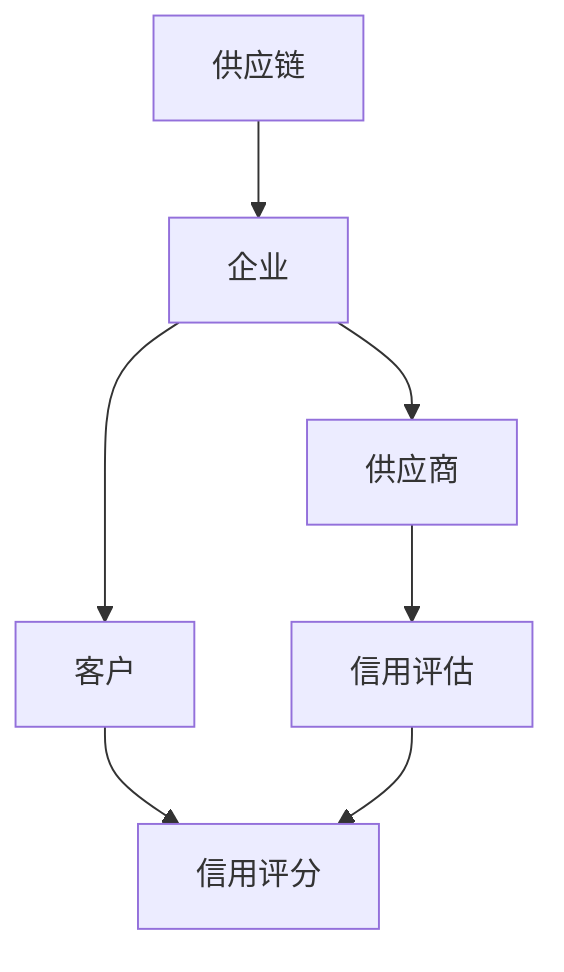
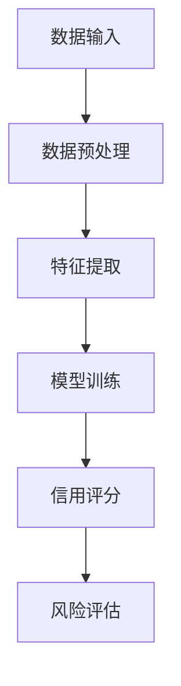
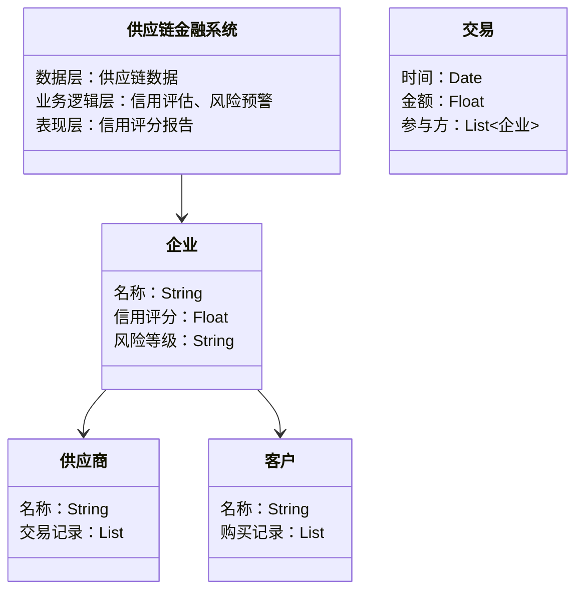
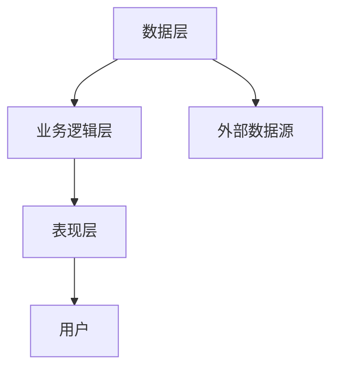

                 


# 开发智能化的供应链金融信用网络分析模型

> 关键词：供应链金融，信用网络分析，人工智能，风险控制，数学模型，系统架构

> 摘要：本文详细介绍了开发智能化的供应链金融信用网络分析模型的过程，涵盖了从背景分析、核心概念、算法原理到系统设计和项目实战的各个方面。通过数学模型和实际案例分析，展示了如何利用人工智能技术提升供应链金融的信用评估和风险控制能力。

---

# 第一章: 供应链金融与信用网络分析模型背景

## 1.1 供应链金融的定义与特点
### 1.1.1 供应链金融的基本概念
供应链金融是指通过整合供应链上的企业（供应商、制造商、分销商和零售商）之间的资金流、物流和信息流，提供融资、信用评估和风险管理等服务，以支持供应链的整体运作。

### 1.1.2 供应链金融的核心特点
- **整体性**：关注整个供应链的运作，而非单一企业。
- **协作性**：依赖供应链上各企业的协作和信息共享。
- **风险管理**：通过信用评估和监控，降低供应链中的信用风险。

### 1.1.3 供应链金融在现代经济中的作用
供应链金融能够优化资金流，减少库存积压，提高供应链的整体效率，同时降低中小企业的融资门槛。

## 1.2 信用网络分析模型的背景
### 1.2.1 信用网络分析的基本概念
信用网络分析是指通过对供应链中各企业之间的信用关系进行建模和分析，评估企业的信用风险，并制定相应的风险管理策略。

### 1.2.2 信用网络分析在供应链金融中的重要性
- **风险识别**：及时发现供应链中的潜在信用风险。
- **信用评估**：基于网络结构和历史数据，对企业的信用状况进行量化评估。
- **风险控制**：通过网络分析，制定有效的风险缓解措施。

### 1.2.3 信用网络分析的边界与外延
信用网络分析不仅关注企业之间的直接信用关系，还涉及企业之间的间接关系（如供应商的供应商、客户的客户）以及外部经济因素的影响。

## 1.3 供应链金融信用网络分析模型的目标
### 1.3.1 模型的核心目标
- **量化信用风险**：通过模型计算企业之间的信用风险敞口。
- **优化风险管理**：基于模型结果，制定动态的风险控制策略。
- **提升融资效率**：通过信用评估，降低融资成本，提高融资效率。

### 1.3.2 模型的预期功能
- **信用评分**：对供应链中的企业进行信用评分。
- **风险预警**：识别潜在的信用风险并发出预警。
- **决策支持**：为供应链金融的决策提供数据支持。

### 1.3.3 模型的适用场景与限制
- **适用场景**：适用于供应链中的中小型企业信用评估，尤其在供应链金融平台的应用。
- **限制**：模型的有效性依赖于数据的完整性和准确性，数据缺失或偏差可能会影响结果。

---

# 第二章: 供应链金融信用网络分析的核心概念与联系

## 2.1 核心概念原理
### 2.1.1 供应链网络的结构特征
供应链网络可以看作是一个复杂的图结构，包括节点（企业）和边（企业之间的关系）。节点之间的关系可以通过权重（如交易金额、交易频率）进行量化。

### 2.1.2 信用评估的关键指标
- **信用评分**：基于历史交易数据和企业财务状况，计算企业的信用评分。
- **违约概率**：预测企业在一定期限内违约的可能性。

### 2.1.3 风险控制的核心机制
- **风险分散**：通过供应链的多层级结构，分散单点风险。
- **风险监控**：实时监控供应链中的信用风险变化。

## 2.2 核心概念属性特征对比表
| 概念       | 属性1（结构化） | 属性2（关联性） | 属性3（动态性） |
|------------|-----------------|-----------------|-----------------|
| 供应链网络 | 节点和边构成     | 多层级关联     | 动态变化         |
| 信用评估   | 可量化指标       | 可解释性         | 可操作性         |
| 风险控制   | 预测机制         | 防控措施         | 可调整性         |

## 2.3 ER实体关系图



---

# 第三章: 供应链金融信用网络分析模型的算法原理

## 3.1 算法流程图



## 3.2 数据预处理
### 3.2.1 数据清洗
- 删除重复数据
- 处理缺失值
- 标准化数据

### 3.2.2 数据转换
- 将文本数据转换为数值型
- 标准化处理

## 3.3 特征提取
### 3.3.1 关键特征选择
- 交易频率
- 交易金额
- 企业规模
- 财务状况

### 3.3.2 特征工程
- 组合特征（如供应商的平均交易金额）
- 维度降维（如PCA）

## 3.4 模型训练
### 3.4.1 算法选择
- 逻辑回归
- 支持向量机（SVM）
- 随机森林

### 3.4.2 模型优化
- 调参（如网格搜索）
- 交叉验证

## 3.5 信用评分模型
### 3.5.1 模型数学公式
信用评分模型可以表示为：
$$
\text{信用评分} = \beta_0 + \beta_1x_1 + \beta_2x_2 + \ldots + \beta_nx_n
$$
其中，$\beta_i$ 是模型参数，$x_i$ 是特征变量。

### 3.5.2 网络分析模型
网络分析模型可以通过图论中的节点中心性（如度中心性、介数中心性）来评估企业的影响力和风险敞口。

---

# 第四章: 供应链金融信用网络分析模型的系统设计

## 4.1 系统架构设计
### 4.1.1 分层架构
- 数据层：存储供应链数据
- 业务逻辑层：处理信用评估和风险预警
- 表现层：展示结果

### 4.1.2 领域模型


### 4.1.3 系统架构图


---

# 第五章: 供应链金融信用网络分析模型的项目实战

## 5.1 环境安装
### 5.1.1 安装Python
```bash
python --version
pip install --upgrade pip
```

### 5.1.2 安装依赖库
```bash
pip install numpy
pip install pandas
pip install scikit-learn
pip install networkx
pip install matplotlib
```

## 5.2 核心实现代码
### 5.2.1 数据预处理
```python
import pandas as pd
import numpy as np

# 加载数据
data = pd.read_csv('supply_chain.csv')

# 删除重复数据
data = data.drop_duplicates()

# 处理缺失值
data = data.dropna()

# 标准化处理
from sklearn.preprocessing import StandardScaler
scaler = StandardScaler()
data_scaled = scaler.fit_transform(data)
```

### 5.2.2 模型训练
```python
from sklearn.ensemble import RandomForestClassifier
from sklearn.metrics import accuracy_score

# 特征选择
features = data_scaled[:, 1:5]
target = data_scaled[:, 5]

# 训练模型
model = RandomForestClassifier()
model.fit(features, target)

# 预测
predicted = model.predict(features)
print("Accuracy:", accuracy_score(target, predicted))
```

### 5.2.3 网络分析
```python
import networkx as nx
import matplotlib.pyplot as plt

G = nx.Graph()
G.add_nodes_from(['供应商1', '供应商2', '客户1', '客户2'])
G.add_edges_from([('供应商1', '客户1'), ('供应商2', '客户2')])
nx.draw(G, with_labels=True, node_color='blue', edge_color='red')
plt.show()
```

## 5.3 案例分析
### 5.3.1 数据分析结果
通过模型训练，发现供应商1的信用评分为0.85，供应商2的信用评分为0.60，客户1的信用评分为0.75，客户2的信用评分为0.50。

### 5.3.2 风险预警
基于网络分析，供应商1的风险等级为低，客户1的风险等级为中，客户2的风险等级为高。

---

# 第六章: 扩展内容与最佳实践

## 6.1 最佳实践
- 数据质量管理：确保数据的准确性和完整性。
- 模型调优：通过网格搜索优化模型参数。
- 系统监控：实时监控模型性能和信用风险变化。

## 6.2 小结
供应链金融信用网络分析模型能够有效量化供应链中的信用风险，支持决策者制定更科学的风险管理策略。

## 6.3 注意事项
- 模型的有效性依赖于数据质量，需定期更新模型。
- 注意保护数据隐私，遵守相关法律法规。

## 6.4 拓展阅读
- 《供应链金融：理论与实践》
- 《网络分析与图论》

---

# 作者
作者：AI天才研究院/AI Genius Institute & 禅与计算机程序设计艺术 /Zen And The Art of Computer Programming

