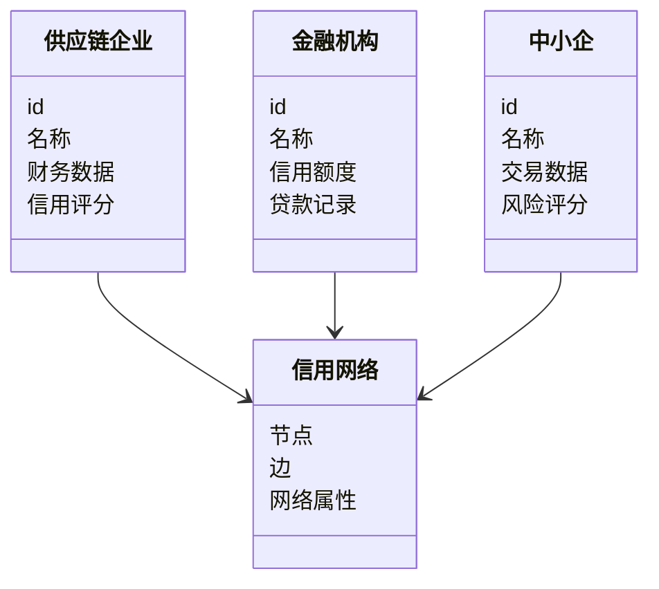

                 


# 开发智能化的供应链金融信用网络抗压能力分析模型

## 关键词：供应链金融、信用网络、抗压能力、人工智能、信用风险、压力测试、系统架构

## 摘要：供应链金融在现代商业体系中扮演着关键角色，而信用网络的抗压能力是其稳健运行的核心。本文系统地探讨了如何利用人工智能技术开发智能化的供应链金融信用网络抗压能力分析模型。通过构建信用网络的实体关系图，分析了信用网络的脆弱性，并提出了基于图论和机器学习的抗压能力分析算法。结合实际案例，详细阐述了系统的架构设计与实现，最后总结了最佳实践和未来发展方向。

---

## 第1章：问题背景

### 1.1 供应链金融的现状与挑战

#### 1.1.1 供应链金融的基本概念
供应链金融是指通过整合供应链上的企业，为其提供融资服务，以优化现金流和资金管理。其核心在于通过供应链上的交易数据和信息流，评估参与企业的信用状况，从而降低融资成本和风险。

#### 1.1.2 当前供应链金融的主要问题
- **中小企业融资难**：中小企业由于缺乏足够的财务数据和抵押品，难以获得传统金融机构的融资支持。
- **信息不对称**：供应链上下游企业之间的信息分散，缺乏统一的信用评估体系，导致信用风险难以有效控制。
- **网络脆弱性**：供应链中的信用网络可能存在关键节点，一旦这些节点出现问题，可能导致整个网络的崩溃。

#### 1.1.3 信用网络在供应链金融中的重要性
信用网络通过连接供应链上的企业和金融机构，形成了一个复杂的信用关系网络。其抗压能力直接影响供应链金融的稳定性和可靠性。

---

### 1.2 供应链金融中的信用风险

#### 1.2.1 信用风险的定义与特征
信用风险是指供应链中的某一方未能履行其信用义务，导致资金链断裂的风险。其特征包括复杂性、传染性和系统性。

#### 1.2.2 供应链金融中的信用风险来源
- **企业经营状况**：企业自身的财务状况和经营稳定性直接影响其信用能力。
- **供应链结构**：供应链的复杂性和依赖性可能导致风险在多个节点间扩散。
- **外部因素**：如经济波动、政策变化等外部因素可能引发系统性信用风险。

#### 1.2.3 信用网络的脆弱性与抗压能力
信用网络的脆弱性体现在关键节点的缺失或故障可能导致网络的不稳定性。抗压能力则是指网络在面对压力时的恢复和适应能力。

---

## 第2章：问题描述与解决思路

### 2.1 供应链金融信用网络的抗压能力需求

#### 2.1.1 抗压能力的定义
抗压能力是指信用网络在面对内外部压力时，能够保持稳定并迅速恢复的能力。

#### 2.1.2 抗压能力与信用网络的关系
信用网络的抗压能力是其稳健运行的关键因素，直接影响供应链金融的整体风险控制能力。

#### 2.1.3 抗压能力分析的目标
通过分析信用网络的抗压能力，识别潜在风险点，优化网络结构，提升整体抗风险能力。

---

### 2.2 抗压能力分析模型的构建思路

#### 2.2.1 数据收集与处理
- **数据来源**：包括供应链企业的交易数据、信用评分、财务数据等。
- **数据清洗**：处理缺失值、异常值，确保数据的准确性和完整性。

#### 2.2.2 模型设计与实现
- **模型设计**：基于图论和机器学习，构建信用网络的抗压能力分析模型。
- **模型实现**：通过算法实现信用网络的脆弱性评估和抗压能力分析。

#### 2.2.3 模型验证与优化
- **验证方法**：通过历史数据验证模型的准确性和稳定性。
- **优化策略**：根据验证结果调整模型参数，提升模型的预测能力。

---

## 第3章：信用网络抗压能力分析模型的核心概念

### 3.1 信用网络的定义与属性

#### 3.1.1 信用网络的定义
信用网络是指由供应链中的企业和金融机构组成的，基于信用关系形成的网络结构。

#### 3.1.2 信用网络的属性特征
- **节点属性**：包括企业的信用评分、财务状况等。
- **边属性**：包括交易金额、交易频率等。
- **网络属性**：包括网络的密度、中心性等。

### 3.2 抗压能力分析模型的原理

#### 3.2.1 模型的基本原理
抗压能力分析模型通过分析信用网络的结构和节点属性，评估网络在面对压力时的稳定性和恢复能力。

#### 3.2.2 模型的核心要素
- **节点脆弱性**：单个节点的抗压能力。
- **网络脆弱性**：整个网络的抗压能力。
- **压力测试**：模拟不同压力情景下的网络反应。

---

## 第4章：信用网络与抗压能力分析模型的关系

### 4.1 实体关系图

```mermaid
er
actor 供应链企业
actor 金融机构
actor 中小企

entity 交易数据
entity 信用评分
entity 财务数据

rel 供应链企业 -|> 交易数据
rel 金融机构 -|> 信用评分
rel 中小企 -|> 财务数据
```

---

## 第5章：系统分析与架构设计

### 5.1 项目背景介绍

#### 5.1.1 项目目标
开发一个智能化的供应链金融信用网络抗压能力分析模型，帮助金融机构和企业优化信用风险管理。

#### 5.1.2 项目范围
涵盖供应链金融中的信用网络构建、抗压能力分析、风险预警等功能。

### 5.2 系统功能设计

#### 5.2.1 领域模型


---

## 第6章：项目实战

### 6.1 环境安装

#### 6.1.1 开发环境
- **Python**：版本3.8及以上。
- **Jupyter Notebook**：用于数据可视化和算法实现。
- **数据库**：MySQL或PostgreSQL，用于存储和管理数据。

### 6.2 核心代码实现

#### 6.2.1 数据预处理
```python
import pandas as pd
import numpy as np

# 加载数据
data = pd.read_csv('supply_chain.csv')

# 数据清洗
data.dropna(inplace=True)
data = data[~data.duplicated()]
```

#### 6.2.2 模型训练
```python
from sklearn.model_selection import train_test_split
from sklearn.linear_model import LogisticRegression

# 划分数据集
X = data.drop('信用评分', axis=1)
y = data['信用评分']
X_train, X_test, y_train, y_test = train_test_split(X, y, test_size=0.2)

# 训练模型
model = LogisticRegression()
model.fit(X_train, y_train)
```

#### 6.2.3 压力测试
```python
from networkx import DiGraph

# 构建信用网络
graph = DiGraph()
graph.add_nodes_from(data['企业ID'])
graph.add_edges_from(data[['企业ID', '供应商ID']])
```

---

## 第7章：最佳实践与小结

### 7.1 最佳实践

#### 7.1.1 数据隐私保护
在处理供应链企业的数据时，必须严格遵守数据隐私法规，确保数据的安全性和合规性。

#### 7.1.2 模型可解释性
提升模型的可解释性，便于业务人员理解和应用，同时也有助于模型的优化和改进。

#### 7.1.3 系统可扩展性
设计系统时应考虑其可扩展性，确保在数据量和用户需求增加时，系统能够顺利扩展。

### 7.2 小结

本文系统地探讨了开发智能化的供应链金融信用网络抗压能力分析模型的关键步骤和实现方法。通过构建信用网络的实体关系图，分析了信用网络的脆弱性，并提出了基于图论和机器学习的抗压能力分析算法。结合实际案例，详细阐述了系统的架构设计与实现，最后总结了最佳实践和未来发展方向。

---

## 作者：AI天才研究院/AI Genius Institute & 禅与计算机程序设计艺术 /Zen And The Art of Computer Programming

