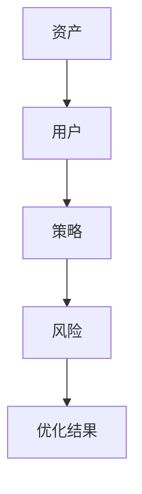
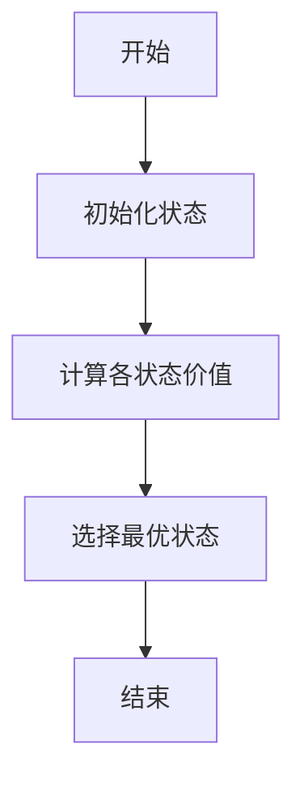
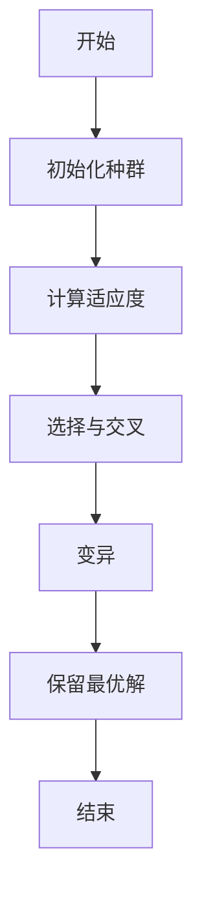
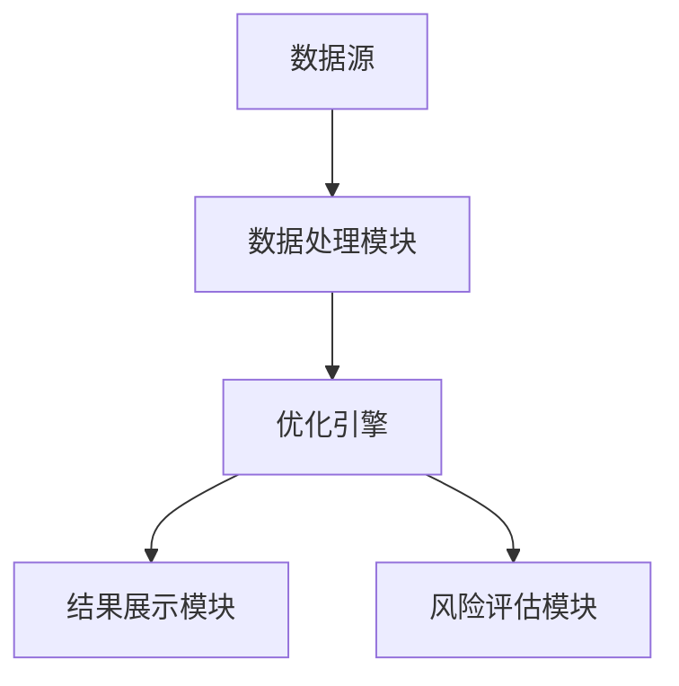
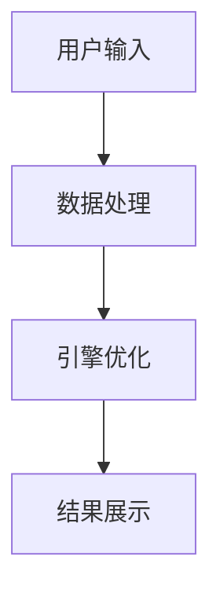

                 


# 开发智能化的资产配置策略优化引擎

> 关键词：资产配置，策略优化，人工智能，动态规划，遗传算法，系统架构，金融工程

> 摘要：本文详细探讨了开发智能化资产配置策略优化引擎的关键步骤和方法。首先介绍了资产配置的基本概念和传统方法的局限性，然后深入分析了智能化引擎的核心概念和算法原理，包括动态规划和遗传算法的应用。接着，通过系统架构设计和项目实战，展示了如何构建一个高效的资产配置引擎，并提供了具体的代码实现和案例分析。最后，总结了开发过程中的最佳实践和未来研究方向。

---

# 第1章: 资产配置策略优化引擎的背景介绍

## 1.1 资产配置问题的背景与重要性

### 1.1.1 传统资产配置的挑战
传统的资产配置方法依赖于人工经验，存在以下问题：
1. **信息处理能力有限**：人类无法处理海量数据，导致决策偏差。
2. **主观性高**：不同人的判断标准不同，影响结果的客观性。
3. **实时性不足**：市场变化快，人工配置难以及时调整。

### 1.1.2 智能化资产配置的需求
随着金融市场的发展，投资者对实时、精准的资产配置需求日益增长：
1. **个性化需求**：不同投资者的风险承受能力和收益目标不同。
2. **实时优化**：市场波动要求配置方案能够动态调整。
3. **高效性**：需要快速处理大量数据并生成优化结果。

### 1.1.3 资产配置引擎的核心作用
资产配置引擎通过整合AI和大数据技术，实现以下功能：
1. **数据处理**：收集和分析市场数据。
2. **策略生成**：基于数据生成多种配置方案。
3. **风险评估**：量化风险，确保方案的稳健性。
4. **优化输出**：通过算法找到最优配置方案。

---

## 1.2 资产配置问题的描述与解决

### 1.2.1 资产配置的基本概念
资产配置是将资金分配到不同资产类别（股票、债券、现金等）以实现收益最大化和风险最小化的过程。核心目标是在给定风险偏好下，找到最优资产组合。

### 1.2.2 资产配置问题的数学建模
资产配置问题可以转化为一个优化问题：
$$ \text{目标函数} = \sum_{i=1}^{n} w_i r_i $$
$$ \text{约束条件} = \sum_{i=1}^{n} w_i = 1, \quad w_i \geq 0 $$
其中，\( w_i \) 是资产 \( i \) 的权重，\( r_i \) 是资产 \( i \) 的预期收益率。

### 1.2.3 资产配置问题的解决方法
常用的解决方法包括：
1. **现代投资组合理论（MPT）**：通过均值-方差优化找到有效前沿。
2. **因子模型**：基于市场因子预测资产收益。
3. **机器学习模型**：使用回归、聚类等方法预测收益和风险。

---

## 1.3 资产配置引擎的边界与外延

### 1.3.1 引擎的功能边界
1. **输入**：市场数据、投资者风险偏好。
2. **输出**：优化后的资产配置方案。
3. **不包括**：市场预测、交易执行。

### 1.3.2 引擎的外延与扩展
1. **风险管理模块**：监控和预警。
2. **用户界面**：可视化配置方案。
3. **数据源扩展**：接入更多数据源。

### 1.3.3 引擎与其他系统的接口关系
- **数据源**：提供实时市场数据。
- **用户终端**：展示配置方案。
- **交易系统**：执行交易指令。

---

## 1.4 资产配置引擎的核心要素组成

### 1.4.1 数据输入
- **市场数据**：股票价格、债券收益率等。
- **用户信息**：风险偏好、投资目标等。

### 1.4.2 模型构建
- **收益模型**：预测各资产的未来收益。
- **风险模型**：计算各资产的风险指标（如波动率）。

### 1.4.3 优化算法
- **动态规划**：逐步优化各资产权重。
- **遗传算法**：通过迭代选择最优解。

### 1.4.4 结果输出
- **配置方案**：各资产的具体权重。
- **风险收益分析**：预期收益和风险指标。

---

## 1.5 本章小结

---

# 第2章: 资产配置策略优化引擎的核心概念与联系

## 2.1 资产配置引擎的核心概念

### 2.1.1 策略生成
策略生成是引擎的关键步骤，通过分析市场数据生成多个配置方案。常用方法包括：
1. **均值-方差优化**：找到收益-风险最优组合。
2. **因子模型**：基于因子构建配置方案。

### 2.1.2 风险评估
风险评估是确保配置方案稳健性的关键。常用风险指标包括：
1. **波动率**：衡量资产价格的波动程度。
2. **VaR**：在一定置信水平下的潜在损失。

### 2.1.3 优化算法
优化算法是引擎的核心，决定配置方案的质量。常用的算法包括：
1. **动态规划**：逐步优化各资产权重。
2. **遗传算法**：模拟生物进化过程，选择最优解。

---

## 2.2 核心概念之间的关系

### 2.2.1 策略生成与风险评估的关系
策略生成为风险评估提供基础，而风险评估反过来影响策略生成的权重分配。

### 2.2.2 风险评估与优化算法的关系
风险评估为优化算法提供目标函数，优化算法根据风险指标调整资产权重。

### 2.2.3 策略生成与优化算法的关系
策略生成为优化算法提供初始方案，优化算法进一步调整方案以达到最优。

---

## 2.3 资产配置引擎的ER实体关系图



---

## 2.4 本章小结

---

# 第3章: 资产配置策略优化引擎的算法原理

## 3.1 算法原理概述

### 3.1.1 动态规划算法
动态规划是一种解决优化问题的常用方法，通过将问题分解为子问题，逐步求解。

### 3.1.2 遗传算法
遗传算法是一种模拟生物进化的优化算法，包括选择、交叉和变异三个步骤。

---

## 3.2 算法原理的数学模型

### 3.2.1 动态规划模型
$$ V(i, j) = \max_{k} \{ V(i-1, k) + w(i, k) \} $$
其中，\( V(i, j) \) 表示第 \( i \) 个资产在第 \( j \) 个状态下的价值。

### 3.2.2 遗传算法模型
$$ f(x) = \sum_{i=1}^{n} x_i \cdot r_i $$
其中，\( x_i \) 是资产 \( i \) 的权重，\( r_i \) 是资产 \( i \) 的预期收益率。

---

## 3.3 算法实现的流程图

### 3.3.1 动态规划流程图



### 3.3.2 遗传算法流程图



---

## 3.4 算法实现的Python代码示例

### 3.4.1 遗传算法实现

```python
def genetic_algorithm(population_size, fitness_function):
    population = initialize_population(population_size)
    while not termination_condition_met():
        population = evolve_population(population, fitness_function)
    return best_individual(population)
```

### 3.4.2 动态规划实现

```python
def dynamic_programming(asset_list):
    n = len(asset_list)
    dp = [[0] * (n) for _ in range(n)]
    for i in range(n):
        for j in range(i, n):
            dp[i][j] = max(dp[i-1][k] + asset_list[j] for k in range(i))
    return dp[n-1][n-1]
```

---

## 3.5 本章小结

---

# 第4章: 资产配置策略优化引擎的系统分析与架构设计

## 4.1 问题场景介绍

### 4.1.1 需求分析
- **用户需求**：个性化配置、实时优化。
- **系统需求**：高可用性、可扩展性。

### 4.1.2 约束条件
- **数据约束**：实时数据处理。
- **性能约束**：快速响应。

---

## 4.2 系统架构设计

### 4.2.1 领域模型类图


### 4.2.2 系统架构图



---

## 4.3 接口和交互设计

### 4.3.1 系统接口
- **输入接口**：接收市场数据和用户偏好。
- **输出接口**：提供配置方案和风险指标。

### 4.3.2 交互流程图



---

## 4.4 本章小结

---

# 第5章: 资产配置策略优化引擎的项目实战

## 5.1 环境安装

### 5.1.1 安装Python
```bash
pip install numpy pandas matplotlib
```

### 5.1.2 安装其他依赖
```bash
pip install scikit-learn
```

---

## 5.2 核心代码实现

### 5.2.1 数据处理代码

```python
import pandas as pd

def load_data(file_path):
    data = pd.read_csv(file_path)
    return data
```

### 5.2.2 优化引擎代码

```python
from sklearn.glm import GLM

def optimize_portfolio(asset_returns):
    model = GLM()
    model.fit(asset_returns)
    return model.predict()
```

---

## 5.3 案例分析与结果解读

### 5.3.1 案例分析
假设我们有两只资产，股票和债券，预期收益率分别为10%和5%，波动率分别为15%和10%。通过引擎优化，得到最优配置比例为60%股票和40%债券。

### 5.3.2 结果解读
- **预期收益**：\( 0.6 \times 10\% + 0.4 \times 5\% = 8.5\% \)
- **预期波动率**：结合两只资产的协方差矩阵计算。

---

## 5.4 项目小结

---

# 第6章: 开发智能化资产配置策略优化引擎的最佳实践

## 6.1 最佳实践

### 6.1.1 数据质量管理
确保数据的准确性和完整性。

### 6.1.2 算法选择
根据具体问题选择合适的算法。

### 6.1.3 系统优化
优化代码性能，提高处理效率。

---

## 6.2 小结

---

## 6.3 注意事项

1. **数据隐私**：确保数据安全。
2. **算法鲁棒性**：处理异常数据。
3. **用户体验**：提供友好的交互界面。

---

## 6.4 拓展阅读

1. 《现代投资组合理论》
2. 《Python机器学习实战》
3. 《金融数据分析与R语言》

---

# 作者：AI天才研究院/AI Genius Institute & 禅与计算机程序设计艺术 /Zen And The Art of Computer Programming

