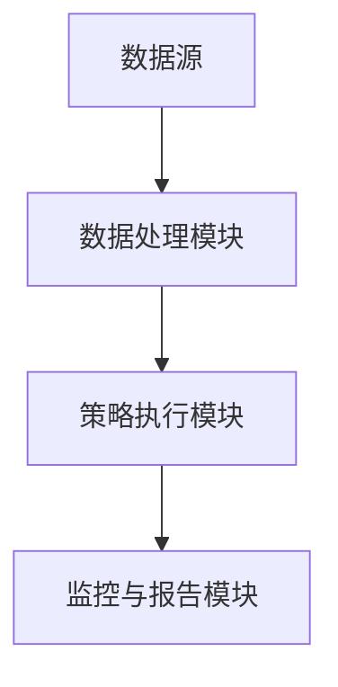
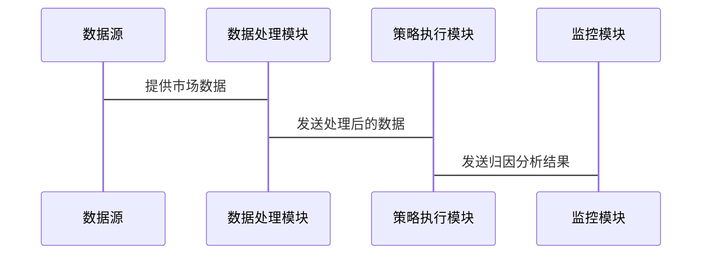

                 


# 开发智能化的资产配置策略动态归因分析引擎

> 关键词：资产配置，动态归因分析，智能化，金融算法，系统架构

> 摘要：本文详细探讨了如何开发智能化的资产配置策略动态归因分析引擎。通过分析资产配置与动态归因分析的核心概念、算法原理、系统架构设计以及实际项目实现，本文为读者提供了一套完整的解决方案，帮助他们在金融领域实现高效、智能的资产配置与风险控制。

---

## 第一部分: 资产配置与动态归因分析概述

### 第1章: 资产配置与动态归因分析的背景与概念

#### 1.1 资产配置的背景与意义
资产配置是指将资金分配到不同的资产类别（如股票、债券、房地产等）以实现投资目标的过程。其核心在于平衡风险与收益，优化投资组合的表现。

##### 1.1.1 金融投资中的资产配置概念
资产配置是金融投资的核心策略之一。通过科学的资产配置，投资者可以在不同市场环境下优化收益，降低风险。

##### 1.1.2 资产配置的重要性与作用
- **分散风险**：通过将资金分配到不同的资产类别，降低单一资产波动带来的风险。
- **优化收益**：根据市场环境动态调整资产配置，捕捉更高的收益机会。

##### 1.1.3 资产配置的分类与应用场景
资产配置可以分为**战略资产配置**（长期战略）和**战术资产配置**（短期调整）。其应用场景包括养老金管理、保险资金配置、机构投资等。

#### 1.2 动态归因分析的定义与特点
动态归因分析是通过实时数据和算法模型，动态调整资产配置策略的过程。

##### 1.2.1 动态归因分析的基本概念
动态归因分析是基于市场环境变化，实时评估资产配置的效果，并进行动态优化的过程。

##### 1.2.2 动态归因分析的核心特点
- **实时性**：根据市场数据实时调整配置策略。
- **动态性**：能够根据市场变化快速响应，优化投资组合。

##### 1.2.3 动态归因分析与静态归因分析的区别
| 特性         | 静态归因分析       | 动态归因分析       |
|--------------|--------------------|--------------------|
| 时间维度     | 静态，固定时间段   | 动态，实时变化     |
| 调整频率     | 低频或固定         | 高频或实时         |
| 数据依赖性   | 历史数据为主       | 实时数据为主       |

#### 1.3 资产配置与动态归因分析的关系
动态归因分析是资产配置的重要组成部分，通过动态调整优化资产配置策略。

##### 1.3.1 资产配置与动态归因分析的内在联系
动态归因分析为资产配置提供实时数据支持和优化建议，而资产配置为动态归因分析提供目标和方向。

##### 1.3.2 动态归因分析在资产配置中的作用
- 提供实时市场数据支持。
- 动态优化资产配置策略。

##### 1.3.3 资产配置策略的动态调整机制
- 根据市场波动调整权重。
- 根据风险指标动态优化配置。

---

### 第2章: 资产配置策略的动态归因分析框架

#### 2.1 资产配置策略的核心要素
##### 2.1.1 资产类别划分
资产类别划分是资产配置的基础，常见的资产类别包括股票、债券、现金等。

##### 2.1.2 风险与收益的平衡
资产配置需要在风险与收益之间找到最佳平衡点。

##### 2.1.3 时间维度与市场环境的影响
时间维度和市场环境是影响资产配置的重要因素，需要动态调整。

#### 2.2 动态归因分析的框架设计
##### 2.2.1 数据采集与处理流程
数据采集是动态归因分析的基础，需要实时获取市场数据并进行预处理。

##### 2.2.2 策略执行与监控机制
通过策略执行系统实时监控市场变化，并根据归因分析结果动态调整配置。

##### 2.2.3 归因分析的指标体系
归因分析需要建立完善的指标体系，包括收益归因、风险归因等。

#### 2.3 资产配置策略的动态调整模型
##### 2.3.1 动态调整的驱动因素
市场波动、宏观经济指标、投资者风险偏好等都是驱动因素。

##### 2.3.2 调整规则与优化算法
通过动态规划、遗传算法等优化算法实现资产配置的动态调整。

##### 2.3.3 模型的验证与评估方法
通过回测、风险指标评估等方法验证模型的有效性。

---

## 第二部分: 资产配置策略的动态归因分析算法原理

### 第3章: 动态归因分析的核心算法

#### 3.1 动态规划算法
##### 3.1.1 动态规划的基本原理
动态规划是一种通过分解问题并存储子问题的解来优化决策过程的算法。

##### 3.1.2 在资产配置中的应用
动态规划可以用于优化资产配置的权重分配。

##### 3.1.3 算法实现与优化
通过动态规划算法实现资产配置的动态调整，并通过优化算法提升效率。

#### 3.2 蒙特卡洛模拟算法
##### 3.2.1 蒙特卡洛模拟的基本原理
蒙特卡洛模拟是一种通过随机采样来估计复杂问题的数值方法。

##### 3.2.2 在风险评估中的应用
蒙特卡洛模拟可以用于评估资产配置的风险。

##### 3.2.3 算法实现与案例分析
通过Python代码实现蒙特卡洛模拟，并分析其在资产配置中的应用案例。

#### 3.3 时间序列分析算法
##### 3.3.1 时间序列分析的基本原理
时间序列分析是通过分析数据的时序特征来预测未来趋势的方法。

##### 3.3.2 在趋势预测中的应用
时间序列分析可以用于预测资产价格的趋势。

##### 3.3.3 算法实现与优化
通过ARIMA模型等方法实现时间序列分析，并优化模型性能。

---

### 第4章: 资产配置策略的数学模型与公式

#### 4.1 资产配置的数学模型
##### 4.1.1 优化目标函数
$$ \text{目标函数} = \max \left( \sum_{i=1}^{n} w_i r_i - \lambda \sum_{i=1}^{n} w_i^2 \right) $$
其中，\( w_i \) 是资产 \( i \) 的权重，\( r_i \) 是资产 \( i \) 的预期收益，\( \lambda \) 是风险惩罚系数。

##### 4.1.2 约束条件
$$ \sum_{i=1}^{n} w_i = 1 $$
$$ w_i \geq 0 \quad \text{对所有} \ i $$

#### 4.2 动态归因分析的数学公式
##### 4.2.1 收益归因公式
$$ \text{收益归因} = \sum_{i=1}^{n} w_i (r_i - r_{\text{基准}}) $$

##### 4.2.2 风险归因公式
$$ \text{风险归因} = \sum_{i=1}^{n} w_i^2 \sigma_i^2 $$

---

## 第三部分: 资产配置策略动态归因分析引擎的系统架构设计

### 第5章: 系统分析与架构设计

#### 5.1 问题场景介绍
动态归因分析引擎需要实时处理大量金融数据，并根据算法模型动态调整资产配置策略。

#### 5.2 系统功能设计
##### 5.2.1 数据获取模块
- 实时获取市场数据。
- 数据预处理与清洗。

##### 5.2.2 策略执行模块
- 根据归因分析结果动态调整配置。
- 执行交易指令。

##### 5.2.3 监控与报告模块
- 实时监控系统运行状态。
- 生成归因分析报告。

#### 5.3 系统架构设计
##### 5.3.1 系统架构图


##### 5.3.2 接口设计
- 数据接口：REST API。
- 策略接口：基于消息队列的异步调用。

##### 5.3.3 交互流程


---

## 第四部分: 资产配置策略动态归因分析引擎的项目实战

### 第6章: 项目实战

#### 6.1 环境安装与配置
##### 6.1.1 Python环境搭建
安装Python、Jupyter Notebook、Pandas、NumPy等库。

##### 6.1.2 数据源接入
使用Yahoo Finance API获取实时数据。

#### 6.2 核心功能实现
##### 6.2.1 数据处理模块
```python
import pandas as pd

# 获取数据
data = pd.DataFrame(yahoo_data.get_data('AAPL'))
# 数据清洗
data.dropna(inplace=True)
```

##### 6.2.2 策略执行模块
```python
from sklearn import linear_model

# 训练模型
model = linear_model.LinearRegression()
model.fit(X, y)
```

##### 6.2.3 监控与报告模块
```python
import matplotlib.pyplot as plt

# 绘制图表
plt.plot(data['price'], label='资产价格')
plt.xlabel('时间')
plt.ylabel('价格')
plt.legend()
plt.show()
```

#### 6.3 项目小结
通过项目实战，我们掌握了动态归因分析引擎的核心实现步骤。

---

## 第五部分: 资产配置策略动态归因分析引擎的最佳实践

### 第7章: 最佳实践与注意事项

#### 7.1 数据质量的重要性
数据清洗和预处理是确保模型准确性的关键。

#### 7.2 模型调优与优化
通过回测和风险指标评估优化模型性能。

#### 7.3 系统性能优化
采用分布式架构提升系统处理能力。

#### 7.4 注意事项
- 数据隐私与安全。
- 系统的实时性和稳定性。

---

## 结语

开发智能化的资产配置策略动态归因分析引擎是一项复杂的系统工程，需要结合金融知识、算法优化和系统架构设计。通过本文的详细讲解，读者可以系统地掌握从理论到实践的完整流程。

---

**作者：AI天才研究院/AI Genius Institute & 禅与计算机程序设计艺术 /Zen And The Art of Computer Programming**

