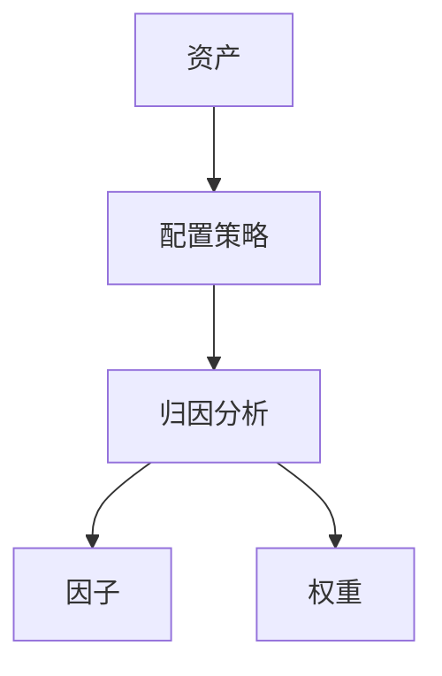
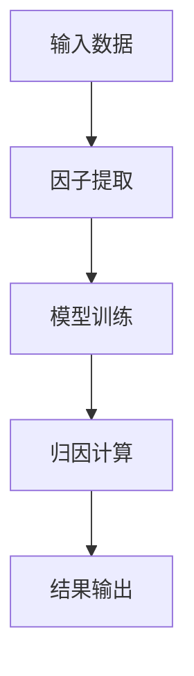
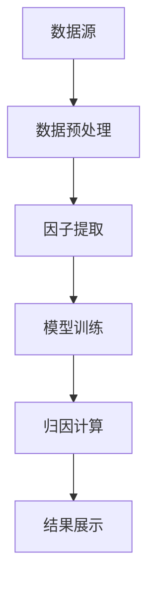

                 


# 开发智能化的资产配置策略归因分析引擎

> 关键词：资产配置，归因分析，人工智能，投资组合管理，量化交易，系统架构

> 摘要：本文详细探讨了开发智能化的资产配置策略归因分析引擎的过程，结合机器学习和统计学方法，分析投资组合的表现，帮助投资者优化资产配置。文章从背景、核心概念、算法原理到系统架构，再到项目实战，全面阐述了开发过程中的关键点和技术实现。

---

## 第一章：资产配置策略归因分析引擎的背景与问题背景

### 1.1 资产配置策略归因分析引擎的定义

#### 1.1.1 问题背景与问题描述

在金融领域，资产配置是决定投资组合表现的核心因素之一。然而，如何准确分析投资组合表现的驱动因素，一直是投资者面临的挑战。传统的归因分析方法通常依赖于手动分析和单一因子模型，存在效率低、维度有限的问题。随着人工智能和大数据技术的发展，开发智能化的归因分析引擎成为可能。

#### 1.1.2 问题解决方法与边界

通过引入机器学习算法，如因子分解模型和随机森林，可以自动提取多因子，并进行非线性关系分析。归因分析引擎能够实时处理海量数据，提供多维度的归因结果，帮助投资者优化资产配置策略。

#### 1.1.3 核心概念与外延

归因分析：通过对投资组合表现的分解，识别各因子对收益的贡献度。资产配置策略：根据市场情况调整各类资产的投资比例，以实现收益目标。

### 1.2 资产配置策略归因分析引擎的特点

#### 1.2.1 数据驱动与智能化

引擎基于大数据和机器学习，能够自动识别复杂的投资关系，提供精准的归因结果。

#### 1.2.2 多因子模型与策略分解

采用多因子模型，分解投资组合的表现，识别不同因子对收益的贡献。

#### 1.2.3 高效计算与实时性

引擎能够快速处理数据，提供实时归因分析结果，帮助投资者及时调整策略。

---

## 第二章：核心概念与联系

### 2.1 核心概念原理

#### 2.1.1 资产配置策略的定义与分类

资产配置策略包括战略资产配置和战术资产配置。战略配置基于长期投资目标，而战术配置根据市场变化进行短期调整。

#### 2.1.2 归因分析的定义与方法

归因分析是将投资组合的表现分解为各个因子的贡献，常用的方法包括因子分解模型和随机森林算法。

### 2.2 核心概念对比分析

#### 2.2.1 多因子模型与单因子模型对比

| 对比维度 | 多因子模型 | 单因子模型 |
|----------|-------------|------------|
| 解释性   | 较高         | 较低       |
| 精度     | 较高         | 较低       |
| 计算复杂度| 较高         | 较低       |

#### 2.2.2 线性回归与非线性回归对比

| 对比维度 | 线性回归     | 非线性回归   |
|----------|--------------|--------------|
| 假设      | 线性关系       | 非线性关系     |
| 模型复杂度| 较低          | 较高          |

#### 2.2.3 时间序列分析与截面数据分析对比

时间序列分析关注数据随时间的变化，截面数据分析关注同一时间点的不同变量。

### 2.3 实体关系图



---

## 第三章：算法原理与实现

### 3.1 算法原理

#### 3.1.1 因子分解模型

因子分解模型通过奇异值分解（SVD）提取数据中的主要因子，表示为：

$$
X = U \cdot S \cdot V^T
$$

其中，U和V是正交矩阵，S是对角矩阵，对角线元素是因子的权重。

#### 3.1.2 随机森林算法

随机森林通过构建多个决策树，并行处理数据，提高模型的鲁棒性。预测结果通过投票或加权平均得到。

### 3.2 算法流程图



### 3.3 算法实现

#### 3.3.1 因子分解模型代码

```python
import numpy as np

def factor_decomposition(data):
    factors = data.columns
    U, S, V = np.linalg.svd(data.values)
    return U, S, V
```

#### 3.3.2 随机森林代码

```python
from sklearn.ensemble import RandomForestRegressor

model = RandomForestRegressor(n_estimators=100)
model.fit(X_train, y_train)
```

---

## 第四章：系统分析与架构设计

### 4.1 系统分析

#### 4.1.1 项目背景

开发一个智能化的归因分析引擎，旨在提高资产配置的效率和准确性。

#### 4.1.2 系统功能设计

引擎功能包括数据处理、因子提取、模型训练、归因计算和结果展示。

### 4.2 系统架构设计



### 4.3 接口设计

系统提供API接口，方便外部调用归因分析功能。

---

## 第五章：项目实战

### 5.1 环境安装

安装Python和相关库，如numpy、pandas、scikit-learn。

### 5.2 核心代码实现

#### 5.2.1 因子分解代码

```python
import numpy as np

def factor_decomposition(data):
    U, S, V = np.linalg.svd(data.values)
    return U, S, V
```

#### 5.2.2 随机森林代码

```python
from sklearn.ensemble import RandomForestRegressor

model = RandomForestRegressor(n_estimators=100)
model.fit(X_train, y_train)
```

### 5.3 案例分析

以股票数据为例，进行因子分解和归因分析，展示结果。

---

## 第六章：最佳实践和小结

### 6.1 小结

归因分析引擎能够帮助投资者优化资产配置，提升投资组合的表现。

### 6.2 注意事项

确保数据质量和模型的实时性，定期更新模型参数。

### 6.3 拓展阅读

推荐相关书籍和论文，深入学习归因分析和机器学习技术。

---

## 附录：数据集与工具资源

### 附录A：数据集

提供用于训练和测试的金融数据集。

### 附录B：工具资源

推荐使用的Python库和开发工具。

---

## 作者：AI天才研究院/AI Genius Institute & 禅与计算机程序设计艺术 /Zen And The Art of Computer Programming

