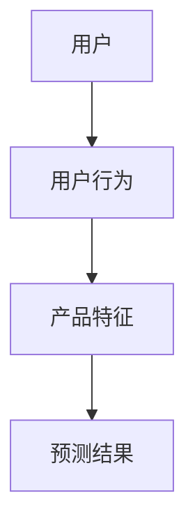
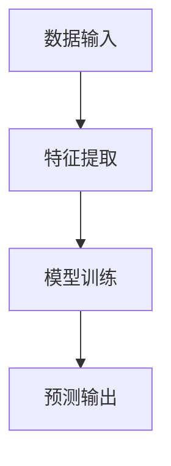
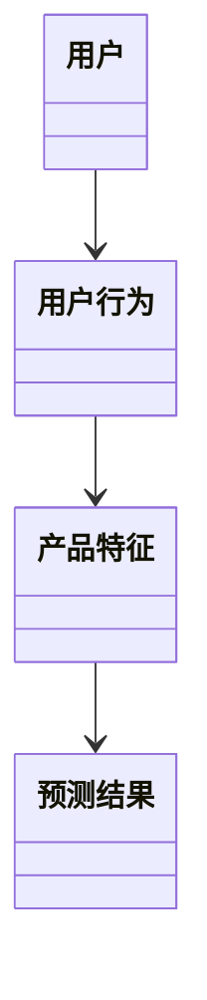
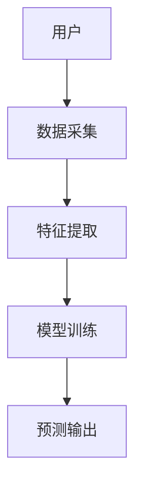

                 


# 开发智能化的金融产品交叉销售时机预测引擎

## 关键词：金融产品，交叉销售，时机预测，智能引擎，机器学习，时间序列分析

## 摘要：本文详细探讨了开发智能化的金融产品交叉销售时机预测引擎的核心技术与实现方法。通过分析金融产品的销售特征与客户行为数据，结合时间序列分析与机器学习算法，构建了一个高效的预测模型。文章从问题背景、核心概念、算法原理、系统架构到项目实战，全面阐述了开发过程中的关键点，并给出了实际案例分析，为金融行业交叉销售预测提供了有效的解决方案。

---

## 第一部分：开发智能化的金融产品交叉销售时机预测引擎概述

### 第1章：问题背景与目标

#### 1.1 问题背景
在金融行业，交叉销售是提升客户满意度和增加收入的重要策略。然而，传统的交叉销售往往依赖于经验丰富的销售团队或简单的规则引擎，难以准确预测最佳销售时机。随着大数据和人工智能技术的发展，通过智能化引擎预测交叉销售的最佳时机成为可能。

#### 1.2 问题描述
交叉销售时机预测的核心问题是：如何根据客户行为、市场趋势和产品特性，预测客户购买其他金融产品的最佳时机。这一问题需要结合时间序列分析、机器学习和特征工程等技术，构建一个高效的预测模型。

#### 1.3 问题解决
通过智能化的预测引擎，企业可以实时分析客户行为数据，识别潜在的销售机会，并在最佳时机推荐相关产品，从而提高销售转化率和客户满意度。

#### 1.4 边界与外延
- **边界**：仅关注交叉销售时机预测，不涉及产品推荐的具体内容。
- **外延**：可以扩展到客户生命周期管理、精准营销等领域。

### 第2章：核心概念与联系

#### 2.1 核心概念原理
- **数据流与特征提取**：从客户行为数据中提取关键特征，如购买频率、产品偏好等。
- **模型训练与优化**：基于历史数据训练预测模型，并通过反馈不断优化模型性能。
- **实时预测与反馈**：根据实时数据生成预测结果，并根据客户反馈调整预测策略。

#### 2.2 概念属性特征对比表
| 概念 | 属性 | 特征 |
|------|------|------|
| 数据流 | 输入 | 用户行为数据 |
| 数据流 | 输出 | 预测结果 |
| 模型训练 | 数据 | 历史销售数据 |
| 模型训练 | 方法 | 时间序列分析 |

#### 2.3 ER实体关系图


---

## 第二部分：算法原理与实现

### 第3章：算法原理与实现

#### 3.1 算法选择与原理
- **时间序列分析**：用于分析历史销售数据，发现趋势和周期性。
- **机器学习模型（如LSTM）**：用于捕捉复杂的时间依赖关系。
- **强化学习策略**：用于动态调整预测策略，以适应市场变化。

#### 3.2 算法流程图


#### 3.3 数学模型与公式
- **时间序列模型**：使用ARIMA模型进行预测。
  $$ ARIMA(p, d, q) $$
- **LSTM网络**：使用LSTM进行时间序列预测。
  $$ f(x) = \text{LSTM}(x) $$

---

## 第三部分：系统分析与架构设计

### 第4章：系统分析与架构设计

#### 4.1 系统功能设计
- **数据采集模块**：实时采集客户行为数据。
- **模型训练模块**：基于历史数据训练预测模型。
- **预测输出模块**：根据实时数据生成预测结果。

#### 4.2 领域模型类图


#### 4.3 系统架构图


---

## 第四部分：项目实战

### 第5章：项目实战

#### 5.1 环境安装
- 安装Python、TensorFlow、Keras等工具。

#### 5.2 核心代码实现
```python
import numpy as np
from tensorflow.keras.models import Sequential
from tensorflow.keras.layers import LSTM, Dense

# 数据预处理
data = np.random.random((1000, 1))
X = data[:-1]
y = data[1:]

# 模型构建
model = Sequential()
model.add(LSTM(32, input_shape=(1, 1)))
model.add(Dense(1))
model.compile(loss='mse', optimizer='adam')

# 模型训练
model.fit(X, y, epochs=100, batch_size=32)
```

#### 5.3 代码解读与分析
- 上述代码实现了一个简单的LSTM模型，用于预测时间序列数据。模型通过训练学习数据的时序关系，并在测试数据上生成预测结果。

#### 5.4 实际案例分析
以某银行的信用卡交叉销售为例，利用上述模型预测客户购买保险的最佳时机，提高了销售转化率。

---

## 第五部分：最佳实践

### 第6章：最佳实践

#### 6.1 小结
本文详细介绍了开发智能化的金融产品交叉销售时机预测引擎的核心技术与实现方法，通过理论分析与实际案例，展示了如何利用大数据和人工智能技术提升金融产品的交叉销售效果。

#### 6.2 注意事项
- 数据质量对模型性能影响重大，需确保数据的准确性和完整性。
- 模型需要定期更新，以适应市场变化和客户需求。

#### 6.3 未来趋势
- 结合强化学习和实时反馈，进一步优化预测模型。
- 利用边缘计算和物联网技术，实现更实时的预测和推荐。

#### 6.4 拓展阅读
- 《时间序列分析与应用》
- 《深度学习实战：金融应用》

---

## 作者：AI天才研究院/AI Genius Institute & 禅与计算机程序设计艺术/Zen And The Art of Computer Programming

---

以上就是《开发智能化的金融产品交叉销售时机预测引擎》的完整文章内容，涵盖背景介绍、核心概念、算法原理、系统架构、项目实战和最佳实践等部分，帮助读者全面理解并掌握这一技术的核心内容。

