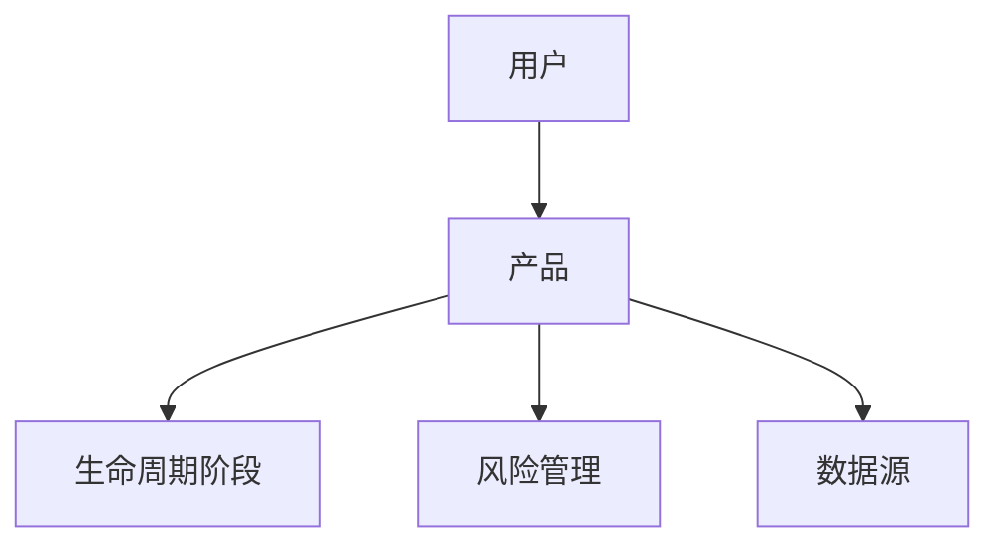
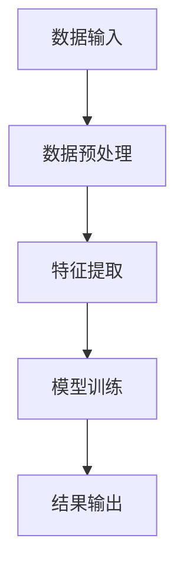
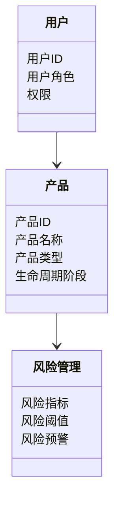
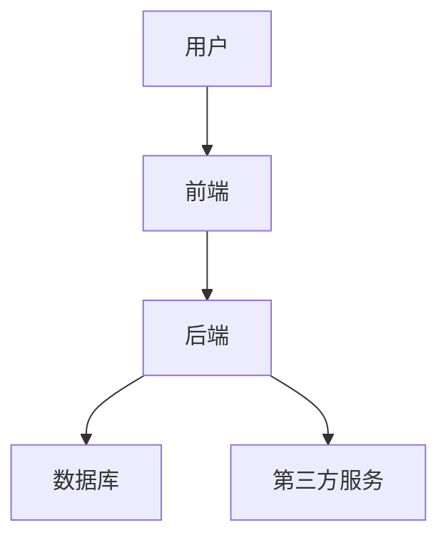
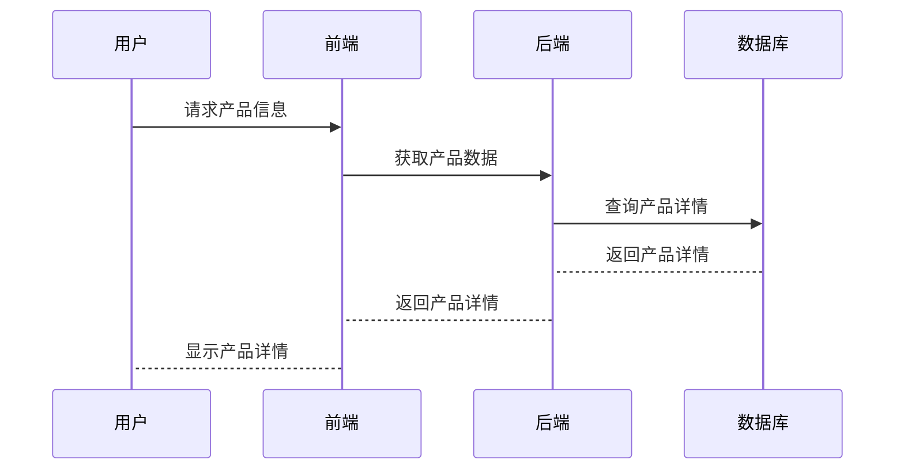

                 


# 开发智能化的金融产品生命周期管理平台

> 关键词：金融产品生命周期管理、智能化、机器学习、自然语言处理、系统架构设计

> 摘要：本文详细探讨了开发智能化的金融产品生命周期管理平台的核心技术与方法，涵盖背景分析、核心概念、算法原理、系统架构设计、项目实战以及最佳实践等内容，旨在为金融行业的数字化转型提供理论支持和实践指导。

---

## 第1章: 金融产品生命周期管理平台的背景与意义

### 1.1 金融产品生命周期管理的背景

#### 1.1.1 传统金融产品管理的挑战
传统金融产品管理存在以下问题：
- 手工操作繁琐，效率低下
- 数据分散，难以统一管理
- 风险预测能力不足
- 缺乏智能化决策支持

#### 1.1.2 智能化管理的必要性
随着金融科技的发展，智能化管理成为必然趋势：
- 提高管理效率和准确性
- 降低人工成本
- 实现风险预测和预警
- 提供实时数据支持的决策能力

#### 1.1.3 金融行业数字化转型的现状
当前，金融行业正在经历数字化转型，智能化管理是其中的重要组成部分：
- 数据驱动的决策越来越普及
- 人工智能技术广泛应用
- 云计算和大数据技术支撑金融业务创新

### 1.2 问题背景与问题描述

#### 1.2.1 传统金融产品管理中的痛点
传统管理方式存在以下痛点：
- 缺乏统一的管理平台
- 数据孤岛现象严重
- 风险控制能力不足
- 无法实时跟踪产品生命周期

#### 1.2.2 智能化管理的需求
智能化管理的需求主要体现在：
- 实时监控和分析产品数据
- 自动化风险预警
- 智能化决策支持
- 个性化的产品推荐

#### 1.2.3 问题的边界与外延
平台的边界包括：
- 产品生命周期的全阶段管理
- 数据的实时采集与分析
- 风险控制的自动化
- 决策支持的智能化

平台的外延包括：
- 与第三方系统的集成
- 数据安全与隐私保护
- 用户权限管理

### 1.3 问题解决与平台目标

#### 1.3.1 智能化管理的核心目标
平台的核心目标是：
- 提供全生命周期的产品管理支持
- 实现数据驱动的智能化决策
- 提高风险管理的准确性和及时性
- 优化产品开发和运营效率

#### 1.3.2 平台的功能定位
平台的功能定位包括：
- 数据采集与处理模块
- 风险分析与预警模块
- 决策支持模块
- 报告生成与展示模块

#### 1.3.3 平台的预期价值
平台的预期价值体现在：
- 提高金融产品的市场竞争力
- 降低运营成本
- 提升客户满意度
- 推动金融行业的数字化转型

### 1.4 本章小结
本章主要介绍了金融产品生命周期管理平台的背景与意义，分析了传统管理的痛点，阐述了智能化管理的必要性，并明确了平台的目标和价值。

---

## 第2章: 核心概念与原理

### 2.1 智能化管理的核心概念

#### 2.1.1 金融产品生命周期模型
金融产品生命周期模型包括以下几个阶段：
1. **产品设计阶段**：包括需求分析、产品设计、风险评估等
2. **产品开发阶段**：包括编码实现、测试、上线等
3. **产品运营阶段**：包括监控、维护、优化等
4. **产品终止阶段**：包括退市、数据归档等

#### 2.1.2 智能化管理的实现机制
智能化管理的实现机制包括：
- 数据采集与处理
- 数据分析与建模
- 智能决策支持
- 自动化执行

#### 2.1.3 数据驱动的决策支持
数据驱动的决策支持包括：
- 数据可视化
- 预测分析
- 实时监控
- 自适应优化

### 2.2 核心概念的属性特征对比

#### 2.2.1 传统管理与智能化管理的对比
| 特性 | 传统管理 | 智能化管理 |
|------|----------|------------|
| 数据处理 | 手工处理 | 自动化处理 |
| 决策方式 | 经验驱动 | 数据驱动 |
| 效率 | 低效 | 高效 |

#### 2.2.2 数据驱动与规则驱动的对比
| 特性 | 数据驱动 | 规则驱动 |
|------|----------|------------|
| 决策依据 | 数据分析 | 预定义规则 |
| 灵活性 | 高 | 低 |
| 适应性 | 强 | 弱 |

#### 2.2.3 人工干预与自动化的对比
| 特性 | 人工干预 | 自动化 |
|------|----------|------------|
| 效率 | 低 | 高 |
| 准确性 | 受人为因素影响 | 较高 |
| 成本 | 高 | 低 |

### 2.3 实体关系图（ER图）



### 2.4 本章小结
本章详细讲解了金融产品生命周期管理平台的核心概念，包括金融产品生命周期模型、智能化管理的实现机制，以及数据驱动的决策支持。通过对比分析，明确了智能化管理的优势和必要性。

---

## 第3章: 算法原理与实现

### 3.1 算法原理

#### 3.1.1 机器学习在金融产品管理中的应用
机器学习在金融产品管理中的应用包括：
- 风险预测
- 客户画像
- 产品推荐

#### 3.1.2 自然语言处理在文档管理中的应用
自然语言处理在文档管理中的应用包括：
- 文本分类
- 实体识别
- 情感分析

#### 3.1.3 时间序列分析在风险预测中的应用
时间序列分析在风险预测中的应用包括：
- 趋势预测
- 异常检测
- 预测模型优化

### 3.2 算法流程图



### 3.3 数学模型与公式

#### 3.3.1 线性回归模型
$$ y = \beta_0 + \beta_1x + \epsilon $$

#### 3.3.2 分类模型
$$ P(y|X) = \frac{e^{\beta X}}{1 + e^{\beta X}} $$

#### 3.3.3 聚类模型
$$ d(x_i, x_j) = \sqrt{(x_i - x_j)^2} $$

### 3.4 举例说明

#### 3.4.1 风险预测的线性回归案例
假设我们有一个金融产品的历史数据，包括收益率、风险指标等，可以通过线性回归模型预测未来的产品风险。

#### 3.4.2 文本分类的朴素贝叶斯案例
使用朴素贝叶斯算法对金融产品的描述文本进行分类，识别出高风险产品。

### 3.5 本章小结
本章详细讲解了机器学习和自然语言处理在金融产品管理中的应用，通过流程图和数学公式，明确了算法的实现步骤和应用场景。

---

## 第4章: 系统分析与架构设计

### 4.1 问题场景介绍

#### 4.1.1 项目背景
本项目旨在开发一个智能化的金融产品生命周期管理平台，实现产品全生命周期的智能化管理。

#### 4.1.2 项目介绍
项目目标是通过智能化技术提升金融产品的管理效率和风险控制能力。

### 4.2 系统功能设计

#### 4.2.1 领域模型类图



### 4.3 系统架构设计

#### 4.3.1 系统架构图



#### 4.3.2 系统接口设计
- 用户接口：API接口用于用户登录、产品查询等操作
- 数据接口：与第三方数据源对接，获取实时数据

### 4.4 系统交互流程

#### 4.4.1 序列图



### 4.5 本章小结
本章详细分析了系统的功能设计和架构设计，明确了系统的模块划分和组件之间的交互关系。

---

## 第5章: 项目实战

### 5.1 环境安装

#### 5.1.1 开发环境
- 操作系统：Linux/Windows/MacOS
- 开发工具：Python、Jupyter Notebook、VS Code
- 数据库：MySQL/PostgreSQL
- 开发框架：Django/Flask

### 5.2 系统核心实现源代码

#### 5.2.1 数据处理模块

```python
import pandas as pd

def load_data(file_path):
    df = pd.read_csv(file_path)
    return df

def preprocess_data(df):
    # 数据清洗和特征提取
    df.dropna(inplace=True)
    df['date'] = pd.to_datetime(df['date'])
    return df

if __name__ == "__main__":
    df = load_data("data.csv")
    df = preprocess_data(df)
    print(df.head())
```

#### 5.2.2 风险预测模块

```python
from sklearn.linear_model import LinearRegression

def train_model(X, y):
    model = LinearRegression()
    model.fit(X, y)
    return model

def predict_risk(model, new_X):
    return model.predict(new_X)

if __name__ == "__main__":
    # 假设X和y已经准备好
    model = train_model(X, y)
    prediction = predict_risk(model, new_X)
    print(prediction)
```

### 5.3 代码应用解读与分析

#### 5.3.1 数据处理模块解读
- `load_data`函数用于加载数据文件
- `preprocess_data`函数进行数据清洗和特征提取

#### 5.3.2 风险预测模块解读
- `train_model`函数训练模型
- `predict_risk`函数进行风险预测

### 5.4 实际案例分析

#### 5.4.1 案例背景
假设我们有一个金融产品的历史数据，包括收益率、风险指标等。

#### 5.4.2 数据处理与分析
加载数据并进行预处理，提取关键特征。

#### 5.4.3 模型训练与预测
使用线性回归模型训练并预测未来的产品风险。

### 5.5 本章小结
本章通过实际案例分析，展示了如何在开发过程中应用数据处理和模型训练的代码，明确了系统实现的具体步骤和方法。

---

## 第6章: 最佳实践、小结与展望

### 6.1 最佳实践 tips

#### 6.1.1 数据处理
- 确保数据的准确性和完整性
- 及时更新数据源
- 采用适当的数据清洗方法

#### 6.1.2 系统设计
- 模块化设计，便于扩展和维护
- 采用微服务架构，提高系统的灵活性
- 确保系统的高可用性和安全性

#### 6.1.3 算法优化
- 定期更新模型，确保预测的准确性
- 结合多种算法，提高系统的鲁棒性
- 使用超参数优化技术，提升模型性能

### 6.2 项目小结
本项目通过智能化技术，成功实现了金融产品生命周期的全阶段管理，提高了管理效率和风险控制能力。

### 6.3 注意事项
- 数据隐私和安全问题需要高度重视
- 系统的可扩展性和维护性需要充分考虑
- 模型的实时性和准确性需要不断优化

### 6.4 拓展阅读
- 《机器学习实战》
- 《深度学习入门》
- 《金融风险管理》

### 6.5 本章小结
本章总结了项目开发中的最佳实践，分析了项目的小结和未来展望，并提供了拓展阅读的建议。

---

## 作者：AI天才研究院/AI Genius Institute & 禅与计算机程序设计艺术 /Zen And The Art of Computer Programming

---

以上是《开发智能化的金融产品生命周期管理平台》的完整目录大纲和部分章节内容，涵盖了从背景分析到系统实现的各个方面，旨在为读者提供全面的技术指导和实践参考。

