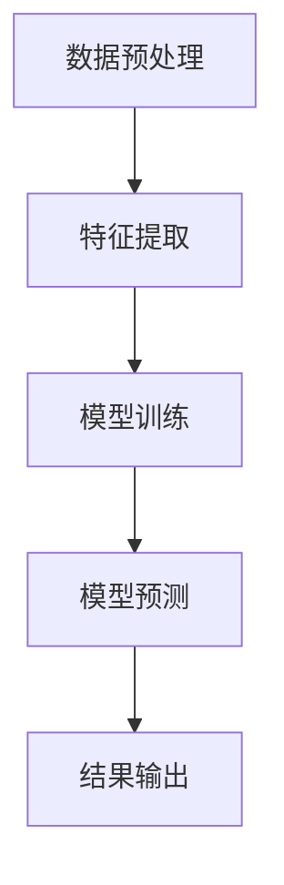
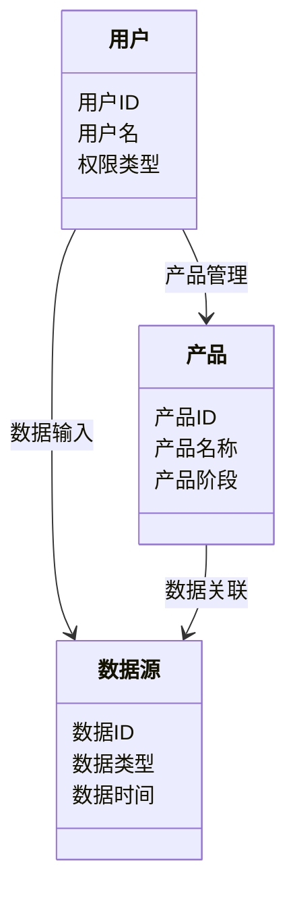
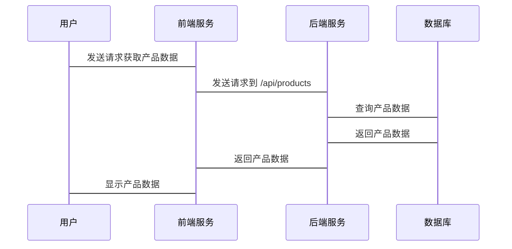

                 


# 开发智能化的金融产品生命周期管理平台

## 关键词
- 金融产品生命周期
- 人工智能
- 大数据
- 系统架构
- 机器学习

## 摘要
智能化的金融产品生命周期管理平台利用人工智能和大数据技术，优化金融产品的开发、管理和监控流程。通过机器学习算法和自然语言处理技术，平台能够实时分析市场动态和用户反馈，帮助金融机构提高产品开发效率、降低风险，并提升用户体验。本文将详细探讨平台的开发背景、核心概念、算法原理、系统架构以及实际应用案例。

---

# 第一部分：背景与核心概念

## 第1章：背景介绍与问题背景

### 1.1 问题背景

#### 1.1.1 传统金融产品管理的痛点
- 数据分散：金融机构内部数据孤岛问题严重，难以实现高效的数据整合与分析。
- 低效开发：传统金融产品开发周期长，依赖人工经验，难以快速响应市场变化。
- 风险控制：传统方法难以实时捕捉市场风险，导致产品失败率较高。

#### 1.1.2 金融行业数字化转型的需求
- 金融机构需要通过数字化转型提高效率、降低成本。
- 用户需求日益多样化，要求产品快速迭代。

#### 1.1.3 AI与大数据技术的驱动作用
- 人工智能和大数据技术为金融行业提供了新的解决方案。
- 自然语言处理和机器学习技术能够提升产品描述的分析能力。

### 1.2 问题描述

#### 1.2.1 金融产品生命周期管理的复杂性
- 产品开发涉及多个阶段，包括设计、测试、上线和监控。
- 每个阶段都需要大量数据支持，且数据来源多样。

#### 1.2.2 传统系统在效率与精准度上的不足
- 传统系统难以实时处理海量数据，导致决策延迟。
- 系统缺乏智能化，难以预测市场变化和用户需求。

#### 1.2.3 数据孤岛与信息不透明的问题
- 数据分散在不同部门，导致信息孤岛。
- 缺乏统一的数据管理平台，影响决策效率。

### 1.3 问题解决与边界

#### 1.3.1 智能化平台的目标与核心任务
- 提供智能化的金融产品生命周期管理。
- 实现实时数据分析和预测，提升产品开发效率。

#### 1.3.2 平台的边界与外延
- 界定平台的功能范围，避免越界。
- 扩展平台的应用场景，例如客户画像和风险评估。

#### 1.3.3 核心要素与组成结构
- 平台由数据层、算法层、业务层组成。

## 第2章：核心概念与系统架构

### 2.1 核心概念原理

#### 2.1.1 智能化金融产品管理平台的定义
- 平台通过AI和大数据技术优化金融产品管理流程。

#### 2.1.2 平台的核心功能模块
- 数据采集与处理：整合多源数据。
- 智能分析：利用机器学习和自然语言处理技术进行预测和描述。
- 产品生命周期管理：跟踪产品从设计到终止的全过程。

#### 2.1.3 平台的用户角色与权限体系
- 用户角色包括普通用户、管理员和开发者。
- 权限体系确保数据安全和操作合规。

### 2.2 核心概念对比表

| **核心功能** | **传统系统** | **智能化平台** |
|--------------|--------------|----------------|
| 数据处理能力 | 低效、延迟 | 实时、高效     |
| 用户体验     | 简单、单一 | 个性化、丰富   |
| 风险控制     | 事后、被动 | 实时、主动     |

### 2.3 ER实体关系图

```mermaid
erDiagram
    user [用户] {
        <属性> 用户ID
        <属性> 用户名
        <属性> 权限类型
    }
    product [金融产品] {
        <属性> 产品ID
        <属性> 产品名称
        <属性> 产品阶段
    }
    data_source [数据源] {
        <属性> 数据ID
        <属性> 数据类型
        <属性> 数据时间
    }
    user --> product : 管理与操作
    user --> data_source : 数据输入与查询
    product --> data_source : 数据关联与分析
```

---

# 第二部分：算法原理与实现

## 第3章：算法原理与实现

### 3.1 算法原理

#### 3.1.1 机器学习在金融产品预测中的应用
- 用于产品生命周期预测和市场趋势分析。

#### 3.1.2 自然语言处理在产品描述分析中的应用
- 分析产品描述文本，提取关键词和情感倾向。

#### 3.1.3 时间序列分析在产品生命周期预测中的应用
- 预测产品在不同阶段的市场表现。

### 3.2 算法流程图



### 3.3 代码实现

#### 3.3.1 机器学习模型代码示例

```python
import numpy as np
from sklearn.linear_model import LinearRegression

# 示例数据
X = np.array([[1], [2], [3], [4], [5]])
y = np.array([2, 4, 5, 4, 7])

# 训练模型
model = LinearRegression()
model.fit(X, y)

# 预测
print(model.predict([[6]]))
```

#### 3.3.2 算法的数学模型

$$ y = \beta_0 + \beta_1 x + \epsilon $$

其中，$\beta_0$ 是截距，$\beta_1$ 是斜率，$\epsilon$ 是误差项。

---

# 第三部分：系统分析与架构设计

## 第4章：系统分析与架构设计

### 4.1 问题场景介绍

#### 4.1.1 金融机构的痛点
- 数据分散，难以统一管理。
- 产品开发周期长，难以快速响应市场需求。

### 4.2 系统功能设计

#### 4.2.1 领域模型类图



### 4.3 系统架构设计

#### 4.3.1 平台架构图

```mermaid
docker
    service 前端服务 {
        image nginx:latest
        ports:
            - "80:80"
        }
    service 后端服务 {
        image python:3.9-slim
        command: python3 app.py
        ports:
            - "5000:5000"
        depends_on:
            - 数据库服务
        }
    service 数据库服务 {
        image postgres:latest
        ports:
            - "5432:5432"
        volumes:
            - ./data:/var/lib/postgresql/data
        }
```

### 4.4 接口设计与交互流程图

#### 4.4.1 API接口设计

| **接口名称** | **方法** | **URL**       | **描述**               |
|--------------|----------|---------------|------------------------|
| 获取产品数据  | GET      | /api/products | 返回所有产品信息       |
| 创建新产品   | POST     | /api/products | 创建一个新的产品记录    |
| 更新产品     | PUT      | /api/products/{id} | 更新指定产品的信息     |

#### 4.4.2 交互流程图



---

# 第四部分：项目实战与应用

## 第5章：项目实战与应用

### 5.1 项目实战

#### 5.1.1 环境安装

```bash
pip install numpy
pip install scikit-learn
pip install jupyter
```

#### 5.1.2 核心代码实现

```python
import numpy as np
from sklearn import linear_model

# 示例数据
X = np.array([[1], [2], [3], [4], [5]])
y = np.array([2, 4, 5, 4, 7])

# 训练模型
model = linear_model.LinearRegression()
model.fit(X, y)

# 预测
print(model.predict([[6]]))
```

#### 5.1.3 案例分析与详细讲解

通过上述代码，我们可以实现一个简单的线性回归模型，用于预测金融产品的市场表现。在实际应用中，可以结合更多的特征变量，例如市场趋势和用户反馈，进一步提升预测的准确性。

---

# 第五部分：最佳实践与小结

## 第6章：最佳实践与小结

### 6.1 最佳实践

#### 6.1.1 开发阶段
- 确保数据的高质量和完整性。
- 定期进行模型调优和性能优化。

#### 6.1.2 部署阶段
- 采用容器化部署，确保系统的稳定性和可扩展性。
- 建立完善的监控体系，实时跟踪系统运行状态。

### 6.2 小结

智能化的金融产品生命周期管理平台通过结合AI和大数据技术，显著提升了金融机构的效率和精准度。本文详细探讨了平台的开发背景、核心概念、算法原理、系统架构以及实际应用案例，为读者提供了全面的技术指导。

### 6.3 注意事项

- 数据隐私和安全是开发过程中的重要考虑因素。
- 在实际应用中，需根据具体需求调整模型和架构。

### 6.4 拓展阅读

- 《机器学习实战》
- 《大数据技术与应用》
- 《金融产品生命周期管理》

---

# 作者

作者：AI天才研究院/AI Genius Institute & 禅与计算机程序设计艺术 /Zen And The Art of Computer Programming

---

# 结语

通过本文的详细讲解，读者可以深入了解智能化金融产品生命周期管理平台的开发与应用。希望本文能为金融机构的技术团队提供有价值的参考，帮助他们更好地利用AI和大数据技术优化产品管理流程，提升竞争力。

