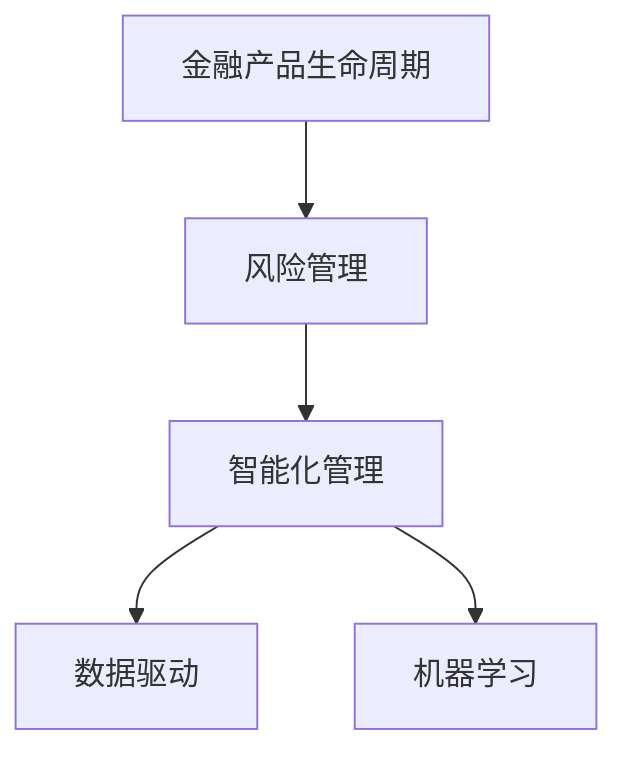
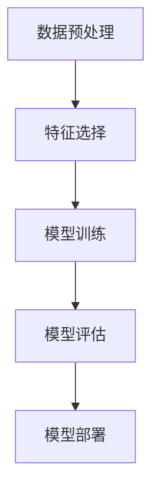
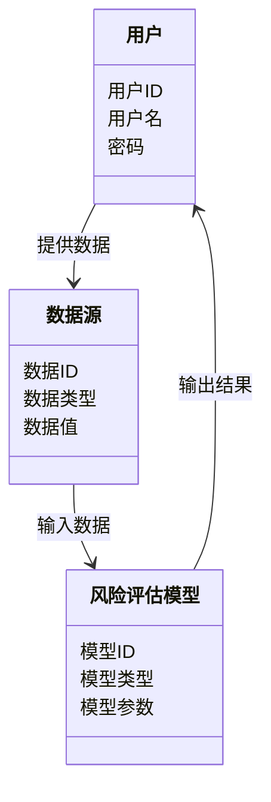
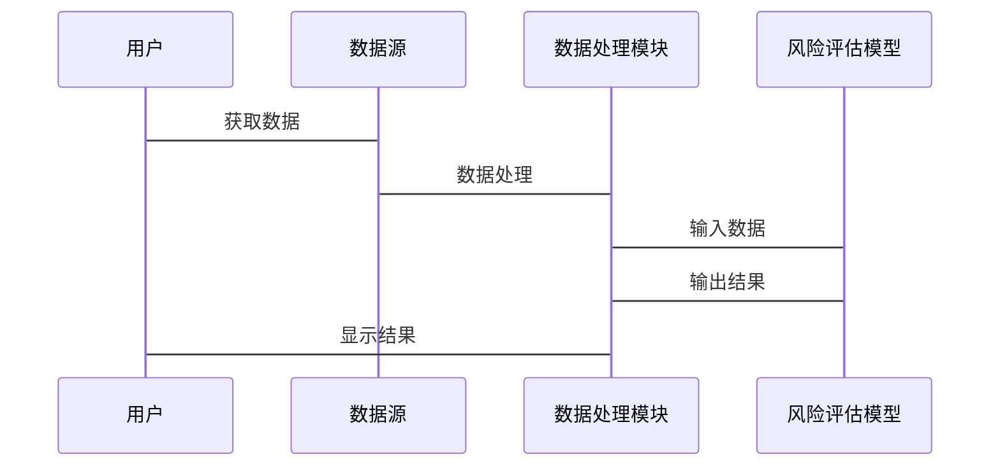

                 


# 开发智能化的金融产品生命周期风险动态管理平台

## 关键词：
金融产品生命周期, 风险管理, 智能化, 动态管理, 平台开发, 机器学习

## 摘要：
本文详细探讨了开发智能化的金融产品生命周期风险动态管理平台的核心理念、技术实现和应用场景。通过分析金融产品生命周期中的主要风险类型，结合机器学习和大数据技术，提出了一种基于动态风险管理的智能化解决方案。文章从背景介绍、核心概念、算法原理、系统架构到项目实战，全面阐述了平台开发的全过程，并通过具体案例分析展示了平台的实际应用价值。

---

# 第一部分: 开发智能化的金融产品生命周期风险动态管理平台背景介绍

## 第1章: 问题背景与需求分析

### 1.1 问题背景

#### 1.1.1 金融产品生命周期管理的挑战
金融产品的生命周期管理涉及从产品设计、发行、交易、结算到退市的全过程。传统模式下，风险管理通常基于静态的、孤立的分析方法，难以应对市场环境的快速变化和复杂性。

#### 1.1.2 风险管理在金融行业的重要性
金融市场的不确定性和波动性要求金融机构必须具备实时监控和动态调整风险管理的能力。尤其是在金融危机频发的当下，智能化风险管理已成为金融机构的核心竞争力之一。

#### 1.1.3 传统风险管理的局限性
传统的风险管理方法依赖于人工判断和静态模型，存在以下问题：
- 数据孤岛：各部门之间数据分散，难以实现全局视角的风险管理。
- 响应滞后：无法实时捕捉市场变化和潜在风险。
- 模型单一：缺乏灵活性，难以应对多样化的风险场景。

### 1.2 问题描述

#### 1.2.1 金融产品生命周期中的主要风险类型
金融产品生命周期中的风险主要包括市场风险、信用风险、流动性风险、操作风险和合规风险。

#### 1.2.2 动态风险管理的需求
随着金融市场的复杂化，风险管理需要具备以下特点：
- 实时性：能够快速响应市场变化。
- 动态性：根据市场环境和产品特性实时调整风险评估。
- 智能性：利用人工智能技术自动识别和预测风险。

#### 1.2.3 平台开发的目标与意义
开发智能化的金融产品生命周期风险动态管理平台的目标是：
- 提供实时、动态、智能化的风险评估和管理能力。
- 通过数据驱动的方法，优化风险管理的效率和准确性。
- 为金融机构提供一个统一的、可扩展的管理平台。

### 1.3 问题解决

#### 1.3.1 智能化风险管理的核心思想
智能化风险管理的核心思想是通过大数据和人工智能技术，构建一个能够实时感知、分析和预测风险的动态管理系统。

#### 1.3.2 数据驱动的风险分析方法
数据驱动的风险分析方法依赖于海量数据的采集、处理和分析，结合机器学习算法，实现对风险的实时监控和预测。

#### 1.3.3 技术实现路径的选择
技术实现路径包括：
- 数据采集与处理：建立统一的数据采集和处理机制。
- 模型构建：基于机器学习算法构建风险评估模型。
- 平台开发：开发一个支持实时数据分析和风险评估的管理平台。

### 1.4 边界与外延

#### 1.4.1 平台的功能边界
平台的功能边界包括：
- 数据采集与处理：支持多种数据源的接入。
- 风险评估与预警：提供实时风险评估和预警功能。
- 报告与分析：生成风险分析报告和可视化界面。

#### 1.4.2 与相关系统的接口关系
平台需要与以下系统进行接口交互：
- 数据源系统：如交易系统、客户关系管理系统等。
- 风险评估模型：如机器学习模型、规则引擎等。
- 用户界面：如Web界面或移动端界面。

#### 1.4.3 平台的扩展性与可维护性
平台设计需要考虑以下方面：
- 模块化设计：便于功能扩展和维护。
- 高可用性：确保系统的稳定性和可靠性。
- 可扩展性：支持未来的功能扩展和技术升级。

### 1.5 核心要素与概念结构

#### 1.5.1 核心概念的定义
核心概念包括：
- 金融产品生命周期：从设计、发行到退市的全过程。
- 风险管理：对潜在风险的识别、评估和控制。
- 智能化管理：基于人工智能技术的动态风险管理。

#### 1.5.2 概念之间的关系
- 金融产品生命周期与风险管理是密不可分的。
- 智能化管理是实现动态风险管理的核心技术。

#### 1.5.3 概念结构的可视化



---

## 第2章: 核心概念与联系

### 2.1 核心概念原理

#### 2.1.1 风险动态管理的定义
风险动态管理是指在金融产品生命周期的各个阶段，实时监控和评估风险，并根据市场环境和产品特性动态调整风险管理策略。

#### 2.1.2 金融产品生命周期的阶段划分
金融产品生命周期可以划分为以下几个阶段：
1. 产品设计阶段：确定产品目标、风险特征和收益预期。
2. 产品发行阶段：评估产品发行风险，制定风险控制措施。
3. 产品交易阶段：实时监控交易风险，及时发现和处理异常情况。
4. 产品结算阶段：评估结算风险，确保交易的顺利进行。
5. 产品退市阶段：评估退市风险，制定退市策略。

#### 2.1.3 智能化管理的关键技术
智能化管理的关键技术包括：
- 机器学习：用于风险预测和分类。
- 自然语言处理：用于分析非结构化数据。
- 数据挖掘：用于发现数据中的潜在规律。

### 2.2 概念属性特征对比

| 概念 | 属性 | 特征 |
|------|------|------|
| 传统风险管理 | 数据来源 | 离散数据，缺乏实时性 |
|        | 方法 | 基于规则，静态分析 |
|        | 响应时间 | 延迟，无法实时监控 |
| 智能化风险管理 | 数据来源 | 多源数据，实时更新 |
|        | 方法 | 数据驱动，动态分析 |
|        | 响应时间 | 实时响应，动态调整 |

### 2.3 ER实体关系图

```mermaid
erDiagram
    用户角色 {
        <属性> 用户ID
        <属性> 用户类型
        <属性> 用户权限
    }
    数据来源 {
        <属性> 数据类型
        <属性> 数据格式
        <属性> 数据时间戳
    }
    风险评估模型 {
        <属性> 模型类型
        <属性> 模型参数
        <属性> 模型版本
    }
    用户角色 --> 数据来源 : 提供数据
    数据来源 --> 风险评估模型 : 输入数据
    风险评估模型 --> 用户角色 : 输出结果
```

---

## 第3章: 算法原理讲解

### 3.1 算法选择与原理

#### 3.1.1 时间序列分析
时间序列分析是一种用于预测未来趋势的统计方法。常用模型包括ARIMA、LSTM等。

#### 3.1.2 机器学习分类算法
机器学习分类算法用于将风险分类为不同类别（如高风险、中风险、低风险）。常用算法包括支持向量机（SVM）、随机森林（Random Forest）和逻辑回归（Logistic Regression）。

#### 3.1.3 风险评估模型的构建
风险评估模型的构建过程包括数据预处理、特征选择、模型训练和模型评估。

### 3.2 算法流程图



### 3.3 算法实现

#### 3.3.1 时间序列分析示例

```python
import pandas as pd
import numpy as np
from sklearn.metrics import mean_squared_error
from statsmodels.tsa.arima_model import ARIMA

# 示例数据
data = np.array([1, 2, 3, 4, 5, 6, 7, 8, 9, 10])
# 拆分训练集和测试集
train = data[:7]
test = data[7:]
# 训练ARIMA模型
model = ARIMA(train, order=(1, 1, 1))
model_fit = model.fit(disp=0)
# 预测
 forecast = model_fit.forecast(len(test), alpha=0.05)
预测值 = forecast.forecast
# 计算均方根误差
rmse = np.sqrt(mean_squared_error(test, 预测值))
print("均方根误差:", rmse)
```

#### 3.3.2 机器学习分类示例

```python
from sklearn import datasets
from sklearn.model_selection import train_test_split
from sklearn.linear_model import LogisticRegression
from sklearn.metrics import accuracy_score

# 加载数据集
iris = datasets.load_iris()
X = iris.data
y = iris.target
# 拆分训练集和测试集
X_train, X_test, y_train, y_test = train_test_split(X, y, test_size=0.3, random_state=42)
# 训练逻辑回归模型
model = LogisticRegression()
model.fit(X_train, y_train)
# 预测
y_pred = model.predict(X_test)
# 计算准确率
accuracy = accuracy_score(y_test, y_pred)
print("准确率:", accuracy)
```

### 3.4 数学公式

#### 3.4.1 ARIMA模型公式
$$
ARIMA(p, d, q) = y_t - \sum_{i=1}^{p} \phi_i y_{t-i} - \sum_{j=1}^{q} \theta_j \epsilon_{t-j} = \epsilon_t
$$

#### 3.4.2 逻辑回归公式
$$
P(y=1|x) = \frac{1}{1 + e^{-(\beta_0 + \beta_1 x)}}
$$

---

## 第4章: 系统分析与架构设计方案

### 4.1 问题场景介绍

#### 4.1.1 项目背景
本文将开发一个智能化的金融产品生命周期风险动态管理平台，旨在通过实时数据分析和机器学习技术，实现对金融产品风险的动态监控和管理。

#### 4.1.2 项目目标
- 实现金融产品生命周期的动态风险管理。
- 提供实时风险评估和预警功能。
- 为金融机构提供一个高效、可靠的管理平台。

### 4.2 项目介绍

#### 4.2.1 项目范围
- 数据采集与处理：支持多种数据源的接入。
- 风险评估与预警：提供实时风险评估和预警功能。
- 报告与分析：生成风险分析报告和可视化界面。

#### 4.2.2 项目里程碑
1. 需求分析与设计（第1-2周）
2. 数据采集与处理（第3-4周）
3. 模型开发与训练（第5-6周）
4. 平台开发与测试（第7-8周）
5. 部署与上线（第9周）

### 4.3 系统功能设计

#### 4.3.1 领域模型



#### 4.3.2 系统架构设计


#### 4.3.3 接口设计
- 数据接口：支持RESTful API。
- 模型接口：支持HTTP请求。
- 用户接口：支持WebSocket实时通信。

#### 4.3.4 交互设计



---

## 第5章: 项目实战

### 5.1 环境安装

#### 5.1.1 安装Python
```bash
python --version
pip install --upgrade pip
```

#### 5.1.2 安装机器学习库
```bash
pip install numpy pandas scikit-learn
```

### 5.2 系统核心实现

#### 5.2.1 数据预处理

```python
import pandas as pd
import numpy as np

# 示例数据
data = pd.DataFrame({
    '时间': range(10),
    '值': np.random.randn(10) * 10
})
print(data)
```

#### 5.2.2 模型训练

```python
from sklearn.linear_model import LinearRegression
from sklearn.model_selection import train_test_split

X = data[['时间']]
y = data['值']
X_train, X_test, y_train, y_test = train_test_split(X, y, test_size=0.2, random_state=42)
model = LinearRegression()
model.fit(X_train, y_train)
```

#### 5.2.3 模型部署

```python
def predict_risk(data):
    return model.predict(data)
```

### 5.3 案例分析

#### 5.3.1 数据分析
- 数据可视化：使用Matplotlib或Seaborn绘制数据图表。
- 数据特征分析：分析数据的分布和相关性。

#### 5.3.2 风险评估
- 风险分类：使用机器学习模型对风险进行分类。
- 风险预测：预测未来的风险趋势。

### 5.4 项目小结

#### 5.4.1 成果展示
- 平台功能：实时风险评估、预警、报告生成。
- 模型性能：准确率、召回率、F1分数等。

#### 5.4.2 经验总结
- 数据质量的重要性：数据清洗和特征工程是关键。
- 模型选择：根据实际场景选择合适的算法。
- 系统设计：模块化设计便于维护和扩展。

---

## 第6章: 总结与展望

### 6.1 总结

#### 6.1.1 核心内容回顾
本文详细探讨了智能化的金融产品生命周期风险动态管理平台的开发过程，包括背景分析、核心概念、算法原理、系统设计和项目实战。

#### 6.1.2 最佳实践
- 数据驱动：充分利用数据价值。
- 技术结合：将传统金融知识与人工智能技术相结合。
- 模块化设计：便于系统的维护和扩展。

### 6.2 展望

#### 6.2.1 未来发展方向
- 更加智能化：引入更高级的人工智能技术，如深度学习和强化学习。
- 更加实时化：实现亚秒级的实时风险监控。
- 更加个性化：根据用户需求提供定制化的风险管理方案。

#### 6.2.2 作者建议
- 加强数据隐私保护：确保数据的安全性和合规性。
- 提升用户体验：优化平台的易用性和交互性。
- 推动行业应用：将智能化风险管理平台推广到更多金融机构。

---

## 小结

开发智能化的金融产品生命周期风险动态管理平台是一项复杂但具有重要意义的工程。通过本文的详细分析和实践，读者可以深入了解平台的核心理念和技术实现方法。未来，随着人工智能技术的不断发展，智能化风险管理将为金融行业带来更大的价值。

---

## 作者：AI天才研究院 & 禅与计算机程序设计艺术

