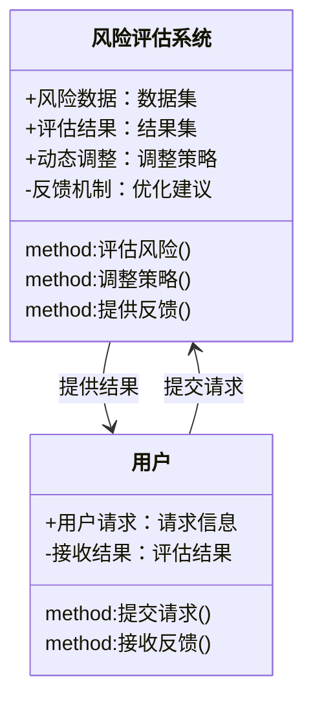

                 


# 开发智能化的金融产品生命周期风险动态评估平台

> 关键词：金融产品生命周期，风险动态评估，人工智能，时间序列分析，机器学习

> 摘要：本文探讨如何利用人工智能技术开发一个智能化的金融产品风险动态评估平台。平台通过分析金融产品生命周期中的各种风险因素，利用时间序列分析和机器学习模型，实时动态评估风险，并提供相应的调整策略。

---

## 第1章 背景与问题分析

### 1.1 问题背景

随着金融市场的日益复杂，金融产品的风险评估变得至关重要。传统的静态评估方法难以应对动态变化的市场环境，因此需要一种智能化的解决方案来实时跟踪和评估风险。

### 1.2 问题描述

金融产品生命周期中的风险种类繁多，包括市场风险、信用风险和操作风险等。动态评估需要考虑多个因素，如市场波动和产品特性。

### 1.3 问题解决

通过引入人工智能技术，平台能够实时更新风险评估结果，并根据市场变化动态调整评估策略。

---

## 第2章 核心概念与联系

### 2.1 核心概念原理

- **动态风险评估**：实时分析风险因素的变化。
- **金融产品生命周期管理**：跟踪产品从创建到终止的全过程。
- **智能化评估模型**：利用机器学习模型进行预测。

### 2.2 ER实体关系图

```mermaid
er
  actor(用户)
  actor(风险评估系统)
  actor(金融产品)
  actor(风险数据)
  actor(评估结果)
  actor(动态调整)
  actor(反馈机制)
  relation(用户 -> 风险评估系统)
  relation(风险评估系统 -> 风险数据)
  relation(风险数据 -> 金融产品)
  relation(金融产品 -> 评估结果)
  relation(评估结果 -> 动态调整)
  relation(动态调整 -> 反馈机制)
  relation(反馈机制 -> 风险评估系统)
```

---

## 第3章 时间序列分析

### 3.1 原理与应用

时间序列分析用于预测未来风险，模型包括AR、MA和ARIMA。

### 3.2 Python实现

```python
import pandas as pd
import numpy as np
from statsmodels.tsa.arima_model import ARIMA

data = pd.Series([1, 2, 3, 4, 5], index=pd.date_range('2020', periods=5))
model = ARIMA(data, order=(1, 1, 0))
model_fit = model.fit(disp=0)
print(model_fit.summary())
```

### 3.3 数学模型

ARIMA模型的数学公式：
$$ARIMA(p, d, q)$$
其中，p为自回归阶数，d为差分阶数，q为移动平均阶数。

---

## 第4章 机器学习模型

### 4.1 随机森林算法

随机森林用于分类和回归问题，适用于多特征的数据。

### 4.2 实现代码

```python
from sklearn.ensemble import RandomForestRegressor

# 示例数据
X = [[1, 2], [3, 4], [5, 6]]
y = [1, 2, 3]

model = RandomForestRegressor(n_estimators=100)
model.fit(X, y)
print(model.predict([[7, 8]]))
```

---

## 第5章 系统架构设计

### 5.1 功能模块

- 数据采集模块
- 风险评估模块
- 结果展示模块

### 5.2 类图设计



---

## 第6章 项目实战

### 6.1 环境安装

安装必要的库，如Pandas、NumPy、Scikit-learn。

### 6.2 核心代码

```python
from sklearn.metrics import accuracy_score

# 示例数据
X_train = [[1, 2], [3, 4], [5, 6]]
y_train = [1, 2, 3]
X_test = [[7, 8], [9, 10]]
y_true = [4, 5]

model = RandomForestRegressor(n_estimators=100)
model.fit(X_train, y_train)
y_pred = model.predict(X_test)
print(accuracy_score(y_true, y_pred))
```

### 6.3 案例分析

通过实际案例展示平台的应用，解释如何利用模型进行风险评估。

---

## 第7章 最佳实践

### 7.1 小结

总结平台开发的关键点，强调技术应用的重要性。

### 7.2 注意事项

提示开发中的注意事项，如数据质量和模型调优。

### 7.3 拓展阅读

推荐相关书籍和资源，供读者深入学习。

---

作者：AI天才研究院 & 禅与计算机程序设计艺术

