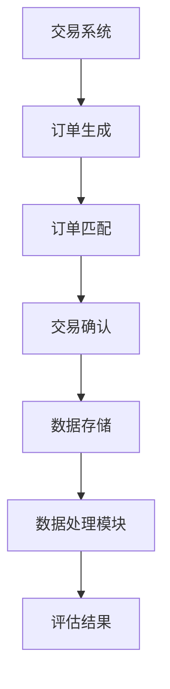
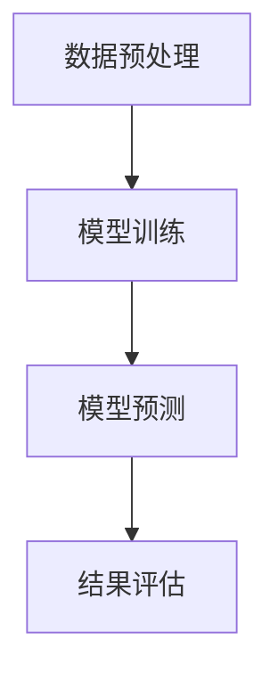
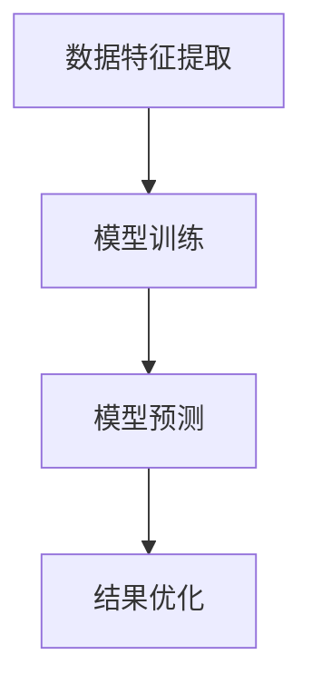

                 


# 开发智能化的金融市场微观结构变化影响评估工具

## 关键词：金融市场，微观结构，时间序列分析，机器学习，系统架构，算法实现

## 摘要：  
金融市场微观结构的变化对市场的效率、风险和流动性有着重要影响。为了量化这些变化，开发一个智能化的评估工具显得尤为重要。本文从金融市场的核心概念出发，结合时间序列分析和机器学习算法，详细讲解如何构建一个高效、准确的评估工具。文章内容涵盖理论分析、算法实现、系统设计和项目实战，旨在为读者提供一个全面的解决方案。

---

## 第1章: 金融市场微观结构与变化概述

### 1.1 金融市场微观结构的核心概念

#### 1.1.1 金融市场的定义与分类
- 金融市场的定义：金融资产交易的场所，包括股票、债券、衍生品等。
- 金融市场的分类：一级市场和二级市场，场内交易和场外交易等。

#### 1.1.2 微观结构的定义与特征
- 微观结构：金融市场的底层运行机制，包括交易规则、参与者行为、信息流动等。
- 微观结构的特征：实时性、动态性、复杂性。

#### 1.1.3 微观结构变化的定义与表现形式
- 微观结构变化：由于市场参与者的交易行为、制度规则或技术环境的变化，导致市场微观结构发生的变化。
- 表现形式：订单簿变化、交易频率波动、价格波动等。

### 1.2 金融市场微观结构变化的影响

#### 1.2.1 微观结构变化对市场效率的影响
- 市场效率下降：信息不对称加剧，交易成本增加。
- 市场效率提升：高频交易和算法交易提高了市场流动性。

#### 1.2.2 微观结构变化对市场风险的影响
- 增加市场波动性：极端交易行为可能导致市场崩盘。
- 提高风险识别能力：通过实时监控微观结构变化，降低系统性风险。

#### 1.2.3 微观结构变化对市场流动性的分析
- 流动性变化：订单深度和报价频率的变化影响市场流动性。
- 流动性风险：由于微观结构变化导致的市场流动性不足。

### 1.3 评估工具的必要性与目标

#### 1.3.1 为什么要开发评估工具
- 提高市场透明度：通过实时监控微观结构变化，揭示市场的潜在风险。
- 优化交易策略：基于微观结构变化的评估，帮助交易者制定更有效的策略。
- 降低监管成本：通过自动化评估工具，减少人工监管的复杂性。

#### 1.3.2 工具的目标与功能定位
- 目标：量化微观结构变化，提供实时风险评估和交易建议。
- 功能定位：数据采集、分析、预警和可视化。

#### 1.3.3 工具的适用范围与边界
- 适用范围：适用于股票、期货等标准化金融产品。
- 边界：不适用于非标准化金融工具和场外交易市场。

---

## 第2章: 金融市场微观结构变化的核心要素

### 2.1 交易数据与市场行为分析

#### 2.1.1 交易数据的分类与特征
- 分类：订单数据、成交数据、市场深度数据。
- 特征：高频性、实时性、多样性。

#### 2.1.2 市场行为的量化指标
- 订单簿分析：订单深度、买卖价差、订单撤销率。
- 成交数据分析：成交量、成交价、成交时间分布。

#### 2.1.3 数据流图（Data Flow Diagram, DFD）展示


### 2.2 微观结构变化的驱动因素

#### 2.2.1 市场参与者的行为分析
- 机构投资者：高频交易、算法交易。
- 零散投资者：情绪化交易、跟风交易。

#### 2.2.2 市场规则与制度的影响
- 交易规则：撮合机制、订单类型。
- 制度因素：市场开放时间、交易税费。

#### 2.2.3 技术与工具的驱动作用
- 技术进步：高频交易技术、大数据分析工具。
- 工具创新：智能算法、自动化交易系统。

### 2.3 实体关系图（ER图）展示

```mermaid
erDiagram
    participant 市场参与者 {
        <属性> ID : integer
        <属性> 类型 : string
        <属性> 交易策略 : string
    }
    participant 订单 {
        <属性> ID : integer
        <属性> 类型 : string
        <属性> 数量 : integer
        <属性> 价格 : float
    }
    participant 成交 {
        <属性> ID : integer
        <属性> 时间 : datetime
        <属性> 数量 : integer
        <属性> 价格 : float
    }
    市场参与者 --> 订单 : 提交
    订单 --> 成交 : 匹配
    成交 --> 评估工具 : 提供数据
```

---

## 第3章: 时间序列分析与预测算法

### 3.1 时间序列分析的基础知识

#### 3.1.1 时间序列的定义与特征
- 时间序列：按时间顺序排列的数据序列。
- 特征：趋势性、周期性、随机性。

#### 3.1.2 时间序列分析的主要方法
- 经典方法：移动平均法、指数平滑法。
- 现代方法：ARIMA模型、GARCH模型。

#### 3.1.3 时间序列分析的数学基础
- 关键概念：自相关函数（ACF）、偏自相关函数（PACF）。

### 3.2 常见的时间序列预测模型

#### 3.2.1 ARIMA模型
- ARIMA的定义：自回归积分移动平均模型。
- ARIMA的公式：  
  $$ARIMA(p, d, q)$$  
  其中，p为自回归阶数，d为差分阶数，q为移动平均阶数。

#### 3.2.2 LSTM模型
- LSTM的定义：长短期记忆网络。
- LSTM的核心：记忆单元和门控机制。

#### 3.2.3 其他时间序列预测方法
- 回归模型：线性回归、岭回归。
- 聚类模型：K-means、DBSCAN。

### 3.3 时间序列分析的流程图



---

## 第4章: 机器学习在微观结构变化评估中的应用

### 4.1 机器学习的基本原理

#### 4.1.1 机器学习的定义与分类
- 监督学习：有标签数据的训练。
- 无监督学习：无标签数据的分析。

#### 4.1.2 监督学习与无监督学习的区别
- 监督学习：基于标记数据进行分类或回归。
- 无监督学习：基于无标记数据进行聚类或降维。

### 4.2 微观结构变化评估的机器学习模型

#### 4.2.1 分类模型
- 随机森林：基于决策树的集成模型。
- 支持向量机（SVM）：基于几何分割的分类模型。

#### 4.2.2 聚类模型
- K-means：基于距离的聚类算法。
- DBSCAN：基于密度的聚类算法。

#### 4.2.3 回归模型
- 线性回归：最小二乘法。
- 随机森林回归：基于树的回归模型。

### 4.3 机器学习模型的流程图



---

## 第5章: 系统分析与架构设计

### 5.1 项目背景与目标

#### 5.1.1 项目背景介绍
- 项目背景：金融市场微观结构变化的实时监控需求。
- 项目目标：开发一个智能化的评估工具。

#### 5.1.2 项目目标与范围
- 目标：量化微观结构变化，提供实时风险评估。
- 范围：支持多种金融产品，实时数据处理。

#### 5.1.3 项目的关键成功因素
- 数据采集的实时性。
- 模型的准确性和稳定性。

### 5.2 系统功能模块设计

#### 5.2.1 数据采集模块
- 功能：实时采集交易数据。
- 实现：API接口、数据库存储。

#### 5.2.2 数据处理模块
- 功能：数据清洗、特征提取。
- 实现：Python的Pandas库、数据预处理。

#### 5.2.3 模型评估模块
- 功能：模型训练、预测评估。
- 实现：机器学习框架（如Scikit-learn、TensorFlow）。

#### 5.2.4 结果展示模块
- 功能：可视化结果、生成报告。
- 实现：可视化工具（如Matplotlib、Plotly）。

### 5.3 系统架构设计

#### 5.3.1 系统架构图


---

## 第6章: 项目实战

### 6.1 环境安装

#### 6.1.1 安装Python
- 安装命令：`python --version`

#### 6.1.2 安装依赖库
- 安装命令：`pip install numpy pandas scikit-learn tensorflow`

### 6.2 核心代码实现

#### 6.2.1 数据采集与预处理

```python
import pandas as pd
import numpy as np

# 数据采集
data = pd.read_csv('market_data.csv')

# 数据清洗
data = data.dropna()
data = data.drop_duplicates()
```

#### 6.2.2 模型训练与评估

```python
from sklearn.model_selection import train_test_split
from sklearn.ensemble import RandomForestClassifier

# 数据分割
X_train, X_test, y_train, y_test = train_test_split(data.drop('target', axis=1), data['target'], test_size=0.2)

# 模型训练
model = RandomForestClassifier()
model.fit(X_train, y_train)

# 模型评估
score = model.score(X_test, y_test)
print(f'模型准确率：{score}')
```

### 6.3 案例分析与解读

#### 6.3.1 案例分析
- 数据来源：某交易所的交易数据。
- 数据特征：订单深度、买卖价差、成交时间。

#### 6.3.2 实际应用
- 风险预警：及时发现市场异常。
- 交易策略优化：基于模型结果调整交易策略。

### 6.4 项目总结

#### 6.4.1 项目小结
- 项目成果：开发了一个智能化的评估工具。
- 经验总结：数据质量和模型选择对结果影响重大。

---

## 第7章: 总结与展望

### 7.1 最佳实践 Tips
- 数据质量：确保数据的实时性和准确性。
- 模型优化：结合多种算法提高预测精度。
- 系统维护：定期更新模型和优化系统性能。

### 7.2 小结
- 本文详细介绍了金融市场微观结构变化评估工具的开发过程，从理论分析到算法实现，再到系统设计和项目实战，为读者提供了一个完整的解决方案。

### 7.3 注意事项
- 数据隐私：注意保护用户数据隐私。
- 系统稳定性：确保系统的高可用性和稳定性。

### 7.4 拓展阅读
- 推荐书籍：《金融时间序列分析》、《机器学习实战》。
- 推荐博客：技术博客、金融数据分析博客。

---

## 作者：AI天才研究院/AI Genius Institute & 禅与计算机程序设计艺术 /Zen And The Art of Computer Programming

---

感谢您的阅读！希望这篇文章能为您提供开发智能化的金融市场微观结构变化影响评估工具的思路和方法。

