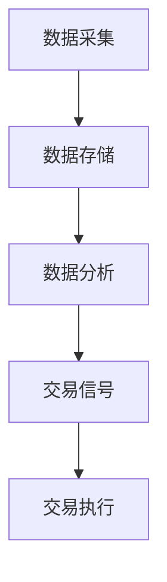

                 


# 开发智能化的金融市场微观结构变化影响量化工具

> 关键词：金融市场微观结构，量化工具，时间序列分析，机器学习，系统架构

> 摘要：本文详细探讨了开发智能化的金融市场微观结构变化影响量化工具的关键步骤。从核心概念到算法原理，再到系统设计和项目实战，系统地阐述了如何利用现代技术手段分析金融市场微观结构变化，并提供实际案例和最佳实践，帮助读者全面掌握相关知识。

---

# 第一部分: 金融市场微观结构与量化工具概述

## 第1章: 金融市场微观结构基础

### 1.1 金融市场概述

#### 1.1.1 金融市场的定义与分类
金融市场是指资金、证券等金融资产交易的场所，按交易对象可分为股票市场、债券市场、外汇市场等。按交易场所可分为场内市场和场外市场。

#### 1.1.2 微观结构的基本概念
金融市场微观结构研究市场参与者的交易行为、订单簿、价格形成机制等。核心要素包括订单类型、市场深度、买卖价差、交易量等。

#### 1.1.3 量化工具在金融市场中的作用
量化工具通过数学模型和算法分析市场数据，帮助投资者做出决策，优化交易策略。

### 1.2 金融市场微观结构的核心要素

#### 1.2.1 市场参与者分析
市场参与者包括机构投资者、个人投资者、做市商等，他们的行为影响市场价格和波动性。

#### 1.2.2 订单簿与交易机制
订单簿记录了当前未成交的订单，交易机制包括撮合成交、订单匹配规则等。

#### 1.2.3 价格形成机制
价格由市场供求关系决定，高频交易和算法交易加速了价格形成过程。

### 1.3 量化工具的定义与特点

#### 1.3.1 量化工具的定义
量化工具是利用数学模型和算法对金融市场数据进行分析和预测的工具。

#### 1.3.2 量化工具的核心特点
数据驱动、高频交易、自动化决策、低延迟处理。

#### 1.3.3 量化工具与传统金融分析的区别
量化工具强调数据驱动和算法，传统金融分析更多依赖经验和基本面分析。

### 1.4 本章小结
本章介绍了金融市场的基本概念，分析了微观结构的核心要素，解释了量化工具的作用和特点。

---

# 第二部分: 微观结构变化的量化分析方法

## 第2章: 微观结构变化的核心概念与联系

### 2.1 核心概念原理

#### 2.1.1 市场微观结构的核心要素
订单类型、市场深度、买卖价差、交易量、价格波动等。

#### 2.1.2 量化工具的基本原理
通过分析订单数据、交易数据，识别市场微观结构的变化，预测价格走势。

#### 2.1.3 微观结构变化的数学模型
利用时间序列分析、机器学习模型描述市场微观结构的变化。

### 2.2 概念属性特征对比表

| 概念               | 属性               | 特征                   |
|--------------------|--------------------|-----------------------|
| 市场参与者         | 类型               | 机构投资者、个人投资者 |
| 订单类型           | 时间               | 即时订单、限价订单    |
| 价格形成机制       | 影响因素           | 供求关系、市场情绪    |

### 2.3 ER实体关系图

```mermaid
er
    actor 市场参与者 {
        id: int
        类型: string
    }
    actor 订单 {
        id: int
        类型: string
        数量: int
        价格: float
    }
    actor 交易 {
        id: int
        时间: datetime
        类型: string
    }
    market 微观结构 {
        id: int
        时间: datetime
        参与者: 市场参与者
        订单: 订单
        交易: 交易
    }
```

### 2.4 本章小结
本章详细分析了微观结构变化的核心概念，通过对比表和实体关系图，展示了各概念之间的联系。

---

# 第三部分: 算法原理与数学模型

## 第3章: 微观结构变化的算法原理

### 3.1 时间序列分析算法

#### 3.1.1 ARIMA算法
ARIMA（自回归积分滑动平均模型）用于预测时间序列数据。

$$ ARIMA(p, d, q) $$

- p：自回归阶数
- d：差分阶数
- q：移动平均阶数

#### 3.1.2 LSTM算法
长短期记忆网络适用于处理时间序列数据中的长期依赖关系。

#### 3.1.3 GARCH模型
广义自回归条件异方差模型用于预测波动性。

$$ GARCH(p, q) $$

- p：自回归阶数
- q：移动平均阶数

### 3.2 机器学习模型

#### 3.2.1 支持向量机（SVM）
用于分类和回归任务，适用于交易信号的生成。

#### 3.2.2 随机森林
基于决策树的集成学习方法，用于特征重要性分析。

#### 3.2.3 神经网络
深度学习模型，用于复杂非线性关系的建模。

---

## 第4章: 算法实现与案例分析

### 4.1 环境安装
安装必要的库：
- Python 3.8+
- NumPy, Pandas, Scikit-learn, TensorFlow

### 4.2 核心代码实现

#### 4.2.1 ARIMA模型实现
```python
from statsmodels.tsa.arima_model import ARIMA

model = ARIMA(data, order=(5, 1, 0))
model_fit = model.fit()
forecast = model_fit.forecast(steps=10)
```

#### 4.2.2 LSTM模型实现
```python
from keras.models import Sequential
from keras.layers import LSTM, Dense

model = Sequential()
model.add(LSTM(50, input_shape=(timesteps, features)))
model.add(Dense(1))
model.compile(loss='mean_squared_error', optimizer='adam')
model.fit(X_train, y_train, epochs=50, batch_size=32)
```

### 4.3 案例分析
以股票价格预测为例，展示模型的训练和预测过程，分析预测结果的准确性。

### 4.4 本章小结
本章详细讲解了时间序列分析和机器学习算法的实现，并通过案例分析展示了模型的应用。

---

# 第四部分: 系统分析与架构设计

## 第5章: 系统架构设计

### 5.1 项目介绍
开发一个实时量化交易系统，分析市场微观结构变化，生成交易信号。

### 5.2 系统功能设计

#### 5.2.1 数据采集模块
从交易所API获取实时数据，存储到数据库中。

#### 5.2.2 数据分析模块
使用时间序列分析和机器学习模型分析数据，生成交易信号。

#### 5.2.3 交易执行模块
根据交易信号执行订单，记录交易结果。

### 5.3 系统架构图



### 5.4 接口设计
定义RESTful API接口，提供数据获取、模型调用等功能。

### 5.5 本章小结
本章描述了系统的架构设计，展示了各模块之间的关系。

---

# 第五部分: 项目实战

## 第6章: 项目实现与案例分析

### 6.1 项目环境安装
安装必要的开发工具和库。

### 6.2 核心代码实现

#### 6.2.1 数据采集模块
```python
import requests

def get_data(api_key):
    response = requests.get(f'https://api.example.com/v1/market-data', params={'api_key': api_key})
    return response.json()
```

#### 6.2.2 数据分析模块
```python
from sklearn.ensemble import RandomForestRegressor

model = RandomForestRegressor()
model.fit(X_train, y_train)
predictions = model.predict(X_test)
```

### 6.3 案例分析
以某只股票为例，展示从数据采集到模型预测的完整过程。

### 6.4 项目小结
本章通过实际项目展示了量化工具的开发过程，验证了模型的有效性。

---

# 第六部分: 最佳实践

## 第7章: 小结与注意事项

### 7.1 小结
本文详细介绍了金融市场微观结构变化的量化工具开发过程，从理论到实践，系统地讲解了相关知识。

### 7.2 注意事项
- 数据质量：确保数据准确性和完整性。
- 模型调参：根据实际情况调整模型参数。
- 风险控制：制定合理的风险管理策略。

### 7.3 拓展阅读
推荐相关书籍和论文，供读者进一步学习。

---

# 作者

作者：AI天才研究院/AI Genius Institute  
邮箱：contact@aicourse.com  
官网：https://www.aicourse.com

---

**附录**

附录A: 常用金融数据接口  
附录B: 开发工具推荐  
附录C: 参考文献

