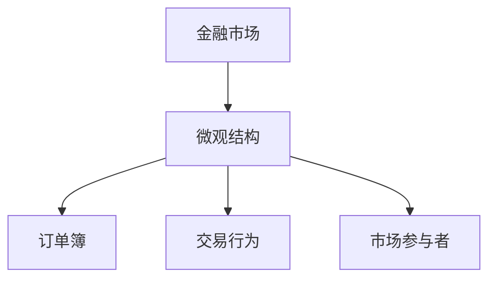
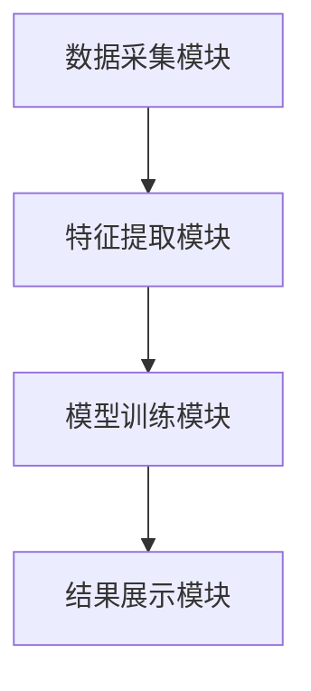

                 


# 开发智能化的金融市场微观结构变化检测工具

> 关键词：金融市场，微观结构，变化检测，机器学习，LSTM，系统架构

> 摘要：金融市场微观结构变化检测工具是一种利用技术手段分析金融市场中的微观结构变化，从而帮助投资者和交易员做出更明智决策的工具。本文从背景介绍、核心概念、算法原理、系统架构到项目实战，详细阐述了开发智能化的金融市场微观结构变化检测工具的全过程。

---

## 第1章：金融市场微观结构变化检测工具开发背景

### 1.1 问题背景介绍

#### 1.1.1 金融市场微观结构的定义与特征

金融市场微观结构是指金融市场的基本组成要素及其相互关系。它包括订单簿、交易行为、市场参与者等多个方面。这些要素共同构成了市场的运作机制，反映了市场的流动性和价格形成过程。

#### 1.1.2 微观结构变化检测的必要性

在金融市场中，微观结构的变化可能预示着市场的流动性变化、价格波动或潜在的市场风险。及时检测这些变化，可以帮助交易员和投资者做出更快速的反应，从而抓住市场机会或规避风险。

#### 1.1.3 当前市场中的技术挑战与解决方案

随着金融市场的复杂化和高频交易的普及，传统的基于统计的方法在处理复杂数据时显得力不从心。为了提高检测的准确性和实时性，引入机器学习和深度学习等技术成为必然趋势。

### 1.2 问题描述与目标

#### 1.2.1 微观结构变化检测的核心问题

核心问题在于如何从海量的金融数据中提取有效的特征，并利用这些特征构建高效的检测模型。这需要结合金融市场的知识和数据科学的技术。

#### 1.2.2 开发工具的目标与预期效果

开发工具的目标是实现对金融市场微观结构变化的实时检测，并提供相应的预警服务。预期效果包括提高检测的准确性和实时性，降低市场风险。

### 1.3 问题解决方法概述

#### 1.3.1 数据驱动方法

数据驱动方法依赖于大量历史数据，通过统计分析和机器学习模型来发现数据中的模式和规律。

#### 1.3.2 模型驱动方法

模型驱动方法基于对金融市场微观结构的理解，建立数学模型来描述市场的变化过程。这种方法需要深厚的金融知识和数学建模能力。

#### 1.3.3 综合方法的优势

综合方法结合了数据驱动和模型驱动的优势，能够在复杂市场环境中实现更准确的检测。

### 1.4 边界与外延

#### 1.4.1 工具的适用范围

适用于高频交易、机构交易等场景，特别关注市场的微观结构变化。

#### 1.4.2 与宏观市场分析的区分

微观结构变化检测关注市场机制的变化，而宏观市场分析关注整体市场的趋势和宏观经济因素。

#### 1.4.3 与其他金融工具的关联

与其他金融工具如风险管理、算法交易等密切相关，能够为其提供实时的市场信息。

### 1.5 概念结构与核心要素

#### 1.5.1 核心概念框架

框架包括数据采集、特征提取、模型训练、结果展示等模块。

#### 1.5.2 核心要素的定义与作用

- 数据源：提供原始数据，如订单簿、交易记录等。
- 特征提取：将原始数据转换为模型可识别的特征。
- 模型训练：利用特征训练检测模型。
- 结果展示：将检测结果以用户友好的形式展示。

#### 1.5.3 框架的逻辑关系

数据源经过特征提取后，生成特征向量，输入模型训练模块，生成检测模型，最后通过结果展示模块输出检测结果。

---

## 第2章：金融市场微观结构变化检测的核心概念

### 2.1 金融市场微观结构的定义与属性

金融市场微观结构是指金融市场的基本组成要素及其相互关系，包括订单簿、交易行为、市场参与者等。其属性包括实时性、动态性和复杂性。

### 2.2 变化检测的定义与特征

变化检测是指识别市场微观结构中的异常变化，具有实时性、连续性和潜在风险性等特征。

### 2.3 实体关系图



### 2.4 核心概念之间的关系

- 微观结构与变化检测：微观结构的变化是变化检测的对象。
- 数据特征与检测方法：特征的选择直接影响检测方法的效果。
- 实体关系的动态变化：市场参与者的交易行为变化影响订单簿和交易行为。

---

## 第3章：变化检测算法原理

### 3.1 算法概述

#### 3.1.1 基于统计的方法

使用统计方法检测数据中的异常值，如Z-score和均值漂移法。

#### 3.1.2 机器学习方法

采用监督学习、无监督学习和半监督学习等方法。

#### 3.1.3 深度学习方法

使用LSTM等深度学习模型捕捉时间序列中的复杂模式。

---

### 3.2 基于LSTM的时序分析

#### 3.2.1 算法流程

1. 数据预处理：标准化和滑动窗口分割。
2. 特征提取：提取订单簿特征。
3. 模型训练：训练LSTM网络。
4. 预测与评估：使用阈值判断异常。

#### 3.2.2 实现代码

```python
import numpy as np
import tensorflow as tf
from tensorflow.keras import layers

# 数据预处理
def preprocess_data(data, window_size=10):
    X = []
    Y = []
    for i in range(len(data) - window_size):
        X.append(data[i:i+window_size])
        Y.append(data[i+window_size])
    return np.array(X), np.array(Y)

# LSTM模型
model = tf.keras.Sequential()
model.add(layers.LSTM(64, input_shape=(None, 1)))
model.add(layers.Dense(1))
model.compile(optimizer='adam', loss='mean_squared_error')

# 训练模型
X_train, Y_train = preprocess_data(train_data)
model.fit(X_train, Y_train, epochs=10, batch_size=32)
```

---

## 第4章：数学模型

### 4.1 变化检测的数学模型

#### 4.1.1 时间序列模型

使用LSTM的时间序列模型：

$$
f(x_t) = LSTM(x_{t-1}, x_{t-2}, ..., x_{t-n})
$$

#### 4.1.2 异常检测模型

基于统计的异常检测模型：

$$
z = \frac{x - \mu}{\sigma}
$$

其中，$\mu$是均值，$\sigma$是标准差。

---

## 第5章：系统架构

### 5.1 系统架构设计

#### 5.1.1 模块划分

- 数据采集模块：实时采集市场数据。
- 特征提取模块：提取关键特征。
- 模型训练模块：训练检测模型。
- 结果展示模块：可视化检测结果。

#### 5.1.2 系统架构图



---

## 第6章：项目实战

### 6.1 环境安装

安装必要的库：

```bash
pip install numpy tensorflow pandas matplotlib
```

### 6.2 核心实现

实现LSTM模型：

```python
import numpy as np
import tensorflow as tf
from tensorflow.keras import layers

# 数据加载与预处理
data = np.array(...)
X_train, Y_train = preprocess_data(data)

# 模型构建与训练
model = tf.keras.Sequential()
model.add(layers.LSTM(64, input_shape=(None, 1)))
model.add(layers.Dense(1))
model.compile(optimizer='adam', loss='mean_squared_error')
model.fit(X_train, Y_train, epochs=10, batch_size=32)
```

### 6.3 案例分析

分析交易数据，检测市场微观结构的变化。

---

## 总结与展望

### 总结

本文详细介绍了开发智能化的金融市场微观结构变化检测工具的全过程，包括背景、核心概念、算法原理、系统架构和项目实战。

### 展望

未来可以进一步优化算法，结合更多金融数据源，提高检测的准确性和实时性。

---

作者：AI天才研究院 & 禅与计算机程序设计艺术

