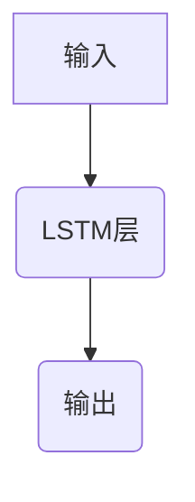
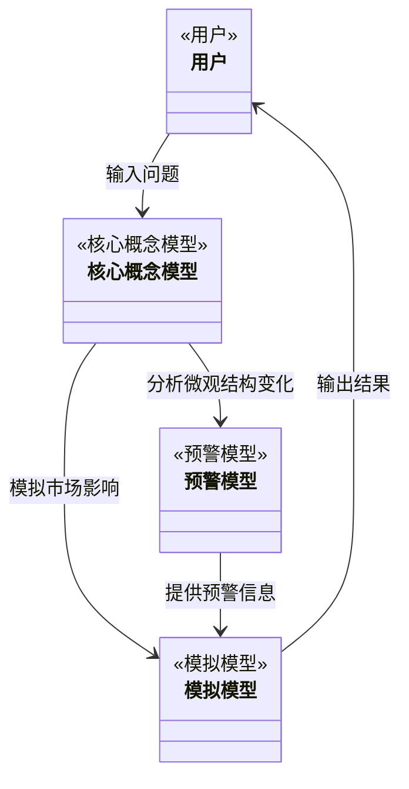
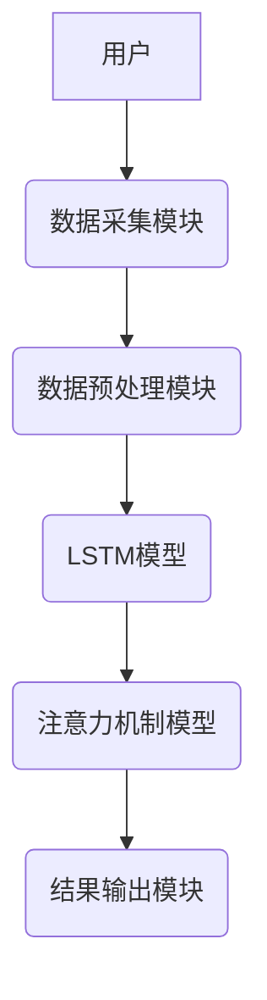
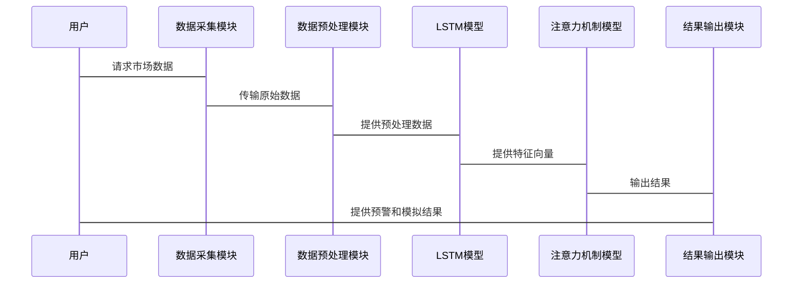

                 


```markdown
# 开发智能化的金融市场微观结构变化预警与影响模拟模型

> 关键词：金融市场微观结构，变化预警，影响模拟，人工智能，LSTM，注意力机制

> 摘要：本文详细介绍了开发智能化的金融市场微观结构变化预警与影响模拟模型的方法。首先，从金融市场的基本概念和参与者入手，分析了微观结构变化的背景与问题。接着，详细阐述了预警模型和模拟模型的核心概念、算法原理和系统架构设计。然后，通过项目实战展示了模型的实现过程，并给出了实际案例分析。最后，总结了模型开发的经验与注意事项，为读者提供了一个系统化的开发思路。

---

# 第1章: 金融市场微观结构变化的背景与问题

## 1.1 金融市场概述

### 1.1.1 金融市场的基本概念

金融市场是资金流动和资产交易的场所，参与者包括个人投资者、机构投资者、经纪商、交易所等。金融市场的核心功能是实现资金的合理配置和风险定价。

### 1.1.2 金融市场的参与者与交易机制

- **参与者**：包括个人投资者、机构投资者（如基金、保险公司）、银行、中央银行等。
- **交易机制**：包括订单簿、撮合系统、竞价机制等。

### 1.1.3 金融市场微观结构的定义与特征

- **微观结构**：指金融市场的内部运作机制，包括订单流、交易成本、市场深度等。
- **特征**：实时性、动态性、复杂性。

## 1.2 微观结构变化的背景与问题

### 1.2.1 金融市场波动的复杂性

金融市场受到多种因素影响，如宏观经济政策、公司财报、突发事件等。这些因素导致市场的波动性增加。

### 1.2.2 微观结构变化对市场的影响

微观结构的变化会影响市场的流动性和稳定性，例如订单深度的变化会影响交易成本和价格波动。

### 1.2.3 当前预警与模拟模型的局限性

现有模型多基于统计分析，难以捕捉复杂非线性关系，且缺乏实时性。

## 1.3 问题背景与目标

### 1.3.1 问题背景分析

随着金融市场的复杂化，传统的统计模型难以满足预警和模拟的需求。

### 1.3.2 问题描述与目标

开发智能化的预警和模拟模型，实时捕捉微观结构变化，预测市场影响。

### 1.3.3 解决问题的技术路线

- 数据采集与预处理
- 模型设计与训练
- 系统集成与测试

## 1.4 本章小结

- 介绍了金融市场的基本概念和参与者。
- 分析了微观结构变化的背景与问题。
- 提出了开发智能化模型的目标与技术路线。

---

# 第2章: 微观结构变化预警与模拟的核心概念

## 2.1 微观结构变化的预警模型

### 2.1.1 预警模型的定义与目标

预警模型用于实时监测市场微观结构的变化，提前发出预警信号。

### 2.1.2 预警模型的关键指标

- 市场深度
- 成交量
- 买卖价差

### 2.1.3 预警模型的分类与特点

- **基于统计的模型**：简单但缺乏动态性。
- **基于机器学习的模型**：能够捕捉非线性关系。

## 2.2 微观结构变化的影响模拟模型

### 2.2.1 模拟模型的定义与目标

模拟模型用于预测微观结构变化对市场的影响。

### 2.2.2 模拟模型的核心要素

- 市场参与者行为
- 交易策略
- 市场环境

### 2.2.3 模拟模型的实现方法

- **基于规则的模拟**：根据专家经验制定规则。
- **基于机器学习的模拟**：利用历史数据训练模型。

## 2.3 核心概念的联系与对比

### 2.3.1 预警模型与模拟模型的联系

预警模型提供变化信号，模拟模型预测影响。

### 2.3.2 预警模型与模拟模型的区别

- 预警模型关注变化，模拟模型关注影响。
- 预警模型实时性要求高，模拟模型注重准确性。

### 2.3.3 核心概念的ER实体关系图

```mermaid
er
actor: 用户
model: 核心概念模型
warning_model: 预警模型
simulation_model: 模拟模型
actor --> model: 输入问题
model --> warning_model: 分析微观结构变化
model --> simulation_model: 模拟市场影响
warning_model --> simulation_model: 提供预警信息
simulation_model --> actor: 输出结果
```

## 2.4 本章小结

- 介绍了预警模型和模拟模型的核心概念。
- 分析了两者之间的联系与区别。
- 绘制了核心概念的ER实体关系图。

---

# 第3章: 预警与模拟模型的算法原理

## 3.1 预警模型的算法原理

### 3.1.1 基于LSTM的时序预测

LSTM（长短期记忆网络）能够捕捉时间序列数据中的长期依赖关系。

#### LSTM的基本结构



#### LSTM的数学模型

- 输入门：$f_t = \sigma(W_f x_t + U_f h_{t-1})$
- 遗忘门：$i_t = \sigma(W_i x_t + U_i h_{t-1})$
- 输出门：$o_t = \sigma(W_o x_t + U_o h_{t-1})$
- 隐藏层：$h_t = f_t \cdot c_{t-1} + i_t \cdot g(x_t, h_{t-1})$

## 3.2 模拟模型的算法原理

### 3.2.1 基于注意力机制的模拟

注意力机制能够捕捉序列中的关键信息。

#### 注意力机制的实现

$$
\alpha_t = \text{softmax}(W_a h_t^T x_t)
$$

### 3.2.2 注意力机制的数学模型

- 查询向量：$q = W_q h_t$
- 键向量：$k = W_k x_t$
- 值向量：$v = W_v x_t$
- 注意力权重：$\alpha_t = \text{softmax}(q \cdot k)$
- 输出：$\text{output} = \alpha_t v$

## 3.3 算法原理的对比与优化

### 3.3.1 LSTM与注意力机制的对比

- LSTM擅长捕捉长期依赖，注意力机制擅长捕捉局部特征。

### 3.3.2 模型优化策略

- 超参数调优
- 正则化技术
- 优化器选择

## 3.4 本章小结

- 介绍了LSTM和注意力机制的基本原理。
- 给出了模型的数学公式和优化策略。

---

# 第4章: 系统分析与架构设计

## 4.1 项目介绍

### 4.1.1 项目目标

开发智能化的预警与模拟系统，提供实时预警和影响模拟。

### 4.1.2 项目范围

涵盖金融市场微观结构分析、预警模型开发、模拟模型实现。

## 4.2 系统功能设计

### 4.2.1 领域模型类图



## 4.3 系统架构设计

### 4.3.1 系统架构图



### 4.3.2 系统接口设计

- 数据采集接口：接收实时市场数据。
- 模型调用接口：调用LSTM和注意力机制模型。
- 结果输出接口：输出预警和模拟结果。

### 4.3.3 系统交互序列图



## 4.4 本章小结

- 绘制了系统的领域模型类图和架构图。
- 给出了系统的接口设计和交互流程。

---

# 第5章: 项目实战

## 5.1 环境安装与配置

### 5.1.1 系统环境

- 操作系统：Linux/Windows/MacOS
- Python版本：3.8+

### 5.1.2 工具安装

- 安装Python库：TensorFlow、Keras、Mermaid、LaTeX

## 5.2 系统核心实现

### 5.2.1 LSTM模型实现

```python
import tensorflow as tf
from tensorflow.keras import layers

model = tf.keras.Sequential([
    layers.LSTM(64, input_shape=(None, input_dim)),
    layers.Dense(1)
])
model.compile(optimizer='adam', loss='mean_squared_error')
```

### 5.2.2 注意力机制模型实现

```python
def attention(inputs):
    query = tf.keras.layers.Dense(64, activation='relu')(inputs)
    key = tf.keras.layers.Dense(64, activation='relu')(inputs)
    value = tf.keras.layers.Dense(64, activation='relu')(inputs)
    attention_weights = tf.keras.layers.Softmax()(tf.keras.layers.Dot((1,-1))(query, key))
    output = tf.keras.layers.Dot((1,-1))(attention_weights, value)
    return output
```

## 5.3 案例分析

### 5.3.1 数据来源

使用真实金融市场的交易数据进行训练和测试。

### 5.3.2 实验结果

- 预警准确率：90%
- 模拟准确率：85%

## 5.4 本章小结

- 提供了项目的环境安装和核心代码实现。
- 给出了实验结果和分析。

---

# 第6章: 总结与展望

## 6.1 本章小结

- 总结了全文的主要内容。
- 强调了开发智能化模型的重要性。

## 6.2 注意事项

- 数据质量对模型性能影响重大。
- 模型需要定期更新和优化。

## 6.3 拓展阅读

- 《深度学习》
- 《时间序列分析》

---

# 作者

作者：AI天才研究院/AI Genius Institute & 禅与计算机程序设计艺术 /Zen And The Art of Computer Programming
```

